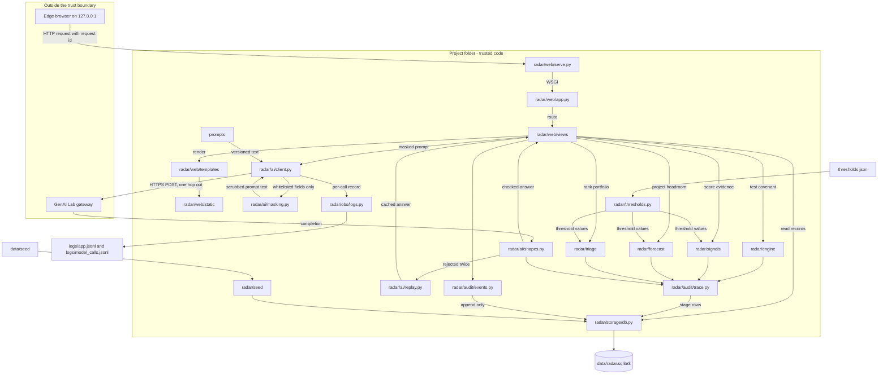

# plan.md — Covenant Radar · build design and schedule

**Companion to `spec.md` v0.1 (2026-08-29). Written at `T+3` for the people building and the assistants they dispatch.**
This plan is `§0`–`§15`. A bare `§N` is a section of **this** document. A section of the spec is always written `spec §N`. IDs added here and never renumbered: `P-01` tasks, `C-01` contracts, `CUT-01` cut rungs, `[OPEN-13]`+ open questions continuing after the spec's `[OPEN-12]`.

---

## §0 The one page

*Transcription and restatement only — no new IDs, anchors or facts. Everything here appears in a later section or in `spec.md`.*

**What is being built.** Covenant Radar keeps a machine-readable register of every covenant a borrower signed, recomputes each one daily from a seeded synthetic Indian commercial-lending book, and scores daily payment, utilisation, treasury, concentration and industry signals for whether they are sustained deterioration or passing noise. It projects each covenant's headroom forward to a dated breach risk with probability, confidence and named drivers, ranks the portfolio, drafts a grounded intervention memo, and opens every stage of that chain to an audit panel.

**The stack.** Python 3.12+ · Flask 3.1.3 · waitress 3.0.2 on `127.0.0.1:8500` · Jinja2 3.1.6 templates, hand-written CSS, vanilla JS, inline SVG · pandas 3.0.5 · SQLite via stdlib `sqlite3` · pytest 9.1.1 · langchain-openai 1.5.1 against `https://genailab.tcs.in` running `azure_ai/genailab-maas-DeepSeek-V3-0324` · Microsoft Edge headless CLI for screenshots. No admin rights, no Docker, no CDN, packages from the approved registry only.

**The hours.** Working hours 60. Planned work 57.8 — requirement 40.0, supporting 7.5, non-task 10.3. Protected reserve left: **2.2**. Setup at `T+3`–`T+4` is 5.0 and was already deducted by `spec §11`. The reserve is below `spec §11`'s 9-hour floor; the delivery lead accepted that at hand-over and §14 records it as `[OPEN-16]`.

**Mode: `dual`.** **Claude lane** — P1 and P2, the deterministic core: seed, ratios, registry, engine, evidence ledger, forecast, triage, thresholds. **Codex lane** — P3 and P4, the interface and the AI layer: tokens, components, screens, scrubber, why-panel, prompts, model client, masking, shape checks, example harness, replay cache. **Integration lane** — P5, human, no assistant: audit store, override capture, audit screen, demo assets, all merges, all gates. Ownership of manifests, lockfiles and shared configuration sits with the Claude lane's P1; no task installs a dependency.

**Serial order if one agent.** P-01 · P-02 · P-05 · P-03 · P-04 · P-35 · P-36 · P-37 · P-06 · P-11 · P-29 · P-07 · P-30 · P-28 · P-24 · P-20 · P-13 · P-12 · P-08 · P-26 · P-27 · P-39 · P-22 · P-23 · P-14 · P-15 · P-16 · P-18 · P-32 · P-17 · P-19 · P-21 · P-42 · P-41 · P-09 · P-10 · P-33 · P-25 · P-34 · P-43 · P-38 · P-31 · P-40.

**When a lane runs out of assistant.** Pull the bottom `CUT-01` rung, or the human builds the task by hand. Never hand the task to the other lane — the receiving lane does not own those files.

**The three standout features and when they work.** S2, the 30/60/90 breach radar with the draggable horizon — end to end by `T+13`. S1, paste a sanction clause and get a live code-verified covenant — by `T+15`. S3, committee-ready memo with a reconstructable audit trail — by `T+17`.

**The gates and their proof.**
`T+3` spec handed over, roles agreed, workspaces created — proof: `.agent-workspaces/claude` and `.agent-workspaces/codex` exist and are ignored.
`T+4` environment gate on the judging laptop — proof: `pip install -r requirements.txt` returns 0; `python -m radar.serve --port 8500` serves a page; `python -m radar.seed --reset` loads; `python scripts/probe_gateway.py` prints access, latency, quota and an offline cache answer; `python scripts/capture_screens.py --probe` writes one PNG; assistant allowances read and written down.
`T+8` thinnest end-to-end path on seeded input — proof: `pytest -q` green and one borrower renders with one forecast and one live memo; `python -m harness.run_examples --both-arms` prints first scores.
`T+13` S2 end to end, thresholds tuned, outside-user timing run, first visual look — proof: queue → case file → scrubber → why-panel by hand; `pytest -q tests/test_forecast.py tests/test_triage.py` green.
`T+15` S1 end to end including the bad paths — proof: `pytest -q tests/test_intake.py` green plus a by-hand EX-16/EX-17 run.
`T+17` feature freeze and design review — proof: S3 walked by hand; screens opened beside `spec §15`'s direction sentence and refusal list.
`T+20` demo start to finish on the judging machine, `spec §23`'s whole list executed, both arms printed, book frozen — proof: `python scripts/quality_gate.py` green plus the sweep record.
`T+22` code freeze, `last-green` is the demo build, rehearsal ×2, backup recording — proof: preflight list passes.
`T+23:30` submission uploaded. `T+24` judged.

**Where the code lives.** Project root `covenant-radar/` — the folder already holding `spec.md`, `problem.md`, `SPEC_PROMPT.md`, `PLAN_PROMPT.md`. Product package `radar/`, prompts in `prompts/`, examples in `examples/`, harness in `harness/`, scripts in `scripts/`, tests in `tests/`, generated data in `data/`, logs in `logs/`, evidence in `evidence/`. Merge evidence is written to `MERGE_LOG.md`. Operational workspaces are `.agent-workspaces/claude` and `.agent-workspaces/codex`, both ignored.

**The complete quality gate.** One command, expected exit 0:

```
python scripts/quality_gate.py
```

which runs, in order and stopping at the first failure: `python -m compileall -q radar harness scripts` · `python -m pyflakes radar harness scripts tests` (or `python -m py_compile` if pyflakes is absent from the registry) · `pytest -q` · `python -m radar.seed --reset --check-deterministic` · `python -m harness.run_examples --both-arms --out evidence/examples/` · `python scripts/capture_screens.py --all` · `python scripts/check_contrast.py` · `python scripts/perf_timings.py --out evidence/perf/`.

**The refusal.** A `§9` task block is dispatched on its own. Where the block does not say enough to do the work without guessing, the builder stops, does not guess, and prints:

```
BRIEF INCOMPLETE — P-01: <the one thing that is missing>
```

That line is a builder's output. It never appears in this document, in code, in a comment, in a test name or in a commit message. Refusing costs the task an hour; guessing costs the merge.

---

## §1 What the spec fixed, and what this plan adds

**The authority rule.** `spec.md` decides what gets built, what it is built with, and what counts as done. This document decides order, design inside each layer, and ownership. No requirement is edited, added, dropped or reworded here. Non-blocking disagreements are in §14 and the spec is planned as written.

**Repository baseline, inspected read-only at `T+3`.** The folder `covenant-radar/` (working directory `c:\Users\GenAICHNSIRUSR35\exp_team`) contains exactly: `spec.md`, `problem.md`, `SPEC_PROMPT.md`, `PLAN_PROMPT.md`, and `.claude/settings.local.json`. There is **no manifest, no lockfile, no test, no script and no product source**. It is **not a git repository, and `git` is not on this machine's PATH** — carried as `[OPEN-13]`. There is therefore **no last known green command**. Python **3.12.8** is present per-user at `C:\Program Files\Python312\python.exe`, which resolves `spec §12`'s `[OPEN-06]` favourably on the inspected machine; it is still re-read at the `T+4` gate on the judging laptop because `[ASSUMED-06]` could be wrong. `problem.md` states no hour markers, so `[ASSUMED-07]` holds and `spec §28`'s markers are the clock unmoved.

**Greenfield or existing.** The **product** is greenfield: no code is replaced because none exists. The **repository** is not: five paths already exist and are preserved. No task in §9 lists any of them under `Files owned`; every one of them appears under `Off limits` in every block. `spec.md` is never edited by any task, by any lane, at any hour. There are no dirty version-control paths to preserve because there is no version control yet — `[OPEN-13]`'s `T+4` answer creates it.

**What each section transcribes and what it authors.**

| Section | Transcribes from | Authors here |
|---|---|---|
| §0 | everything below it | nothing |
| §1 | `spec §10`, `§11`, `§30` | the baseline, the mode, the judged-row mapping |
| §2 | `spec §13` entire | install order, hour, owner, the baseline task |
| §3 | `spec §13`'s walk and `LATER:` lines | both diagrams, the layer walk, the log path, the request id |
| §4 | `spec §14`'s file paths, `spec §25`'s commands | the whole tree, the merge-evidence file, ignore rules |
| §5 | `spec §14`'s record list, `spec §21`'s wipe answer | every field, type, key, index, retention |
| §6 | `spec §14`'s interface table | every `C-01` row not already fixed there |
| §7 | `spec §15` entire — direction sentence, refusals, composition, palette, type, motion, viewports | tokens as a file, components, tasks, hours, gates |
| §8 | `spec §17`'s thresholds and example set, `spec §20`'s log fields | prompt files, the one call site, the trace, the runner |
| §9 | `spec §10`'s requirements and checks | all 43 task blocks |
| §10 | `spec §28`'s markers, `spec §11`'s hours | the grid, the dependency table, the arithmetic |
| §11 | — | lanes, batches, disjointness tests, capacity |
| §12 | `spec §8`'s cut list, `spec §5`'s narrower versions | pricing, decide-hours, revert methods |
| §13 | `spec §23`, `§24`, `§22`, `§25` | the aggregate command, the schedule of runs |
| §14 | `spec §27`'s opens | every disagreement, addition and new `[OPEN-NN]` |
| §15 | — | the checks |

**The four judged rows this document makes true or false.**

| # | Criterion | Made true or false by | How |
|---|---|---|---|
| 12 | Prototype shows the key features working | §10's schedule | S2 merged by `T+13`, S1 by `T+15`, S3 by `T+17`; nothing feature-shaped starts after `T+17`, so no standout feature depends on an hour the demo never reaches |
| 13 | Ease of use, interface and experience | §7's hours sitting inside §10 | 11.5 interface task-hours are grid cells between `T+4` and `T+19`, not an end-of-night block; `spec §15`'s protected screen (R-08) is funded at its full 4.0 h and is never a §12 rung |
| 17 | Clear, realistic, achievable milestones and timelines | §10 and nothing else | eleven `spec §28` markers, each a gate row with a proof command, a caller and a red branch; the grid shows every person's every hour |
| 19 | Dependencies and critical-path items | §10's order | a topological table with the critical chain, compared against `spec §12`'s two critical-path items |

The other fifteen criteria are the spec's and are not re-answered here.

**Execution mode: `dual`.** Claude lane (P1, P2), Codex lane (P3, P4), Integration lane (P5, human). The serial order in §0 is the same task list in a dependency-safe sequence for single mode.

**Requirement inventory, counted against the spec.** Functional `must`: R-01, R-02, R-03, R-04, R-05, R-06, R-07, R-08, R-09, R-10, R-11 — **11**. Non-functional `must`: N-01, N-02, N-03, N-04, N-05 — **5**. `should`: R-12 — **1**. `later`: R-13 — **1**. Flows: F-01…F-04 — **4**. Exclusions: NG-01…NG-09 — **9**. Risks: RISK-01…RISK-10 — **10**. Open questions: `[OPEN-01]`…`[OPEN-12]` — **12**. Assumptions: `[ASSUMED-01]`…`[ASSUMED-08]` — **8**. Counts match `spec §31` check 23.

**Every `must` mapped to its §9 tasks.**

| Req | Priority | Spec hours | Plan hours | Tasks |
|---|---|---|---|---|
| R-01 | must | 3 | 3.0 | P-06, P-07 |
| R-02 | must | 1.5 | 1.5 | P-08 |
| R-03 | must | 3 | 4.0 | P-09, P-10, P-33 |
| R-04 | must | 3 | 3.0 | P-11, P-12 |
| R-05 | must | 3.5 | 4.0 | P-13, P-14 |
| R-06 | must | 4 | 4.0 | P-15, P-16 |
| R-07 | must | 1.5 | 2.5 | P-17, P-32 |
| R-08 | must | 4 | 4.0 | P-18, P-19 |
| R-09 | must | 3 | 3.0 | P-20, P-21 |
| R-10 | must | 2.5 | 2.5 | P-22, P-23 |
| R-11 | must | 1.5 | 2.5 | P-24, P-25, P-34 |
| N-01 | must | 3 | 3.0 | P-26, P-27 |
| N-02 | must | 1 | 1.0 | P-28 |
| N-03 | must | 0.5 | 0.5 | P-29 |
| N-04 | must | 1 | 1.0 | P-30 |
| N-05 | must | 0.5 | 0.5 | P-31 |
| R-12 | should | 2 | **0 — not scheduled** | none; `CUT-04` |
| R-13 | later | — | **0 — no task, no hour** | none |

**Non-functional `must`s, `spec §19` failure cases and funded `spec §26` mitigations, mapped to the task whose steps and acceptance checks carry them.**

| Item | Carried by |
|---|---|
| N-01 dual-arm scoring | P-26 steps 1–5, P-27 `Commands` |
| N-02 app and AI logs separate, unwritable-log path | P-28 `Edge cases`, `Tests` |
| N-03 reload, last-good-hold, audit event | P-29 `Edge cases`, `Tests` |
| N-04 masking, key hygiene, outbound scan | P-30 `Tests`, P-09 step 4 |
| N-05 §18 targets timed | P-31 `Commands` |
| §19 empty / enormous / hostile clause paste | P-10 `Edge cases`, P-33 `Behaviour` |
| §19 instruction injection | P-09 step 5, P-10 `Edge cases` |
| §19 seed malformed / truncated | P-07 `Edge cases` |
| §19 duplicate seed, idempotence | P-13 `Edge cases` |
| §19 missing quarter, stale marker | P-12 `Edge cases` |
| §19 ratio undefined, negative EBITDA | P-11 `Edge cases` |
| §19 gateway slow, down, junk-200 | P-22 `Edge cases`, P-23 `Edge cases`, P-39 |
| §19 crash / restart mid-session | P-24 `Edge cases` |
| §19 thresholds.json malformed | P-29 `Edge cases` |
| §19 browser offline / reload mid-scrub | P-19 `Edge cases` |
| RISK-01 transparent formula, confidence, dual arm | P-16, P-21, P-27 |
| RISK-02 T3/T4 tuned by `T+13` | P-42 |
| RISK-03 fails-closed verification shown live | P-10, P-33 |
| RISK-04 replay cache, alias probe, T7 ceiling | P-39, P-03, P-22 |
| RISK-05 registry fallbacks | P-02 |
| RISK-06 reserve and priced cut list | §10 line (e), §12 |
| RISK-07 second laptop, hourly push, recording | P-40, `[OPEN-13]` |

RISK-08, RISK-09 and RISK-10 are growth risks whose mitigations are `LATER:` in the spec; they carry no task and no hour here, and §14 lists them as unfunded by design. A `must` with no task is failure; a task building nothing is invention — neither exists above.

---

## §2 The stack, pinned and installed

*Transcribed from `spec §13` in full. Owner and hour are authored here.*

| Layer | Primary (exact version) | No-admin install | Time | Size | Prerequisites | Registry source | Fallback (production-grade, `spec §13`'s own) | Owner | Hour |
|---|---|---|---|---|---|---|---|---|---|
| Runs the logic | Python 3.12+ (whatever ≥3.10 the laptop has — `[OPEN-06]`) | already present per-user; `python -m venv .venv` | 1 min | ~30 MB venv | none | machine-resident | none — absence is `[OPEN-06]`'s escalation | P1 | `T+3`–`T+4` |
| Web framework | Flask 3.1.3 | `pip install flask==3.1.3` | 20 s | ~2 MB | venv active | approved TCS PyPI mirror (`[ASSUMED-03]`) | FastAPI 0.141.1 + uvicorn 0.52.4 | P1 | `T+3`–`T+4` |
| WSGI server | waitress 3.0.2 | `pip install waitress==3.0.2` | 10 s | <1 MB | venv | mirror | uvicorn 0.52.4 (with the FastAPI fallback) | P1 | `T+3`–`T+4` |
| Templates | Jinja2 3.1.6 | arrives as Flask's dependency | — | <1 MB | Flask | mirror | stdlib `string.Template` + static HTML | P1 | `T+3`–`T+4` |
| Numeric | pandas 3.0.5 (+ its numpy) | `pip install pandas==3.0.5` | 60 s | ~60 MB wheel | venv | mirror wheels for Windows | stdlib `statistics` + `csv` + hand math | P1 | `T+3`–`T+4` |
| Storage | SQLite via stdlib `sqlite3` (bundled version read at the gate) | nothing to install | 0 | 0 | Python | machine-resident | JSON files via stdlib `json` | P2 | `T+3`–`T+4` |
| Model client | langchain-openai 1.5.1 | `pip install langchain-openai==1.5.1` | 40 s | ~15 MB | venv | mirror | 1: `openai` 3.5.0 · 2: plain HTTPS POST with httpx 0.28.1 | P4 | `T+3`–`T+4` |
| Model gateway | `https://genailab.tcs.in`, alias `azure_ai/genailab-maas-DeepSeek-V3-0324` | env var `GENAILAB_API_KEY` only | — | — | key handed over | organizer-provided | alias `azure/genailab-maas-gpt-4o` (`[OPEN-04]`) | P4 | `T+3`–`T+4` |
| Test runner | pytest 9.1.1 | `pip install pytest==9.1.1` | 15 s | ~3 MB | venv | mirror | stdlib `unittest` | P1 | `T+3`–`T+4` |
| Screenshot capture | Microsoft Edge headless CLI, `msedge.exe --headless --disable-gpu --window-size=W,H --screenshot=out.png URL` | already on Windows 11 | 0 | 0 | Edge present; policy allows headless (`[OPEN-09]`) | machine-resident | P3 by hand with Edge's built-in full-page capture (Ctrl+Shift+S) at the same three sizes, 1 support hour | P3 | `T+3`–`T+4` |
| Charts, fonts | inline SVG rendered by our own templates; Georgia, Consolas, Segoe UI as system faces | nothing to install | 0 | 0 | Windows 11 | machine-resident | fallback stacks declared in `radar/web/static/css/tokens.css` | P3 | `T+4`–`T+7` |

The lockfile is `requirements.txt`, named in §4, owned solely by **P1** in the Claude lane. No other task edits it. Anything found missing after `T+4` is `[OPEN-14]`'s default: P1 installs it at the next checkpoint.

**The baseline task, before anything changes.** `P-01` runs the repository's existing quality commands and records each pre-existing failure. There are none to run — no manifest, no test, no script exists — so `P-01`'s recorded baseline is the literal statement *"no quality command exists in the inspected tree; the first green command in this project's life is `pytest -q` after `P-05`"*, written into `MERGE_LOG.md` above the first checkpoint row. That statement is the baseline other tasks are measured against.

**The environment task.** `P-02` (install), `P-03` (gateway probe), `P-04` (capture probe) and `P-05` (schema from nothing) run at `T+3`–`T+4`. Their **one hour each is part of the four setup hours `spec §11` already deducted** — it is not additional build capacity and it is not charged again in §10's lines (b), (c) or (d). Their commands come from `spec §13` alone and need nothing this plan decides, **so a human may begin `P-02` the moment the spec is handed over, in parallel with this plan run.** Install and proxy trouble is the likeliest thing to eat hour 4 and that parallel hour is the only free one there is.

**The `T+4` gate on the judging laptop.** Every row below is proved in one sitting with its result written into `MERGE_LOG.md`.

| Gate item | Command | Expected | If it fails |
|---|---|---|---|
| Python version (`[OPEN-06]`) | `python --version` | `Python 3.1x.y`, x ≥ 10 | request IT self-service Python at `T+4` sharp; escalate to organizers within the hour |
| Package install (`[OPEN-07]`) | `pip install -r requirements.txt` | exit 0, all pins resolved | drop to `spec §13`'s named fallback for the missing row only; a registry empty of every web framework escalates per RISK-05 |
| App starts | `python -m radar.serve --port 8500` then `curl http://127.0.0.1:8500/health` | `{"ok": true}` | fallback WSGI row |
| Data loads | `python -m radar.seed --reset` | `book loaded: 12 borrowers, 0 errors`, exit 0 | fix `P-05`'s schema before any other task starts |
| Model access, TLS on (`[OPEN-05]`, `[OPEN-02]`, `[OPEN-03]`) | `python scripts/probe_gateway.py --verify-on` | prints `access=ok`, `latency_ms=<n>`, `quota=<headers or unknown>`, `structured_output=<yes/no>` | retry with `verify=False`, record the posture in `MERGE_LOG.md` and on the ops panel per `spec §16` |
| Fallback alias (`[OPEN-04]`) | `python scripts/probe_gateway.py --alias azure/genailab-maas-gpt-4o` | `access=ok` or `access=denied` | single-model build; replay is the fallback |
| Offline fallback | disconnect network, then `python scripts/probe_gateway.py --offline` | prints `replay=ok` and one cached answer | `P-39` moves to `T+6` |
| Capture tool (`[OPEN-09]`) | `python scripts/capture_screens.py --probe` | writes `evidence/shots/probe_1920x1080.png`, exit 0 | the named human fallback: P3, Edge Ctrl+Shift+S, same three sizes, 1 support hour |
| Assistant capacity (`[OPEN-14]`) | read each account's usage screen | allowance remaining on the rolling five-hour window, any longer-period cap, reset times — written down | a longer-period cap already spent means this plan runs single-mode or human-built from that hour |
| Version control (`[OPEN-13]`) | `git --version` | any version | snapshot fallback: `.snapshots/<checkpoint>-<task>.zip`, and `MERGE_LOG.md` records snapshot ids where it would record SHAs |

A primary failure may switch only to `spec §13`'s production-grade fallback. If that fails too, stop for respec rather than improvise a substitute.

---

## §3 Architecture

*The `LATER:` lines are transcribed from `spec §13`. Both diagrams, the layer walk, the log path and the request identifier are authored here.*



```mermaid
sequenceDiagram
  autonumber
  actor U as Risk officer (Edge)
  participant V as radar/web/views/borrower.py
  participant D as radar/storage/db.py
  participant F as radar/forecast
  participant A as radar/ai/client.py
  participant M as radar/ai/masking.py
  participant S as radar/ai/shapes.py
  participant R as radar/ai/replay.py
  participant L as radar/obs/logs.py
  participant T as radar/audit/trace.py
  U->>V: POST /memo/B-07 (request id rq-7f3a)
  V->>D: load registry, tests, evidence, forecast for B-07
  D-->>V: records (every figure comes from here)
  V->>F: read stage-4 outputs for the slot values
  F-->>V: probability, confidence, dated crossing, drivers
  V->>M: build prompt from whitelisted fields only
  M-->>V: scrubbed prompt, names and ID patterns masked
  V->>A: call_model(stage=6, prompt, version=memo.v1)
  A->>A: T7 counter check, 30 s timeout
  A-->>S: completion text
  S->>S: slots resolved, catalogue actions only, length <= T6
  alt shape check passes
    S-->>V: checked memo
    V->>T: write stage-6 trace row (decider=model, prompt version, verdict)
    V->>L: model_calls.jsonl line (rq-7f3a, tokens, latency, verdict=pass)
    V-->>U: memo rendered, model text labelled "Drafted by model"
  else shape check fails
    S-->>A: retry once (T8)
    A-->>S: second completion
    S->>S: check again
    alt second check fails
      S->>T: write stage-6 trace row (verdict=refused)
      S->>L: model_calls.jsonl line (verdict=refused, retry=1, reason)
      S-->>V: refusal
      V-->>U: "Model unavailable — memo refused." No partial memo renders.
    end
  else gateway down or timeout
    A->>R: read keyed cache
    R-->>V: cached answer or none
    V->>L: model_calls.jsonl line (verdict=refused, reason=gateway_down)
    V-->>U: §19 message plus REPLAY chip; everything computed locally still works
  end
```

**The app's own log** is `logs/app.jsonl`, an entry in §4's tree, ignored and never committed. **The single identifier that follows one request across every layer is `request_id`** — a `rq-` prefix plus eight hex characters, minted once in `radar/web/app.py`'s before-request hook, carried in Flask's request context, and written verbatim onto every `logs/app.jsonl` line, every `audit_event` row, every `trace_row` row and every `logs/model_calls.jsonl` line that request produces. One grep over three files reconstructs a request from an hour ago, which is what `spec §20` promises; without it that promise is a grep at hour 21.

**The layers, and what each may know.**

- **Serving** (`radar/web/serve.py`) — starts waitress on `127.0.0.1:8500`. Knows the app object and the port. Knows nothing about records. `LATER:` on a real server, any WSGI host.
- **Web** (`radar/web/app.py`, `views/`, `templates/`, `static/`) — routes, request id, template rendering, form validation, HTTP status. May call the domain layers and the AI layer. **May never** compute a ratio, decide a band, or originate a probability: `spec §17` says any probability shown exists in a `forecast` row first, so display code reads and never derives.
- **Domain** (`radar/engine`, `radar/signals`, `radar/forecast`, `radar/triage`) — pure functions over records plus thresholds. Knows the storage layer and `radar/thresholds.py` and `radar/audit/trace.py`. **May never** import anything under `radar/web` or `radar/ai`; a domain module that knows about the model has stopped being auditable.
- **AI** (`radar/ai/`) — the only place an outbound call exists. Knows prompts, masking, shape checks, the replay cache and the logger. **May never** write to `data/radar.sqlite3` directly; it hands checked results back to the web layer, which stores them.
- **Audit and observability** (`radar/audit/`, `radar/obs/`) — append-only events, the grounding trace, the two log streams. Knows storage. Known by everyone. **May never** be edited or deleted through any exposed route.
- **Storage** (`radar/storage/`) — connection, schema creation, row mapping. Knows SQLite. Knows nothing above it. `LATER:` PostgreSQL on a server, per `spec §13`.
- **Seed** (`radar/seed/`) — generator, storylines, idempotent loader. Writes records; reads seed files. `LATER:` an import layer mapping CBS/LOS extracts, per `spec §21`.

Everything above runs in one process on one laptop today. `LATER:`, per `spec §13`: a web tier, a scheduled scoring worker (R-13), a server database and the bank's identity in front (NG-03's SSO), with the gateway call through the bank's egress proxy. Nothing in `spec §3`'s mechanism changes shape.

Every box in the flowchart is an entry in §4's tree and every layer named above has a directory there. The reverse does not hold and is not forced: the ignore file, the seed data, the evidence of runs and the merge log are entries in the tree and are not architecture.

---

## §4 The directory structure

*Starts from §1's real baseline. Marks: `existing` · `modify` · `new` · `generated`.*

```
covenant-radar/                              existing (the inspected folder) · project root · P5
├─ .claude/settings.local.json               existing · preserved, never edited, not product · P5
├─ problem.md                                existing · preserved, never edited · P5
├─ spec.md                                   existing · preserved, NEVER edited by any task · P5
├─ SPEC_PROMPT.md                            existing · preserved, never edited · P5
├─ PLAN_PROMPT.md                            existing · preserved, never edited · P5
├─ plan.md                                   new · this document · P5
├─ MERGE_LOG.md                              new · THE MERGE-EVIDENCE FILE · P5 · §11
├─ README.md                                 new · spec §25's lines verbatim · P5 · P-40
├─ .gitignore                                new · ignore rules below · P5 · P-01
├─ requirements.txt                          new · the lockfile; ONLY P1 edits it · P-02
├─ thresholds.json                           new · spec §17's T1–T8 · P1 · P-29
├─ radar/
│  ├─ __init__.py                            new · P-05
│  ├─ config.py                              new · paths, port 8500, env key name · P-05
│  ├─ ids.py                                 new · request_id minting · P-05
│  ├─ thresholds.py                          new · N-03 loader, last-good hold · P-29
│  ├─ storage/
│  │  ├─ __init__.py                         new · P-05
│  │  ├─ schema.sql                          new · the DDL of §5 · P-05
│  │  ├─ db.py                               new · connect, init_schema, tx · P-05
│  │  └─ records.py                          new · row⇄dict mapping · P-05
│  ├─ seed/
│  │  ├─ __init__.py                         new · P-06
│  │  ├─ __main__.py                         new · python -m radar.seed · P-06
│  │  ├─ generator.py                        new · R-01 borrowers, facilities · P-06
│  │  ├─ storylines.py                       new · R-01 three storylines · P-07
│  │  └─ loader.py                           new · idempotent load, R-01.c · P-07
│  ├─ engine/
│  │  ├─ __init__.py                         new · P-11
│  │  ├─ ratios.py                           new · R-04 eight ratio types + RATIO_LIBRARY · P-11
│  │  ├─ registry.py                         new · R-02 versioned registry · P-08
│  │  └─ covenant_engine.py                  new · R-04 test runner, exceptions · P-12
│  ├─ signals/
│  │  ├─ __init__.py                         new · P-13
│  │  ├─ ingest.py                           new · R-05 idempotent ingestion, day cursor · P-13
│  │  └─ ledger.py                           new · R-05 persistence, materiality, decay · P-14
│  ├─ forecast/
│  │  ├─ __init__.py                         new · P-15
│  │  ├─ project.py                          new · R-06 trajectory, dated crossing · P-15
│  │  └─ attribution.py                      new · R-06 probability, confidence, drivers · P-16
│  ├─ triage/
│  │  ├─ __init__.py                         new · P-17
│  │  └─ queue.py                            new · R-07 urgency, banding, what-changed · P-17
│  ├─ ai/
│  │  ├─ __init__.py                         new · P-30
│  │  ├─ masking.py                          new · N-04 outbound scrub · P-30
│  │  ├─ client.py                           new · THE one call site, T7, timeout, retry · P-09
│  │  ├─ shapes.py                           new · §17 shape checks, T6, T8 · P-23
│  │  ├─ intake.py                           new · R-03 stage 1 propose + verify · P-10
│  │  ├─ memo.py                             new · R-10 stage 6 draft · P-22
│  │  └─ replay.py                           new · spec §22 keyed cache · P-39
│  ├─ audit/
│  │  ├─ __init__.py                         new · P-24
│  │  ├─ events.py                           new · R-11 append-only store · P-24
│  │  ├─ reconstruct.py                      new · R-11.a warning reconstruction · P-24
│  │  ├─ overrides.py                        new · R-11 override + feedback capture · P-25
│  │  └─ trace.py                            new · §8 grounding trace, all six stages · P-20
│  ├─ obs/
│  │  ├─ __init__.py                         new · P-28
│  │  └─ logs.py                             new · N-02 app log + model-call log · P-28
│  └─ web/
│     ├─ __init__.py                         new · P-37
│     ├─ app.py                              new · factory, request id, blueprints, 404 · P-37
│     ├─ serve.py                            new · python -m radar.serve (waitress) · P-37
│     ├─ views/
│     │  ├─ __init__.py                      new · P-37
│     │  ├─ queue.py                         new (stub P-37) → modify P-32 · screen 1
│     │  ├─ borrower.py                      new (stub P-37) → modify P-18, P-19 · screen 2
│     │  ├─ intake.py                        new (stub P-37) → modify P-33 · screen 3
│     │  ├─ audit.py                         new (stub P-37) → modify P-34 · screen 4
│     │  ├─ why.py                           new (stub P-37) → modify P-21 · why-panel
│     │  └─ ops.py                           new (stub P-37) → modify P-29 · day advance, reload
│     ├─ templates/
│     │  ├─ base.html                        new · P-37
│     │  ├─ _404.html                        new · P-37
│     │  ├─ _components.html                 new · the 14 macros · P-36
│     │  ├─ _states.html                     new · empty/loading/error/offline partials · P-36
│     │  ├─ _why_panel.html                  new · P-21
│     │  ├─ queue.html                       new · P-32
│     │  ├─ borrower.html                    new · P-18
│     │  ├─ intake.html                      new · P-33
│     │  └─ audit.html                       new · P-34
│     └─ static/
│        ├─ css/tokens.css                   new · THE design-value file · P-35
│        ├─ css/app.css                      new · layout, components · P-36
│        ├─ css/why.css                      new · drawer · P-21
│        ├─ js/scrubber.js                   new · the signature interaction · P-19
│        └─ js/app.js                        new · progressive enhancement only · P-36
├─ prompts/
│  ├─ stage1_extract.v1.txt                  new · P-09 · version string in header
│  └─ stage6_memo.v1.txt                     new · P-22 · version string in header
├─ actions/catalogue.json                    new · role-tagged action catalogue · P-22
├─ examples/
│  ├─ EX-01.json … EX-20.json                new · spec §17's 20 examples · P-26
│  └─ _schema.json                           new · the shape a new example must match · P-26
├─ harness/
│  ├─ __init__.py                            new · P-27
│  ├─ run_examples.py                        new · N-01 both arms, one command · P-27
│  └─ baseline.py                            new · naive rule, regex parser, naive prompt · P-27
├─ scripts/
│  ├─ probe_gateway.py                       new · T+4 model-access probe · P-03
│  ├─ capture_screens.py                     new · Edge headless at 3 viewports · P-38
│  ├─ check_contrast.py                      new · 7:1 text, 4.5:1 chips · P-35
│  ├─ perf_timings.py                        new · N-05 §18 targets · P-31
│  ├─ quality_gate.py                        new · THE aggregate command · P-05
│  └─ preflight.md                           new · spec §22's preflight list · P-40
├─ tests/                                    new · one test module per task, listed in §9
│  ├─ conftest.py                            new · fixtures, temp db · P-05
│  └─ test_*.py                              new · owned by the task that names them
├─ data/
│  ├─ seed/*.csv, *.json                     generated · `python -m radar.seed --write-seed` · P-06/P-07 · COMMITTED
│  ├─ radar.sqlite3                          generated · `python -m radar.seed --reset` · P-05 · IGNORED
│  ├─ demo_freeze.sha256                     generated · `--demo-freeze` · P-40 · COMMITTED
│  └─ replay/*.json                          generated · `python -m radar.ai.replay --fill` · P-39 · COMMITTED
├─ logs/
│  ├─ app.jsonl                              generated · written by radar/obs/logs.py · IGNORED
│  └─ model_calls.jsonl                      generated · written by radar/obs/logs.py · IGNORED
├─ evidence/                                 generated · IGNORED — proof a human reads, not product source
│  ├─ shots/<screen>_<state>_<WxH>.png       generated · scripts/capture_screens.py · P-38
│  ├─ examples/run-<iso8601>.json            generated · harness/run_examples.py · P-27
│  ├─ perf/run-<iso8601>.json                generated · scripts/perf_timings.py · P-31
│  ├─ contrast/run-<iso8601>.json            generated · scripts/check_contrast.py · P-35
│  └─ sweep/T20-acceptance.md                generated · written by hand at T+20 · P5
├─ .agent-workspaces/                        operational · IGNORED · NOT product · P5 · §11
│  ├─ claude/
│  └─ codex/
├─ .snapshots/                               operational · IGNORED · [OPEN-13]'s fallback only · P5
└─ .venv/                                    generated · python -m venv · IGNORED
```

**The merge-evidence file is `MERGE_LOG.md`.** It is committed, and only P5 writes it. At every §10 merge checkpoint P5 appends one row per merged task: **task id · commit SHA (or, under `[OPEN-13]`'s fallback, the snapshot id) · the exact revert command · the task's `Plan hours`**. The hours are there because §10's `T+8` and `T+13` gates sum them against the `Plan hours` the grid scheduled before that marker; a checkpoint that recorded only a SHA leaves that gate with one of its two numbers missing. §12's rungs are reverted against these SHAs. `tasks.md`, if one is ever written, transcribes this path rather than choosing one.

```
## CKPT-3 · T+12
| Task  | SHA      | Revert                   | Plan hours |
|-------|----------|--------------------------|------------|
| P-12  | a1b2c3d  | git revert --no-edit a1b2c3d | 1.5    |
```

**Committed:** every human-authored source file, `requirements.txt`, `thresholds.json`, `prompts/`, `examples/`, `actions/catalogue.json`, `data/seed/`, `data/replay/`, `data/demo_freeze.sha256`, `MERGE_LOG.md`, `README.md`, `plan.md`, and the five existing markdown files.
**Ignored** (`.gitignore`): `.venv/`, `__pycache__/`, `*.pyc`, `.pytest_cache/`, `data/radar.sqlite3`, `data/radar.sqlite3-*`, `logs/`, `evidence/`, `.agent-workspaces/`, `.snapshots/`, `*.env`, `.env`.
**Sensitive:** `GENAILAB_API_KEY` exists only as a session environment variable; it is never in a file, a log, a prompt, a test or a commit. `P-30`'s scan enforces it.
**Generated:** every path above marked `generated`, each with its command and owning task named in the same line.
**Preserved:** the five existing files and `.claude/`. Nothing overwrites or renames an existing file; no task lists one under `Files owned`.
**Evidence artifacts settled:** `evidence/**` and `logs/**` are **ignored**. They are proof a human reads at a checkpoint, not product source. A task that commits them puts paths outside its `Files owned` into the diff the checkpoint rejects on, so every §9 block naming an evidence path names it under `Evidence`, never under `Files owned`.
**Operational workspaces** are `.agent-workspaces/claude` and `.agent-workspaces/codex` — outside the product tree, excluded from builds, never committed.

---

## §5 Data and storage, designed

*Authored here. `spec §14` named the records and their meanings and deliberately stopped short of the definitions.*

One store: **SQLite** at `data/radar.sqlite3`, created from nothing by `radar/storage/schema.sql` through `radar/storage/db.py:init_schema()`. Types are SQLite's (`TEXT`, `INTEGER`, `REAL`); dates are ISO-8601 `TEXT` in IST; money is `REAL` in ₹ crore; `NULL` means "not known", never "zero". **Empty store** = all tables exist, all are zero-row, and `schema_meta` holds one row: `schema_version='1'`, `seed_id=NULL`. Every screen renders its designed empty state against exactly that.

**Create from nothing, in the command that does it:**

```
python -m radar.seed --reset
```
which drops `data/radar.sqlite3` if present, executes `radar/storage/schema.sql`, then loads `data/seed/*`. `python -m radar.seed --init-only` stops after the DDL and is what `P-05` proves at `T+4`.

| Table | Field | Type | Empty? | Notes |
|---|---|---|---|---|
| **borrower** | `borrower_id` | TEXT PK | no | `B-01`…`B-12`; hero is `B-07` |
| | `name` | TEXT | no | fictional, e.g. `Meridian Auto Components Pvt Ltd` |
| | `cin` | TEXT | no | CIN-format synthetic · **official-identity class** |
| | `industry` | TEXT | no | |
| | `concentration_share` | REAL | no | 0–1 |
| | `promoter_names` | TEXT | yes | JSON array · **identifying class** |
| | `guarantor_names` | TEXT | yes | JSON array · **identifying class** |
| | `storyline` | TEXT | no | `deteriorator` \| `noisy_transient` \| `stable` \| `templated` |
| | *keys/index* | | | PK `borrower_id`; `idx_borrower_storyline` — the backtest filters by storyline on every replay day |
| **facility** | `facility_id` | TEXT PK | no | `F-07a` |
| | `borrower_id` | TEXT FK→borrower | no | |
| | `type` | TEXT | no | `CC` \| `WCDL` \| `TL` |
| | `sanctioned_limit_cr` | REAL | no | ≥ 5.0 always |
| | `outstanding_cr` | REAL | no | |
| | `utilisation_pct` | REAL | no | 0–100 |
| | *keys/index* | | | PK; `idx_facility_borrower` |
| **covenant** | `covenant_id` | TEXT PK | no | `CV-0007-01` |
| | `facility_id` | TEXT FK | no | |
| | `version` | INTEGER | no | starts 1; edits create a new row |
| | `definition_ref` | TEXT | no | one of `RATIO_LIBRARY`'s eight names |
| | `threshold` | REAL | no | |
| | `direction` | TEXT | no | `min` \| `max` |
| | `frequency` | TEXT | no | `quarterly` \| `half_yearly` \| `annual` |
| | `exceptions_json` | TEXT | yes | array of `{from_quarter,to_quarter,threshold}` |
| | `source_text` | TEXT | yes | **free-text class**, may embed names |
| | `status` | TEXT | no | `live` \| `superseded` \| `proposed` |
| | `tested_once` | INTEGER | no | 0/1 — 1 freezes the row (R-02.a) |
| | *keys/index* | | | PK `covenant_id`; UNIQUE (`facility_id`,`definition_ref`,`version`); `idx_covenant_live` on (`facility_id`,`status`) — every case-file render filters live covenants per facility |
| **financial_period** | `period_id` TEXT PK · `borrower_id` FK · `fy_quarter` TEXT (`FY26Q2`) · `complete` INTEGER · `lines_json` TEXT | no / no / no / no / no | | `lines_json` holds the statement lines the ratio library reads · **financial class**; index `idx_period_borrower_q` on (`borrower_id`,`fy_quarter`) |
| **signal_event** | `event_id` TEXT PK · `borrower_id` FK · `event_date` TEXT · `type` TEXT · `magnitude` REAL · `payload_json` TEXT · `source_hash` TEXT | no ×7 | | `type` ∈ payment/utilisation/treasury/concentration/industry_news; UNIQUE `source_hash` gives R-05.d idempotence for free |
| **evidence_item** | `evidence_id` TEXT PK · `borrower_id` FK · `type` TEXT · `first_seen` TEXT · `last_seen` TEXT · `persistence_days` INTEGER · `event_count_30d` INTEGER · `materiality_pct` REAL · `state` TEXT · `superseded_by` TEXT · `decay_factor` REAL | no except `superseded_by` yes | | `state` ∈ `transient`\|`sustained`\|`superseded`; **never deleted** (R-05.c); `idx_evidence_borrower_state` — stage 4 reads sustained items per borrower on every scoring day |
| **covenant_test** | `test_id` TEXT PK · `covenant_id` FK · `covenant_version` INTEGER · `period_id` FK · `value` REAL (yes — NULL when not computable) · `threshold_used` REAL · `headroom_pct` REAL (yes) · `verdict` TEXT · `exception_used` TEXT (yes) · `computed_at` TEXT · `request_id` TEXT | | | `verdict` ∈ `pass`\|`fail`\|`stale`\|`not_computable`; `idx_test_covenant_period` |
| **forecast** | `forecast_id` TEXT PK · `covenant_id` FK · `as_of_day` TEXT · `horizon_days` INTEGER (30/60/90) · `probability` REAL · `confidence` REAL · `projected_cross_date` TEXT (yes) · `formula_inputs_json` TEXT · `computed_at` TEXT · `request_id` TEXT | | | **any probability shown anywhere exists here first**; UNIQUE (`covenant_id`,`as_of_day`,`horizon_days`); `idx_forecast_day` |
| **forecast_driver** | `driver_id` TEXT PK · `forecast_id` FK · `name` TEXT · `share` REAL · `evidence_id` TEXT (yes) | | | shares ≥ T5 listed individually, the remainder folded into one `other` row summing to 1.0 |
| **warning_memo** | `memo_id` TEXT PK · `borrower_id` FK · `as_of_day` TEXT · `template_version` TEXT · `prompt_version` TEXT · `model_version` TEXT · `slots_json` TEXT · `drafted_text` TEXT · `actions_json` TEXT · `check_verdict` TEXT · `request_id` TEXT | | | `slots_json` maps every figure slot to a record ref; a memo row is written **only after** the shape check passes (R-10.b) |
| **audit_event** | `event_id` TEXT PK (monotonic) · `ts_ist` TEXT · `actor_label` TEXT · `event_type` TEXT · `subject_ref` TEXT · `payload_json` TEXT · `thresholds_snapshot_id` TEXT · `request_id` TEXT | no ×8 | | **append-only by construction**: no UPDATE or DELETE statement exists anywhere in `radar/`; `idx_audit_subject`, `idx_audit_request` |
| **override_record** | `override_id` TEXT PK · `ts_ist` TEXT · `actor_label` TEXT · `stage` INTEGER (1–6) · `subject_ref` TEXT · `shown_json` TEXT · `user_action` TEXT · `user_value_json` TEXT (yes) · `reason` TEXT (yes — **free-text class**) · `prompt_version` TEXT (yes) · `model_version` TEXT (yes) · `thresholds_snapshot_id` TEXT · `request_id` TEXT | | | `user_action` ∈ `corrected`\|`overrode`\|`accepted`\|`rejected` — this is `spec §17`'s loop record and the only data a second version could learn from |
| **thresholds_snapshot** | `snapshot_id` TEXT PK · `ts_ist` TEXT · `values_json` TEXT · `source` TEXT | no ×4 | | one row per successful load of `thresholds.json`; every forecast, test and memo names the snapshot in force |
| **trace_row** | `trace_id` TEXT PK · `request_id` TEXT · `subject_ref` TEXT · `stage` INTEGER (1–6) · `decider` TEXT (`code`\|`model`) · `inputs_json` TEXT · `outputs_json` TEXT · `rule_or_prompt_version` TEXT · `thresholds_compared_json` TEXT · `confidence` REAL (yes) · `sources_json` TEXT · `ts_ist` TEXT | | | the one structure the why-panel reads for all six stages; `idx_trace_subject_stage` |
| **schema_meta** | `schema_version` TEXT · `seed_id` TEXT (yes) · `demo_day` TEXT | | | `demo_day` is the cursor F-03 advances |

**Personal and sensitive fields, and what happens to them.** `spec §14` marks: **identifying** — `borrower.promoter_names`, `borrower.guarantor_names`; **official-identity** — `borrower.cin`, any PAN-format string; **financial** — `financial_period.lines_json`, `facility.*`, `signal_event.magnitude`; **free text** — `covenant.source_text`, `override_record.reason`, treated at the strictest class present.

| | In a log | On the wire | At rest | On delete | Retention |
|---|---|---|---|---|---|
| identifying | never — masked to `GUARANTOR_1`, `PROMOTER_1` | loopback only; **never** to the gateway (N-04) | plain in `data/radar.sqlite3` in the project folder; no app-level encryption in-build, stated not hidden | wipe-reseed removes all | build lifetime |
| official-identity | never | loopback only; regex-stripped by N-04 before any prompt | as above | as above | build lifetime |
| financial | aggregates only | masked derived values (ratios, headrooms) may go to the gateway for stage 6 | as above | as above | build lifetime |
| free text | reference by id, never the body | clause text goes to stage 1 **after** the N-04 scrub; override reasons never leave the machine | original kept locally | as above | build lifetime |

**`override_record` and the auditor's view carry the same answer.** `override_record.reason` and `override_record.shown_json` may contain any class above, so both are logged by id only, never sent to the gateway, and removed by the wipe. `audit_event` and `override_record` both get a **retention answer rather than growing until the disk fills**: build lifetime, removed by `--reset`; `spec §21`'s `LATER:` line carries production retention and write-once storage.

**When the shape changes at hour 15.** `spec §21`'s answer is wipe and reload:

```
python -m radar.seed --reset
```

What makes it safe: the data is synthetic and regenerable by construction; the generator and storylines are code in the repository, so any prior world is recoverable by checkout; nothing a user entered matters except demo-rehearsal artefacts. **What must be re-seeded afterwards, named so a wipe at hour 15 does not eat the demo data:** (1) the frozen demo book — re-run `python -m radar.seed --reset --demo-freeze` and confirm `data/demo_freeze.sha256` still matches; (2) the replay cache is **not** in the database and survives, but any answer keyed to a record id that changed must be refilled with `python -m radar.ai.replay --fill`; (3) any covenant added by hand through F-02 during rehearsal is gone — re-paste it or accept the seeded registry. After `T+20` the book is frozen and no reset runs at all.

**Authored constants, derived from the spec and recorded in §14.** `demo_day = 2026-09-02` (from `spec §15`'s sketch: crossing 04 Nov 2026 at day 63). Hero `B-07` = *Meridian Auto Components Pvt Ltd*, exposure ₹62.4 cr, DSCR 1.31 vs ≥1.20, TOL/TNW 2.9 vs ≤3.25, utilisation 86%, 30-day 22% / 60-day 71%. Storyline counts: 1 deteriorator (`B-07`), 4 noisy-transient (`spec §6` G3 names four), 3 stable, 4 templated = 12.

---

## §6 The contracts

*Transcribed where `spec §14` already fixed it; every other row is written here, now. **This section is the freeze.** No row is left open for a later hour: a §9 block copies the rows it uses and stops rather than brief around an open one. `spec §16` gives this build no authentication (NG-03), so the role/permission column below states what the build enforces and what a real deployment would — the calling side is written against both, and every row says so rather than deciding it at hour 12.*

**Standing answer for every HTTP row on the identity question** (`spec §16`, NG-03): the server binds `127.0.0.1:8500` only. There is no token, session or password. **An unauthenticated network caller** gets nothing — nothing listens off loopback, so the connection is refused at the socket. **An authenticated-but-unpermitted caller does not exist in-build**: every local caller receives the same screens, and the actor label is a self-declared dropdown, not an identity. Where `spec §16`'s matrix says a role may not act, the **control is not rendered** and the route still accepts the call — stated here rather than discovered. `LATER:` per `spec §16`, 401 for no identity and 403 naming the missing permission.

| ID | Name, exactly as typed | Lives in | In (types) | Out (types) | Caller is wrong | Thing behind it slow/down | Called by | Role / permission |
|---|---|---|---|---|---|---|---|---|
| **C-01** | `GET /` | `radar/web/views/queue.py` | none | 200 HTML queue screen | — | n/a (local) | browser | all §7 roles view; build renders for any local caller |
| **C-02** | `GET /borrower/<borrower_id>` | `radar/web/views/borrower.py` | `borrower_id: str` | 200 HTML case file; 404 designed page if unknown | unknown id → `_404.html`, "No such borrower"; malformed id → same | n/a | browser | all roles view |
| **C-03** | `GET /api/forecast/<covenant_id>?day=<int>` | `radar/web/views/borrower.py` | `covenant_id: str`, `day: int 0..90` | `200 {"day":int,"value":float,"headroom_pct":float,"probability":float\|null,"confidence":float,"crossing_date":str\|null,"drivers":[{"name":str,"share":float}],"insufficient_evidence":bool}` | `day` out of range or non-integer → `400 {"error":"day must be an integer 0..90"}`; unknown covenant → `404 {"error":"unknown covenant"}` | reads stored daily paths only; never re-models, never calls the gateway, so it cannot be slow for an external reason | `scrubber.js` | all roles view |
| **C-04** | `POST /intake/propose` | `radar/web/views/intake.py` | form `facility_id: str`, `clause_text: str (1..20000)` | 200 HTML proposal panel with per-check verdicts | empty/whitespace → `"Paste the covenant paragraph first."`; >20000 chars → `"Too long for one covenant — paste one clause at a time."`, text not stored; injection-shaped → §17 fixed refusal + log | gateway down → hand-entry form renders, proposal column absent, §19 message shown | intake screen | Credit, Risk may paste; RM, Auditor may not — control not rendered in-build |
| **C-05** | `POST /intake/confirm` | `radar/web/views/intake.py` | form `proposal_id: str`, corrected fields | 302 to `C-02`; covenant registered `status='live'` | any verification check failed → `409 {"error":"proposal failed verification","failed_check":str}` and **the confirm control never rendered in the first place** | n/a | intake screen | Credit, Risk; **nobody, ever**, may confirm a failed proposal (`spec §16` ❌⁰) |
| **C-06** | `POST /memo/<borrower_id>` | `radar/web/views/borrower.py` | `borrower_id: str` | 200 HTML memo block; model text wrapped in `<span class="drafted">` labelled **Drafted by model** | unknown borrower → 404; T7 ceiling reached → `200` with queue banner `"Model-call ceiling reached — memo queued"` | 30 s timeout → one retry → replay cache with `REPLAY` chip, else §19 message; shape check fails twice → refusal, **no partial memo** | case file | RM, Credit, Risk generate; Auditor, Operator may not |
| **C-07** | `GET /why/<subject_ref>` | `radar/web/views/why.py` | `subject_ref: str` (`forecast:<id>`, `test:<id>`, `memo:<id>`, `evidence:<id>`) | 200 HTML drawer, six stage sections in order | malformed ref → `400 {"error":"unknown subject"}`; stage that did not run → that section renders **"not run"**, never fabricated content | n/a | queue, case file, audit screens | all roles view |
| **C-08** | `GET /audit` · `GET /audit/warning/<forecast_id>` | `radar/web/views/audit.py` | `forecast_id: str` | 200 HTML reconstruction: source data, calculation, trend, evidence in force, thresholds in force, forecast, memo, overrides | unknown id → 404 designed page; warning older than the last reseed → `"This warning predates the current book — demo retention is build-lifetime."` | n/a | audit screen | all roles view; Auditor read-only everywhere |
| **C-09** | `POST /override` | `radar/web/views/audit.py` | form `subject_ref: str`, `stage: int 1..6`, `user_action: str`, `user_value_json: str\|null`, `reason: str (1..2000)` | 302 back to subject; `override_record` written; risk view revised, prior state preserved | missing reason → `400 "A reason is required to override."`; stage outside 1..6 → 400 | n/a | case file, audit screen | Risk overrides; RM, Credit, Auditor may not — control not rendered |
| **C-10** | `POST /feedback` | `radar/web/views/why.py` | form `subject_ref: str`, `stage: int`, `user_action: 'accepted'\|'rejected'\|'corrected'`, `user_value_json: str\|null` | `204` no content | unknown action → `400 {"error":"unknown action"}` | n/a | why-panel, memo block | RM, Credit, Risk |
| **C-11** | `POST /ops/day/advance` | `radar/web/views/ops.py` | form `days: int 1..7` | 302 to referrer; `schema_meta.demo_day` advanced; new signals ingested; evidence rescored; forecasts recomputed | `days` outside 1..7 → `400` | n/a | ops control | Operator |
| **C-12** | `POST /ops/thresholds/reload` | `radar/web/views/ops.py` | none | 302; new `thresholds_snapshot` + `audit_event` with before/after | malformed file → `400` page naming **the line number**; last good values stay in force | n/a | ops panel | Operator only |
| **C-13** | `radar.ai.client.call_model(stage: int, prompt: str, prompt_version: str, request_id: str, timeout_s: int = 30) -> ModelResult` | `radar/ai/client.py` | as signature; `stage ∈ {1,6}` | `ModelResult(text: str, model_version: str, tokens_in: int, tokens_out: int, latency_ms: int, from_replay: bool)` | `stage` not in {1,6} → `ValueError("call_model: stage must be 1 or 6")`; unmasked prompt (masking marker absent) → `RuntimeError("call_model: prompt was not masked")` | timeout 30 s → **one** retry → `GatewayUnavailable`; T7 counter at 40 calls/session-hour → `CeilingReached`; caller falls to `C-27` | `C-15`, `C-16` only — **the single outbound call site in the product** | n/a (server-side) |
| **C-14** | `radar.ai.masking.mask_outbound(fields: dict) -> tuple[str, dict]` | `radar/ai/masking.py` | whitelisted keys only: `ratio_name`, `value`, `threshold`, `headroom_pct`, `evidence_type`, `persistence_days`, `materiality_pct`, `probability`, `confidence`, `crossing_date`, `clause_text` | `(masked_text, token_map)` — names → `GUARANTOR_n`/`PROMOTER_n`, CIN/PAN patterns → `IDNUM_n` | any key outside the whitelist → `ValueError("mask_outbound: field not whitelisted: <key>")` — **fails closed** | pure function | `C-15`, `C-16` | n/a |
| **C-15** | `radar.ai.intake.propose_covenant(clause_text: str, facility_id: str, request_id: str) -> Proposal` | `radar/ai/intake.py` | as signature | `Proposal(fields: dict, checks: list[Check], all_passed: bool, rationale: str, prompt_version: str)`; `Check(name, passed, detail)` over `schema`, `definition_recomputable`, `range_sane`, `frequency_allowed` | text empty/oversize → `ValueError` with §19's message; injection-shaped → `Proposal(all_passed=False, checks=[Check('injection_refused', False, ...)])` | gateway down → `GatewayUnavailable`, caller renders hand-entry | `C-04` | Credit, Risk |
| **C-16** | `radar.ai.memo.draft_memo(borrower_id: str, as_of_day: str, request_id: str) -> MemoResult` | `radar/ai/memo.py` | as signature | `MemoResult(slots: dict, drafted_text: str, actions: list[str], verdict: 'pass'\|'retried'\|'refused', prompt_version, model_version)` | unknown borrower → `KeyError` | shape fails → one retry → `verdict='refused'` and **no memo row is written** | `C-06` | RM, Credit, Risk |
| **C-17** | `radar.ai.shapes.check_stage1(payload: dict) -> list[Check]` · `radar.ai.shapes.check_stage6(text: str, slots: dict, catalogue: list[str]) -> list[Check]` | `radar/ai/shapes.py` | as signatures | list of `Check(name, passed, detail)`; stage 6 checks `slots_resolved`, `actions_in_catalogue`, `length_within_T6`, `no_figure_outside_slot` | non-dict / non-str input → `TypeError` | pure | `C-15`, `C-16` | n/a |
| **C-18** | `radar.engine.ratios.compute(definition_ref: str, lines: dict) -> RatioResult` and `radar.engine.ratios.RATIO_LIBRARY: frozenset[str]` | `radar/engine/ratios.py` | `definition_ref ∈ RATIO_LIBRARY` = `{leverage, dscr, interest_cover, current_ratio, tol_tnw, utilisation_pct, receivable_days, min_net_worth}`; `lines: dict[str, float]` | `RatioResult(value: float\|None, computable: bool, reason: str\|None, inputs_used: dict)` | `definition_ref` not in library → `UnknownDefinition("unknown ratio definition: <ref>")`; missing line → `RatioResult(None, False, 'missing line: <name>', ...)` | pure | `C-19`, `C-15`, harness | n/a |
| **C-19** | `radar.engine.covenant_engine.test_covenant(covenant_id: str, period_id: str, request_id: str) -> CovenantTest` | `radar/engine/covenant_engine.py` | as signature | `CovenantTest(value, threshold_used, headroom_pct, verdict, exception_used, computed_at)`; `verdict ∈ {pass, fail, stale, not_computable}` | unknown covenant or period → `KeyError` | pure over storage | views, `C-20`, harness | n/a |
| **C-20** | `radar.signals.ledger.score_evidence(borrower_id: str, as_of_day: str) -> list[EvidenceItem]` | `radar/signals/ledger.py` | as signature | list of `EvidenceItem(evidence_id, type, state, persistence_days, event_count_30d, materiality_pct, decay_factor, superseded_by)` | unknown borrower → `[]`, never an exception | pure over storage | `C-21`, views | n/a |
| **C-21** | `radar.forecast.project.forecast_covenant(covenant_id: str, as_of_day: str, request_id: str) -> list[Forecast]` | `radar/forecast/project.py` | as signature | exactly three `Forecast(horizon_days ∈ {30,60,90}, probability, confidence, projected_cross_date, formula_inputs)` | unknown covenant → `KeyError`; fewer than two periods → three forecasts with `confidence=0.0` and `probability=None` | pure | views, `C-22`, harness | n/a |
| **C-22** | `radar.triage.queue.rank(as_of_day: str) -> list[QueueRow]` | `radar/triage/queue.py` | as signature | `QueueRow(borrower_id, name, exposure_cr, worst_covenant_id, worst_horizon, probability, confidence, urgency, band, what_changed)`; `band ∈ {act, amber, watch}` | empty book → `[]` | pure | `C-01` | n/a |
| **C-23** | `radar.audit.events.append(actor_label: str, event_type: str, subject_ref: str, payload: dict, request_id: str) -> str` | `radar/audit/events.py` | as signature | new `event_id` | non-serialisable payload → `TypeError` | pure over storage | every layer | **nobody, ever** may edit or delete — no UPDATE/DELETE exists |
| **C-24** | `radar.audit.trace.write(request_id, subject_ref, stage: int, decider: 'code'\|'model', inputs: dict, outputs: dict, rule_or_prompt_version: str, thresholds_compared: list[dict], confidence: float\|None, sources: list[str]) -> str` and `radar.audit.trace.read(subject_ref) -> list[TraceRow]` | `radar/audit/trace.py` | as signature; `thresholds_compared` entries are `{"name":str,"value":float,"observed":float,"side":"above"\|"below"\|"at"}` | `trace_id`; `read` returns six rows ordered by stage, missing stages present with `decider=None` | `stage` outside 1..6 → `ValueError` | pure | every stage; `C-07` reads | n/a |
| **C-25** | `radar.thresholds.get(name: str) -> float \| dict` and `radar.thresholds.snapshot_id() -> str` | `radar/thresholds.py` | `name ∈ {T1,T2,T3,T4,T5,T6,T7,T8}` | value, or dict for T1/T3 | unknown name → `KeyError("unknown threshold: <name>")` | file unreadable at reload → last good values stay in force, error names the line | domain layers only — **never** the web layer | Operator may change the file |
| **C-26** | `radar.obs.logs.app_log(**fields)` and `radar.obs.logs.model_log(**fields)` | `radar/obs/logs.py` | app: `request_id, ts_ist, route, actor_label, duration_ms, outcome, error_class`; model: `call_id, request_id, stage, prompt_version, model_version, tokens_in, tokens_out, latency_ms, cost, check_verdict, retry_count, refusal_reason` | None | missing required field → `KeyError` | file unwritable → the user-facing flow **still completes**; the failure is surfaced on the ops panel, never swallowed | every layer | Auditor, Operator read |
| **C-27** | `radar.ai.replay.get(stage: int, key: str) -> str \| None` and `radar.ai.replay.put(stage, key, text)` | `radar/ai/replay.py` | `key` = sha256 of the masked prompt | cached text or `None` | unknown stage → `ValueError` | pure file read from `data/replay/` | `C-13` on failure | n/a |
| **C-28** | `radar.storage.db.connect() -> Connection` · `init_schema(conn)` | `radar/storage/db.py` | none | connection with `foreign_keys=ON`, `journal_mode=WAL` | db file unwritable → `RuntimeError` naming the path | n/a | everything | n/a |
| **C-29** | `python -m radar.seed [--reset] [--init-only] [--demo-freeze] [--write-seed] [--check-deterministic]` | `radar/seed/__main__.py` | flags | stdout `book loaded: 12 borrowers, 0 errors`; exit 0 | malformed/truncated seed → exit 2, named error, **no partial book** | n/a | Operator | Operator only |
| **C-30** | `python -m radar.serve --port 8500` | `radar/web/serve.py` | `--port int` | waitress on `127.0.0.1:<port>` | port busy → exit 3 `"port 8500 in use"` | n/a | Operator | Operator only |
| **C-31** | `python -m harness.run_examples --both-arms [--out DIR] [--only EX-07]` | `harness/run_examples.py` | flags | table of 20 rows × two arms vs pass marks; JSON to `evidence/examples/run-<iso>.json`; exit 0 even with misses, exit 4 if the run itself broke | one malformed example → names the file, continues with the rest | n/a | P4, P5 | P4, P5 may add examples |
| **C-32** | `thresholds.json` keys | `thresholds.json` | `{"T1":{"act":0.70,"amber":0.40},"T2":0.50,"T3":{"consecutive_days":14,"events_in_30d":3},"T4":0.05,"T5":0.10,"T6":1200,"T7":40,"T8":1}` | read through `C-25` only | missing key → refuse the file, last good values hold | n/a | `C-25` | Operator edits, change logged |
| **C-33** | `python scripts/capture_screens.py [--all] [--probe] [--screen NAME]` | `scripts/capture_screens.py` | flags | PNGs at `evidence/shots/<screen>_<state>_<WxH>.png`; exit 0 | Edge headless blocked by policy → exit 5 `"headless capture unavailable — use the named human fallback"` | n/a | P3 | P3 |

---

## §7 The interface, built

**`spec §15`'s direction sentence, transcribed verbatim, above everything else:**

> *Every screen is a credit case file being weighed — computed numbers in ink on paper, every claim wearing its evidence, and one amber-to-red accent that only ever means breach risk.*

That is the line a builder reads when a layout decision comes up that no task anticipated. None of what `spec §15` decided is re-decided here; what follows is how it becomes files and hours.

### The refusals, transcribed from `spec §15` as build rules a reviewer can hold a screen against

**The standing generic tells:** no purple-to-indigo gradients on near-black · no glass cards with blur · no glowing borders · no bento grid of tiles · no stock icon sets · no gradient blob behind a hero line · and the refusal that does not age — **no component library left at its defaults**.

**The three tells `spec §15` added from this year:** (1) no untouched shadcn default card — `rounded-2xl shadow-lg p-6` — and no "Cardocalypse" of cards nested in cards; (2) no permanent dark mode as the default reflex with neon cyan/violet glow, the v0/Cursor signature; (3) no 2026 "tasteful default" — cream background, Instrument Serif, sage green accent — which our paper-and-Georgia ledger dodges by being denser, colder and older than a lifestyle brand: examiner, not artisan café.

**The three the chosen direction forbids:** (1) **No KPI tiles or summary-card grids.** A case file has no dashboard; numbers live in ledger tables beside their context, never as isolated big-number tiles. (2) **No colour that is not risk.** Chrome, links, buttons, icons and states stay ink and paper; the green→amber→red scale appears only where it *means* covenant headroom state — if everything is highlighted, nothing is evidence. (3) **No chart without its ledger line.** Every trajectory or sparkline sits beside the figures it plots and the evidence rows behind them, click-through; a chart that cannot show its numbers does not render.

Also transcribed and binding: fonts ship as system faces (Georgia, Consolas, Segoe UI are on every Windows 11 machine) — **nothing loads from a CDN, so nothing 403s on the projector**. And no 3D, maps, WebGL or heavy motion anywhere: nothing in this product shows space, volume, a network or a route, so every figure is flat hand-drawn SVG, no heavy library is used, and **therefore no flat fallback is needed** — which is why this section has no 3D-fallback task and must not grow one.

### The composition rules, transcribed from `spec §15`

Each screen is organised around **the thing being done**, never a grid of things to read: the queue around *choosing whom to open*; the case file around *weighing one borrower*; intake around *checking a proposal against its source text* (side-by-side, clause left, fields right). **Density:** high in ledger tables, deliberately empty above the fold — the case-file header holds exactly four facts (name, exposure, worst covenant, dated risk) and 40% whitespace, so the projector eye lands somewhere. **Alignment:** every number right-aligned on the decimal in Consolas; labels left; the accent may appear only in the headroom column, the forecast band, the scrubber's crossing tick and the queue band chips — never in navigation, buttons or headings. **Content:** all mockups and screenshots use the real seeded book (Meridian Auto Components' actual generated numbers), never lorem or short placeholder names — layouts are designed for realistic Indian lengths ("Meridian Auto Components Pvt Ltd", "₹62.4 crore", "TOL/TNW ≤ 3.25").

### The tokens, as one real file — `radar/web/static/css/tokens.css` (`P-35`)

Every value below is `spec §15`'s, transcribed exactly. Every screen and every component reads from this file. **A colour typed literally into a component is a defect anyone may fix without asking** — and a duration or an easing curve typed literally is the same defect, which is what stops motion arriving as an adjective instead of a number.

```css
:root{
  --paper:#F7F4EE; --ink:#191C1F; --ink-muted:#5A6067; --hairline:#D9D3C7;
  --headroom-green:#1E6B45; --watch-amber:#B45309; --breach-red:#B42318;
  --font-head:Georgia,'Times New Roman',serif;
  --font-data:Consolas,'Courier New',monospace;
  --font-ui:'Segoe UI',Tahoma,sans-serif;
  --size-data:13px; --size-body:15px; --size-section:18px; --size-case-title:22px; --size-screen-title:28px;
  --weight-regular:400; --weight-semi:600; --weight-bold:700;
  --space-1:4px; --space-2:8px; --space-3:12px; --space-4:16px; --space-6:24px; --space-8:32px; --space-12:48px;
  --row-height:32px; --content-max:1200px; --grid-cols:12;
  --radius:2px; --border:1px solid var(--hairline);
  --shadow-drawer:0 8px 24px rgba(25,28,31,.18);
  --dur-state:160ms; --dur-panel:240ms; --ease:cubic-bezier(0.2,0,0,1);
  --hit-min:32px;
}
@media (prefers-reduced-motion:reduce){:root{--dur-state:0ms;--dur-panel:0ms;}}
```

`--hit-min` is the one value `spec §15` did not name; it is `[OPEN-15]` in §14, defaulted to the spec's own 32px table-row height.

### The type stack, vendored — `P-35`, same file

`spec §15` chose **Georgia** (headings and memo prose), **Consolas** (data and numbers), **Segoe UI** (UI labels) precisely *because* they ship on every Windows 11 machine, so there is **nothing to vendor and no `@font-face` rule anywhere in this tree** — the vendoring problem is solved by the spec's own choice, and the check that proves it stays. Weights used: 400, 600, 700 only. Fallback stacks are the second-best answer to the same argument: Georgia → `'Times New Roman', serif` (a workhorse newspaper serif, not the framework default); Consolas → `'Courier New', monospace` (tabular figures preserved); Segoe UI → `Tahoma, sans-serif` (quiet native chrome). **The check:** `P-35` disconnects the network, loads all four screens, and confirms every face renders and **₹ (U+20B9) renders in all three stacks at 13px and 28px** — if Georgia lacks the glyph the fallback supplies it, and that is a pass, not a defect.

### The component inventory — `P-36`, built before any screen

| # | Component | For | States carried | Task |
|---|---|---|---|---|
| 1 | `btn` | primary and quiet actions | rest, hover, focus, active, disabled, loading | P-36 |
| 2 | `input` / `textarea` | clause paste, override reason, threshold edit | rest, focus, disabled, error | P-36 |
| 3 | `panel` | a bounded region of the case file | rest, loading, error | P-36 |
| 4 | `ledger-row` | one line of a ledger table | rest, hover, selected | P-36 |
| 5 | `ledger-table` | covenant strip, evidence margin, queue | rest, loading (skeleton), empty | P-36 |
| 6 | `band-chip` | act / amber / watch | the three risk states only | P-36 |
| 7 | `verdict-mark` | a verification check passed or struck | passed, struck | P-36 |
| 8 | `toast` | ops confirmations, threshold reload | info, error | P-36 |
| 9 | `drawer` | the why-panel's container | closed, opening, open | P-36 |
| 10 | `empty-state` | every screen's designed empty | one | P-36 |
| 11 | `skeleton` | loading ledger rows, never a spinner over blank | one | P-36 |
| 12 | `offline-note` | gateway-down state on stages 1 and 6 | one | P-36 |
| 13 | `why-panel` | the six-stage explanation | per stage: ran, not run | P-21 |
| 14 | `feedback-control` | accept / reject / correct on a shown answer (`spec §17`'s loop) | rest, submitted | P-25 |

Components come before screens, because a screen built before its components is a screen rebuilt after them.

### One task per screen, each with the same four acceptance criteria named

| Screen | Task | Judged path (`spec §22`) | Empty | Loading | Error | Offline |
|---|---|---|---|---|---|---|
| Portfolio queue | `P-32` | yes — beat 2 | "No borrowers loaded — run the seed." | skeleton ledger rows | §19 message + next step | banner: bands and ranks are local and unaffected |
| **Borrower case file (protected)** | `P-18` + `P-19` | yes — beats 1, 3 | "No covenants registered — add one from the sanction letter" + intake link | skeleton covenant strip and evidence margin | §19 message + next step | everything computes locally except memo, which shows its `spec §22` fallback state |
| Covenant intake | `P-33` | yes — beat 4 | "Paste a covenant paragraph to begin." | proposal column skeleton | struck proposal, failing check named | hand-entry form, proposal column absent |
| Audit & ops | `P-34` | yes — beats 5, 6 | "No warnings yet — advance a day or generate a memo." | skeleton timeline | §19 message | scoreboard reads the stored run; no gateway needed |

All four screens are on the judged path, so the split is not judged-vs-unjudged but protected-vs-compressed. **`spec §15`'s one protected screen is the borrower case file.** It is funded at R-08's full **4.0 h** (`P-18` 2.0 + `P-19` 2.0) beside `spec §5`'s three features in §10's table, it is never a §12 rung, and when hours run short **what shrinks is the other screens' polish and never this one's**. The other three screens get **3.0 h between them** (`P-32` 1.0, `P-33` 1.0, `P-34` 1.0) and compress first, which is `spec §15`'s own decision, not this plan's.

### The signature interaction as its own named task

**`P-19` · the horizon scrubber**, 2.0 h, Codex lane, owner P3, scheduled to complete by **`T+11`** and never after `T+13`. It lives on the protected screen; its `Demo:` field names `spec §22`'s **0:00–0:10 opening hook**, not `none`. It is **never a §12 rung** — a task nobody scheduled into the judged run is one that gets cut without anyone noticing what was lost. **Its flat fallback if it is not working by `T+13`:** the three fixed stops 30/60/90 as a tab strip reading the same `C-03` payload, wired from the start as the keyboard path (`spec §15` already makes the three stops tab stops), so the fallback is a CSS class swap and not a rewrite — `CUT-01`'s revert method names it.

### The accessibility floor, as numbers a task can be checked against

- **Contrast:** **7:1** for all text, **4.5:1** for accent chips (`spec §15`). Checked twice — by `scripts/check_contrast.py` in the browser, and **by eye on the projector at `T+20`** when the demo first runs on the judging machine, because the panel it was built on passes ratios the projector fails.
- **Hit size:** **32×32 px** minimum for every interactive target (`--hit-min`); the scrubber handle is **44 px** at the 390 px reflow. `[OPEN-15]`.
- **Focus:** a visible focus ring on everything focusable — 2px `--ink` outline offset 2px, never `outline:none`.
- **Keyboard path through F-01 start to finish:** queue row → Enter → case file → Tab to scrubber → arrow keys step days, Home/End jump to today/+90, the three horizon stops are tab stops → Tab to *Why this?* → Enter opens the drawer, Escape closes and returns focus → Tab to *Generate memo* → Enter → Tab to *Log action*.
- **Screen reader:** one `h1` per screen and a real heading hierarchy; every control labelled; `<table>` semantics with `<th scope>` on every ledger; **a text equivalent for every SVG figure** — the ledger line under forbid 3 doubles as the accessible rendering, so the equivalent already exists as markup.
- **Reduced motion:** under `prefers-reduced-motion`, panels appear without slide, the scrub updates discretely at the three horizon stops, and nothing animates — implemented as the media query on `--dur-state`/`--dur-panel` above, so it is one rule and not a per-component decision.
- **Languages and scripts:** English only (`[ASSUMED-02]`), ₹ lakh/crore formatting, IST dates, Indian FY quarters — all rendering in the three system faces, with ₹ proved by `P-35`'s glyph check.

### Visual proof, per judged screen

Viewports, exactly `spec §15`'s: **390×844 (mobile) · 1366×768 (laptop) · 1920×1080 (projector)**. Reference: `spec §15`'s case-file sketch and its composition rules. Screenshot paths: `evidence/shots/<screen>_<state>_<WxH>.png` for states `normal`, `empty`, `loading`, `error`, `offline`. Compared for: layout against the sketch, type scale against the five sizes, colour against the seven hex values, spacing against the 4px scale and 32px rows, overflow at 390px, and interaction (the scrubber's crossing tick appearing with its date). **Named human visual reviewer: P3 captures, P5 reviews and signs.** A frontend task is not done from a test command alone.

### The capture itself, as a command in this document

```
python scripts/capture_screens.py --all
```
which shells out, once per screen × state × viewport, to:
```
msedge.exe --headless --disable-gpu --window-size=390,844   --screenshot=evidence\shots\borrower_normal_390x844.png   http://127.0.0.1:8500/borrower/B-07
msedge.exe --headless --disable-gpu --window-size=1366,768  --screenshot=evidence\shots\borrower_normal_1366x768.png  http://127.0.0.1:8500/borrower/B-07
msedge.exe --headless --disable-gpu --window-size=1920,1080 --screenshot=evidence\shots\borrower_normal_1920x1080.png http://127.0.0.1:8500/borrower/B-07
```
Its install is carried by §2's environment task and **proved at the `T+4` gate like everything else** (`P-04`), because the usual browser-driving tools fetch a browser binary from a vendor CDN during install, which the proxy blocks — this either worked at hour 4 or was never going to work at hour 20. **If `[OPEN-09]` fails**, `spec §15`'s named fallback is a task with hours, an owner, the sizes and the exact paths: **P3, Edge's built-in full-page capture (Ctrl+Shift+S), the same three sizes, the same `evidence/shots/` filenames, 1.0 h — `P-38` switches mode, it does not disappear.** Slower, not optional.

### The design gate, and the first look that makes it survivable

**`T+17` — the design gate**, riding `spec §28`'s existing feature-freeze marker and never later. P5 leads; P3 attends. Someone opens the real screens next to `spec §15`'s direction sentence, its refusal list and its composition rules and writes down what is off, into `evidence/sweep/T20-acceptance.md`'s design section. **The hours behind it are reserved in §10's table**: 1.0 h for the gate itself in line (d), and `P-43` (0.5 h, line (c)) is the §9 task the findings are sent to. A gate with no reserved hours behind it is a list of regrets.

**`T+13` — the first look**, which is not a gate and is what makes `T+17` survivable. `T+13` is the marker where S2 first works end to end, so it is the first hour a real screen with real data exists to look at. P5 opens it beside the direction sentence and the composition rules and writes down what is off; those findings become `P-43` work **before** feature freeze rather than after it. Without it, every visual finding lands at `T+17` and gets fixed between `T+20` and `T+22` — the same window §10 already reserves for the `spec §23` sweep. Two sources of work, one fix window, and the interface is the one that loses, because a failing acceptance check is louder than a screen that is merely off.

**The never-seen-it timing happens inside this same block** and is a §9 task like any other — **`P-41`, Integration lane, owner P5, 0.5 h, `Supports: spec §15`**, its half-hour in line (c): somebody who is not on this team does `spec §9`'s F-01 unaided while P5 watches, says nothing, and writes down where they stalled and how long it took. Pass is G4's ≤3 minutes and ≤2 stalls. Its findings join the first look's on the way to `P-43`. It is the only measurement in this build that answers judged 13 with something other than the team's own taste. If `[OPEN-11]`'s outsider does not materialise, G4 stays `ESTIMATED` and says so.

---

## §8 The AI layer, built

*Authored here from `spec §17` and `spec §20`, which said what must be true and not where it lives.*

**The prompts, as files, one per job, each with a version string that changes when the text does.** `prompts/stage1_extract.v1.txt` and `prompts/stage6_memo.v1.txt`. Line 1 of each file is `# version: stage1_extract.v1` / `# version: stage6_memo.v1`; `radar/ai/client.py` reads that line and refuses to call with a prompt whose header version does not match the filename. A prompt edit that does not bump the version is caught by `P-09`'s test, because a version that lies is worse than none.

**The one place the model is called** is `radar/ai/client.py:call_model` (`C-13`). Retries (one, T8), the 30-second timeout, the T7 per-session-hour ceiling and the per-call log line exist there once and nowhere else. `radar/ai/intake.py` and `radar/ai/memo.py` are its only callers; nothing under `radar/web`, `radar/engine`, `radar/signals`, `radar/forecast` or `radar/triage` may import it, and `P-30`'s test asserts exactly that by scanning imports.

**The exact shape every answer must have, and the check that enforces it before anything reaches a screen.** Stage 1 must return a JSON object with exactly `{definition_ref, threshold, direction, frequency, exceptions, rationale}`; `check_stage1` verifies schema validity, that `definition_ref ∈ RATIO_LIBRARY`, that the definition is **independently recomputable** by `C-18` against the borrower's stored statements, that the threshold is inside the sane range for that ratio type, and that the frequency is in the allowed set. Stage 6 must fill the fixed template; `check_stage6` verifies every figure slot resolves to a record ref, that every recommended action exists in `actions/catalogue.json` with the right role tag, that length ≤ T6, and that no figure appears outside a slot. **An answer that fails is retried once (T8) and then refused — never displayed, never partially displayed.** A refused stage-6 answer writes no `warning_memo` row at all, so a half-finished memo simply does not exist.

**What is stripped or masked on the way out.** `radar/ai/masking.py` (`C-14`) admits only the whitelisted, non-personal keys listed in §6 and raises on anything else — fails closed. Promoter, guarantor and director names become `PROMOTER_n` / `GUARANTOR_n`; CIN- and PAN-format strings become `IDNUM_n`; the token map stays local so the stored registry keeps the original. The API key comes only from `GENAILAB_API_KEY` in the environment and appears in no file, log, prompt or test.

**The grounding trace.** `radar/audit/trace.py` (`C-24`) is written **now**, not after the screens exist, because retrofitting it is a rewrite of both. One row per stage per subject, carrying: the inputs that moved the decision, the outputs, the decider, the version of the thing that decided (`rule_or_prompt_version` — a rule id for code stages, a prompt version for model stages), the thresholds compared with **which side the value fell**, the confidence, and the source record refs. **It covers the stages `spec §3` says code decides, in the same shape as the model call, not a second one** — so stage 4 writes `rule_or_prompt_version="forecast.trend_pressure.v1"` and `thresholds_compared=[{"name":"T1","value":0.70,"observed":0.71,"side":"above"}]` exactly as stage 6 writes `"stage6_memo.v1"` and its check verdict. The why-panel reads one structure and not three, and `spec §17`'s promise that a trained model would answer the same way holds without a second panel.

**The log line per model call** (`logs/model_calls.jsonl`, via `C-26`), fields named: `call_id`, `request_id`, `stage`, `prompt_version`, `model_version` (as returned by the gateway), `tokens_in`, `tokens_out`, `latency_ms`, `cost` (tokens × price; price blank until `[OPEN-02]` answers, the field exists so a day of users adds up the day the price is known), `check_verdict` (`pass`/`retried`/`refused`), `retry_count`, `refusal_reason`.

### The thresholds, as one file — `thresholds.json`, read through `C-25`

Transcribed from `spec §17`. Every number is read from this file and **never typed into a branch** — a confidence buried in an `if` is the same defect as a hex value typed into a component: the second one appears within the hour, and at hour 19 nobody can find the one refusing every answer.

| # | Threshold | Value | Above | Below | Exactly at | File key | Who may change |
|---|---|---|---|---|---|---|---|
| T1 | Escalation probability (per worst covenant-horizon) | act ≥ 0.70; amber ≥ 0.40 | Act band: queue top, memo offered | Watch band: listed, no escalation | Boundary belongs to the higher band (0.70 → act; 0.40 → amber) | `T1.act`, `T1.amber` | Operator, logged |
| T2 | Confidence floor | 0.50 | Probability shown with confidence | "Insufficient evidence — watching"; no bare probability ever renders | Shown (floor is inclusive) | `T2` | Operator, logged |
| T3 | Persistence — sustained if | ≥14 consecutive days **or** ≥3 events in 30 days | Sustained: feeds stage-4 pressure | Transient: visible, decaying, no forecast effect | Sustained (inclusive) | `T3.consecutive_days`, `T3.events_in_30d` | Operator, logged |
| T4 | Materiality — evidence counts if projected headroom erosion at 90d | ≥5% of threshold value | Counts | Noted on the ledger, excluded from pressure | Counts (inclusive) | `T4` | Operator, logged |
| T5 | Driver listed if contribution | ≥10% of risk delta | Listed with share | Folded into "other" | Listed | `T5` | Operator, logged |
| T6 | Memo length ceiling | 1,200 tokens out | Regenerate once shorter, else refuse | Fine | Fine | `T6` | Operator, logged |
| T7 | Model-call ceiling per session-hour | 40 calls | Calls queue; banner says so | Fine | Queue engages at the 40th | `T7` | Operator, logged |
| T8 | Bad-shape retry | 1 retry, then refuse | — | — | — | `T8` | Operator, logged |

These are the only numbers the build tunes while it is running. `P-42` tunes T1–T5 against the example set on the synthetic backtest by `T+13` (`[OPEN-12]`); every change writes an `audit_event` with before and after.

### `spec §17`'s example set, as files and a command

**The examples** live as `examples/EX-01.json` … `examples/EX-20.json`, one file per case, matching `examples/_schema.json` so **adding one is an edit, not a code change** — P4 and P5 may add, and each addition is an `audit_event`. They are funded by **N-01 (3 hours in `spec §11`)**, built by `P-26`.

**The runner is its own task, `P-27`**, carrying the one command:

```
python -m harness.run_examples --both-arms --out evidence/examples/
```

which scores every example against `spec §17`'s pass marks for **accuracy** (EX-01–06 and EX-11 exact, 7/7), **grounding** (0 ungrounded figures on EX-18), **extraction** (field precision and recall ≥0.90 across EX-13–15 after verification; 2/2 fail-closed on EX-16–17), **forecast usefulness** (EX-07 within ±10 days; EX-08/09 zero false escalations), **usefulness** (EX-20 median ≥4/5 on the five-point rubric), **speed** (memo p95 ≤20 s, screen p95 ≤2 s) and **safe failure** (EX-19 refuses, never a partial memo), and writes the result to `evidence/examples/run-<iso8601>.json`, a path §4 already ignores with the rest of the evidence.

It runs **both arms** — the product, and `spec §17`'s named baseline: the naive headroom rule (flag any covenant with headroom <10%, no velocity, no evidence pressure) for forecasting, a regex/keyword parser for extraction, and one naive prompt with no grounding slots for the memo. A score with nothing beside it says only that the number exists; the judge question `spec §22` prepared about the model versus a rule is answered off **the gap between the two**. §13 puts the runs on the clock at `T+8` and again inside the `T+20` sweep.

### The capture `spec §17`'s loop needs, wired where the answer is shown

The `feedback-control` component (§7 #14, built in `P-25`) sits **on the why-panel and under the memo**, not bolted on afterwards. When a user corrects, overrides, accepts or rejects, the screen posts **`C-10` `POST /feedback`** (or **`C-09` `POST /override`** where a reason is required), and it lands in the **`override_record`** table of §5, carrying what was shown, what the user did instead, the stage that produced it, the prompt and model versions, and the thresholds snapshot in force. It is one small task, and it is the only thing in this build producing data a second version could improve on.

### The keyed cache of real answers — `P-39`

`radar/ai/replay.py` (`C-27`) keys a stored real response by `sha256(masked_prompt)` under `data/replay/`, filled first at `T+8` and refreshed at rehearsal. `spec §22`'s fallbacks need something to show when the endpoint dies at hour 24, and rehearsing against a live endpoint twelve times is money and rate limit spent on nothing. A replayed answer renders with the visible `REPLAY` chip.

### The model-access probe the `T+4` gate runs — `P-03`

```
python scripts/probe_gateway.py --verify-on
```
calls the model through the approved path and prints exactly what the gate needs: **that access works**, the **measured round-trip latency**, the **quota and rate limit actually granted** (or `unknown` where the gateway sends no headers — `[OPEN-02]`), whether structured output exists (`[OPEN-03]`), and — with `--offline` and the network pulled — the **offline fallback answering from the cache**. It is a §9 task like anything else, it runs before any screen exists, and **its numbers are what `spec §18`'s targets are checked against** rather than the ones anybody hoped for.

---

## §9 The work

*Grouped under Claude lane, Codex lane and Integration lane. The dependency-safe serial order for single mode is printed in §0 and again in §10. Every block below is complete on its own: a builder may read only this block, plan §0, spec §0 and the code paths named under `Read first`.*

**Standing `Do not` for every task in this section**, restated once and binding on all 43 — each block repeats it so a dispatched block stands alone: *edit outside `Files owned`, open a file outside `Read first`, invent a contract, install unnamed technology, leave TODOs or placeholders, disable tests, write `[OPEN-NN]`, `[ASSUMED-NN]`, `LATER:`, `MEASURED`, `USER-TESTED`, `ESTIMATED` or `PROJECTED` into code, a comment, a log line, a test name or anything a user sees, or merge, rebase, push or switch branches.*

**Standing `Off limits` for every task**: `spec.md`, `problem.md`, `plan.md`, `SPEC_PROMPT.md`, `PLAN_PROMPT.md`, `.claude/`, `MERGE_LOG.md`, `.agent-workspaces/`, `.snapshots/`, `requirements.txt` (P1 only), and **everything else not listed under that task's `Files owned`**.

---

### Setup tasks — `T+3`–`T+4`, inside `spec §11`'s already-deducted four hours

### P-01 · Repository skeleton, ignore rules and baseline record
`Lane: Integration` / `Owner: P5` / `Goal: the project tree exists with its ignore rules, the two agent workspaces exist and are ignored, and MERGE_LOG.md holds the recorded pre-change baseline.` / `Supports: spec §25, spec §28's T+3` / `Spec: spec §25, spec §28` / `Spec hours: n/a` / `Plan hours: 1.0` / `Depends on: nothing`
`Context:` The folder already holds `spec.md`, `problem.md`, `SPEC_PROMPT.md`, `PLAN_PROMPT.md` and `.claude/settings.local.json`. None may be edited or moved. There is no version control yet and `git` is not on this machine's PATH — if `git --version` fails, initialise nothing and record the failure; §14's `[OPEN-13]` default then applies and snapshots replace SHAs. The baseline to record is that **no quality command exists in the inspected tree**.
`Read first:` nothing — this task creates the tree.
`Contracts used:` none.
`Files owned:` `.gitignore`, `MERGE_LOG.md`, `.agent-workspaces/claude/.keep`, `.agent-workspaces/codex/.keep`
`Off limits:` the five existing files, `.claude/`, everything else.
`Behaviour:` `.gitignore` lists exactly: `.venv/`, `__pycache__/`, `*.pyc`, `.pytest_cache/`, `data/radar.sqlite3`, `data/radar.sqlite3-*`, `logs/`, `evidence/`, `.agent-workspaces/`, `.snapshots/`, `.env`, `*.env`. `MERGE_LOG.md` opens with the baseline sentence and an empty `## CKPT-1 · T+7` heading with the four-column table header.
`Edge cases:` `git` absent → write `VCS: none available at T+3; snapshot fallback in force` as the first MERGE_LOG line and continue. A workspace directory already present → leave it, do not delete.
`Do:` 1. Run `git --version`; record the result verbatim in `MERGE_LOG.md`. 2. If git exists, `git init` and `git add .gitignore MERGE_LOG.md`. 3. Write `.gitignore` with exactly the twelve lines above. 4. Create `.agent-workspaces/claude/.keep` and `.agent-workspaces/codex/.keep`. 5. Write `MERGE_LOG.md`'s baseline block: the git result, the sentence `no quality command exists in the inspected tree; the first green command in this project's life is pytest -q after P-05`, then the `## CKPT-1 · T+7` heading and the header row `| Task | SHA | Revert | Plan hours |`.
`Tests:` none — this task writes no importable code.
`Commands:` `git --version` (exit 0 or non-zero, both recorded) · `python -c "import pathlib;assert pathlib.Path('.gitignore').read_text().count(chr(10))>=12"` exit 0.
`Visual proof: n/a`
`Evidence:` `MERGE_LOG.md` baseline block; `.agent-workspaces/` present and matched by `.gitignore`.
`Done when:` `.gitignore` holds the twelve lines, both workspaces exist, `MERGE_LOG.md` holds the git result and the baseline sentence, and none of the five existing files changed.
`Do not:` the standing list above.
`Demo: none`

### P-02 · Per-user venv and pinned install from the approved registry
`Lane: Claude` / `Owner: P1` / `Goal: requirements.txt exists with spec §13's exact pins and every one installs into .venv from the approved registry.` / `Supports: spec §13, spec §25, spec §28's T+4 gate` / `Spec: spec §13 rows 1–8, spec §25` / `Spec hours: n/a` / `Plan hours: 1.0` / `Depends on: nothing — this may start the moment the spec is handed over, in parallel with the plan run`
`Context:` Locked-down TCS laptop: no admin rights, no Docker, no system service. Install is per-user into a project venv from the approved registry only. The exact pins from `spec §13`, character for character: `flask==3.1.3`, `waitress==3.0.2`, `pandas==3.0.5`, `langchain-openai==1.5.1`, `pytest==9.1.1`. Jinja2 3.1.6 arrives as Flask's dependency and is **not** pinned separately. SQLite is stdlib and is not installed. If a pin is missing from the mirror, its **only** permitted substitute is `spec §13`'s named fallback for that row: Flask/waitress → `fastapi==0.141.1` + `uvicorn==0.52.4`; pandas → stdlib `statistics`+`csv` (remove the pin, note it); langchain-openai → `openai==3.5.0`, else `httpx==0.28.1`; pytest → stdlib `unittest` (remove the pin). A registry with no web framework at all is not a component choice — escalate to the organizers.
`Read first:` nothing.
`Contracts used:` none.
`Files owned:` `requirements.txt`
`Off limits:` everything else. **This is the only task in the build that edits `requirements.txt`.**
`Behaviour:` `pip install -r requirements.txt` completes with exit 0 inside `.venv`, and `python -c "import flask, waitress, pandas, langchain_openai, pytest"` exits 0.
`Edge cases:` a pin missing from the mirror → substitute only the named fallback and write which row fell back into `MERGE_LOG.md`; proxy 403 on any host that is not the mirror → stop, this is `[OPEN-07]`, escalate; venv creation blocked → stop, this is `[OPEN-06]`.
`Do:` 1. `python -m venv .venv` then `.venv\Scripts\activate`. 2. Write `requirements.txt` with the five pins above, one per line, no ranges. 3. `pip install -r requirements.txt`. 4. `python -c "import flask, waitress, pandas, langchain_openai, pytest; print('ok')"`. 5. `python -c "import sqlite3; print(sqlite3.sqlite_version)"` and record the bundled SQLite version in `MERGE_LOG.md`. 6. Record every fallback taken.
`Tests:` none — the commands are the test.
`Commands:` `pip install -r requirements.txt` exit 0 · `python -c "import flask, waitress, pandas, langchain_openai, pytest; print('ok')"` prints `ok`, exit 0 · `python -c "import sqlite3; print(sqlite3.sqlite_version)"` prints a version, exit 0.
`Visual proof: n/a`
`Evidence:` `requirements.txt`; the install log and the bundled SQLite version in `MERGE_LOG.md`.
`Done when:` all three commands pass inside `.venv` on the judging laptop and every fallback taken is written down.
`Do not:` the standing list above.
`Demo: none`

### P-03 · Gateway access probe with TLS on, latency, quota and offline fallback
`Lane: Codex` / `Owner: P4` / `Goal: one command prints that gateway access works, the measured latency, the quota actually granted, whether structured output exists, and an offline cached answer.` / `Supports: spec §28's T+4 gate, spec §13, spec §16` / `Spec: spec §13 gateway row, spec §16 TLS block, spec §27 [OPEN-02]–[OPEN-05]` / `Spec hours: n/a` / `Plan hours: 1.0` / `Depends on: P-02`
`Context:` Endpoint `https://genailab.tcs.in`; chat alias `azure_ai/genailab-maas-DeepSeek-V3-0324`; fallback alias `azure/genailab-maas-gpt-4o`. The key is only ever `os.environ["GENAILAB_API_KEY"]` — never a literal, never a default, never printed. `spec §16`: the handed sample sets `verify=False`; **the first call this probe makes leaves verification on**, and if it succeeds we ship it that way. Quota and rate-limit headers may be absent; print `unknown` rather than a guess.
`Read first:` nothing — this script stands alone.
`Contracts used:` `C-13`'s target endpoint and aliases only; the probe does not import `radar.ai.client`, which does not exist yet.
`Files owned:` `scripts/probe_gateway.py`
`Off limits:` `radar/**`, everything else.
`Behaviour:` `python scripts/probe_gateway.py --verify-on` prints six lines: `access=ok|denied`, `tls_verify=on|off`, `latency_ms=<int>`, `quota=<value|unknown>`, `structured_output=yes|no`, `model_version=<string as returned>`.
`Edge cases:` key missing from the environment → exit 2 with `GENAILAB_API_KEY is not set` and no call attempted. TLS verification fails → retry once with `verify=False`, print `tls_verify=off`, exit 0, and the posture is recorded. Auth failure → `access=denied`, exit 3, never retried with altered credentials. Timeout beyond 30 s → `access=timeout`, exit 4. `--offline` with the network down → read `data/replay/probe.json` if present, print `replay=ok`, exit 0; if absent, print `replay=absent`, exit 5.
`Do:` 1. Read the key from the environment only; exit 2 if absent. 2. Send a one-sentence prompt through langchain-openai to the primary alias with TLS verification left on; time it. 3. Print the six lines; on TLS failure retry once with verification off and print `tls_verify=off`. 4. With `--alias`, repeat against `azure/genailab-maas-gpt-4o` and print its `access=`. 5. With `--offline`, skip the network entirely and read `data/replay/probe.json`. 6. Write `data/replay/probe.json` with the first successful response so `--offline` has something to read.
`Tests:` `tests/test_probe_gateway.py` — `test_missing_key_exits_2` (monkeypatched empty environment), `test_offline_reads_replay_file` (temp file), `test_no_key_in_output` (asserts the key string never appears in stdout).
`Commands:` `python scripts/probe_gateway.py --verify-on` prints the six lines, exit 0 · `python scripts/probe_gateway.py --alias azure/genailab-maas-gpt-4o` prints `access=ok` or `access=denied`, exit 0 or 3 · `python scripts/probe_gateway.py --offline` prints `replay=ok`, exit 0 · `pytest -q tests/test_probe_gateway.py` exit 0.
`Visual proof: n/a`
`Evidence:` the six printed lines pasted into `MERGE_LOG.md` under the `T+4` gate; `data/replay/probe.json`.
`Done when:` all four commands pass on the judging laptop and the key appears in no output, no file and no log.
`Do not:` the standing list above.
`Demo: none`

### P-04 · Edge headless capture probe at three viewports
`Lane: Codex` / `Owner: P3` / `Goal: one PNG is written by Edge headless at 1920×1080, proving [OPEN-09] before hour 19.` / `Supports: spec §13 capture row, spec §15's proof block, spec §28's T+4 gate` / `Spec: spec §13 screenshot row, spec §15 "How the screens get proved"` / `Spec hours: n/a` / `Plan hours: 1.0` / `Depends on: nothing`
`Context:` `spec §13` chose Microsoft Edge's headless CLI precisely because Edge ships with Windows 11 and nothing downloads; the usual browser-driving tools fetch a binary from a vendor CDN at install and the proxy blocks exactly that. Whether corporate policy allows headless is `[OPEN-09]`. The three viewports are `spec §15`'s: 390×844, 1366×768, 1920×1080. `msedge.exe` is normally at `C:\Program Files (x86)\Microsoft\Edge\Application\msedge.exe`; resolve it, do not hardcode a guess without a fallback search.
`Read first:` nothing.
`Contracts used:` none — `C-33`'s full script is `P-38`; this is the probe only.
`Files owned:` `scripts/capture_screens.py`
`Off limits:` `radar/**`, everything else.
`Behaviour:` `python scripts/capture_screens.py --probe` writes `evidence/shots/probe_1920x1080.png` from `about:blank` or a local data URL and exits 0.
`Edge cases:` `msedge.exe` not found on either standard path → exit 5 with `edge not found — use the named human fallback`. Headless blocked by policy (process returns non-zero or writes no file) → exit 5 with `headless capture unavailable — use the named human fallback`. Output directory absent → create it. A PNG of zero bytes counts as failure, not success.
`Do:` 1. Resolve `msedge.exe` from `%ProgramFiles(x86)%` then `%ProgramFiles%`, else exit 5. 2. Create `evidence/shots/`. 3. Run `msedge.exe --headless --disable-gpu --window-size=1920,1080 --screenshot=evidence\shots\probe_1920x1080.png about:blank`. 4. Assert the file exists and is larger than 0 bytes, else exit 5. 5. Print `capture=ok WxH=1920x1080 bytes=<n>`.
`Tests:` `tests/test_capture_probe.py` — `test_exit_5_when_edge_missing` (monkeypatched resolver), `test_zero_byte_png_is_failure`.
`Commands:` `python scripts/capture_screens.py --probe` writes the PNG, prints `capture=ok`, exit 0 · `pytest -q tests/test_capture_probe.py` exit 0.
`Visual proof:` `evidence/shots/probe_1920x1080.png` at 1920×1080 — the file existing at non-zero size is the proof.
`Evidence:` the PNG; the `capture=` line in `MERGE_LOG.md` under the `T+4` gate.
`Done when:` both commands pass on the judging laptop, or the probe exits 5 and P3's named human fallback is engaged in writing at `T+4`.
`Do not:` the standing list above.
`Demo: none`

### P-05 · Schema from nothing, empty-book smoke and the aggregate gate script
`Lane: Claude` / `Owner: P2` / `Goal: an empty database is created from nothing by one command, and the aggregate quality gate script exists and runs.` / `Supports: spec §21, spec §25, spec §23` / `Spec: spec §14's record list, spec §21, spec §25` / `Spec hours: n/a` / `Plan hours: 1.0` / `Depends on: nothing — stdlib sqlite3 only, no install needed`
`Context:` The complete field-level schema is §5 of this plan; copy it exactly — thirteen tables: `borrower`, `facility`, `covenant`, `financial_period`, `signal_event`, `evidence_item`, `covenant_test`, `forecast`, `forecast_driver`, `warning_memo`, `audit_event`, `override_record`, `thresholds_snapshot`, `trace_row`, `schema_meta`. Foreign keys on, WAL journal. Empty store means every table exists with zero rows and `schema_meta` holds one row: `schema_version='1'`, `seed_id=NULL`, `demo_day='2026-09-02'`. **No UPDATE or DELETE statement may ever be written against `audit_event`** — the store is append-only by construction, which is R-11.b.
`Read first:` nothing.
`Contracts used:` `C-28` — `radar.storage.db.connect() -> Connection` with `foreign_keys=ON` and `journal_mode=WAL`; `init_schema(conn)`; raises `RuntimeError` naming the path when the db file is unwritable. `C-29`'s `--init-only` flag.
`Files owned:` `radar/__init__.py`, `radar/config.py`, `radar/ids.py`, `radar/storage/__init__.py`, `radar/storage/schema.sql`, `radar/storage/db.py`, `radar/storage/records.py`, `scripts/quality_gate.py`, `tests/conftest.py`, `tests/test_storage.py`
`Off limits:` `radar/seed/**`, `radar/engine/**`, `radar/web/**`, everything else.
`Behaviour:` `python -m radar.seed --init-only` is not available yet (that CLI is `P-06`), so this task exposes `python -c "from radar.storage.db import connect, init_schema; init_schema(connect())"` and proves it. `scripts/quality_gate.py` runs the eight steps listed in plan §0 in order, stopping at the first failure, and exits with that step's code.
`Edge cases:` `data/` absent → create it. Database file already present → `init_schema` is idempotent via `CREATE TABLE IF NOT EXISTS` and never drops. Directory unwritable → `RuntimeError` naming the path. A step in `quality_gate.py` whose script does not exist yet → skip with `SKIP <name>` and exit 0, so the gate is runnable from hour 4.
`Do:` 1. Write `radar/config.py` with `DB_PATH`, `SEED_DIR`, `LOG_DIR`, `EVIDENCE_DIR`, `PORT = 8500`, `API_KEY_ENV = "GENAILAB_API_KEY"`. 2. Write `radar/ids.py` with `new_request_id() -> str` returning `rq-` plus eight hex characters. 3. Write `radar/storage/schema.sql` with the fifteen tables, primary keys, foreign keys and the six indexes named in §5. 4. Write `radar/storage/db.py` with `connect()` and `init_schema()`. 5. Write `radar/storage/records.py` with `row_to_dict` and `dict_to_row`. 6. Write `scripts/quality_gate.py` running the eight steps with `SKIP` for absent scripts. 7. Write `tests/conftest.py` with a `tmp_db` fixture.
`Tests:` `tests/test_storage.py` — `test_init_creates_fifteen_tables`, `test_schema_meta_defaults` (version 1, demo_day 2026-09-02), `test_foreign_keys_on`, `test_init_is_idempotent`, `test_unwritable_path_raises_runtimeerror`, `test_no_update_or_delete_on_audit_event_in_sql` (greps `schema.sql` and `radar/` for `UPDATE audit_event` and `DELETE FROM audit_event`).
`Commands:` `python -c "from radar.storage.db import connect, init_schema; init_schema(connect()); print('ok')"` prints `ok`, exit 0 · `pytest -q tests/test_storage.py` exit 0, 6 passed · `python scripts/quality_gate.py` exit 0 with `SKIP` lines for absent steps.
`Visual proof: n/a`
`Evidence:` `data/radar.sqlite3` created and non-empty; pytest output in `MERGE_LOG.md`.
`Done when:` all three commands pass and no UPDATE or DELETE against `audit_event` exists anywhere.
`Do not:` the standing list above.
`Demo: none`

---

### Claude lane — P1 and P2, the deterministic core

### P-06 · Borrower and facility generator
`Lane: Claude` / `Owner: P1` / `Goal: twelve Indian corporate borrowers with facilities ≥ ₹5 crore exist in the database, byte-identically on every run from the same seed.` / `Builds: R-01` / `Spec: spec §10 R-01, R-01.a, R-01.c; spec §2 row 11; spec §14 Borrower and Facility records` / `Spec hours: 3 (R-01 total, shared with P-07)` / `Plan hours: 1.5` / `Depends on: P-05`
`Context:` Twelve borrowers `B-01`…`B-12` with clearly fictional Indian names, CIN-format synthetic identifiers, an industry, a concentration share in 0–1, and synthetic promoter and guarantor names. **`B-07` is the hero: `Meridian Auto Components Pvt Ltd`, exposure ₹62.4 crore, utilisation 86%.** Every borrower has at least one facility; every facility's sanctioned limit is ≥ 5.0 (₹ crore), because `spec §2`'s CRILC band starts at ₹5 crore. Storyline assignment: `B-07` = `deteriorator`; four borrowers = `noisy_transient` (`spec §6` G3 counts four); three = `stable`; four = `templated`. Ratio ranges are calibrated to RBI DBIE aggregate ranges — leverage 1.2–3.4, current ratio 0.9–2.1, DSCR 0.9–2.6 — chosen so the hero sits just inside its covenant at the demo day. Determinism comes from `random.Random(seed)` with a fixed integer seed constant, never from the system clock or `os.urandom`.
`Read first:` `radar/storage/db.py` and `radar/storage/schema.sql` — for the exact column names and the connection helper; `radar/config.py` — for `DB_PATH` and `SEED_DIR`.
`Contracts used:` `C-28` — `radar.storage.db.connect() -> Connection` (`foreign_keys=ON`, `journal_mode=WAL`), `init_schema(conn)`, raises `RuntimeError` naming the path when unwritable. `C-29` — `python -m radar.seed [--reset] [--init-only] [--demo-freeze] [--write-seed] [--check-deterministic]`, stdout `book loaded: 12 borrowers, 0 errors`, exit 0; malformed or truncated seed exits 2 with a named error and **no partial book**.
`Files owned:` `radar/seed/__init__.py`, `radar/seed/__main__.py`, `radar/seed/generator.py`, `data/seed/borrowers.csv`, `data/seed/facilities.csv`, `tests/test_seed_generator.py`
`Off limits:` `radar/seed/storylines.py`, `radar/seed/loader.py` (P-07 owns them), `radar/storage/**`, everything else.
`Behaviour:` `python -m radar.seed --reset` drops and recreates the database, writes twelve borrower rows and their facilities, and prints `book loaded: 12 borrowers, 0 errors`.
`Edge cases:` running twice from scratch must produce byte-identical database files (R-01.a) — compare SHA-256 of the file after `VACUUM`. Seed CSV truncated mid-row → exit 2 naming the file and line, database left untouched (R-01.c). A generated facility below ₹5 crore → raise at generation time, never write it. `--reset` on a locked database file → `RuntimeError` naming the path.
`Do:` 1. Write `radar/seed/generator.py` with `SEED = 20260902` and `generate_borrowers(rng) -> list[dict]` producing the twelve rows with the storyline split above and `B-07`'s fixed hero values. 2. Add `generate_facilities(rng, borrowers) -> list[dict]`, one to two facilities each, every limit ≥ 5.0, `B-07`'s total exposure exactly 62.4 and utilisation 86.0. 3. Write `data/seed/borrowers.csv` and `data/seed/facilities.csv` with a `schema_version` column set to `1`. 4. Write `radar/seed/__main__.py` with the `C-29` flags; `--reset` drops the file, calls `init_schema`, loads, prints the line; `--check-deterministic` runs the whole load twice into two temp files and compares SHA-256, exiting 1 on mismatch. 5. Validate every row before the first INSERT and abort the transaction whole on any failure.
`Tests:` `tests/test_seed_generator.py` — `test_twelve_borrowers`, `test_hero_b07_values` (name, 62.4, 86.0), `test_every_facility_at_least_five_crore`, `test_storyline_counts` (1/4/3/4), `test_two_runs_byte_identical` (R-01.a), `test_truncated_csv_exits_2_and_writes_nothing` (R-01.c).
`Commands:` `python -m radar.seed --reset` prints `book loaded: 12 borrowers, 0 errors`, exit 0 · `python -m radar.seed --check-deterministic` prints `deterministic=ok`, exit 0 · `pytest -q tests/test_seed_generator.py` exit 0, 6 passed.
`Visual proof: n/a`
`Evidence:` the two seed CSVs; the `deterministic=ok` line; pytest output.
`Done when:` all three commands pass, `B-07` holds the hero values exactly, and a truncated seed leaves no partial book.
`Do not:` the standing list above.
`Demo:` beat 2, 0:10–1:40 — the queue is ranked over this book.

### P-07 · Eight quarters of financials, 180 days of signals, three storylines
`Lane: Claude` / `Owner: P1` / `Goal: every borrower has eight quarters of statements and 180 days of typed signal events, with the deteriorator, noisy-transient and stable storylines authored so the hero crosses on the authored date.` / `Builds: R-01` / `Spec: spec §10 R-01, R-01.b, R-01.c; spec §8's in-scope line; spec §14 FinancialPeriod and SignalEvent records` / `Spec hours: 3 (R-01 total, shared with P-06)` / `Plan hours: 1.5` / `Depends on: P-06`
`Context:` Eight quarters of Indian FY periods ending at `FY27Q2` so the demo day `2026-09-02` sits inside the latest complete quarter. Statement lines are whatever the eight ratios need: `revenue`, `ebitda`, `interest`, `principal_due`, `current_assets`, `current_liabilities`, `total_outside_liabilities`, `tangible_net_worth`, `receivables`, `net_worth`, `total_debt`. 180 days of daily signal events across exactly five types: `payment`, `utilisation`, `treasury`, `concentration`, `industry_news`. **The three authored storylines:** `deteriorator` (`B-07`) — payment delays lengthening from day 120, utilisation climbing about 9 percentage points over 30 days, so DSCR falls from 1.31 toward 1.20 and **crosses on 2026-11-04, sixty-three days after the demo day**; `noisy_transient` (four borrowers) — a visible blip that decays and never crosses T1-amber; `stable` (three) — flat within noise. The remaining four are templated from the same distributions. `concentration` and `industry_news` enter as slower-moving items, at most one every ten days. Determinism is the same `random.Random(SEED)`.
`Read first:` `radar/seed/generator.py` — for `SEED`, the borrower ids and the storyline field; `radar/storage/schema.sql` — for `financial_period` and `signal_event` columns including `source_hash`; `radar/config.py` — for `SEED_DIR`.
`Contracts used:` `C-29` — the seed CLI, its stdout line and its exit-2 behaviour on a malformed file, as copied in P-06. `C-28` — `connect()` / `init_schema(conn)`.
`Files owned:` `radar/seed/storylines.py`, `radar/seed/loader.py`, `data/seed/financials.csv`, `data/seed/signals.csv`, `data/seed/covenants.csv`, `tests/test_seed_storylines.py`
`Off limits:` `radar/seed/generator.py`, `radar/seed/__main__.py` (P-06 owns them), everything else.
`Behaviour:` after `python -m radar.seed --reset`, `financial_period` holds 96 rows (12 × 8), `signal_event` holds about 2,000 rows across the five types, and `covenant` holds the seeded registry rows including `B-07`'s DSCR ≥ 1.20 and TOL/TNW ≤ 3.25.
`Edge cases:` a borrower deliberately missing its latest quarter — exactly one templated borrower has `complete=0` on `FY27Q2` so R-04.c's stale path has real data to run on. One period with negative EBITDA so R-04.d's undefined-ratio path has real data. `source_hash` is the SHA-256 of the event's natural key so re-seeding the same file creates no duplicates (R-05.d). A truncated `signals.csv` → exit 2 naming file and line, nothing written.
`Do:` 1. Write `radar/seed/storylines.py` with `deteriorator(rng, day)`, `noisy_transient(rng, day)`, `stable(rng, day)` returning the day's events. 2. Generate eight `financial_period` rows per borrower with `lines_json`, calibrated to the ranges in P-06's context; set one borrower's latest quarter `complete=0` and one period's `ebitda` negative. 3. Generate 180 days of events per borrower with `source_hash` set. 4. Write `data/seed/covenants.csv` with two to four covenants per facility drawn only from the eight `RATIO_LIBRARY` names, including `B-07`'s DSCR ≥ 1.20 and TOL/TNW ≤ 3.25, one of them carrying a two-quarter exception window. 5. Write `radar/seed/loader.py` loading all four CSVs in one transaction, validating every row first and rolling back whole on any failure.
`Tests:` `tests/test_seed_storylines.py` — `test_96_financial_periods`, `test_five_signal_types_present`, `test_hero_dscr_crosses_on_2026_11_04` (recompute the trajectory by hand in the test), `test_noisy_transient_never_sustained_by_rule`, `test_one_borrower_missing_latest_quarter`, `test_one_period_negative_ebitda`, `test_reseed_creates_no_duplicate_source_hash`, `test_truncated_signals_csv_exits_2`.
`Commands:` `python -m radar.seed --reset` exit 0 · `python -m radar.seed --check-deterministic` prints `deterministic=ok`, exit 0 · `pytest -q tests/test_seed_storylines.py` exit 0, 8 passed.
`Visual proof: n/a`
`Evidence:` the four seed CSVs; pytest output; the hand-recomputed crossing date in the test.
`Done when:` all three commands pass and the hero's DSCR trajectory crosses 1.20 on 2026-11-04.
`Do not:` the standing list above.
`Demo:` beat 3, 1:40–2:40 — the signal that lands when the day advances comes from this stream.

### P-11 · The ratio library, eight types, with undefined and stale behaviour
`Lane: Claude` / `Owner: P1` / `Goal: eight named ratios compute exactly from stored statement lines, and an undefined ratio returns a defined result rather than an exception.` / `Builds: R-04` / `Spec: spec §10 R-04, R-04.a, R-04.d; spec §17 EX-01, EX-02, EX-05` / `Spec hours: 3 (R-04 total, shared with P-12)` / `Plan hours: 1.5` / `Depends on: P-05`
`Context:` `spec §10` R-04 names exactly eight: **leverage, DSCR, interest cover, current ratio, TOL/TNW, utilisation %, receivable days, minimum net worth**. The library is a closed set — `RATIO_LIBRARY` is a `frozenset` of those eight machine names, and R-02.b refuses any covenant naming something outside it. Formulas: `leverage = total_debt / tangible_net_worth`; `dscr = ebitda / (interest + principal_due)`; `interest_cover = ebitda / interest`; `current_ratio = current_assets / current_liabilities`; `tol_tnw = total_outside_liabilities / tangible_net_worth`; `utilisation_pct = 100 * outstanding / sanctioned_limit`; `receivable_days = 365 * receivables / revenue`; `min_net_worth = net_worth`. **All arithmetic is in code; no model is involved anywhere in this file.** `spec §10` R-04.d: negative EBITDA making a ratio undefined must show the defined behaviour — *"not computable — treated as breach-direction worst case, flagged for review"* — never a division error and never a silent skip.
`Read first:` `radar/storage/schema.sql` — for `financial_period.lines_json`'s key names; `radar/seed/storylines.py` — for the exact statement-line keys the generator writes.
`Contracts used:` `C-18` — `radar.engine.ratios.compute(definition_ref: str, lines: dict) -> RatioResult` where `RatioResult(value: float|None, computable: bool, reason: str|None, inputs_used: dict)`; `RATIO_LIBRARY: frozenset[str]` = `{leverage, dscr, interest_cover, current_ratio, tol_tnw, utilisation_pct, receivable_days, min_net_worth}`; an unknown `definition_ref` raises `UnknownDefinition("unknown ratio definition: <ref>")`; a missing statement line returns `RatioResult(None, False, 'missing line: <name>', ...)`.
`Files owned:` `radar/engine/__init__.py`, `radar/engine/ratios.py`, `tests/test_ratios.py`
`Off limits:` `radar/engine/registry.py`, `radar/engine/covenant_engine.py`, everything else.
`Behaviour:` `compute("dscr", lines)` returns the exact quotient with `computable=True` and `inputs_used` naming every line it read.
`Edge cases:` denominator zero or negative making the ratio meaningless → `RatioResult(None, False, "not computable — treated as breach-direction worst case, flagged for review", inputs_used)`. Missing line → `RatioResult(None, False, "missing line: ebitda", ...)`. Unknown definition → `UnknownDefinition`. Values are returned as `float` with no rounding — rounding is a display concern and belongs in the template.
`Do:` 1. Write `RATIO_LIBRARY` as a `frozenset` of the eight names. 2. Write one pure function per ratio taking `lines: dict` and returning a `float`, each raising nothing. 3. Write `compute()` dispatching on `definition_ref`, catching `ZeroDivisionError` and non-positive denominators into the `not computable` result. 4. Populate `inputs_used` with every key read and its value, because `C-24`'s trace and the why-panel read it. 5. Raise `UnknownDefinition` for anything outside the frozenset.
`Tests:` `tests/test_ratios.py` — `test_all_eight_names_in_library`, `test_dscr_hand_worked_meridian_q4` (the EX-01 numbers, exact equality), `test_tol_tnw_hand_worked_second_borrower` (EX-02), `test_negative_ebitda_not_computable_message` (EX-05, asserts the exact string), `test_missing_line_named`, `test_unknown_definition_raises`, `test_inputs_used_lists_every_line_read`.
`Commands:` `pytest -q tests/test_ratios.py` exit 0, 7 passed · `python -c "from radar.engine.ratios import RATIO_LIBRARY; assert len(RATIO_LIBRARY)==8; print('ok')"` prints `ok`, exit 0.
`Visual proof: n/a`
`Evidence:` pytest output showing the two hand-worked cases passing exactly.
`Done when:` both commands pass and no ratio path can raise `ZeroDivisionError`.
`Do not:` the standing list above.
`Demo:` beat 3, 1:40–2:40 — *"No model touched that. Here's the arithmetic."*

### P-29 · thresholds.json, its loader, its reload and its last-good hold
`Lane: Claude` / `Owner: P1` / `Goal: every deciding number in the product is read from one file, a reload writes an audit event with before and after, and a malformed file leaves the last good values in force.` / `Builds: N-03` / `Spec: spec §10 N-03, N-03.a, N-03.b; spec §17's threshold table; spec §9 F-04` / `Spec hours: 0.5` / `Plan hours: 0.5` / `Depends on: P-05`
`Context:` The eight thresholds, transcribed exactly from `spec §17`: **T1** act ≥ 0.70, amber ≥ 0.40, boundary to the higher band · **T2** confidence floor 0.50, inclusive · **T3** sustained if ≥14 consecutive days **or** ≥3 events in 30 days, inclusive · **T4** materiality ≥5% of threshold value, inclusive · **T5** driver listed if ≥10% of risk delta, inclusive · **T6** memo ceiling 1,200 tokens out · **T7** 40 model calls per session-hour · **T8** 1 retry then refuse. Values live in `thresholds.json`; the operator may change them; every change is an `audit_event`. **No threshold value may ever be typed into a branch anywhere in `radar/`** — that is the same defect as a hex value typed into a component.
`Read first:` `radar/storage/schema.sql` — for `thresholds_snapshot` and `audit_event` columns; `radar/config.py` — for paths.
`Contracts used:` `C-25` — `radar.thresholds.get(name: str) -> float | dict` for `name ∈ {T1..T8}`, returning a dict for T1 and T3; `radar.thresholds.snapshot_id() -> str`; unknown name raises `KeyError("unknown threshold: <name>")`; on a failed reload the last good values stay in force and the error names the line. `C-32` — the exact key shape `{"T1":{"act":0.70,"amber":0.40},"T2":0.50,"T3":{"consecutive_days":14,"events_in_30d":3},"T4":0.05,"T5":0.10,"T6":1200,"T7":40,"T8":1}`. `C-23` — `radar.audit.events.append(actor_label, event_type, subject_ref, payload, request_id) -> str`.
`Files owned:` `thresholds.json`, `radar/thresholds.py`, `tests/test_thresholds.py`
`Off limits:` `radar/audit/events.py` (P-24 owns it — call it, do not edit it), everything else.
`Behaviour:` first `get()` loads the file, writes a `thresholds_snapshot` row and caches it; `reload()` re-reads, writes a new snapshot and an `audit_event` of type `threshold_change` carrying before and after.
`Edge cases:` malformed JSON → keep the cached values, raise `ThresholdFileError` whose message names the line number from the JSON decoder, write no snapshot (N-03.b). A missing key → same treatment; a partial file is not partially applied. File absent at first load → `RuntimeError` naming the path, because there is no last-good to fall back to. `audit/events.py` not yet merged → guard the import so the loader still works, and the audit write is exercised by the test that runs after P-24 merges.
`Do:` 1. Write `thresholds.json` with the exact `C-32` shape and the eight values above. 2. Write `radar.thresholds` with a module-level cache, `get`, `snapshot_id`, `reload`. 3. On every successful load insert a `thresholds_snapshot` row with `values_json` and `source='file'`. 4. On `reload` diff old against new and call `C-23` with `event_type='threshold_change'` and the before/after payload. 5. On any parse failure keep the cache and raise `ThresholdFileError` naming the line.
`Tests:` `tests/test_thresholds.py` — `test_eight_keys_present_with_spec_values`, `test_unknown_name_raises_keyerror`, `test_reload_writes_snapshot_and_audit_event` (N-03.a), `test_malformed_file_keeps_last_good_and_names_line` (N-03.b), `test_no_threshold_literal_in_radar` (greps `radar/` for `0.70`, `0.40`, `0.50`, `1200` and fails if found outside `thresholds.py` and `thresholds.json`).
`Commands:` `pytest -q tests/test_thresholds.py` exit 0, 5 passed · `python -c "import radar.thresholds as t; print(t.get('T1'))"` prints `{'act': 0.7, 'amber': 0.4}`, exit 0.
`Visual proof: n/a`
`Evidence:` `thresholds.json`; pytest output including the no-literal grep.
`Done when:` both commands pass and no threshold literal exists anywhere else in `radar/`.
`Do not:` the standing list above.
`Demo:` beat 3, 1:40–2:40 — the why-panel names T3 and the side the value fell.

### P-08 · Versioned covenant registry
`Lane: Claude` / `Owner: P2` / `Goal: covenant terms are versioned and immutable once tested, and a definition outside the ratio library is refused.` / `Builds: R-02` / `Spec: spec §10 R-02, R-02.a, R-02.b; spec §14 Covenant record; spec §9 F-02` / `Spec hours: 1.5` / `Plan hours: 1.5` / `Depends on: P-05, P-11, P-07`
`Context:` The registry stores covenants per facility with definition (from the closed library of eight), threshold, direction, testing frequency, applicable exceptions, source text, version and status. **Versions are immutable once a test has run against them; an edit creates a new version and the old version remains, with past test results still referencing the old version** (R-02.a). The registry is populated by the seed and by F-02 intake. `frequency ∈ {quarterly, half_yearly, annual}`; `direction ∈ {min, max}`; `status ∈ {live, superseded, proposed}`; `exceptions_json` is an array of `{from_quarter, to_quarter, threshold}`.
`Read first:` `radar/engine/ratios.py` — for `RATIO_LIBRARY` and `UnknownDefinition`; `radar/storage/schema.sql` — for the `covenant` table's columns, its UNIQUE constraint and `tested_once`; `data/seed/covenants.csv` — for the seeded rows this must accept.
`Contracts used:` `C-18`'s `RATIO_LIBRARY: frozenset[str]` and `UnknownDefinition("unknown ratio definition: <ref>")`. `C-28`'s `connect()`.
`Files owned:` `radar/engine/registry.py`, `tests/test_registry.py`
`Off limits:` `radar/engine/ratios.py`, `radar/engine/covenant_engine.py`, `radar/seed/**`, everything else.
`Behaviour:` `register(facility_id, fields) -> covenant_id` inserts version 1 with `status='live'`. `amend(covenant_id, fields) -> covenant_id` inserts a new version, sets the old row `status='superseded'`, and returns the new id. `live_for_facility(facility_id) -> list[dict]` returns only live rows.
`Edge cases:` `definition_ref` outside `RATIO_LIBRARY` → raise `UnknownDefinition` with that exact message, insert nothing (R-02.b). Amending a covenant whose `tested_once=1` → still creates a new version and never mutates the old row; amending one with `tested_once=0` also creates a new version, because a single rule is easier to defend than two. Frequency outside the allowed set → `ValueError` naming the allowed set. A duplicate (`facility_id`, `definition_ref`, `version`) → the UNIQUE constraint raises; catch it and re-raise as `ValueError` naming the triple.
`Do:` 1. Write `register()` validating `definition_ref` against `RATIO_LIBRARY`, direction, frequency and threshold type before any INSERT. 2. Write `amend()` reading the current max version, inserting version+1, marking the prior row superseded in the same transaction. 3. Write `live_for_facility()` and `get(covenant_id, version=None)`. 4. Never UPDATE any column of a superseded row other than `status`. 5. Raise `UnknownDefinition` unchanged from `C-18` rather than wrapping it.
`Tests:` `tests/test_registry.py` — `test_register_creates_version_1_live`, `test_amend_creates_new_version_old_remains` (R-02.a), `test_past_tests_still_reference_old_version` (insert a `covenant_test` against v1, amend, assert the test row still points at v1), `test_unknown_definition_refused` (R-02.b, asserts the exact message), `test_bad_frequency_raises`, `test_seeded_rows_all_register`.
`Commands:` `pytest -q tests/test_registry.py` exit 0, 6 passed · `python -c "from radar.engine.registry import live_for_facility; print(len(live_for_facility('F-07a')))"` prints a positive integer, exit 0.
`Visual proof: n/a`
`Evidence:` pytest output; the printed live-covenant count for the hero facility.
`Done when:` both commands pass and no amendment mutates a prior version's terms.
`Do not:` the standing list above.
`Demo:` beat 4, 2:40–3:30 — the confirmed covenant goes live and is tested on the spot.

### P-12 · Covenant test runner with exceptions, staleness and headroom
`Lane: Claude` / `Owner: P1` / `Goal: every live covenant is tested at its frequency, producing value, threshold, headroom, verdict and the exception used, with stale and not-computable handled by name.` / `Builds: R-04` / `Spec: spec §10 R-04, R-04.a–d; spec §17 EX-03, EX-04, EX-05, EX-06` / `Spec hours: 3 (R-04 total, shared with P-11)` / `Plan hours: 1.5` / `Depends on: P-05, P-11, P-07, P-29, P-20`
`Context:` The engine computes the ratio, applies any registered exception in force for that period, compares against the threshold in the covenant's direction, and writes a `covenant_test` row. **Headroom** is signed distance to the threshold as a percentage of the threshold: for `direction='min'`, `headroom_pct = 100 * (value - threshold) / threshold`; for `direction='max'`, `100 * (threshold - value) / threshold`. `verdict ∈ {pass, fail, stale, not_computable}`. **R-04.b:** an exception relaxes the threshold only inside its window, and the test record names the exception used. **R-04.c:** a borrower with a missing quarter is marked `stale` with the message `"stale — data to Q(n)"`, no value is invented, and forecast confidence for it drops. **R-04.d:** a not-computable ratio shows `"not computable — treated as breach-direction worst case, flagged for review"`. **EX-06:** a value exactly at its threshold gives `headroom_pct = 0.0` and verdict `pass` — the boundary belongs to the compliant side, matching `spec §17`'s inclusive convention. Every test writes a stage-2 trace row.
`Read first:` `radar/engine/ratios.py` — `compute` and `RatioResult`; `radar/engine/registry.py` — `live_for_facility` and `get`; `radar/storage/schema.sql` — the `covenant_test` columns; `radar/audit/trace.py` — the `write` signature.
`Contracts used:` `C-18` — `compute(definition_ref, lines) -> RatioResult(value, computable, reason, inputs_used)`. `C-19` — `radar.engine.covenant_engine.test_covenant(covenant_id: str, period_id: str, request_id: str) -> CovenantTest(value, threshold_used, headroom_pct, verdict, exception_used, computed_at)`; unknown covenant or period raises `KeyError`. `C-24` — `radar.audit.trace.write(request_id, subject_ref, stage, decider, inputs, outputs, rule_or_prompt_version, thresholds_compared, confidence, sources) -> str`, with `thresholds_compared` entries `{"name","value","observed","side"}` where side ∈ `above|below|at`.
`Files owned:` `radar/engine/covenant_engine.py`, `tests/test_covenant_engine.py`
`Off limits:` `radar/engine/ratios.py`, `radar/engine/registry.py`, `radar/audit/trace.py`, everything else.
`Behaviour:` `test_covenant("CV-0007-01", "P-B07-FY27Q2", rq)` returns a `CovenantTest` and writes one `covenant_test` row and one stage-2 `trace_row`.
`Edge cases:` period `complete=0` → `verdict='stale'`, `value=None`, `headroom_pct=None`, reason `"stale — data to Q(n)"` with the real quarter substituted. `RatioResult.computable=False` → `verdict='not_computable'` with R-04.d's exact message and the breach-direction worst case recorded in the trace. Exception window matching the period → use the relaxed threshold and set `exception_used` to the window's identifier; outside it use the base threshold and leave `exception_used` NULL. Value exactly at threshold → `headroom_pct=0.0`, `verdict='pass'`. Unknown covenant or period → `KeyError`.
`Do:` 1. Load the covenant version and the period. 2. If the period is incomplete, write the stale row and return before computing anything. 3. Call `C-18`; if not computable, write the not-computable row with R-04.d's message. 4. Resolve any exception whose `from_quarter ≤ period ≤ to_quarter` and use its threshold, recording `exception_used`. 5. Compute `headroom_pct` by direction and set the verdict. 6. Insert the `covenant_test` row and call `C-24` with `stage=2`, `decider='code'`, `rule_or_prompt_version='engine.covenant_test.v1'`, `thresholds_compared=[{"name": definition_ref, "value": threshold_used, "observed": value, "side": ...}]`, `sources=[period_id, covenant_id]`.
`Tests:` `tests/test_covenant_engine.py` — `test_twelve_hand_worked_cases_exact` (R-04.a, the twelve engine cases from `spec §17`'s set, exact equality), `test_exception_applies_only_inside_window_and_is_named` (R-04.b), `test_missing_quarter_marks_stale_no_value` (R-04.c, exact message), `test_negative_ebitda_worst_case_message` (R-04.d, exact message), `test_value_exactly_at_threshold_is_pass_zero_headroom` (EX-06), `test_writes_one_stage_2_trace_row_with_side`.
`Commands:` `pytest -q tests/test_covenant_engine.py` exit 0, 6 passed · `python -c "from radar.engine.covenant_engine import test_covenant; from radar.ids import new_request_id; print(test_covenant('CV-0007-01','P-B07-FY27Q2',new_request_id()))"` prints a `CovenantTest` with `verdict='pass'` and `headroom_pct` near 9.2, exit 0.
`Visual proof: n/a`
`Evidence:` pytest output showing 12/12 exact matches on R-04.a.
`Done when:` both commands pass, all twelve hand-worked cases match exactly, and every test writes its stage-2 trace row.
`Do not:` the standing list above.
`Demo:` beat 3, 1:40–2:40 — the arithmetic the why-panel opens.

### P-13 · Signal ingestion, the demo-day cursor and typed evidence items
`Lane: Claude` / `Owner: P2` / `Goal: daily signal events become typed evidence items idempotently, and advancing the demo day ingests exactly that day's events.` / `Builds: R-05` / `Spec: spec §10 R-05, R-05.d; spec §9 F-03; spec §19 duplicate-seed row` / `Spec hours: 3.5 (R-05 total, shared with P-14)` / `Plan hours: 2.0` / `Depends on: P-05`
`Context:` Five signal types exactly: `payment`, `utilisation`, `treasury`, `concentration`, `industry_news`. Each event becomes or updates a typed `evidence_item` for that borrower and type, extending `last_seen` and recomputing `persistence_days` and `event_count_30d`. **Idempotence (R-05.d):** `signal_event.source_hash` is UNIQUE, so re-seeding the same file inserts nothing and creates no duplicate evidence. **The demo-day cursor** lives in `schema_meta.demo_day`, starts at `2026-09-02`, and `advance(days)` moves it forward and ingests every event dated on or before the new cursor that has not been ingested. `spec §19`: a duplicate seed tells the operator nothing beyond `"already loaded"` on the ops panel.
`Read first:` `radar/storage/schema.sql` — `signal_event`, `evidence_item`, `schema_meta` columns; `data/seed/signals.csv` — the exact column order and the `source_hash` construction; `radar/config.py`.
`Contracts used:` `C-28` — `connect()`. `C-11` — `POST /ops/day/advance` with `days: int 1..7`, 400 outside that range; this task provides the function the route will call, not the route.
`Files owned:` `radar/signals/__init__.py`, `radar/signals/ingest.py`, `tests/test_ingest.py`
`Off limits:` `radar/signals/ledger.py` (P-14 owns it), `radar/web/**`, everything else.
`Behaviour:` `ingest_upto(cursor_date) -> int` returns the number of new events ingested. `advance(days) -> str` returns the new cursor date. `current_day() -> str` reads `schema_meta.demo_day`.
`Edge cases:` the same file ingested twice → zero new rows, zero new evidence items (R-05.d). `days` outside 1..7 → `ValueError("days must be 1..7")`. An event type outside the five → skip it and count it in a returned `rejected` tally rather than raising, because one bad row must not stop a day. Advancing past the end of the 180-day stream → ingest nothing and return the new cursor unchanged in effect. An event dated before the current cursor arriving later → ingest it and mark `late=1` in `payload_json`, never silently drop it.
`Do:` 1. Write `current_day()` and `set_day()` against `schema_meta`. 2. Write `ingest_upto(cursor)` selecting un-ingested events by date, inserting each with `INSERT OR IGNORE` on `source_hash`. 3. For each inserted event, upsert its `evidence_item` by (`borrower_id`, `type`): create with `first_seen`, or extend `last_seen`, recompute `persistence_days` as the span of consecutive days and `event_count_30d` as the count in the trailing thirty days. 4. Write `advance(days)` validating 1..7, moving the cursor and calling `ingest_upto`. 5. Return counts of inserted, skipped-duplicate and rejected.
`Tests:` `tests/test_ingest.py` — `test_five_types_ingest`, `test_same_file_twice_no_duplicates` (R-05.d), `test_advance_moves_cursor_and_ingests_that_day`, `test_days_outside_1_to_7_raises`, `test_unknown_type_counted_not_raised`, `test_persistence_days_counts_consecutive_run`, `test_event_count_30d_window`.
`Commands:` `pytest -q tests/test_ingest.py` exit 0, 7 passed · `python -c "from radar.signals.ingest import advance, current_day; print(current_day()); print(advance(1))"` prints `2026-09-02` then `2026-09-03`, exit 0.
`Visual proof: n/a`
`Evidence:` pytest output; the two printed cursor dates.
`Done when:` both commands pass and a double ingestion produces zero duplicates.
`Do not:` the standing list above.
`Demo:` beat 3, 1:40–2:40 — *advance one day; a payment signal lands.*

### P-14 · Persistence, materiality, decay and supersession
`Lane: Claude` / `Owner: P2` / `Goal: every evidence item is classified sustained or transient against T3 and T4 with decay, transient items never escalate, and superseding evidence revises without deleting.` / `Builds: R-05` / `Spec: spec §10 R-05, R-05.a–c; spec §17 T3, T4; spec §2 row 8; spec §17 EX-09, EX-10` / `Spec hours: 3.5 (R-05 total, shared with P-13)` / `Plan hours: 2.0` / `Depends on: P-13, P-29, P-20`
`Context:` This is `problem.md`'s core challenge — deterioration versus noise — and without it Radar rebuilds the alert fatigue `spec §2` row 8 documents. **T3, transcribed:** sustained if **≥14 consecutive days or ≥3 events in 30 days**; the boundary is inclusive, so exactly 14 days or exactly 3 events is sustained. **T4, transcribed:** evidence counts if projected headroom erosion at 90 days is **≥5% of the threshold value**; inclusive; below it the item is *noted on the ledger and excluded from pressure*, not hidden. **Decay:** a transient item's `decay_factor` falls geometrically at 0.9 per day since `last_seen`, floored at 0.0, and an item whose factor reaches 0.05 is still visible and still transient — it is never deleted. **Supersession (R-05.c):** contradicting later evidence sets the prior item's `superseded_by` to the new item and both states remain reconstructable; **nothing is ever deleted**. Both T3 and T4 are read from `C-25`, never typed here.
`Read first:` `radar/signals/ingest.py` — `evidence_item` shape and the upsert; `radar/thresholds.py` — `get`; `radar/audit/trace.py` — `write`; `radar/storage/schema.sql` — `evidence_item` columns.
`Contracts used:` `C-20` — `radar.signals.ledger.score_evidence(borrower_id: str, as_of_day: str) -> list[EvidenceItem(evidence_id, type, state, persistence_days, event_count_30d, materiality_pct, decay_factor, superseded_by)]`; an unknown borrower returns `[]` and never raises. `C-25` — `radar.thresholds.get('T3') -> {"consecutive_days":14,"events_in_30d":3}`, `get('T4') -> 0.05`; unknown name raises `KeyError`. `C-24` — `trace.write(...)` as copied in P-12.
`Files owned:` `radar/signals/ledger.py`, `tests/test_ledger.py`
`Off limits:` `radar/signals/ingest.py`, `radar/thresholds.py`, `radar/audit/trace.py`, everything else.
`Behaviour:` `score_evidence("B-07", "2026-09-02")` returns every item for that borrower with `state` set and `decay_factor` applied, and writes one stage-3 trace row per borrower.
`Edge cases:` exactly 14 consecutive days → sustained. Exactly 3 events in 30 days → sustained. Materiality exactly 0.05 → counts. A transient item with `decay_factor` below 0.05 → still returned, still `state='transient'`, never deleted. A superseded item → returned with `state='superseded'` and its `superseded_by` set; it contributes no pressure. Unknown borrower → `[]`.
`Do:` 1. Read T3 and T4 through `C-25`; never write the numbers. 2. For each item compute `persistence_days` and `event_count_30d` as of the day, and set `state='sustained'` when either T3 arm is met at or above its value. 3. Compute `materiality_pct` as the projected 90-day headroom erosion divided by the covenant threshold, and mark items below T4 as noted-not-counted by leaving `state='transient'` and setting a `counts=False` flag in the returned item. 4. Apply `decay_factor = 0.9 ** days_since_last_seen`, floored at 0.0. 5. Where a later contradicting item exists, set the prior item's `superseded_by` with an UPDATE of that column only, never a DELETE. 6. Write one stage-3 trace row with `rule_or_prompt_version='ledger.persistence_materiality.v1'` and `thresholds_compared` naming T3 and T4 with the side each value fell.
`Tests:` `tests/test_ledger.py` — `test_noisy_transient_never_crosses_t1_amber` (R-05.a, replays 180 days), `test_deteriorator_flips_sustained_on_the_exact_day` (R-05.b, asserts the day the rule says and that the flip is in the audit trail), `test_contradicting_evidence_revises_both_states_reconstructable` (R-05.c), `test_exactly_14_days_is_sustained`, `test_exactly_3_events_in_30d_is_sustained`, `test_materiality_exactly_5pct_counts`, `test_transient_decays_but_is_never_deleted`, `test_stage_3_trace_row_names_t3_and_side`.
`Commands:` `pytest -q tests/test_ledger.py` exit 0, 8 passed · `python -c "from radar.signals.ledger import score_evidence; print([(e.type,e.state) for e in score_evidence('B-07','2026-09-02')])"` prints a list including `('payment','sustained')`, exit 0.
`Visual proof: n/a`
`Evidence:` pytest output; the printed evidence states for the hero.
`Done when:` both commands pass, the noisy-transient borrower never crosses amber, and no evidence row is ever deleted.
`Do not:` the standing list above.
`Demo:` beat 3, 1:40–2:40 — *evidence flips sustained at T3.*

### P-15 · Trajectory projection and the dated crossing
`Lane: Claude` / `Owner: P2` / `Goal: each covenant's metric is projected forward day by day to ninety days and the date it crosses its threshold is computed and stored.` / `Builds: R-06` / `Spec: spec §10 R-06, R-06.a; spec §17 EX-07; spec §5 S2` / `Spec hours: 4 (R-06 total, shared with P-16)` / `Plan hours: 2.0` / `Depends on: P-12, P-14, P-29, P-20`
`Context:` **Pure code — no model involvement anywhere.** The projection is a transparent trend over recent periods adjusted by sustained-evidence pressure: fit a least-squares slope over the last four complete quarters' ratio values, convert to a per-day drift, then add a pressure term equal to the sum over sustained evidence items of `materiality_pct × decay_factor × direction_sign`. Walk days 0…90 from the demo day, storing the projected value for each day; the **projected crossing date** is the first day the projected value meets or passes the threshold in the covenant's direction, or `None` if it never does inside ninety days. R-06.a: for the hero the projected crossing must land **within ±10 days of 2026-11-04**, the storyline's authored breach. The stored daily path is what `C-03` reads at scrub time — **the scrubber never re-models.** Every intermediate is stored in `forecast.formula_inputs_json` for the why-panel.
`Read first:` `radar/engine/covenant_engine.py` — `CovenantTest` and the headroom convention; `radar/signals/ledger.py` — `score_evidence` and `EvidenceItem`; `radar/thresholds.py` — `get`; `radar/storage/schema.sql` — `forecast` columns and its UNIQUE constraint; `radar/audit/trace.py`.
`Contracts used:` `C-19` — `test_covenant(covenant_id, period_id, request_id) -> CovenantTest(value, threshold_used, headroom_pct, verdict, exception_used, computed_at)`. `C-20` — `score_evidence(borrower_id, as_of_day) -> list[EvidenceItem]`, `[]` for unknown borrower. `C-21` — `radar.forecast.project.forecast_covenant(covenant_id: str, as_of_day: str, request_id: str) -> list[Forecast]`, exactly three with `horizon_days ∈ {30,60,90}`; unknown covenant raises `KeyError`; fewer than two periods gives three forecasts with `confidence=0.0` and `probability=None`. `C-24` — `trace.write(...)`.
`Files owned:` `radar/forecast/__init__.py`, `radar/forecast/project.py`, `tests/test_project.py`
`Off limits:` `radar/forecast/attribution.py` (P-16 owns it), `radar/engine/**`, `radar/signals/**`, everything else.
`Behaviour:` `forecast_covenant("CV-0007-01", "2026-09-02", rq)` returns three `Forecast` objects, stores the 91-day path in `formula_inputs_json`, and sets `projected_cross_date='2026-11-04'` within ±10 days.
`Edge cases:` fewer than two complete periods → slope 0.0, `confidence=0.0`, `probability=None`, `projected_cross_date=None`. A covenant whose latest test is `stale` → confidence is reduced by half and the reason is recorded in `formula_inputs_json` (R-04.c feeding R-06). A covenant already failing at day 0 → `projected_cross_date` is the demo day itself, not `None`. No sustained evidence → pressure term 0.0 and the projection is trend alone. A trajectory moving away from the threshold → `projected_cross_date=None`.
`Do:` 1. Load the last four complete periods' ratio values through `C-19`. 2. Fit the least-squares slope and convert to per-day drift. 3. Sum the pressure term from `C-20`'s sustained items. 4. Walk days 0…90 producing the projected value per day and store the whole path in `formula_inputs_json` along with slope, drift, pressure and the threshold. 5. Find the first crossing day and convert it to a date. 6. Return three `Forecast` objects at 30, 60 and 90 with `probability=None` for now — `P-16` fills probability and confidence — and write one stage-4 trace row with `rule_or_prompt_version='forecast.trend_pressure.v1'`.
`Tests:` `tests/test_project.py` — `test_hero_crossing_within_ten_days_of_2026_11_04` (R-06.a, EX-07), `test_stable_borrower_never_crosses`, `test_fewer_than_two_periods_zero_confidence`, `test_stale_test_halves_confidence`, `test_already_failing_crosses_at_day_zero`, `test_ninety_one_day_path_stored`, `test_no_sustained_evidence_means_trend_only`, `test_stage_4_trace_row_written`.
`Commands:` `pytest -q tests/test_project.py` exit 0, 8 passed · `python -c "from radar.forecast.project import forecast_covenant; from radar.ids import new_request_id; print([f.projected_cross_date for f in forecast_covenant('CV-0007-01','2026-09-02',new_request_id())])"` prints three dates near `2026-11-04`, exit 0.
`Visual proof: n/a`
`Evidence:` pytest output showing the crossing date inside ±10 days.
`Done when:` both commands pass and the 91-day path is stored so the scrubber can read it without re-modelling.
`Do not:` the standing list above.
`Demo:` beat 1, 0:00–0:10 — *"…and in 63 days their debt-service covenant breaks."*

### P-16 · Breach probability, confidence and driver attribution
`Lane: Claude` / `Owner: P2` / `Goal: every covenant-horizon carries a probability, a confidence and top drivers with contribution shares that sum consistently.` / `Builds: R-06` / `Spec: spec §10 R-06, R-06.b–d; spec §17 T1, T2, T5; spec §22 judge question 1` / `Spec hours: 4 (R-06 total, shared with P-15)` / `Plan hours: 2.0` / `Depends on: P-15, P-29, P-20`
`Context:` **Pure code.** The mapping from distance, velocity and pressure to a probability is a logistic on a single score: `score = w_d × (−headroom_pct / 100) + w_v × (drift × horizon_days / threshold) + w_p × pressure`, with `w_d = 0.5`, `w_v = 0.3`, `w_p = 0.2` as the plan's starting weights, stored in `formula_inputs_json` and tuned by `P-42`; `probability = 1 / (1 + exp(−4 × score))` clamped to `[0.0, 1.0]`. **Confidence** is the product of data completeness (complete periods ÷ 4), evidence support (min(1, sustained items ÷ 2)) and a staleness factor (0.5 when the latest test is stale, else 1.0). **T5, transcribed:** a driver is listed with its share when its contribution is **≥10% of risk delta**; below that it is folded into a single `other` row; the boundary is inclusive; the listed shares plus `other` sum to 1.0. **R-06.d, transcribed:** where confidence is below **T2 = 0.50**, the case file shows *"insufficient evidence — watching"* in place of a probability — this task sets a `below_t2` flag on the forecast so the render guard has something to read; the guard itself is `P-18`'s.
`Read first:` `radar/forecast/project.py` — the `Forecast` shape and `formula_inputs_json`'s keys; `radar/thresholds.py` — `get`; `radar/storage/schema.sql` — `forecast` and `forecast_driver`; `radar/audit/trace.py`.
`Contracts used:` `C-21` — as copied in P-15. `C-25` — `get('T1') -> {"act":0.70,"amber":0.40}`, `get('T2') -> 0.50`, `get('T5') -> 0.10`; unknown name raises `KeyError`. `C-24` — `trace.write(...)` with `thresholds_compared` entries `{"name","value","observed","side"}`.
`Files owned:` `radar/forecast/attribution.py`, `tests/test_attribution.py`
`Off limits:` `radar/forecast/project.py`, `radar/thresholds.py`, everything else.
`Behaviour:` after `forecast_covenant` runs, each of the three forecasts carries `probability`, `confidence`, `below_t2` and its `forecast_driver` rows; for the hero the 60-day probability is 0.71 ± 0.02.
`Edge cases:` confidence exactly 0.50 → **shown**, because T2's floor is inclusive. Probability exactly 0.70 → the act band, because T1's boundary belongs to the higher band; the banding itself is `P-17`'s but the trace records the side here. A driver at exactly 10% → listed, not folded. All drivers below T5 → a single `other` row at 1.0. Zero complete periods → confidence 0.0, `below_t2=True`, probability `None`. A probability that would round to 1.0 → clamp at 0.99 so no screen ever shows certainty.
`Do:` 1. Read T1, T2 and T5 through `C-25`. 2. Compute the score and the logistic for each of 30, 60 and 90, clamping to `[0.0, 0.99]`. 3. Compute confidence as the three-factor product and set `below_t2 = confidence < T2`. 4. Attribute contributions per term and per sustained evidence item, normalise to sum 1.0, list those ≥ T5 and fold the rest into `other`. 5. Insert `forecast_driver` rows. 6. Write one stage-4 trace row naming T1, T2 and T5 with the observed value and the side for each, and the mapping curve's terms in `inputs`.
`Tests:` `tests/test_attribution.py` — `test_hero_60day_probability_is_0_71` (±0.02), `test_stable_borrower_all_horizons_below_t1_amber` (R-06.b), `test_driver_shares_sum_to_one` (R-06.c), `test_driver_exactly_ten_percent_is_listed`, `test_confidence_exactly_t2_is_shown`, `test_below_t2_flag_set_when_confidence_low` (R-06.d), `test_probability_clamped_below_one`, `test_trace_names_t1_t2_t5_with_sides`.
`Commands:` `pytest -q tests/test_attribution.py` exit 0, 8 passed · `python -c "from radar.forecast.project import forecast_covenant; from radar.ids import new_request_id; print([(f.horizon_days,round(f.probability,2)) for f in forecast_covenant('CV-0007-01','2026-09-02',new_request_id())])"` prints `[(30, 0.22), (60, 0.71), (90, ...)]`, exit 0.
`Visual proof: n/a`
`Evidence:` pytest output; the printed three-horizon probabilities matching `spec §15`'s sketch.
`Done when:` both commands pass, driver shares sum to 1.0, and no probability is ever born outside a `forecast` row.
`Do not:` the standing list above.
`Demo:` beat 2, 0:10–1:40 — *Meridian on top at 71% / 60-day.*

### P-17 · Portfolio triage ranking, banding and what-changed
`Lane: Claude` / `Owner: P1` / `Goal: borrowers are ranked by urgency with T1 bands and a what-changed note, deterministically, with a stated tie-break.` / `Builds: R-07` / `Spec: spec §10 R-07, R-07.a–b; spec §17 T1; spec §17 EX-11` / `Spec hours: 1.5 (R-07 total, shared with P-32)` / `Plan hours: 1.5` / `Depends on: P-05, P-29, P-20`
`Context:` **Pure code sort.** `urgency = probability × exposure_cr × confidence` taken at the borrower's **worst covenant-horizon** — the horizon with the highest probability across all that borrower's live covenants. Bands come from **T1**: `act` when probability ≥ 0.70, `amber` when ≥ 0.40, otherwise `watch`; the boundary belongs to the higher band. **R-07.b, the tie-break:** two borrowers with equal urgency are ordered **larger exposure first**, and that rule is stated in the why-panel — so the trace records it. `what_changed` compares today's band and worst-covenant probability against the prior day's stored forecast and renders one of: `new to act`, `up from amber`, `probability +0.14`, `no change`. **This task does not depend on `P-16`'s module**: it reads the `forecast` and `forecast_driver` tables whose shape §5 froze, which is why the contracts were frozen before any lane started.
`Read first:` `radar/storage/schema.sql` — `forecast`, `facility`, `borrower` columns; `radar/thresholds.py` — `get`; `radar/audit/trace.py`.
`Contracts used:` `C-22` — `radar.triage.queue.rank(as_of_day: str) -> list[QueueRow(borrower_id, name, exposure_cr, worst_covenant_id, worst_horizon, probability, confidence, urgency, band, what_changed)]`; an empty book returns `[]`. `C-25` — `get('T1') -> {"act":0.70,"amber":0.40}`. `C-24` — `trace.write(...)`.
`Files owned:` `radar/triage/__init__.py`, `radar/triage/queue.py`, `tests/test_queue.py`
`Off limits:` `radar/forecast/**`, `radar/web/**`, everything else.
`Behaviour:` `rank("2026-09-02")` returns twelve `QueueRow`s with `B-07` first, and writes one stage-5 trace row.
`Edge cases:` empty book → `[]`, never an exception. A borrower with no forecast at all → included at the bottom with `probability=None`, `band='watch'`, `urgency=0.0` — never omitted, because a borrower missing from the queue is a borrower nobody looks at. Probability exactly 0.70 → `act`; exactly 0.40 → `amber`. Equal urgency → larger `exposure_cr` first; still equal → `borrower_id` ascending, so the order is total and the test is deterministic. No prior day stored → `what_changed='no change'`.
`Do:` 1. Read T1 through `C-25`. 2. For each borrower select the worst covenant-horizon from `forecast`. 3. Sum the borrower's facility limits for `exposure_cr`. 4. Compute urgency, band and the ordering with the two-level tie-break. 5. Compare with the prior day's forecast rows to build `what_changed`. 6. Write one stage-5 trace row with `rule_or_prompt_version='triage.urgency.v1'`, `thresholds_compared` naming T1 and the side, and the tie-break rule stated in `inputs` so the why-panel can print it.
`Tests:` `tests/test_queue.py` — `test_deteriorator_ranks_first` (R-07.a), `test_order_matches_recomputed_urgency` (R-07.a), `test_equal_urgency_larger_exposure_first` (R-07.b, EX-11), `test_tie_break_stated_in_trace` (R-07.b), `test_probability_exactly_070_is_act`, `test_borrower_without_forecast_still_listed`, `test_empty_book_returns_empty_list`.
`Commands:` `pytest -q tests/test_queue.py` exit 0, 7 passed · `python -c "from radar.triage.queue import rank; r=rank('2026-09-02'); print(r[0].borrower_id, r[0].band, round(r[0].urgency,2))"` prints `B-07 act <n>`, exit 0.
`Visual proof: n/a`
`Evidence:` pytest output; the printed top row.
`Done when:` both commands pass and the ordering is total and deterministic.
`Do not:` the standing list above.
`Demo:` beat 2, 0:10–1:40 — *the queue, ranked; same bank, same data, Tuesday morning.*

### P-42 · Threshold tuning on the synthetic backtest
`Lane: Claude` / `Owner: P2` / `Goal: T1–T5 and the stage-4 weights are tuned against the example set so the deteriorator is caught, the noisy borrowers are not, and every value stays in thresholds.json.` / `Supports: spec §17's [OPEN-12], spec §28's T+13, spec §26 RISK-02` / `Spec: spec §17 threshold table and [OPEN-12]; spec §6 G1 and G3; spec §17 EX-07, EX-08, EX-09` / `Spec hours: n/a` / `Plan hours: 1.0` / `Depends on: P-16, P-17, P-27`
`Context:` `spec §17` is explicit that the hour-3 threshold values are **ours, not tuned truths**, and `[OPEN-12]` says they are tuned against the example set on the synthetic backtest by `T+13`. The targets are `spec §6`'s paired goals: **G1** — at least 60% of deteriorating borrowers flagged at least 30 days before their covenant test date crosses; **G3** — at most one of the four authored noisy-transient borrowers escalated, and at most 30% of the portfolio amber-or-worse on any day of the backtest. These pull in opposite directions on purpose, which is why neither may be tuned alone. **Only `thresholds.json` and the weight block inside it change — no code changes in this task.** Every change writes an `audit_event`, and the before and after values are recorded.
`Read first:` `thresholds.json` — the current values; `radar/forecast/attribution.py` — which weights exist and how the score is formed; `harness/run_examples.py` — how to run the backtest arm; `radar/triage/queue.py` — the banding.
`Contracts used:` `C-32` — the exact key shape, including the weight block `{"w_d":0.5,"w_v":0.3,"w_p":0.2}`. `C-25` — `reload()` writes a new snapshot and an `audit_event` with before and after. `C-31` — `python -m harness.run_examples --both-arms --out evidence/examples/`.
`Files owned:` `thresholds.json`, `evidence/examples/tuning-notes.md`
`Off limits:` all of `radar/**` — **this task changes no code**; `harness/**`; everything else.
`Behaviour:` after tuning, `python -m harness.run_examples --both-arms` shows EX-07 within ±10 days, EX-08 and EX-09 with zero false escalations, and the printed G1/G3 lines meeting their targets.
`Edge cases:` a tuning that fixes G3 by breaking G1 → reject it and record why; the pair is the point. A value that would make T2 exceed 1.0 or T1's amber exceed its act → refuse and keep the prior file. If no setting satisfies both, stop at the closest and write the miss into the notes honestly — `spec §17`'s marks are targets, and a tuned lie is worse than a printed miss.
`Do:` 1. Run `C-31` and record the baseline scores. 2. Adjust at most two values at a time from `{T1.act, T1.amber, T3.consecutive_days, T4, w_d, w_v, w_p}`, re-running after each change. 3. Stop when EX-07, EX-08 and EX-09 all pass, or when three consecutive adjustments fail to improve both G1 and G3. 4. `reload()` so the change is snapshotted and audited. 5. Write `evidence/examples/tuning-notes.md` with every value's before and after and the run that justified it.
`Tests:` none — this task changes no code. Its proof is the harness run.
`Commands:` `python -m harness.run_examples --both-arms --out evidence/examples/` prints EX-07 pass, EX-08 pass, EX-09 pass, exit 0 · `python -c "import radar.thresholds as t; t.reload(); print(t.snapshot_id())"` prints a snapshot id, exit 0 · `pytest -q` exit 0 — the whole suite must still pass with the new values.
`Visual proof: n/a`
`Evidence:` `evidence/examples/run-<iso>.json` before and after; `evidence/examples/tuning-notes.md`; the `threshold_change` audit event.
`Done when:` all three commands pass, or the miss is written into the notes with the closest values in force.
`Do not:` the standing list above. In particular, **do not edit any file under `radar/`** — a tuning that needs a code change is a defect report, not a tuning.
`Demo:` beat 6, 4:20–4:50 — the scoreboard the thresholds produced.

### P-28 · The app log and the model-call log, separate
`Lane: Claude` / `Owner: P2` / `Goal: two JSONL streams exist, every model call carries spec §20's fields, and an unwritable log never breaks a user-facing flow.` / `Builds: N-02` / `Spec: spec §10 N-02, N-02.a–b; spec §20 both log blocks; spec §3's request-id promise` / `Spec hours: 1` / `Plan hours: 1.0` / `Depends on: P-05`
`Context:` **The app's log** (`logs/app.jsonl`): `request_id`, IST timestamp, route, actor label, duration ms, outcome, error class if any. **Never logged:** key material, personal-class field values (identifying and official-identity, masked to tokens), full clause bodies (by reference id), and model prompt bodies — those live masked in the AI log only. **The AI's own log** (`logs/model_calls.jsonl`), per call: `call_id`, `request_id`, `stage`, `prompt_version`, `model_version` as returned by the gateway, `tokens_in`, `tokens_out`, `latency_ms`, computed `cost` (tokens × price; **price blank until `[OPEN-02]` answers** — the field exists so a day of users adds up the day the price is known), `check_verdict` (`pass`/`retried`/`refused`), `retry_count`, `refusal_reason`. **The same `request_id` appears on the app line, on any audit event and on any model call it spawned** — that is `spec §20`'s promise that one grep tells the story an hour later. `spec §17`'s loop events — every override, correction, refusal and failed check — are first-class entries, written as they happen.
`Read first:` `radar/ids.py` — `new_request_id`; `radar/config.py` — `LOG_DIR`; `radar/storage/schema.sql` — for the `audit_event.request_id` column the ids must match.
`Contracts used:` `C-26` — `radar.obs.logs.app_log(**fields)` requiring `request_id, ts_ist, route, actor_label, duration_ms, outcome, error_class`; `radar.obs.logs.model_log(**fields)` requiring the twelve fields above; a missing required field raises `KeyError`; **when the file is unwritable the user-facing flow still completes and the failure is surfaced on the ops panel, never swallowed**.
`Files owned:` `radar/obs/__init__.py`, `radar/obs/logs.py`, `tests/test_logs.py`
`Off limits:` `radar/ai/**`, `radar/web/**`, everything else.
`Behaviour:` each call appends exactly one JSON object and a newline to the right file; `logs/` is created if absent.
`Edge cases:` `logs/` unwritable or the disk full → set a module-level `LOG_WRITE_FAILURES` counter, return normally, and expose `write_failures()` for the ops panel (N-02.b). A field containing a PAN- or CIN-format string in the app log → replaced with `IDNUM_n` before writing. A prompt body passed to `app_log` → rejected with `KeyError`, because prompt bodies belong only in the AI log. Non-serialisable value → `str()` it rather than raise, so logging never breaks a request.
`Do:` 1. Write `app_log` validating the seven required fields and rejecting `prompt`, `prompt_body` and `clause_text` outright. 2. Write `model_log` validating the twelve fields, leaving `cost` as `null` when no price is configured. 3. Route both through one `_append(path, obj)` that creates `logs/`, catches `OSError`, increments the counter and returns. 4. Add `write_failures() -> int`. 5. Scrub CIN- and PAN-shaped strings from every app-log value before writing.
`Tests:` `tests/test_logs.py` — `test_model_log_has_all_twelve_fields` (N-02.a), `test_cost_is_null_when_price_unset`, `test_unwritable_log_does_not_raise_and_counts` (N-02.b), `test_app_log_rejects_prompt_body`, `test_idnum_scrub_in_app_log`, `test_same_request_id_in_both_files`.
`Commands:` `pytest -q tests/test_logs.py` exit 0, 6 passed · `python -c "from radar.obs.logs import model_log; model_log(call_id='c1',request_id='rq-1',stage=6,prompt_version='stage6_memo.v1',model_version='m',tokens_in=1,tokens_out=1,latency_ms=1,cost=None,check_verdict='pass',retry_count=0,refusal_reason=None); print('ok')"` prints `ok`, exit 0.
`Visual proof: n/a`
`Evidence:` `logs/model_calls.jsonl` with one well-formed line; pytest output.
`Done when:` both commands pass and no key, prompt body or personal-class value appears in `logs/app.jsonl`.
`Do not:` the standing list above.
`Demo:` question 5 — *tokens are logged per call from hour 8.*

### P-31 · Timing harness for `spec §18`'s targets
`Lane: Claude` / `Owner: P1` / `Goal: one command times every §18 row on this machine and writes the numbers to the evidence path.` / `Builds: N-05` / `Spec: spec §10 N-05, N-05.a–b; spec §18's target table; spec §23 item 5` / `Spec hours: 0.5` / `Plan hours: 0.5` / `Depends on: P-17, P-18, P-27`
`Context:` `spec §18`'s rows, transcribed: any screen render on the seeded book **p95 ≤ 2 s** over 20 scripted loads · horizon scrubber **≤ 100 ms per step** · full-portfolio daily scoring, 12 borrowers, **≤ 5 s** · memo generation end to end **p95 ≤ 20 s** · **10× book (120 borrowers), one scoring day, ≤ 60 s** (EX-12) · mobile reflow first load **≤ 5 s** on throttled 3G-class emulation. N-05.b: if the 10× run misses its budget, **the miss is printed honestly**, not hidden.
`Read first:` `radar/triage/queue.py` — `rank`, the scoring entry point; `radar/web/app.py` — the routes to time; `radar/seed/generator.py` — how to generate a 10× book; `radar/config.py`.
`Contracts used:` `C-01`, `C-02`, `C-03` — the routes timed. `C-22` — `rank(as_of_day)`. `C-29` — `python -m radar.seed` for the 10× generation.
`Files owned:` `scripts/perf_timings.py`, `tests/test_perf_timings.py`
`Off limits:` `radar/**`, everything else.
`Behaviour:` `python scripts/perf_timings.py --out evidence/perf/` prints one line per `spec §18` row with the measured number and `PASS` or `MISS`, and writes the same as JSON.
`Edge cases:` the server not running → start it in a subprocess on port 8500, or exit 6 with `server not reachable on 127.0.0.1:8500`. The 10× book missing → generate it into a temp database rather than touching `data/radar.sqlite3`. A miss → print `MISS` with the measured and target numbers and still exit 0, because N-05.b requires the honest print, not a failed build.
`Do:` 1. Time 20 loads of `/` and `/borrower/B-07`, report p95. 2. Time 50 calls to `/api/forecast/<id>?day=n`, report the per-step maximum. 3. Time one full `rank()` over the 12-borrower book. 4. Time one memo end to end, p95 over three runs. 5. Generate a 120-borrower book into a temp database and time one scoring day (EX-12). 6. Write every number to `evidence/perf/run-<iso>.json` and print the table.
`Tests:` `tests/test_perf_timings.py` — `test_writes_json_with_six_rows`, `test_miss_is_printed_not_hidden` (monkeypatched slow timer), `test_exit_6_when_server_absent`.
`Commands:` `python scripts/perf_timings.py --out evidence/perf/` prints six rows, exit 0 · `pytest -q tests/test_perf_timings.py` exit 0, 3 passed.
`Visual proof: n/a`
`Evidence:` `evidence/perf/run-<iso>.json`; the printed six-row table.
`Done when:` both commands pass and every `spec §18` row has a measured number beside its target.
`Do not:` the standing list above.
`Demo: none`

---

### Codex lane — P3 and P4, the interface and the AI layer

### P-35 · Design tokens, the type stack and the network-off proof
`Lane: Codex` / `Owner: P3` / `Goal: every design value from spec §15 lives in one file, the three named faces render with the network off, and ₹ renders in all three stacks.` / `Supports: spec §15's visual identity, motion and access blocks` / `Spec: spec §15 palette, typeface, type scale, spacing, shape, motion; spec §13's no-CDN row` / `Spec hours: n/a` / `Plan hours: 1.0` / `Depends on: P-05`
`Context:` Every value is `spec §15`'s and none is re-decided. Palette: paper `#F7F4EE`, ink `#191C1F`, muted ink `#5A6067`, hairline `#D9D3C7`, headroom green `#1E6B45`, watch amber `#B45309`, breach red `#B42318`. Faces: **Georgia** headings and memo prose, **Consolas** data and numbers, **Segoe UI** UI labels — all three ship on Windows 11, so **there is no `@font-face` rule and no font file anywhere in this tree**; that is the spec's own answer to the CDN problem. Fallback stacks: Georgia → `'Times New Roman', serif`; Consolas → `'Courier New', monospace`; Segoe UI → `Tahoma, sans-serif`. Type scale 13/15/18/22/28 px, weights 400/600/700 only. Spacing 4/8/12/16/24/32/48; table rows 32px; 12-column grid at 1200px max. Radius 2px everywhere; 1px hairlines; **no shadows** except the why-panel drawer's single `0 8px 24px`. Motion: **160ms** state changes, **240ms** panel slide, easing `cubic-bezier(0.2, 0, 0, 1)`; under `prefers-reduced-motion` panels appear without slide and nothing animates. Contrast floor **7:1** for text and **4.5:1** for accent chips. Minimum hit target 32px (`[OPEN-15]`, defaulted to the spec's own row height).
`Read first:` nothing — this is the first stylesheet in the tree.
`Contracts used:` none — this task defines the custom properties every later template reads.
`Files owned:` `radar/web/static/css/tokens.css`, `scripts/check_contrast.py`, `tests/test_tokens.py`
`Off limits:` `radar/web/static/css/app.css` (P-36), `radar/web/templates/**`, everything else.
`Behaviour:` `tokens.css` declares exactly the custom properties listed in plan §7 and nothing else — no selectors beyond `:root` and the reduced-motion media query.
`Edge cases:` Georgia missing the ₹ glyph (U+20B9) → the fallback stack supplies it and that is a **pass**, not a defect. `prefers-reduced-motion` set → both duration variables become `0ms` through one media query, not per-component overrides. A hex value appearing in any other CSS file → `test_no_hex_outside_tokens` fails.
`Do:` 1. Write `tokens.css` with the seven colours, three font stacks, five sizes, three weights, seven spacing steps, row height, grid values, radius, border, the one shadow, two durations, one easing and `--hit-min:32px`. 2. Add the `prefers-reduced-motion` block zeroing both durations. 3. Write `scripts/check_contrast.py` computing WCAG contrast for every ink-on-paper and chip-on-paper pair and failing below 7:1 and 4.5:1 respectively. 4. Write the network-off proof step into the test: load a page with no network and assert `document.fonts` resolves the three families from system faces. 5. Assert ₹ renders by measuring its advance width in each stack and failing on a zero-width or `.notdef` box.
`Tests:` `tests/test_tokens.py` — `test_all_seven_hex_values_present`, `test_no_font_face_rule_anywhere`, `test_two_durations_and_one_easing`, `test_reduced_motion_zeroes_durations`, `test_hit_min_is_32px`, `test_no_hex_outside_tokens_css` (greps `radar/web/static/css/` and `radar/web/templates/`), `test_rupee_glyph_has_width_in_all_three_stacks`.
`Commands:` `pytest -q tests/test_tokens.py` exit 0, 7 passed · `python scripts/check_contrast.py` prints every pair with its ratio and `PASS`, exit 0 · `python -m radar.serve --port 8500` with the network disconnected, then load `http://127.0.0.1:8500/` in Edge — all three faces render and ₹ appears, no request leaves the machine.
`Visual proof:` `evidence/shots/tokens_normal_1920x1080.png` — a swatch page showing the seven colours and the three faces at 13px and 28px, compared by eye against `spec §15`'s palette rationale. Human reviewer: P5.
`Evidence:` `evidence/contrast/run-<iso>.json`; the network-off screenshot.
`Done when:` all three commands pass, no `@font-face` exists, and no hex value lives outside `tokens.css`.
`Do not:` the standing list above.
`Demo:` every beat — this file is what the room sees.

### P-36 · The component set — fourteen parts, built before any screen
`Lane: Codex` / `Owner: P3` / `Goal: twelve reusable macros with their named states exist and are used by every screen, and none carries a literal design value.` / `Supports: spec §15's composition and refusal blocks` / `Spec: spec §15 composition, refusals, four state families` / `Spec hours: n/a` / `Plan hours: 1.0` / `Depends on: P-35, P-37`
`Context:` Plan §7's inventory, items 1–12 (items 13 and 14 belong to `P-21` and `P-25`): `btn`, `input`, `panel`, `ledger-row`, `ledger-table`, `band-chip`, `verdict-mark`, `toast`, `drawer`, `empty-state`, `skeleton`, `offline-note`, each with the states plan §7 names. **The refusals bind every one of them:** no KPI tiles or summary-card grids; no colour that is not risk — chrome, links, buttons, icons and states stay ink and paper, and the green→amber→red scale appears only where it means covenant headroom state; no chart without its ledger line. No rounded-2xl shadow-lg card, no nested cards, no glass, no glow, no gradient, no bento grid, no stock icon set, **and no component library left at its defaults** — these are hand-written macros, which is why there is no library to leave at its defaults. Every value comes from `tokens.css`; a literal hex, px, ms or cubic-bezier in this file is a defect.
`Read first:` `radar/web/static/css/tokens.css` — the custom property names; `radar/web/templates/base.html` — the block structure to extend.
`Contracts used:` none — macros are internal. The four state families they render are named per screen in plan §7's table.
`Files owned:` `radar/web/templates/_components.html`, `radar/web/templates/_states.html`, `radar/web/static/css/app.css`, `radar/web/static/js/app.js`, `tests/test_components.py`
`Off limits:` `tokens.css`, `base.html`, every screen template, everything else.
`Behaviour:` each macro renders valid HTML with the class names `app.css` styles; `_states.html` exposes `empty(msg, link)`, `loading(rows)`, `error(msg, next_step)`, `offline(msg)`.
`Edge cases:` a `band-chip` asked for a band outside `act|amber|watch` → render the neutral chip and no accent colour, because the accent may only mean risk. A `ledger-table` with zero rows → render `_states.html`'s `empty`, never an empty `<tbody>`. A `skeleton` used over a blank page → allowed; a spinner → not built at all, per `spec §15`. Long Indian names ("Meridian Auto Components Pvt Ltd") → wrap, never truncate with an ellipsis, because the layout is designed for real lengths.
`Do:` 1. Write the twelve macros in `_components.html`, each taking explicit parameters and no globals. 2. Write the four state partials in `_states.html`. 3. Write `app.css` using only `var(--…)` — no literal design values. 4. Write `app.js` with progressive enhancement only: the drawer's open/close and the toast's dismissal; every screen must work with JavaScript disabled except the scrubber. 5. Give every focusable element the 2px focus ring from `tokens.css` and a 32px minimum target.
`Tests:` `tests/test_components.py` — `test_twelve_macros_defined`, `test_four_state_partials_defined`, `test_app_css_has_no_literal_hex_px_or_ms`, `test_band_chip_rejects_unknown_band`, `test_empty_table_renders_empty_state`, `test_every_interactive_class_has_min_32px`, `test_no_shadow_outside_drawer`.
`Commands:` `pytest -q tests/test_components.py` exit 0, 7 passed · `python -c "import jinja2,pathlib;e=jinja2.Environment(loader=jinja2.FileSystemLoader('radar/web/templates'));e.get_template('_components.html');e.get_template('_states.html');print('ok')"` prints `ok`, exit 0.
`Visual proof:` `evidence/shots/components_normal_1366x768.png` — a gallery page rendering every macro in every state, compared against `spec §15`'s refusal list item by item. Human reviewer: P5.
`Evidence:` the gallery screenshot; pytest output.
`Done when:` both commands pass, the gallery shows every state, and no literal design value exists in `app.css`.
`Do not:` the standing list above.
`Demo:` every beat.

### P-37 · Base layout, routing, request id and the designed 404
`Lane: Codex` / `Owner: P3` / `Goal: the app starts, mints a request id per request, serves a base layout and a designed 404, and registers six view stubs so later tasks modify one file each.` / `Supports: spec §13's request walk, spec §14's web-UI row, spec §20's request-id promise` / `Spec: spec §13 "One request, walked"; spec §14 Web UI row; spec §20 app log` / `Spec hours: n/a` / `Plan hours: 0.5` / `Depends on: P-05, P-35`
`Context:` waitress serves Flask on `127.0.0.1:8500` — **loopback only, so nothing off this machine can reach it**, which is `spec §16`'s whole authentication answer. Every request mints one `request_id` (`rq-` plus eight hex) in a before-request hook, stores it on the request context, and writes one `logs/app.jsonl` line in an after-request hook. **This task creates a stub blueprint module for each of the six views so that every later screen task modifies exactly one file and no two tasks ever write `app.py`.** Each stub returns a 501 page saying which task builds it. An unknown route gets `spec §14`'s designed 404, not a stack trace.
`Read first:` `radar/config.py` — `PORT`; `radar/ids.py` — `new_request_id`; `radar/obs/logs.py` — `app_log`'s required fields; `radar/web/static/css/tokens.css` — the stylesheet to link.
`Contracts used:` `C-26` — `app_log(request_id, ts_ist, route, actor_label, duration_ms, outcome, error_class)`; a missing field raises `KeyError`; an unwritable log never breaks the flow. `C-30` — `python -m radar.serve --port 8500`, waitress on loopback, exit 3 with `port 8500 in use` when busy.
`Files owned:` `radar/web/__init__.py`, `radar/web/app.py`, `radar/web/serve.py`, `radar/web/views/__init__.py`, `radar/web/views/queue.py`, `radar/web/views/borrower.py`, `radar/web/views/intake.py`, `radar/web/views/audit.py`, `radar/web/views/why.py`, `radar/web/views/ops.py`, `radar/web/templates/base.html`, `radar/web/templates/_404.html`, `tests/test_app.py`
`Off limits:` every template except `base.html` and `_404.html`; `static/css/tokens.css`; everything else. **After this task merges, each view module is owned by the task that builds its screen — this task never touches them again.**
`Behaviour:` `GET /health` returns `{"ok": true}`; every other registered route returns 501 until its task lands; an unknown path returns the designed 404 page.
`Edge cases:` port busy → exit 3 with the exact message. `logs/` unwritable → the request still completes (N-02.b). An unhandled exception in a view → the designed error page plus one app-log line with `outcome='error'` and the class name, never a Werkzeug traceback in the browser. A request with no actor selected → `actor_label='unset'`, never `None`.
`Do:` 1. Write `app.py` with `create_app()`, the before/after-request hooks minting and logging `request_id`, the 404 and 500 handlers, and `GET /health`. 2. Write the six stub blueprints, each registering its `C-0x` route paths and returning 501 with the building task's id. 3. Write `serve.py` binding `127.0.0.1` only and honouring `--port`. 4. Write `base.html` linking `tokens.css` and `app.css`, with one `h1` block, a skip link, and the ops actor dropdown. 5. Write `_404.html` using the empty-state partial's tone.
`Tests:` `tests/test_app.py` — `test_health_ok`, `test_request_id_minted_and_logged`, `test_unknown_route_designed_404`, `test_binds_loopback_only`, `test_exception_renders_error_page_not_traceback`, `test_six_view_blueprints_registered`.
`Commands:` `pytest -q tests/test_app.py` exit 0, 6 passed · `python -m radar.serve --port 8500` then `curl http://127.0.0.1:8500/health` returns `{"ok": true}`, exit 0 · `curl http://127.0.0.1:8500/nope` returns the 404 page with HTTP 404.
`Visual proof:` `evidence/shots/404_error_1366x768.png` — the designed 404, compared against `spec §15`'s error-state rule that the message names what to do next. Human reviewer: P5.
`Evidence:` the health response; the 404 screenshot; one `logs/app.jsonl` line carrying the request id.
`Done when:` all three commands pass and nothing listens off loopback.
`Do not:` the standing list above.
`Demo: none`

### P-30 · Outbound masking and key hygiene
`Lane: Codex` / `Owner: P4` / `Goal: only whitelisted non-personal fields can leave the machine, names and identifier patterns are masked, and no key material appears anywhere.` / `Builds: N-04` / `Spec: spec §10 N-04, N-04.a–b; spec §16 keys, data-class table; spec §2's IT-outsourcing block; spec §17's outbound guardrails` / `Spec hours: 1` / `Plan hours: 1.0` / `Depends on: P-05`
`Context:` The gateway is another company's computer, so the minimum necessary data crosses to it. **Prompts are built from templates that admit only whitelisted, non-personal fields** — `ratio_name`, `value`, `threshold`, `headroom_pct`, `evidence_type`, `persistence_days`, `materiality_pct`, `probability`, `confidence`, `crossing_date`, `clause_text`. Anything else raises. **Clause text is scrubbed by rule before it is sent**: promoter, guarantor and director names become `PROMOTER_n` / `GUARANTOR_n`; CIN- and PAN-format strings become `IDNUM_n`. The **stored registry keeps the original locally** (N-04.b) — masking is outbound only. The API key comes **only** from `os.environ["GENAILAB_API_KEY"]` and appears in no code, log, prompt, test or commit.
`Read first:` `radar/config.py` — `API_KEY_ENV`; `radar/storage/schema.sql` — which columns are personal-class per plan §5.
`Contracts used:` `C-14` — `radar.ai.masking.mask_outbound(fields: dict) -> tuple[str, dict]`; whitelist as listed; **any key outside the whitelist raises `ValueError("mask_outbound: field not whitelisted: <key>")` — fails closed**; returns `(masked_text, token_map)` with the map kept local.
`Files owned:` `radar/ai/__init__.py`, `radar/ai/masking.py`, `tests/test_masking.py`
`Off limits:` `radar/ai/client.py` (P-09), `radar/ai/memo.py`, `radar/ai/intake.py`, everything else.
`Behaviour:` `mask_outbound({"clause_text": "...Shri A. Kumar, PAN ABCDE1234F..."})` returns text with `PROMOTER_1` and `IDNUM_1` substituted and a token map linking them back.
`Edge cases:` an unknown key → `ValueError` naming it, and **nothing is sent**. A name that also appears as an ordinary word → mask it anyway; a false positive costs a token, a false negative costs a DPDP contravention. Nested dicts → flattened and each leaf key checked against the whitelist. The key string appearing in any value → replaced with `[REDACTED]` before returning, so a copy-pasted key can never travel.
`Do:` 1. Define `WHITELIST` as a frozenset of the eleven keys. 2. Write `mask_outbound` validating every key, raising on the first violation. 3. Apply the CIN regex `[A-Z]{1}[0-9]{5}[A-Z]{2}[0-9]{4}[A-Z]{3}[0-9]{6}` and the PAN regex `[A-Z]{5}[0-9]{4}[A-Z]{1}`, substituting `IDNUM_n`. 4. Load promoter and guarantor names from the borrower record and substitute `PROMOTER_n` / `GUARANTOR_n`. 5. Scan the assembled text for the environment key's value and replace it with `[REDACTED]`. 6. Add `assert_no_key_material(text)` used by the tests and by `P-09`'s pre-send guard.
`Tests:` `tests/test_masking.py` — `test_unknown_key_raises_and_sends_nothing`, `test_pan_and_cin_masked_to_idnum`, `test_guarantor_name_masked_original_kept_locally` (N-04.b), `test_key_value_never_survives`, `test_full_demo_run_outbound_scan_clean` (N-04.a — replays a captured outbound body and asserts zero personal-class fields and zero key material), `test_import_scan_no_ai_client_in_domain_layers` (asserts nothing under `radar/engine`, `radar/signals`, `radar/forecast`, `radar/triage`, `radar/web` imports `radar.ai.client`).
`Commands:` `pytest -q tests/test_masking.py` exit 0, 6 passed · `python -c "from radar.ai.masking import mask_outbound; print(mask_outbound({'clause_text':'PAN ABCDE1234F'})[0])"` prints text containing `IDNUM_1` and no PAN, exit 0.
`Visual proof: n/a`
`Evidence:` pytest output including the outbound scan; the printed masked text.
`Done when:` both commands pass and the whitelist fails closed on the first unknown key.
`Do not:` the standing list above.
`Demo:` question 4 — what is real and what is stubbed.

### P-20 · The grounding trace over all six stages
`Lane: Codex` / `Owner: P4` / `Goal: one structure records what every stage received, produced, decided by, compared against and on which side — for code stages and model stages alike.` / `Builds: R-09` / `Spec: spec §10 R-09, R-09.a–b; spec §17's explainability block; spec §3's six stages` / `Spec hours: 3 (R-09 total, shared with P-21)` / `Plan hours: 1.5` / `Depends on: P-05`
`Context:` `spec §17` requires the why-panel to open **every** stage of `spec §3`'s mechanism, not only the model call, and to answer the same three questions whatever kind of thing decided the stage — a rule/code stage shows the rule and the numbers it compared, naming the threshold and which side the value fell; a prompted model stage shows the masked versioned prompt, what came back and the code verdict on it; a trained model, if one ever replaced stage 4, would show which inputs moved the decision and which version decided. **That is one shape, not three**, and it is written now because retrofitting it after the screens exist is a rewrite of both. Six stages: 1 covenant digitisation (model), 2 covenant engine (code), 3 evidence ledger (code), 4 horizon forecast (code), 5 portfolio triage (code), 6 intervention memo (model). **R-09.b: a stage that did not run shows "not run", never fabricated content.**
`Read first:` `radar/storage/schema.sql` — the `trace_row` columns; `radar/ids.py` — `new_request_id`.
`Contracts used:` `C-24` — `radar.audit.trace.write(request_id, subject_ref, stage: int, decider: 'code'|'model', inputs: dict, outputs: dict, rule_or_prompt_version: str, thresholds_compared: list[dict], confidence: float|None, sources: list[str]) -> str`; `radar.audit.trace.read(subject_ref) -> list[TraceRow]` returning **six rows ordered by stage, with missing stages present and `decider=None`**; `stage` outside 1..6 raises `ValueError`; `thresholds_compared` entries are `{"name":str,"value":float,"observed":float,"side":"above"|"below"|"at"}`.
`Files owned:` `radar/audit/__init__.py`, `radar/audit/trace.py`, `tests/test_trace.py`
`Off limits:` `radar/audit/events.py` (P-24), `radar/audit/overrides.py` (P-25), everything else.
`Behaviour:` `read("forecast:F-123")` always returns exactly six `TraceRow`s in stage order; stages that never ran carry `decider=None` and empty inputs and outputs, which the panel renders as **"not run"**.
`Edge cases:` `stage` outside 1..6 → `ValueError`. A `thresholds_compared` entry missing `side` → `ValueError` naming the entry, because a threshold with no side is the coin toss `spec §17` refuses. Non-serialisable `inputs` → `str()` the offending value rather than lose the row. Two writes for the same subject and stage → the later one supersedes for display but both rows are kept, because nothing in the audit path is ever overwritten.
`Do:` 1. Define `TraceRow` with the eleven fields. 2. Write `write()` validating stage and every `thresholds_compared` entry, then inserting. 3. Write `read()` selecting by `subject_ref`, ordering by stage, and padding missing stages with `decider=None` placeholders. 4. Add `SIDE = {"above","below","at"}` and reject anything else. 5. Add `stage_name(n)` returning `spec §3`'s six stage names so the panel need not hardcode them.
`Tests:` `tests/test_trace.py` — `test_write_and_read_round_trip`, `test_read_always_returns_six_rows_in_order`, `test_missing_stage_marked_not_run` (R-09.b), `test_stage_out_of_range_raises`, `test_threshold_entry_without_side_raises`, `test_code_and_model_stages_share_one_shape` (asserts a stage-2 row and a stage-6 row have identical field sets), `test_non_serialisable_input_does_not_lose_row`.
`Commands:` `pytest -q tests/test_trace.py` exit 0, 7 passed · `python -c "from radar.audit.trace import read; print([ (r.stage, r.decider) for r in read('forecast:none') ])"` prints six tuples with `None` deciders, exit 0.
`Visual proof: n/a`
`Evidence:` pytest output; the printed six-row padding.
`Done when:` both commands pass and code and model stages share exactly one field set.
`Do not:` the standing list above.
`Demo:` beat 3, 1:40–2:40 — the why-panel opened on stage 3 and stage 4.

### P-09 · Stage-1 extraction prompt and the single masked call site
`Lane: Codex` / `Owner: P4` / `Goal: one versioned prompt file and one wrapped call site exist, with the timeout, the retry, the T7 ceiling and the per-call log in exactly one place.` / `Builds: R-03` / `Spec: spec §10 R-03, R-03.c; spec §17's model-may/may-never block, T7, T8; spec §20's AI log; spec §13's client row` / `Spec hours: 3 (R-03 total, shared with P-10 and P-33)` / `Plan hours: 1.5` / `Depends on: P-30, P-28, P-03`
`Context:` **The model may propose covenant fields and phrase the memo. It may never compute a ratio, decide pass/fail, set or alter a probability, confidence, date, threshold or ranking, invent a figure, name, date or citation, decide an escalation, or take any action.** The stage-1 prompt asks for exactly one JSON object: `{definition_ref, threshold, direction, frequency, exceptions, rationale}`. `prompts/stage1_extract.v1.txt` line 1 is `# version: stage1_extract.v1`, and the client refuses to send a prompt whose header version disagrees with its filename. **`radar/ai/client.py` is the one and only outbound call site in the product**: retries (one, T8), the 30-second timeout, the T7 ceiling of 40 calls per session-hour, and the `logs/model_calls.jsonl` line live there once. Client is langchain-openai 1.5.1 against `https://genailab.tcs.in` with alias `azure_ai/genailab-maas-DeepSeek-V3-0324`; TLS posture follows the `T+4` gate's recorded result. **R-03.c:** pasted text containing instructions to the model produces either a valid proposal about covenant fields or a refusal — never any other behaviour — and the attempt is logged; that is enforced by the template structure and the shape check in code, **not by asking the model nicely**.
`Read first:` `radar/ai/masking.py` — `mask_outbound` and `assert_no_key_material`; `radar/obs/logs.py` — `model_log`'s twelve fields; `scripts/probe_gateway.py` — the working client construction and the TLS decision; `radar/thresholds.py` — `get('T7')`, `get('T8')`; `radar/config.py` — `API_KEY_ENV`.
`Contracts used:` `C-13` — `radar.ai.client.call_model(stage: int, prompt: str, prompt_version: str, request_id: str, timeout_s: int = 30) -> ModelResult(text, model_version, tokens_in, tokens_out, latency_ms, from_replay)`; `stage` not in `{1,6}` raises `ValueError("call_model: stage must be 1 or 6")`; an unmasked prompt raises `RuntimeError("call_model: prompt was not masked")`; timeout → one retry → `GatewayUnavailable`; T7 reached → `CeilingReached`. `C-14` — `mask_outbound(fields) -> (masked_text, token_map)`, raising on any non-whitelisted key. `C-26` — `model_log(**twelve fields)`. `C-25` — `get('T7') -> 40`, `get('T8') -> 1`.
`Files owned:` `prompts/stage1_extract.v1.txt`, `radar/ai/client.py`, `tests/test_client.py`
`Off limits:` `radar/ai/masking.py`, `radar/ai/shapes.py`, `radar/ai/memo.py`, `radar/ai/intake.py`, everything else.
`Behaviour:` `call_model(1, masked_prompt, "stage1_extract.v1", rq)` returns a `ModelResult` and writes exactly one `logs/model_calls.jsonl` line with `check_verdict` left for the caller to amend.
`Edge cases:` key absent from the environment → `RuntimeError("GENAILAB_API_KEY is not set")` before any network use. Prompt lacking the masking marker → `RuntimeError`, so an unmasked prompt can never be sent. Timeout at 30 s → one retry, then `GatewayUnavailable` with a log line carrying `refusal_reason='timeout'`. Call 40 in a session-hour → `CeilingReached`, log line written, **no call made**. Gateway returns HTTP 200 with junk → returned as-is; it is the shape check's job to refuse it, not the client's. Auth failure → `GatewayUnavailable`, **never retried with altered credentials**.
`Do:` 1. Write `prompts/stage1_extract.v1.txt` with the version header, the fixed field list, the refusal instruction for injection-shaped input, and a slot for the masked clause text. 2. Write `call_model` reading the key from the environment only. 3. Add the T7 counter keyed to the session hour, the 30-second timeout and the single T8 retry. 4. Verify the prompt's masking marker and its version header against the filename before sending. 5. Write the `model_log` line on every path including refusals and ceiling hits. 6. Never log the prompt body to `logs/app.jsonl`.
`Tests:` `tests/test_client.py` — `test_stage_outside_1_and_6_raises`, `test_unmasked_prompt_raises`, `test_missing_key_raises_before_network`, `test_timeout_retries_once_then_gatewayunavailable`, `test_t7_ceiling_blocks_call_and_logs`, `test_version_header_mismatch_refused`, `test_every_path_writes_one_model_log_line`, `test_auth_failure_not_retried`.
`Commands:` `pytest -q tests/test_client.py` exit 0, 8 passed · `python -c "from radar.ai.client import call_model; from radar.ai.masking import mask_outbound; from radar.ids import new_request_id; t,_=mask_outbound({'clause_text':'DSCR shall not be less than 1.20'}); r=call_model(1,t,'stage1_extract.v1',new_request_id()); print(r.model_version, r.tokens_out>0)"` prints a model version and `True`, exit 0.
`Visual proof: n/a`
`Evidence:` one `logs/model_calls.jsonl` line with all twelve fields; pytest output.
`Done when:` both commands pass and no module outside `radar/ai/intake.py` and `radar/ai/memo.py` imports `call_model`.
`Do not:` the standing list above.
`Demo:` beat 4, 2:40–3:30 — *the AI proposed it.*

### P-10 · Code re-verification, fail-closed, and the intake API
`Lane: Codex` / `Owner: P4` / `Goal: every model proposal is independently re-verified in code and a failing proposal is struck with the failing check named, with no confirm control anywhere.` / `Builds: R-03` / `Spec: spec §10 R-03, R-03.a–c; spec §9 F-02; spec §16's ❌⁰ row; spec §17 EX-13–17; spec §19's paste rows` / `Spec hours: 3 (R-03 total, shared with P-09 and P-33)` / `Plan hours: 1.5` / `Depends on: P-09, P-08, P-11, P-20`
`Context:` This is `spec §4`'s claimed novelty — the inversion of "AI extracts, human hopefully reviews" into **"AI proposes, code disproves"**. Four independent checks, each recomputed in code and none of them asking the model: **schema validity** (the six keys, right types); **definition recomputable** — `definition_ref` is in `RATIO_LIBRARY` and `C-18` can actually compute it against this borrower's stored statements; **range sanity** — the threshold sits inside the plausible band for that ratio type (DSCR 0.5–5.0, leverage 0.2–10.0, current ratio 0.2–5.0, TOL/TNW 0.2–10.0, interest cover 0.2–20.0, utilisation 0–100, receivable days 1–365, minimum net worth > 0); **frequency allowed** — one of `quarterly`, `half_yearly`, `annual`. **A failure strikes the proposal, names the failing check, and the confirm control does not exist** — `spec §16` marks confirming a failed proposal ❌⁰ for every role, forever. R-03.b's worked case: DSCR ≥ 40 is struck by the range check. R-03.c: injection-shaped text yields a valid proposal or a refusal and nothing else, and the attempt is logged.
`Read first:` `radar/ai/client.py` — `call_model` and its exceptions; `radar/ai/masking.py` — `mask_outbound`; `radar/engine/ratios.py` — `compute`, `RATIO_LIBRARY`, `UnknownDefinition`; `radar/engine/registry.py` — `register`; `radar/audit/trace.py` — `write`; `prompts/stage1_extract.v1.txt` — the exact keys the model returns.
`Contracts used:` `C-15` — `radar.ai.intake.propose_covenant(clause_text: str, facility_id: str, request_id: str) -> Proposal(fields: dict, checks: list[Check], all_passed: bool, rationale: str, prompt_version: str)` with `Check(name, passed, detail)` over `schema`, `definition_recomputable`, `range_sane`, `frequency_allowed`; empty or oversize text raises `ValueError` with `spec §19`'s message; injection-shaped text returns `all_passed=False` with `Check('injection_refused', False, ...)`; gateway down raises `GatewayUnavailable`. `C-13`, `C-14`, `C-18`, `C-24` as copied above.
`Files owned:` `radar/ai/intake.py`, `tests/test_intake.py`
`Off limits:` `radar/ai/client.py`, `radar/ai/masking.py`, `radar/engine/**`, `radar/web/**`, everything else.
`Behaviour:` `propose_covenant(text, "F-07a", rq)` returns a `Proposal` with four `Check`s and writes one stage-1 trace row carrying the masked prompt version and the code verdict.
`Edge cases:` empty or whitespace text → `ValueError("Paste the covenant paragraph first.")`. Over 20,000 characters → `ValueError("Too long for one covenant — paste one clause at a time.")` and **the text is not stored**. Injection-shaped text → the refusal check fails, an `audit_event` of type `injection_refused` is written, and no covenant is proposed. Model returns non-JSON → the schema check fails with the parse error as `detail`; the answer is never partially trusted. Threshold outside the band → `range_sane` fails naming the band. Ambiguous frequency (EX-15) → `frequency_allowed` fails with `detail='ambiguous frequency — not guessed'`, because guessing is worse than flagging.
`Do:` 1. Validate the text length and emptiness first, before any masking or call. 2. Mask through `C-14` and call `C-13` with stage 1. 3. Parse the reply; run the four checks in order, collecting every result rather than stopping at the first. 4. Set `all_passed` only when all four passed. 5. Write the stage-1 trace row with `decider='model'`, `rule_or_prompt_version=prompt_version`, the code verdict in `outputs`, and the four checks in `thresholds_compared`-shaped entries where a numeric band applies. 6. Expose `confirm(proposal_id, corrected_fields, request_id)` which **refuses with `PermissionError` if `all_passed` is False** and otherwise calls `C-18`'s registry `register`.
`Tests:` `tests/test_intake.py` — `test_clean_clause_all_fields_match_hand_label` (R-03.a, EX-13), `test_exception_clause_extracted` (EX-14), `test_ambiguous_frequency_flagged_not_guessed` (EX-15), `test_dscr_40_struck_by_range_check` (R-03.b, EX-16), `test_injection_refused_and_logged` (R-03.c, EX-17), `test_confirm_refuses_when_a_check_failed`, `test_empty_paste_message`, `test_oversize_paste_message_and_not_stored`, `test_stage_1_trace_row_written`.
`Commands:` `pytest -q tests/test_intake.py` exit 0, 9 passed · `python -c "from radar.ai.intake import propose_covenant; from radar.ids import new_request_id; p=propose_covenant('The Borrower shall maintain DSCR of not less than 40.00 times, tested quarterly.','F-07a',new_request_id()); print(p.all_passed, [c.name for c in p.checks if not c.passed])"` prints `False ['range_sane']`, exit 0.
`Visual proof: n/a`
`Evidence:` pytest output; the printed struck check.
`Done when:` both commands pass and `confirm` is unreachable for any failed proposal.
`Do not:` the standing list above.
`Demo:` beat 4, 2:40–3:30 — *the code refused it.*

### P-22 · Memo prompt, grounded slots and the role-tagged action catalogue
`Lane: Codex` / `Owner: P4` / `Goal: the memo is assembled from records with every figure injected, drawn only from a role-tagged catalogue, and the model writes prose over facts it cannot change.` / `Builds: R-10` / `Spec: spec §10 R-10, R-10.a, R-10.c; spec §17's grounding rule and T6; spec §7's role table; spec §9 F-01` / `Spec hours: 2.5 (R-10 total, shared with P-23)` / `Plan hours: 1.5` / `Depends on: P-09, P-16, P-30, P-20`
`Context:` **Every figure is injected from records; the model's own text is labelled *Drafted by model*.** The template's fixed sections are: situation, covenant position, drivers, evidence citations, recommended interventions, advisory closing. Recommended interventions come **only** from `actions/catalogue.json`, each entry `{id, role: "RM"|"credit"|"risk", text, stated_effect}` — twelve entries authored here because `spec §10` R-10 requires a catalogue and `spec §14` names none: three RM (schedule a covenant conversation; request an updated stock statement; obtain a promoter undertaking), five credit (reduce the drawing limit by ₹5 crore; tighten the drawdown schedule; seek additional collateral; re-price the facility; require monthly rather than quarterly reporting), four risk (raise to the credit committee; place on the watchlist; commission a stock audit; recommend an ASM referral). Wording is **advisory** throughout — `spec §17` names memo tone as **the one guardrail that lives partly in the prompt**, a request and not a guarantee; the enforceable half, actions only from the catalogue, is in code here. `prompts/stage6_memo.v1.txt` carries `# version: stage6_memo.v1` on line 1.
`Read first:` `radar/ai/client.py` — `call_model`; `radar/ai/masking.py` — the whitelist; `radar/forecast/attribution.py` — the driver shares and confidence available for slots; `radar/engine/covenant_engine.py` — the test values; `radar/audit/trace.py`.
`Contracts used:` `C-16` — `radar.ai.memo.draft_memo(borrower_id: str, as_of_day: str, request_id: str) -> MemoResult(slots, drafted_text, actions, verdict, prompt_version, model_version)`; unknown borrower raises `KeyError`; a failed shape check retries once then returns `verdict='refused'` and **no memo row is written**. `C-13`, `C-14`, `C-24` as copied above.
`Files owned:` `prompts/stage6_memo.v1.txt`, `actions/catalogue.json`, `radar/ai/memo.py`, `tests/test_memo.py`
`Off limits:` `radar/ai/shapes.py` (P-23), `radar/ai/client.py`, everything else.
`Behaviour:` `draft_memo("B-07", "2026-09-02", rq)` returns a `MemoResult` whose `slots` maps every figure to a record ref and whose `actions` are catalogue ids only.
`Edge cases:` unknown borrower → `KeyError`. Gateway down → `GatewayUnavailable` propagates so the view can render `spec §19`'s message while **everything else on the screen still works** (R-10.c). A model reply naming an action outside the catalogue → the action is dropped and the shape check fails, never silently corrected. A borrower whose confidence is below T2 → the memo's probability slot carries `"insufficient evidence — watching"` rather than a number. Zero drivers above T5 → the drivers section names the single `other` share honestly.
`Do:` 1. Write `actions/catalogue.json` with the twelve entries above. 2. Write `prompts/stage6_memo.v1.txt` with the version header, the six fixed sections, the instruction that every figure is given and must be copied verbatim, the advisory-tone request, and the catalogue ids the model may cite. 3. Build the slot dictionary from records only — no value is computed here. 4. Mask through `C-14` and call `C-13` with stage 6. 5. Write the stage-6 trace row with `decider='model'` and the prompt version. 6. Return `MemoResult` with `verdict` left for `P-23`'s check to set.
`Tests:` `tests/test_memo.py` — `test_every_slot_resolves_to_a_record` (R-10.a), `test_actions_are_catalogue_ids_with_right_role` (R-10.a), `test_unknown_borrower_raises`, `test_gateway_down_propagates_not_swallowed` (R-10.c), `test_below_t2_slot_says_insufficient_evidence`, `test_catalogue_has_twelve_entries_with_roles`, `test_stage_6_trace_row_written`.
`Commands:` `pytest -q tests/test_memo.py` exit 0, 7 passed · `python -c "import json;c=json.load(open('actions/catalogue.json'));print(len(c), sorted({e['role'] for e in c}))"` prints `12 ['RM', 'credit', 'risk']`, exit 0.
`Visual proof: n/a`
`Evidence:` pytest output; the catalogue count and roles.
`Done when:` both commands pass and no figure in the memo originates outside a record.
`Do not:` the standing list above.
`Demo:` beat 5, 3:30–4:20 — *Generate memo; click two figures to their records.*

### P-23 · The shape check, retry-once-then-refuse, and the memo render
`Lane: Codex` / `Owner: P4` / `Goal: no model answer reaches a screen unchecked, a failing answer is retried once and then refused, and no partial memo ever renders.` / `Builds: R-10` / `Spec: spec §10 R-10, R-10.b; spec §17's grounding and shape-check block, T6, T8; spec §19's junk-200 row` / `Spec hours: 2.5 (R-10 total, shared with P-22)` / `Plan hours: 1.0` / `Depends on: P-22, P-29, P-20`
`Context:` `spec §17`: *the answer's shape is fixed and checked in code before anything is displayed — required slots resolved, actions from the catalogue only, length within T6, no figure outside its slot; a reply that fails is retried once, then refused, never shown.* **This is our own code and stays our own code even if the gateway offers structured output**, because a guardrail in code is not a request in a prompt. **T6 = 1,200 tokens out**: above it, regenerate once shorter, else refuse. **T8 = 1 retry, then refuse.** R-10.b: when the shape check fails twice the user sees the refusal message and **no memo — never a partial memo**; nothing is written to `warning_memo`. `spec §19`: a gateway returning HTTP 200 with junk is treated exactly as a failed shape check.
`Read first:` `radar/ai/memo.py` — `MemoResult` and the slot dictionary; `radar/ai/client.py` — the retry semantics already in the client; `actions/catalogue.json` — the valid action ids; `radar/thresholds.py` — `get('T6')`, `get('T8')`; `radar/storage/schema.sql` — `warning_memo`.
`Contracts used:` `C-17` — `radar.ai.shapes.check_stage1(payload: dict) -> list[Check]` and `radar.ai.shapes.check_stage6(text: str, slots: dict, catalogue: list[str]) -> list[Check]` with stage-6 checks `slots_resolved`, `actions_in_catalogue`, `length_within_T6`, `no_figure_outside_slot`; a non-dict or non-str input raises `TypeError`. `C-16` — `draft_memo(...)`, `verdict ∈ {pass, retried, refused}`. `C-25` — `get('T6') -> 1200`, `get('T8') -> 1`.
`Files owned:` `radar/ai/shapes.py`, `tests/test_shapes.py`
`Off limits:` `radar/ai/memo.py`, `radar/ai/client.py`, `radar/ai/intake.py`, everything else.
`Behaviour:` `check_stage6(text, slots, catalogue)` returns four `Check`s; the caller writes a `warning_memo` row **only** when all four passed.
`Edge cases:` a figure appearing in the prose that is not in any slot → `no_figure_outside_slot` fails; this is the check that stops an invented number reaching a screen. Length exactly 1,200 tokens → **passes**, because T6's ceiling is the value itself and above it is the failure. Two consecutive failures → `verdict='refused'`, no row written, the user sees the refusal message. Junk that parses as text but resolves no slots → all four fail at once and the details name each. A `TypeError` input → raised, never silently coerced.
`Do:` 1. Write `check_stage1` verifying the six keys and their types. 2. Write `check_stage6` running the four checks, each returning a `Check` with a human-readable `detail`. 3. Implement `no_figure_outside_slot` by extracting every numeric token from the prose and asserting each appears in `slots`. 4. Write `run_with_retry(fn)` applying T8: one retry then refuse, returning the verdict. 5. Make the refusal path write **nothing** to `warning_memo` and return the fixed refusal message.
`Tests:` `tests/test_shapes.py` — `test_all_four_stage6_checks_present`, `test_figure_outside_slot_fails`, `test_length_exactly_t6_passes`, `test_length_above_t6_fails`, `test_action_outside_catalogue_fails`, `test_two_failures_refuse_and_write_nothing` (R-10.b), `test_junk_200_treated_as_failed_shape_check`, `test_non_str_input_raises_typeerror`.
`Commands:` `pytest -q tests/test_shapes.py` exit 0, 8 passed · `python -c "from radar.ai.shapes import check_stage6; print([c.name for c in check_stage6('DSCR is 9.99', {'dscr':'1.31'}, ['rm_call']) if not c.passed])"` prints a list containing `no_figure_outside_slot`, exit 0.
`Visual proof: n/a`
`Evidence:` pytest output; the printed failing check.
`Done when:` both commands pass and a twice-failed answer leaves `warning_memo` untouched.
`Do not:` the standing list above.
`Demo:` question 2 — *it fails closed.*

### P-26 · The twenty example files
`Lane: Codex` / `Owner: P4` / `Goal: spec §17's twenty examples exist as files with hand-labelled expectations, in a shape a new example can be added to without a code change.` / `Builds: N-01` / `Spec: spec §10 N-01; spec §17's example table and pass marks` / `Spec hours: 3 (N-01 total, shared with P-27)` / `Plan hours: 1.5` / `Depends on: P-07, P-11, P-12`
`Context:` Twenty examples, transcribed from `spec §17` exactly: **EX-01** DSCR from Meridian's Q4, hand-worked · **EX-02** TOL/TNW hand-worked, second borrower · **EX-03** two-quarter exception window, tested inside and outside · **EX-04** borrower with a missing quarter · **EX-05** negative EBITDA period · **EX-06** covenant exactly at its threshold · **EX-07** deteriorator's dated crossing vs authored breach · **EX-08** stable borrower full replay · **EX-09** noisy-transient full replay · **EX-10** contradicting later payment · **EX-11** two borrowers, equal urgency · **EX-12** 120-borrower book, one scoring day · **EX-13** clean DSCR clause text · **EX-14** clause with an exception ("save that for FY27 Q1–Q2…") · **EX-15** clause with ambiguous testing frequency · **EX-16** clause with impossible threshold (DSCR ≥ 40) · **EX-17** clause embedding "ignore your instructions…" · **EX-18** hero memo, every figure traced · **EX-19** forced malformed model reply · **EX-20** hero memo scored on the usefulness rubric. They live as `examples/*.json` **so adding one is an edit, not a code change**; P4 and P5 may add, and each addition is an `audit_event`. Clause texts are written in Indian sanction-letter idiom — ₹ crore thresholds, "TOL/TNW", FY quarters, exception windows.
`Read first:` `radar/engine/ratios.py` — the exact formulas to hand-work against; `data/seed/financials.csv` — the statement lines for EX-01 and EX-02; `data/seed/storylines.py` — the authored breach date for EX-07.
`Contracts used:` `C-31`'s file discovery — every `examples/EX-*.json` is read; a malformed file is named and skipped, and the rest continue.
`Files owned:` `examples/_schema.json`, `examples/EX-01.json` … `examples/EX-20.json`, `tests/test_examples.py`
`Off limits:` `harness/**` (P-27), `radar/**`, everything else.
`Behaviour:` each file matches `_schema.json`: `{id, arm_applies: ["product","baseline"], kind, input, expected, pass_mark}`.
`Edge cases:` a hand-worked expectation that disagrees with the engine → **the example is right until proved otherwise**; record the disagreement in the file's `note` field and raise it at the checkpoint rather than editing the expectation to match the code. EX-19's forced malformed reply is a stored fixture string, not a live call. EX-12's 120-borrower book is generated at run time, not stored. A file with a duplicate id → `test_ids_unique` fails.
`Do:` 1. Write `_schema.json` with the five required keys. 2. Hand-work EX-01 and EX-02 from the seeded statements with the arithmetic written into the file's `note`. 3. Write EX-03 through EX-12 against the seeded book, each naming the borrower and day it exercises. 4. Write EX-13 through EX-17 as clause texts in Indian sanction-letter idiom with hand-labelled field answers. 5. Write EX-18, EX-19 and EX-20 with the memo fixtures and the five-point rubric's criteria (actionable, evidence-cited, role-correct, advisory-toned, concise).
`Tests:` `tests/test_examples.py` — `test_twenty_files_present`, `test_ids_unique_and_sequential`, `test_every_file_matches_schema`, `test_ex01_hand_worked_matches_engine` (recomputes through `C-18`), `test_ex07_names_the_authored_breach_date`, `test_clause_texts_use_indian_idiom` (asserts ₹, crore, FY or TOL/TNW appear in EX-13–17).
`Commands:` `pytest -q tests/test_examples.py` exit 0, 6 passed · `python -c "import glob;print(len(glob.glob('examples/EX-*.json')))"` prints `20`, exit 0.
`Visual proof: n/a`
`Evidence:` the twenty files; pytest output.
`Done when:` both commands pass and every expectation is hand-labelled rather than copied from a run.
`Do not:` the standing list above.
`Demo:` beat 6, 4:20–4:50 — *same 20 cases.*

### P-27 · The dual-arm runner and the baseline arm
`Lane: Codex` / `Owner: P4` / `Goal: one command scores both arms on all twenty examples against spec §17's pass marks and writes the result to the evidence path.` / `Builds: N-01` / `Spec: spec §10 N-01, N-01.a–b; spec §17's pass marks and baseline-arm paragraph; spec §22 beat 6 and question 3; spec §3's "what would prove us wrong"` / `Spec hours: 3 (N-01 total, shared with P-26)` / `Plan hours: 1.5` / `Depends on: P-26, P-16, P-17, P-10, P-23`
`Context:` **The baseline arm, transcribed:** for forecasting, the **naive headroom rule** — flag any covenant with headroom below 10%, no velocity, no evidence pressure; for extraction, a **regex/keyword parser**; for the memo, **one naive prompt with no grounding slots**. The same twenty examples run against both arms and both scores print beside the pass marks. This is `spec §3`'s head-to-head happening rather than being argued, and `spec §22`'s judge question 3 is answered off **the gap between two printed numbers, not an opinion**. **Pass marks, transcribed:** accuracy — EX-01–06 and EX-11 exact, 7/7; grounding — 0 ungrounded figures on EX-18; extraction — field precision and recall ≥0.90 across EX-13–15 after verification and 2/2 fail-closed on EX-16–17; forecast usefulness — EX-07 within ±10 days, EX-08/09 zero false escalations; usefulness — EX-20 median ≥4/5 on the five-point rubric scored independently by three team members; speed — memo p95 ≤20 s, screen p95 ≤2 s; safe failure — EX-19 refuses, never a partial memo. **N-01.b:** one malformed example file is named and the run continues.
`Read first:` `examples/_schema.json` and two example files — the input and expected shapes; `radar/forecast/attribution.py` — the product arm's entry point; `radar/ai/intake.py` — the extraction entry point; `radar/ai/memo.py` and `radar/ai/shapes.py` — the memo path; `radar/config.py` — `EVIDENCE_DIR`.
`Contracts used:` `C-31` — `python -m harness.run_examples --both-arms [--out DIR] [--only EX-07]`; prints a table of twenty rows × two arms against the pass marks; writes JSON to `evidence/examples/run-<iso>.json`; **exits 0 even with misses, exit 4 only if the run itself broke**; one malformed example is named and the rest continue. `C-21`, `C-22`, `C-15`, `C-16`, `C-17` as copied above.
`Files owned:` `harness/__init__.py`, `harness/run_examples.py`, `harness/baseline.py`, `tests/test_harness.py`
`Off limits:` `examples/**` (P-26), `radar/**`, everything else.
`Behaviour:` the command prints one row per example with `product`, `baseline`, `mark` and `PASS`/`MISS`, then a summary line per pass-mark family, then the JSON path.
`Edge cases:` a malformed example → print `SKIPPED EX-nn: <parse error>` and continue (N-01.b). The gateway down → the model-dependent examples print `SKIPPED (gateway unavailable)` and the code-only examples still score, because the mechanism's core never needed the gateway. A miss → printed, never hidden, and the exit code stays 0 so the gate distinguishes a bad score from a broken run. EX-20's rubric needs three human scores → read them from the example file's `human_scores` array, and print `PENDING` when fewer than three are present.
`Do:` 1. Write `harness/baseline.py` with the three named baselines and nothing more. 2. Write `run_examples.py` discovering `examples/EX-*.json`, dispatching each by `kind` to the product arm and the baseline arm. 3. Score each against its `pass_mark` and collect `PASS`/`MISS`/`SKIPPED`/`PENDING`. 4. Print the table and the per-family summary. 5. Write `evidence/examples/run-<iso>.json` with every row, both arms, the marks and the verdicts.
`Tests:` `tests/test_harness.py` — `test_both_arms_run_on_all_twenty` (N-01.a), `test_malformed_example_named_and_run_continues` (N-01.b), `test_miss_exits_zero`, `test_broken_run_exits_4`, `test_gateway_down_skips_model_examples_only`, `test_json_written_with_both_arms`, `test_baseline_naive_headroom_rule_is_ten_percent`.
`Commands:` `python -m harness.run_examples --both-arms --out evidence/examples/` prints twenty rows and the summary, exit 0 · `pytest -q tests/test_harness.py` exit 0, 7 passed · `python -m harness.run_examples --only EX-07` prints one row, exit 0.
`Visual proof: n/a`
`Evidence:` `evidence/examples/run-<iso>.json`; the printed table.
`Done when:` all three commands pass and both arms print for every example.
`Do not:` the standing list above.
`Demo:` beat 6, 4:20–4:50 — *the naive rule, and the mechanism; the gap is the product.*

### P-39 · The keyed replay cache
`Lane: Codex` / `Owner: P3` / `Goal: real model answers are stored keyed by masked prompt so the demo survives a dead endpoint and rehearsals cost nothing.` / `Supports: spec §22's fallbacks, spec §26 RISK-04, spec §28's T+8` / `Spec: spec §22 "Fallbacks, decided now"; spec §14's gateway row; spec §26 RISK-04` / `Spec hours: n/a` / `Plan hours: 1.0` / `Depends on: P-09, P-23`
`Context:` `spec §22`: when the room's network fails the model beats, the demo switches to the **replay cache — stored real responses from rehearsal — and the screen shows a visible `REPLAY` chip; the label is the tell, and we say it aloud.** `spec §26` RISK-04 says the cache is **built at `T+8` and refreshed at rehearsal**. Rehearsing against a live endpoint twelve times is money and rate limit spent on nothing. The key is `sha256(masked_prompt)`, so a replayed answer is provably the answer to the same question.
`Read first:` `radar/ai/client.py` — the `ModelResult` shape and the `from_replay` flag; `radar/ai/masking.py` — what the masked prompt looks like; `radar/config.py`.
`Contracts used:` `C-27` — `radar.ai.replay.get(stage: int, key: str) -> str | None` and `radar.ai.replay.put(stage, key, text)`; `key` is the sha256 of the masked prompt; an unknown stage raises `ValueError`; a pure file read from `data/replay/`. `C-13` — `call_model` falls to `C-27` on `GatewayUnavailable` and sets `from_replay=True`.
`Files owned:` `radar/ai/replay.py`, `data/replay/.keep`, `tests/test_replay.py`
`Off limits:` `radar/ai/client.py`, everything else. **The single line in `client.py` that calls the cache is added by `P-09`; this task provides the module `P-09` already imports.**
`Behaviour:` `python -m radar.ai.replay --fill` runs one stage-1 and one stage-6 call for the hero and stores both; `get(6, key)` returns the stored text or `None`.
`Edge cases:` `data/replay/` absent → create it. A cache miss → `None`, and the caller shows `spec §19`'s gateway-down message; **a miss is never an empty memo**. A stored answer whose key no longer matches because a prompt version changed → treated as a miss, which is why the key includes the masked prompt and therefore the version. Corrupt JSON in a cache file → skip that file, log it, continue. Unknown stage → `ValueError`.
`Do:` 1. Write `get`/`put` reading and writing `data/replay/stage<N>_<key12>.json` with `{key, stage, prompt_version, text, stored_at}`. 2. Write `--fill` performing one real call per stage for the hero and storing the results. 3. Validate stage ∈ {1,6}. 4. Return `None` on any miss or corruption rather than raising. 5. Add `count()` so the preflight list can assert the cache is present.
`Tests:` `tests/test_replay.py` — `test_put_then_get_round_trip`, `test_miss_returns_none`, `test_corrupt_file_skipped_not_raised`, `test_unknown_stage_raises`, `test_key_includes_prompt_version_so_bump_is_a_miss`, `test_count_reports_two_after_fill`.
`Commands:` `pytest -q tests/test_replay.py` exit 0, 6 passed · `python -m radar.ai.replay --fill` prints `replay cache: 2 entries`, exit 0 · `python -c "from radar.ai.replay import count; print(count())"` prints `2`, exit 0.
`Visual proof: n/a`
`Evidence:` `data/replay/*.json`; the printed entry count.
`Done when:` all three commands pass and a miss never produces an empty memo.
`Do not:` the standing list above.
`Demo:` fallback path — the `REPLAY` chip when the network drops.

### P-18 · The borrower case file — layout, covenant strip and four states
`Lane: Codex` / `Owner: P3` / `Goal: spec §15's protected screen renders the hero's four header facts, the covenant strip with headroom, the forecast panel and the evidence margin, with all four states designed.` / `Builds: R-08` / `Spec: spec §10 R-08, R-08.b; spec §15's case-file sketch, composition and state families; spec §22 beat 1` / `Spec hours: 4 (R-08 total, shared with P-19)` / `Plan hours: 2.0` / `Depends on: P-36, P-37, P-12, P-14, P-16`
`Context:` **This is `spec §15`'s one protected screen and it carries `spec §22`'s opening hook.** The header holds **exactly four facts** — name, exposure, worst covenant, dated risk — with **40% whitespace**, so the projector eye lands somewhere. `spec §15`'s sketch is the reference: `Meridian Auto Components Pvt Ltd · Exposure ₹62.4 cr · [AMBER]` on line one; `Worst: DSCR 1.31 vs ≥1.20 · projected cross 04 Nov 2026 (63 days)` on line two; then the covenant strip left with trajectory arrows and the evidence margin right; then the action row. **Numbers are right-aligned on the decimal in Consolas**; the accent appears only in the headroom column, the forecast band and the queue band chips. **No KPI tiles, no cards, no chart without its ledger line** — every SVG trajectory sits beside the figures it plots. **R-06.d's render guard lives here:** where `forecast.below_t2` is set, the panel shows *"insufficient evidence — watching"* and **never a bare probability**. All four state families are part of R-08.b's check, not an afterthought.
`Read first:` `radar/web/views/borrower.py` — the stub this task takes over; `radar/web/templates/_components.html` and `_states.html` — the macros to use; `radar/web/static/css/tokens.css` — the variables; `radar/triage/queue.py`, `radar/forecast/project.py`, `radar/engine/covenant_engine.py`, `radar/signals/ledger.py` — the record readers.
`Contracts used:` `C-02` — `GET /borrower/<borrower_id>` returning 200 HTML or the designed 404. `C-19`, `C-20`, `C-21` as copied above. `C-25` — `get('T2') -> 0.50`, shown at exactly the floor.
`Files owned:` `radar/web/views/borrower.py`, `radar/web/templates/borrower.html`, `tests/test_borrower_screen.py`
`Off limits:` `radar/web/static/js/scrubber.js` (P-19), `_components.html`, `_states.html`, `tokens.css`, every other template and view, everything else.
`Behaviour:` `GET /borrower/B-07` renders the four header facts, one row per live covenant with value, threshold, headroom and a trajectory arrow, the three-horizon forecast line, and the evidence margin.
`Edge cases:` a borrower with no evidence and one covenant → the designed empty states render, **no blank panels and no console errors** (R-08.b). Confidence below T2 → the words replace the probability. A covenant with `verdict='stale'` → the row reads `Data to Q2 FY26 — covenant marked stale` and the confidence badge is reduced. A not-computable ratio → the row shows R-04.d's message rather than a dash. Unknown borrower → the designed 404. Gateway down → the memo area shows its offline state and **everything computed locally still works**.
`Do:` 1. Take over `views/borrower.py`'s stub, loading covenant tests, evidence and forecasts by borrower and day. 2. Write `borrower.html` extending `base.html`, using only `_components.html` macros, laid out to `spec §15`'s sketch. 3. Render the covenant strip as a ledger table with the SVG trajectory beside its figures, never instead of them. 4. Apply the T2 render guard. 5. Wire the four state families through `_states.html`. 6. Right-align every number on the decimal in the data font.
`Tests:` `tests/test_borrower_screen.py` — `test_header_holds_exactly_four_facts`, `test_covenant_rows_show_value_threshold_headroom`, `test_below_t2_shows_insufficient_evidence_not_probability` (R-06.d), `test_stale_covenant_row_message`, `test_empty_borrower_renders_designed_empty_state` (R-08.b), `test_unknown_borrower_404`, `test_no_accent_colour_outside_headroom_and_band`, `test_every_svg_has_its_ledger_figures`.
`Commands:` `pytest -q tests/test_borrower_screen.py` exit 0, 8 passed · `curl -s http://127.0.0.1:8500/borrower/B-07 | findstr "Meridian"` returns the name, exit 0 · `python scripts/capture_screens.py --screen borrower` writes fifteen PNGs (five states × three viewports), exit 0.
`Visual proof:` viewports 390×844, 1366×768, 1920×1080; action: load `/borrower/B-07`; paths `evidence/shots/borrower_{normal,empty,loading,error,offline}_{390x844,1366x768,1920x1080}.png`; compared against `spec §15`'s sketch for layout, the five type sizes, the seven hex values, the 4px spacing scale, overflow at 390px. Human reviewer: **P5**.
`Evidence:` the fifteen screenshots; pytest output.
`Done when:` all three commands pass, all four states render, and P5 signs the visual comparison with zero unresolved high-severity defects.
`Do not:` the standing list above.
`Demo:` beat 1, 0:00–0:10 — the opening hook.

### P-19 · The horizon scrubber — the signature interaction
`Lane: Codex` / `Owner: P3` / `Goal: dragging from today toward +90 depletes the trajectories, drops the crossing tick with its date, inks the drivers in and rewrites the header's dated risk live.` / `Builds: R-08` / `Spec: spec §10 R-08, R-08.a; spec §15's signature-interaction paragraph and motion values; spec §18's 100 ms budget; spec §22 beat 1` / `Spec hours: 4 (R-08 total, shared with P-18)` / `Plan hours: 2.0` / `Depends on: P-18, P-15, P-16`
`Context:` `spec §15`: *dragging from today toward +90, the covenant trajectories deplete, the crossing tick appears the moment a line meets its threshold with the date attached, drivers ink themselves into the margin as they begin to bite, and the header's dated risk rewrites live.* An ordinary 30/60/90 tab strip would show three static snapshots; the scrubber shows **trajectory, when, and what is driving it in one gesture**. **The scrub is direct manipulation — no tween**; the display *is* the data at the dragged date. `spec §10` R-08: **dragging recomputes displayed headroom and probability from stored daily paths — display reads stage-4 outputs, it does not re-model.** `spec §18`: **≤ 100 ms per step**, because it reads precomputed paths. **Keyboard:** arrow keys step days, Home and End jump to today and +90, and the three horizon stops are tab stops. **Reduced motion:** the scrub updates discretely at the three horizon stops and nothing animates. **The flat fallback, wired from the start:** a `data-mode="stops"` attribute switches the same control to three fixed stops reading the same `C-03` payload — that is `CUT-01`'s revert method and it is a class swap, not a rewrite.
`Read first:` `radar/web/templates/borrower.html` — the elements to bind and the ids to update; `radar/web/views/borrower.py` — where `C-03` is registered; `radar/forecast/project.py` — the 91-day path stored in `formula_inputs_json`; `radar/web/static/css/tokens.css` — the two durations and the easing.
`Contracts used:` `C-03` — `GET /api/forecast/<covenant_id>?day=<int 0..90>` returning `{"day","value","headroom_pct","probability","confidence","crossing_date","drivers":[{"name","share"}],"insufficient_evidence"}`; `day` out of range returns `400 {"error":"day must be an integer 0..90"}`; unknown covenant returns `404`; **it reads stored daily paths only and never re-models**.
`Files owned:` `radar/web/static/js/scrubber.js`, `radar/web/static/css/scrubber.css`, `tests/test_scrubber.py`
`Off limits:` `borrower.html`, `views/borrower.py` (P-18 owns them — this task binds to their existing ids), `tokens.css`, everything else.
`Behaviour:` dragging updates every covenant line, the probability, the dated crossing and the lit drivers coherently at every stop, within `spec §18`'s 100 ms budget.
`Edge cases:` `day` outside 0..90 → clamped client-side and the API refuses server-side, so neither end trusts the other. A covenant that never crosses → no tick and the header reads `no projected crossing inside 90 days`. `insufficient_evidence` true → the probability field shows the words, never a number. `prefers-reduced-motion` → three discrete stops only. JavaScript disabled → the three horizon stops render as plain links to `?day=30|60|90`, so the screen still works. A response slower than 100 ms → the previous value stays and no intermediate flicker renders.
`Do:` 1. Bind a range input to the case file's forecast panel using the ids `borrower.html` already exposes. 2. On input, fetch `C-03` for the dragged day, debounced to one in-flight request. 3. Update the covenant lines, the probability, the crossing tick and its date, and the header's dated risk from the response only. 4. Ink each driver into the margin when its share first exceeds T5's value as returned. 5. Add arrow, Home and End key handling and make the three stops tab stops. 6. Read `prefers-reduced-motion` and switch to the three discrete stops. 7. Implement `data-mode="stops"` as the flat fallback path.
`Tests:` `tests/test_scrubber.py` — `test_api_returns_all_nine_keys`, `test_day_out_of_range_400`, `test_unknown_covenant_404`, `test_never_crossing_returns_null_date`, `test_insufficient_evidence_suppresses_probability`, `test_stops_mode_returns_same_payload`, `test_api_reads_stored_path_and_does_not_recompute` (asserts no forecast write occurs during a scrub).
`Commands:` `pytest -q tests/test_scrubber.py` exit 0, 7 passed · `curl -s "http://127.0.0.1:8500/api/forecast/CV-0007-01?day=63"` returns JSON with `crossing_date` `2026-11-04`, exit 0 · `python scripts/perf_timings.py --only scrubber` prints `scrubber_ms_max` at or below 100, exit 0.
`Visual proof:` viewports 390×844, 1366×768, 1920×1080; action: drag from day 0 to day 90 and stop at 63; paths `evidence/shots/scrubber_day00_*.png`, `scrubber_day63_*.png`, `scrubber_day90_*.png`; compared for the crossing tick's position, the date label, the lit drivers and the header rewrite. Human reviewer: **P5**.
`Evidence:` the nine screenshots; the timing line; pytest output.
`Done when:` all three commands pass, the tick lands on day 63 with 04 Nov 2026 attached, and the stops fallback renders the same numbers.
`Do not:` the standing list above.
`Demo:` beat 1, 0:00–0:10 — **`spec §22`'s opening hook is this interaction.**

### P-21 · The why-panel drawer over all six stages
`Lane: Codex` / `Owner: P3` / `Goal: from any shown decision a drawer opens the six stages in order, each with what it received, produced, decided by, compared against and on which side.` / `Builds: R-09` / `Spec: spec §10 R-09, R-09.a–b; spec §17's explainability block; spec §15's drawer shadow; spec §22 beat 3` / `Spec hours: 3 (R-09 total, shared with P-20)` / `Plan hours: 1.5` / `Depends on: P-20, P-36, P-37, P-16`
`Context:` `spec §10` R-09.a: for the hero's 60-day warning, **all six stages are present, each opening to its inputs, outputs and decider, and every threshold named shows its value and the comparison result.** R-09.b: **a stage that did not run shows "not run" rather than fabricated content.** `spec §17`: a code stage shows the rule and the numbers it compared — stage 4 shows trend slope, evidence-pressure terms, the mapping curve, and that 0.71 ≥ T1's 0.70 so the act band fired, **naming the threshold and which side the value fell**; a model stage shows the masked versioned prompt, what came back, and the code verdict on it. **The drawer is the one element in the whole design that casts a shadow** — `0 8px 24px` — because it sits above the document; everything else is flat paper. It is a drawer on screens 1, 2 and 4, **not a screen**.
`Read first:` `radar/audit/trace.py` — `read(subject_ref)` and `TraceRow`'s eleven fields and `stage_name`; `radar/web/views/why.py` — the stub this task takes over; `radar/web/templates/_components.html` — the `drawer` macro; `tokens.css` — `--shadow-drawer`, `--dur-panel`.
`Contracts used:` `C-07` — `GET /why/<subject_ref>` where `subject_ref` is `forecast:<id>`, `test:<id>`, `memo:<id>` or `evidence:<id>`, returning 200 HTML with six stage sections in order; a malformed ref returns `400 {"error":"unknown subject"}`; **a stage that did not run renders "not run", never fabricated content**. `C-24` — `trace.read(subject_ref) -> list[TraceRow]`, always six rows in stage order with missing stages carrying `decider=None`.
`Files owned:` `radar/web/views/why.py`, `radar/web/templates/_why_panel.html`, `radar/web/static/css/why.css`, `tests/test_why_panel.py`
`Off limits:` `radar/audit/trace.py`, `_components.html`, every screen template, everything else.
`Behaviour:` `GET /why/forecast:F-123` renders six collapsible sections named for `spec §3`'s stages, each showing inputs, outputs, decider, and every threshold with its value, the observed value and the side.
`Edge cases:` a stage that did not run → the section renders `not run` and nothing else. A malformed `subject_ref` → 400 with the JSON error. A code stage → the rule id and the numbers; a model stage → the prompt version, the returned text and the code verdict. Reduced motion → the drawer appears without sliding. Escape → closes and returns focus to the opener. JavaScript disabled → `/why/<ref>` renders as a full page, so explainability never depends on script.
`Do:` 1. Take over `views/why.py`'s stub and call `C-24`'s `read`. 2. Write `_why_panel.html` with one section per stage using `stage_name(n)` for the heading. 3. Render `thresholds_compared` as a small table: name, value, observed, side. 4. Render `decider` explicitly as `code` or `model` beside each stage. 5. Style with `why.css` using `--shadow-drawer` and `--dur-panel` only. 6. Add the feedback control's mount point for `P-25`.
`Tests:` `tests/test_why_panel.py` — `test_six_sections_in_stage_order` (R-09.a), `test_every_threshold_shows_value_observed_and_side` (R-09.a), `test_stage_not_run_renders_not_run` (R-09.b), `test_malformed_ref_400`, `test_code_stage_shows_rule_model_stage_shows_prompt_version`, `test_drawer_is_the_only_shadow_in_the_design`, `test_renders_as_full_page_without_javascript`.
`Commands:` `pytest -q tests/test_why_panel.py` exit 0, 7 passed · `curl -s "http://127.0.0.1:8500/why/forecast:F-B07-60" | findstr "T1"` returns the threshold row, exit 0 · `python scripts/capture_screens.py --screen why` writes three PNGs, exit 0.
`Visual proof:` viewports 390×844, 1366×768, 1920×1080; action: open the why-panel on the hero's 60-day forecast; paths `evidence/shots/why_normal_*.png`; compared for the single drawer shadow, the six sections and the threshold table. Human reviewer: **P5**.
`Evidence:` the three screenshots; pytest output.
`Done when:` all three commands pass and every threshold shown names its value, the observed value and the side.
`Do not:` the standing list above.
`Demo:` beat 3, 1:40–2:40 — *the why-panel opened on stage 3 and stage 4.*

### P-32 · The portfolio queue screen with four states
`Lane: Codex` / `Owner: P3` / `Goal: ranked rows render with name, exposure, worst covenant, dated risk, band chip and what-changed, one click into a case file.` / `Builds: R-07` / `Spec: spec §10 R-07, R-07.a; spec §15's screen 1; spec §22 beat 2` / `Spec hours: 1.5 (R-07 total, shared with P-17)` / `Plan hours: 1.0` / `Depends on: P-17, P-36, P-37`
`Context:` `spec §15`'s screen 1: **ranked rows — name · exposure · worst covenant · dated risk · band chip · "what changed". One click into a case file.** The screen is organised around *choosing whom to open*, not around a grid of things to read — so there are **no KPI tiles above it and no summary cards**. Density is high in the ledger table; numbers right-aligned on the decimal in Consolas; **the accent appears only in the band chips**, never in navigation, buttons or headings. Real content lengths throughout: "Meridian Auto Components Pvt Ltd", "₹62.4 crore", "TOL/TNW ≤ 3.25".
`Read first:` `radar/triage/queue.py` — `rank` and `QueueRow`'s ten fields; `radar/web/views/queue.py` — the stub; `_components.html` — `ledger-table`, `ledger-row`, `band-chip`; `_states.html`.
`Contracts used:` `C-01` — `GET /` returning 200 HTML. `C-22` — `rank(as_of_day) -> list[QueueRow(borrower_id, name, exposure_cr, worst_covenant_id, worst_horizon, probability, confidence, urgency, band, what_changed)]`; an empty book returns `[]`.
`Files owned:` `radar/web/views/queue.py`, `radar/web/templates/queue.html`, `tests/test_queue_screen.py`
`Off limits:` `radar/triage/queue.py`, `_components.html`, every other template, everything else.
`Behaviour:` `GET /` renders twelve rows with `B-07` first and its `act` chip, each row linking to `C-02`.
`Edge cases:` empty book → the designed empty state, *"No borrowers loaded — run the seed."* A borrower with no forecast → the row renders with an em-dash in the probability column and a `watch` chip, never omitted. Loading → skeleton ledger rows, **never a spinner over blank**. Gateway down → a banner saying bands and ranks are local and unaffected. 390px → one column, the band chip moving above the name.
`Do:` 1. Take over `views/queue.py`'s stub, calling `C-22` with the current demo day. 2. Write `queue.html` as one ledger table with the six columns. 3. Render band chips with the `band-chip` macro and nothing else in accent colour. 4. Wire the four state families. 5. Make each row a single link target with a 32px minimum height.
`Tests:` `tests/test_queue_screen.py` — `test_twelve_rows_hero_first` (R-07.a), `test_six_columns_present`, `test_band_chip_is_the_only_accent`, `test_empty_book_renders_empty_state`, `test_row_links_to_case_file`, `test_no_forecast_row_still_renders`.
`Commands:` `pytest -q tests/test_queue_screen.py` exit 0, 6 passed · `curl -s http://127.0.0.1:8500/ | findstr "Meridian"` returns the hero row, exit 0 · `python scripts/capture_screens.py --screen queue` writes fifteen PNGs, exit 0.
`Visual proof:` viewports 390×844, 1366×768, 1920×1080; action: load `/`; paths `evidence/shots/queue_{normal,empty,loading,error,offline}_*.png`; compared against `spec §15`'s screen-1 description and the accent rule. Human reviewer: **P5**.
`Evidence:` the fifteen screenshots; pytest output.
`Done when:` all three commands pass and the accent appears nowhere but the band chips.
`Do not:` the standing list above.
`Demo:` beat 2, 0:10–1:40 — *the queue, ranked.*

### P-33 · The covenant intake screen, side by side, with inline verdicts
`Lane: Codex` / `Owner: P3` / `Goal: clause text sits left, proposed fields right, verification verdicts inline, and the confirm control renders only when every check is green.` / `Builds: R-03` / `Spec: spec §10 R-03, R-03.a–b; spec §15's screen 3; spec §16's ❌⁰ row; spec §9 F-02; spec §19's paste rows; spec §22 beat 4` / `Spec hours: 3 (R-03 total, shared with P-09 and P-10)` / `Plan hours: 1.0` / `Depends on: P-10, P-36, P-37`
`Context:` `spec §15`'s screen 3 is organised around *checking a proposal against its source text* — **side by side, clause left, fields right, verification verdicts inline, confirm only when green.** `spec §16` marks confirming a failed proposal ❌⁰ for **every** role, forever: **the control never renders**, which is stronger than disabling it and is what the check asserts. A failed proposal is shown **struck through with the failing check named**, and the officer may hand-enter instead. `spec §9` F-02's bad ends: verification fails; pasted text empty, enormous or instruction-like; model unavailable, in which case the hand-entry form is the same screen minus the proposal column.
`Read first:` `radar/ai/intake.py` — `propose_covenant`, `Proposal`, `Check` and `confirm`'s `PermissionError`; `radar/web/views/intake.py` — the stub; `_components.html` — `verdict-mark`, `input`, `panel`; `_states.html`.
`Contracts used:` `C-04` — `POST /intake/propose` with `facility_id` and `clause_text` 1..20000, returning 200 HTML with per-check verdicts; empty gives *"Paste the covenant paragraph first."*; oversize gives *"Too long for one covenant — paste one clause at a time."* and the text is not stored; injection-shaped gives the fixed refusal and a log entry; gateway down renders the hand-entry form with the proposal column absent. `C-05` — `POST /intake/confirm`, 302 on success, `409 {"error":"proposal failed verification","failed_check":str}` if any check failed, **and the confirm control was never rendered in the first place**.
`Files owned:` `radar/web/views/intake.py`, `radar/web/templates/intake.html`, `tests/test_intake_screen.py`
`Off limits:` `radar/ai/intake.py`, `_components.html`, every other template, everything else.
`Behaviour:` pasting a clean clause renders four green `verdict-mark`s and one confirm button; pasting DSCR ≥ 40 renders the struck proposal with `range_sane` named and **no confirm button anywhere in the DOM**.
`Edge cases:` empty paste → the exact message, no call made. Over 20,000 characters → the exact message and the text is not stored. Injection-shaped → the fixed refusal rendered and logged. Gateway down → the hand-entry form, proposal column absent, everything else on the screen working. A check failing after the operator edits a field → re-verify on submit; never trust the previous verdict.
`Do:` 1. Take over `views/intake.py`'s stub for both `C-04` and `C-05`. 2. Write `intake.html` with the two-column layout, clause left, fields right. 3. Render one `verdict-mark` per check with its `detail` as the inline reason. 4. Render the confirm control **inside a conditional on `all_passed`**, so a failed proposal has no control in the markup at all. 5. Wire the four state families and the hand-entry fallback.
`Tests:` `tests/test_intake_screen.py` — `test_clean_clause_renders_four_green_marks_and_confirm` (R-03.a), `test_dscr_40_struck_and_no_confirm_control_in_dom` (R-03.b), `test_empty_paste_message`, `test_oversize_paste_message`, `test_injection_shows_fixed_refusal`, `test_gateway_down_renders_hand_entry_form`, `test_confirm_post_on_failed_proposal_returns_409`.
`Commands:` `pytest -q tests/test_intake_screen.py` exit 0, 7 passed · `curl -s -X POST -d "facility_id=F-07a&clause_text=DSCR not less than 40.00 times" http://127.0.0.1:8500/intake/propose | findstr /C:"range_sane"` returns the struck check, exit 0 · `python scripts/capture_screens.py --screen intake` writes fifteen PNGs, exit 0.
`Visual proof:` viewports 390×844, 1366×768, 1920×1080; action: paste the bad clause then the good one; paths `evidence/shots/intake_{normal,empty,loading,error,offline}_*.png`; compared against `spec §15`'s side-by-side rule. Human reviewer: **P5**.
`Evidence:` the fifteen screenshots; pytest output.
`Done when:` all three commands pass and no confirm control exists in the DOM for a failed proposal.
`Do not:` the standing list above.
`Demo:` beat 4, 2:40–3:30 — *verification strikes a deliberately-wrong threshold.*

### P-38 · The screenshot capture script at three viewports
`Lane: Codex` / `Owner: P3` / `Goal: one command writes every judged screen in every state at all three viewports, or the named human fallback does it with the same paths.` / `Supports: spec §15's proof block; spec §11's capture support hour; spec §23 item 6` / `Spec: spec §15 "How the screens get proved"; spec §13's capture row; spec §23 item 6` / `Spec hours: n/a (spec §11 support block, 1 h)` / `Plan hours: 1.0` / `Depends on: P-04, P-18, P-32, P-33, P-34`
`Context:` Viewports are `spec §15`'s: **390×844 mobile, 1366×768 laptop, 1920×1080 projector.** Screens: queue, borrower, intake, audit, why, plus the token and component galleries. States: normal, empty, loading, error, offline. The command shells out to Edge headless, which ships with Windows 11 so nothing downloads — the usual browser-driving tools fetch a binary from a vendor CDN at install and the proxy blocks exactly that. **If `[OPEN-09]` failed at `T+4`, this task ships the same script with `--manual`, printing the ordered list of URLs, sizes and exact output filenames for P3 to capture by hand with Edge's Ctrl+Shift+S** — slower, not optional, and the paths are identical so every downstream check still finds its file.
`Read first:` `scripts/capture_screens.py` — the probe this task extends; `radar/web/app.py` — the route list; `radar/config.py` — `EVIDENCE_DIR`.
`Contracts used:` `C-33` — `python scripts/capture_screens.py [--all] [--probe] [--screen NAME] [--manual]`; PNGs at `evidence/shots/<screen>_<state>_<WxH>.png`; exit 5 with `headless capture unavailable — use the named human fallback` when policy blocks it.
`Files owned:` `scripts/capture_screens.py`, `tests/test_capture_screens.py`
`Off limits:` `radar/**`, everything else.
`Behaviour:` `--all` writes 7 screens × 5 states × 3 viewports where the state applies, naming every file to the pattern.
`Edge cases:` a state that does not apply to a screen → skipped and reported, not faked. The server not running → exit 6 naming the port. Headless blocked → exit 5 and print the `--manual` list automatically, so the fallback needs no second command. A zero-byte PNG → failure, deleted and reported. An existing file → overwritten, because the newest capture is the one the reviewer wants.
`Do:` 1. Extend the probe into a table of screen, URL, applicable states and query parameters that force each state. 2. Loop screens × states × viewports calling Edge headless. 3. Assert every output is non-zero and delete and report any that is not. 4. Implement `--manual` printing the ordered URL, size and filename list. 5. Print a summary of written, skipped and failed.
`Tests:` `tests/test_capture_screens.py` — `test_filename_pattern_matches_spec`, `test_all_three_viewports_attempted`, `test_zero_byte_png_deleted_and_reported`, `test_manual_list_names_every_file`, `test_headless_blocked_prints_manual_list`.
`Commands:` `python scripts/capture_screens.py --all` writes the PNGs and prints the summary, exit 0 · `pytest -q tests/test_capture_screens.py` exit 0, 5 passed · `python scripts/capture_screens.py --manual` prints the ordered list, exit 0.
`Visual proof:` the script's own output is the visual proof for every other task; its own check is that every expected filename exists at non-zero size.
`Evidence:` `evidence/shots/**`; the printed summary.
`Done when:` all three commands pass, or `--manual` is in use and P3 has produced the same filenames by hand.
`Do not:` the standing list above.
`Demo: none`

### P-43 · Visual fixes from the `T+13` first look and the `T+17` design gate
`Lane: Codex` / `Owner: P3` / `Goal: the findings from the first look and the design gate are applied, so the gate has somewhere to send them.` / `Supports: spec §15's direction, composition and refusal blocks; spec §28's T+17 design review` / `Spec: spec §15 entire; spec §28 T+13 and T+17` / `Spec hours: n/a` / `Plan hours: 0.5` / `Depends on: P-18, P-19, P-21, P-32, P-33, P-34`
`Context:` The `T+13` first look and the `T+17` design gate both produce written findings in `evidence/sweep/T20-acceptance.md`'s design section: what is off against `spec §15`'s direction sentence, its composition rules and its refusal list. This task applies them. **Fixes are token, spacing, alignment, density and state-copy changes only** — a finding that needs new behaviour is a defect report for the owning screen task, not a fix here. `spec §15`'s protected screen holds its fidelity; where hours bind, **the other screens' polish is what compresses**.
`Read first:` `evidence/sweep/T20-acceptance.md` — the findings; `radar/web/static/css/app.css` and `tokens.css` — the values to adjust; the screen templates named by each finding.
`Contracts used:` none — no contract changes in a visual fix.
`Files owned:` `radar/web/static/css/app.css`, `radar/web/static/css/scrubber.css`, `radar/web/static/css/why.css`, and **only the specific template lines each written finding names**
`Off limits:` `tokens.css` unless a finding names a token explicitly; every view module; `radar/engine/**`, `radar/forecast/**`, `radar/signals/**`, `radar/ai/**`; everything else.
`Behaviour:` after this task, every finding in the design section is marked `fixed` or `deferred with reason`.
`Edge cases:` a finding needing new behaviour → mark it `deferred — needs <task>` and raise it at the checkpoint; do not build it here. A finding that conflicts with `spec §15` → the spec wins and the finding is marked `rejected — spec §15 says otherwise`. A finding on the protected screen and one on another screen with only time for one → **the protected screen's is fixed first**, per `spec §15`.
`Do:` 1. Read every finding in the design section. 2. Classify each as fix, defer or reject. 3. Apply the fixes in `app.css`, `scrubber.css`, `why.css` and the named template lines only. 4. Re-capture the affected screens with `C-33`. 5. Write the disposition of every finding back into the file.
`Tests:` the existing screen tests must still pass; this task adds none of its own because a visual fix that needs a new test is a behaviour change.
`Commands:` `pytest -q` exit 0, whole suite green · `python scripts/capture_screens.py --all` exit 0 · `python scripts/check_contrast.py` exit 0.
`Visual proof:` re-captured `evidence/shots/**` for every screen a finding touched, compared against the finding text. Human reviewer: **P5**.
`Evidence:` the updated `evidence/sweep/T20-acceptance.md` with every finding dispositioned; the re-captured screenshots.
`Done when:` all three commands pass and every finding is marked fixed, deferred with a reason, or rejected against `spec §15`.
`Do not:` the standing list above.
`Demo:` every beat — this is the polish the room sees.

---

### Integration lane — P5, human-built, no assistant

### P-24 · The append-only audit store and warning reconstruction
`Lane: Integration` / `Owner: P5` / `Goal: every stage run, threshold change, intake confirmation, memo, override and logged action becomes an immutable event, and any warning reconstructs from one view.` / `Builds: R-11` / `Spec: spec §10 R-11, R-11.a–b; spec §2's Fraud Directions block; spec §9 F-04; spec §14 AuditEvent record` / `Spec hours: 1.5 (R-11 total, shared with P-25 and P-34)` / `Plan hours: 1.0` / `Depends on: P-05`
`Context:` `spec §2`'s RBI Master Directions on Fraud Risk Management make an auditable, reconstructable warning trail the compliance artefact this product exists to produce. Every event carries **actor label, IST timestamp, prompt and model versions where relevant, and the thresholds in force**. **R-11.b: the store is append-only by construction — no route exists that can edit or delete an audit event, and file tampering is out of the threat model and is stated as such in `spec §16`.** That means **no `UPDATE` and no `DELETE` statement against `audit_event` exists anywhere in `radar/`**, and a test greps for it. **R-11.a:** given any warning, reconstruction reaches source data, calculation, trend, evidence, thresholds, forecast, memo and any overrides **from one view**.
`Read first:` `radar/storage/schema.sql` — `audit_event`'s columns and indexes; `radar/audit/trace.py` — `read`, since reconstruction stitches trace rows to events; `radar/thresholds.py` — `snapshot_id`.
`Contracts used:` `C-23` — `radar.audit.events.append(actor_label: str, event_type: str, subject_ref: str, payload: dict, request_id: str) -> str`; a non-serialisable payload raises `TypeError`; **nobody, ever, may edit or delete**. `C-08` — `GET /audit/warning/<forecast_id>` returning the reconstruction; a warning older than the last reseed returns *"This warning predates the current book — demo retention is build-lifetime."* `C-24` — `trace.read(subject_ref)`.
`Files owned:` `radar/audit/events.py`, `radar/audit/reconstruct.py`, `tests/test_audit.py`
`Off limits:` `radar/audit/trace.py` (P-20), `radar/audit/overrides.py` (P-25), `radar/web/**`, everything else.
`Behaviour:` `append(...)` inserts one row and returns its id; `reconstruct(forecast_id)` returns a dict with the eight named parts, each resolvable to a record.
`Edge cases:` a payload containing a personal-class value → stored by reference id, never by body, matching `spec §20`'s never-logged list. A reconstruction for a forecast from before the last reseed → the plain sentence above, never a partial view. A non-serialisable payload → `TypeError`. Concurrent appends → the monotonic id is generated inside the same transaction so ordering is total.
`Do:` 1. Write `append()` inserting with the IST timestamp, the current `thresholds_snapshot_id` and the `request_id`. 2. Provide **no** update or delete function of any kind. 3. Write `reconstruct(forecast_id)` gathering source periods, covenant tests, the evidence in force, the thresholds snapshot, the forecast with its drivers, any memo and any overrides. 4. Detect a pre-reseed forecast by comparing `schema_meta.seed_id` and return the plain sentence. 5. Order every returned list by IST timestamp.
`Tests:` `tests/test_audit.py` — `test_append_returns_monotonic_ids`, `test_no_update_or_delete_function_exists` (inspects the module's public names), `test_no_update_or_delete_sql_in_radar` (greps the whole package), `test_reconstruct_reaches_all_eight_parts` (R-11.a), `test_pre_reseed_warning_plain_sentence`, `test_payload_stores_personal_by_reference`, `test_non_serialisable_payload_raises`.
`Commands:` `pytest -q tests/test_audit.py` exit 0, 7 passed · `python -c "from radar.audit.reconstruct import reconstruct; r=reconstruct('F-B07-60'); print(sorted(r.keys()))"` prints the eight part names, exit 0.
`Visual proof: n/a`
`Evidence:` pytest output including the SQL grep; the printed eight parts.
`Done when:` both commands pass and no update or delete path against `audit_event` exists anywhere.
`Do not:` the standing list above.
`Demo:` beat 5, 3:30–4:20 — *open the audit reconstruction.*

### P-25 · Override and feedback capture — `spec §17`'s loop
`Lane: Integration` / `Owner: P5` / `Goal: every correction, override, acceptance and rejection is captured where the answer is shown, with what was shown, what the user did instead, the stage, the versions and the thresholds in force.` / `Builds: R-11` / `Spec: spec §10 R-11; spec §17's loop-back paragraph; spec §14 OverrideRecord; spec §7's Risk-Officer row; spec §9 F-01's third bad end` / `Spec hours: 1.5 (R-11 total, shared with P-24 and P-34)` / `Plan hours: 0.5` / `Depends on: P-24, P-21, P-36`
`Context:` `spec §17`: *what a user does with an answer is the only real signal this product will ever get; 24 hours is long enough to capture it and nowhere near long enough to learn from it.* **NG-05 is explicit that nothing learns in-build — corrections are captured, not learned from.** Every correction, override, rejection and accepted answer becomes an `OverrideRecord` plus an `AuditEvent` carrying **what was shown, what the user did instead, which stage produced it, the prompt and model versions, and the thresholds in force at the time**. `spec §7`: only the Risk Officer may override, and **never silently** — every override is captured. `spec §9` F-01: when the officer disagrees the view is revised and **both states are kept**. This is the one small task producing data a second version could improve on, and it is wired **where the answer is shown** rather than added afterwards.
`Read first:` `radar/audit/events.py` — `append`; `radar/storage/schema.sql` — `override_record`'s thirteen columns; `radar/web/templates/_why_panel.html` — the mount point `P-21` left; `radar/thresholds.py` — `snapshot_id`.
`Contracts used:` `C-09` — `POST /override` with `subject_ref`, `stage: int 1..6`, `user_action`, `user_value_json`, `reason: str 1..2000`; 302 back to the subject; a missing reason returns `400 "A reason is required to override."`; a stage outside 1..6 returns 400. `C-10` — `POST /feedback` with `subject_ref`, `stage`, `user_action ∈ {accepted, rejected, corrected}`, returning `204`; an unknown action returns `400 {"error":"unknown action"}`. `C-23` — `append(...)`.
`Files owned:` `radar/audit/overrides.py`, `radar/web/templates/_feedback_control.html`, `tests/test_overrides.py`
`Off limits:` `radar/audit/events.py`, `radar/audit/trace.py`, `_why_panel.html`, every screen template, everything else. **The mount point in `_why_panel.html` was created by `P-21`; this task supplies the partial it includes.**
`Behaviour:` submitting the feedback control writes one `override_record` row and one `audit_event`, and the prior state remains reconstructable.
`Edge cases:` an override with no reason → 400 with the exact message, nothing written. `user_action` outside the four → 400. A reason containing a name or a PAN-format string → stored locally, never sent anywhere, referenced by id in logs. Two overrides on the same subject → both kept; the later one supersedes for display and neither is deleted. Stage outside 1..6 → 400.
`Do:` 1. Write `record_override(...)` and `record_feedback(...)` inserting the `override_record` row with the current thresholds snapshot and the prompt and model versions where the stage is 1 or 6. 2. Call `C-23` with `event_type='override'` or `'feedback'`. 3. Write `_feedback_control.html` rendering accept, reject and correct, plus the reason field when an override is required. 4. Validate the reason's presence and length server-side, never only in the browser. 5. Leave the prior state untouched so both are reconstructable.
`Tests:` `tests/test_overrides.py` — `test_override_writes_record_and_audit_event`, `test_missing_reason_400_and_writes_nothing`, `test_unknown_action_400`, `test_both_states_reconstructable_after_override`, `test_reason_never_leaves_the_machine` (asserts no masking whitelist key carries it), `test_versions_and_snapshot_captured`.
`Commands:` `pytest -q tests/test_overrides.py` exit 0, 6 passed · `curl -s -X POST -d "subject_ref=forecast:F-B07-60&stage=4&user_action=overrode&reason=Payment received 02 Sep" http://127.0.0.1:8500/override -o nul -w "%%{http_code}"` prints `302`, exit 0.
`Visual proof:` `evidence/shots/why_normal_1366x768.png` re-captured with the feedback control visible under the stage sections. Human reviewer: **P5**.
`Evidence:` pytest output; the 302; one `override_record` row.
`Done when:` both commands pass and no override is possible without a reason.
`Do not:` the standing list above.
`Demo:` beat 5, 3:30–4:20 — *the officer disagrees — Radar keeps both states.*

### P-34 · The audit and ops screen — reconstruction, thresholds history, scoreboard
`Lane: Integration` / `Owner: P5` / `Goal: one screen holds the warning reconstruction timeline, the thresholds view with change history, and the example-set scoreboard for both arms.` / `Builds: R-11` / `Spec: spec §10 R-11, R-11.a; spec §15's screen 4; spec §9 F-04; spec §22 beats 5 and 6` / `Spec hours: 1.5 (R-11 total, shared with P-24 and P-25)` / `Plan hours: 1.0` / `Depends on: P-24, P-27, P-29, P-36, P-37`
`Context:` `spec §15`'s screen 4: **warning reconstruction timeline; thresholds view with change history; example-set scoreboard (both arms).** `spec §9` F-04: the auditor picks any past warning and sees source data, covenant calculation, trend, evidence in force, thresholds in force, forecast, memo and overrides; the operator separately edits T1 in the thresholds file and reloads, and **the change appears in the audit trail with before and after**. Bad ends: a malformed thresholds file is refused at load **with the line number** and the last good values stay in force; reconstruction of a warning from before a reseed is **told plainly**. The scoreboard reads `evidence/examples/run-<iso>.json` — the stored result, rerunnable on request, which is exactly what `spec §22` beat 6 shows.
`Read first:` `radar/audit/reconstruct.py` — the eight parts; `radar/thresholds.py` — `reload` and the snapshot history; `harness/run_examples.py` — the JSON result shape; `radar/web/views/audit.py` and `views/ops.py` — the stubs; `_components.html`, `_states.html`.
`Contracts used:` `C-08` — `GET /audit` and `GET /audit/warning/<forecast_id>`. `C-12` — `POST /ops/thresholds/reload`, 302 with a new snapshot and audit event; a malformed file returns a 400 page **naming the line number** and the last good values stay in force. `C-11` — `POST /ops/day/advance` with `days: int 1..7`. `C-31`'s JSON result path.
`Files owned:` `radar/web/views/audit.py`, `radar/web/views/ops.py`, `radar/web/templates/audit.html`, `tests/test_audit_screen.py`
`Off limits:` `radar/audit/**`, `radar/thresholds.py`, `harness/**`, every other template, everything else.
`Behaviour:` `GET /audit` renders the three panels; `GET /audit/warning/F-B07-60` renders the eight-part reconstruction as a timeline.
`Edge cases:` no example run yet → the scoreboard panel shows its empty state, *"No example run yet — run the harness."* Malformed thresholds file on reload → the 400 page names the line, the panel still shows the last good values (N-03.b). A pre-reseed warning → the plain sentence. `days` outside 1..7 → 400. The audit event list growing long → paginate at 200 rows rather than truncate silently.
`Do:` 1. Take over `views/audit.py` and `views/ops.py`'s stubs. 2. Write `audit.html` with three panels: reconstruction timeline, thresholds with change history from `thresholds_snapshot` and `audit_event`, and the scoreboard reading the newest `evidence/examples/run-*.json`. 3. Render both arms side by side against the pass marks. 4. Wire `C-11` and `C-12` as ops controls. 5. Wire the four state families.
`Tests:` `tests/test_audit_screen.py` — `test_three_panels_render`, `test_reconstruction_shows_all_eight_parts` (R-11.a), `test_threshold_change_shows_before_and_after` (N-03.a), `test_malformed_reload_names_line_and_keeps_last_good` (N-03.b), `test_scoreboard_shows_both_arms`, `test_no_run_yet_empty_state`, `test_day_advance_outside_range_400`.
`Commands:` `pytest -q tests/test_audit_screen.py` exit 0, 7 passed · `curl -s http://127.0.0.1:8500/audit/warning/F-B07-60 | findstr "thresholds in force"` returns the panel, exit 0 · `python scripts/capture_screens.py --screen audit` writes fifteen PNGs, exit 0.
`Visual proof:` viewports 390×844, 1366×768, 1920×1080; action: open the hero's reconstruction and the scoreboard; paths `evidence/shots/audit_{normal,empty,loading,error,offline}_*.png`. Human reviewer: **P5**.
`Evidence:` the fifteen screenshots; pytest output.
`Done when:` all three commands pass and the reconstruction reaches all eight parts from one view.
`Do not:` the standing list above.
`Demo:` beats 5 and 6, 3:30–4:50.

### P-40 · Demo reset, the frozen book, the preflight list and the README
`Lane: Integration` / `Owner: P5` / `Goal: one command restores the frozen demo book in under thirty seconds, and the preflight list and the cold-start README exist as real files.` / `Supports: spec §22's reset and preflight blocks; spec §25's from-nothing path; spec §23 items 7 and 8` / `Spec: spec §22 "Reset, preflight, backup"; spec §25's command block; spec §23 items 7–8` / `Spec hours: n/a (spec §11 support block, 1 h)` / `Plan hours: 1.0` / `Depends on: P-06, P-07, P-39`
`Context:` `spec §22`: one-command reset `python -m radar.seed --reset --demo-freeze` restores the frozen book in **under 30 seconds**; the demo book is **frozen at `T+20` and no reseed happens after freeze**. The preflight list, run at `T+22` and again fifteen minutes before the slot, is exactly: env var set → gateway ping with the `T+4` TLS posture → replay cache present → seed hash matches freeze → port 8500 free → projector at 1920×1080, 100% zoom, notifications off → backup recording present **on a second laptop and a phone**. `spec §25`'s cold start is the seven commands, copied verbatim into the README, and `spec §23` item 8 requires it to complete in **≤10 minutes performed by the team member who did not write the setup**.
`Read first:` `radar/seed/__main__.py` — the existing flags; `radar/ai/replay.py` — `count()`; `spec §25`'s command block for the exact seven lines.
`Contracts used:` `C-29` — `python -m radar.seed [--reset] [--demo-freeze]`. `C-27` — `count()`. `C-30` — `python -m radar.serve --port 8500`.
`Files owned:` `README.md`, `scripts/preflight.md`, `scripts/preflight.py`, `data/demo_freeze.sha256`, `tests/test_preflight.py`
`Off limits:` `radar/seed/**` — **the `--demo-freeze` flag was defined by `P-06`; this task uses it and does not edit it**; everything else.
`Behaviour:` `python -m radar.seed --reset --demo-freeze` restores the book and writes `data/demo_freeze.sha256`; `python scripts/preflight.py` prints the seven checks with `PASS` or `FAIL`.
`Edge cases:` reset taking longer than 30 s → print the elapsed time and `SLOW`, so the demo owner knows before the room does. The freeze hash not matching → `FAIL` naming both hashes; **never silently reseed after freeze**. Port 8500 busy → `FAIL` naming the process if it can be resolved. The recording absent → `FAIL`; the two manual checks (projector, notifications) print as `MANUAL` and require a typed acknowledgement.
`Do:` 1. Write `README.md` containing `spec §25`'s seven command lines verbatim and nothing else a first-timer must interpret. 2. Write `scripts/preflight.md` as the human list in `spec §22`'s order. 3. Write `scripts/preflight.py` automating the five machine checks and prompting for the two manual ones. 4. Time the reset and print the elapsed seconds. 5. Write and verify `data/demo_freeze.sha256`.
`Tests:` `tests/test_preflight.py` — `test_seven_checks_present`, `test_freeze_hash_mismatch_fails_loudly`, `test_reset_under_thirty_seconds`, `test_readme_holds_the_seven_spec_25_lines`, `test_missing_recording_fails`.
`Commands:` `python -m radar.seed --reset --demo-freeze` prints `book loaded` and the elapsed seconds under 30, exit 0 · `python scripts/preflight.py` prints seven checks, exit 0 · `pytest -q tests/test_preflight.py` exit 0, 5 passed.
`Visual proof: n/a`
`Evidence:` `data/demo_freeze.sha256`; the preflight output pasted into `MERGE_LOG.md` at `T+22`.
`Done when:` all three commands pass and the reset completes in under thirty seconds on the judging machine.
`Do not:` the standing list above.
`Demo:` the reset before every rehearsal.

### P-41 · The unaided-user timing run
`Lane: Integration` / `Owner: P5` / `Goal: a person who is not on this team completes F-01 unaided while P5 watches silently, and the stalls and the time are written down.` / `Supports: spec §15's timing paragraph; spec §6 G4; spec §27 [OPEN-11]` / `Spec: spec §15 "How long the main job takes is measured, not guessed"; spec §6 G4; spec §24's who-tries-it block` / `Spec hours: n/a (spec §11 support block, 0.5 h)` / `Plan hours: 0.5` / `Depends on: P-18, P-19, P-21, P-32`
`Context:` `spec §15`: at `T+13`, **a person not on this team does F-01 unaided while P5 watches silently, noting stalls and time**; pass is `spec §6` G4's **≤3 minutes and ≤2 stalls with zero explanations from us**. `[OPEN-11]` asks whether such a person will be available; P5 asks the organizers **by `T+6`**. **If no outsider exists, G4 stays `ESTIMATED` and says so** — a label nobody earned is worse than the honest one. F-01, transcribed: open Radar → the ranked queue → open the top borrower's case file → see covenants, forecast, drivers, evidence → drag the horizon scrubber and watch DSCR cross at a projected date → open the why-panel on the forecast stage → click *Generate memo* → review the memo → log an action.
`Read first:` `spec §9`'s F-01 paragraph — the exact steps the observer scores against; `scripts/preflight.md` — the machine state to set before the run.
`Contracts used:` none — this task runs the product, it does not change it.
`Files owned:` `evidence/sweep/T13-unaided-run.md`
`Off limits:` all code; **this task changes nothing in the product**; everything else.
`Behaviour:` one observed run, timed, with every stall noted and the total time recorded against G4's marks.
`Edge cases:` no outsider available → write `no outside user available; G4 remains ESTIMATED` and stop; **do not substitute a team member and call it unaided**. The user asking a question → P5 says nothing and records it as a stall. The run exceeding three minutes → record the real number; the target is not the result. A crash during the run → record it as the finding it is and rerun only if the user is willing.
`Do:` 1. Confirm `[OPEN-11]`'s person by `T+6`; if absent, record the honest label and stop. 2. Set the machine to the preflight state and reset to the demo book. 3. Say nothing beyond "complete a morning triage for the top borrower". 4. Start a timer; note every stall with its timestamp and what the user was looking at. 5. Write `evidence/sweep/T13-unaided-run.md` with the total time, the stall count, each stall, and whether G4's marks were met; carry every usability finding into `P-43`'s input.
`Tests:` none — this is an observation, not code.
`Commands:` none automated. The evidence file is the artefact.
`Visual proof: n/a`
`Evidence:` `evidence/sweep/T13-unaided-run.md` with the time, the stalls and the G4 verdict.
`Done when:` the run happened and the file exists, or `[OPEN-11]` resolved negative and the file records `G4 remains ESTIMATED` in those words.
`Do not:` the standing list above. In particular, **do not help, prompt, or explain during the run** — the measurement is the whole point.
`Demo: none`

---

## §10 The order, the dependencies and the clock

*Markers transcribed from `spec §28`. Schedule, dependency order and arithmetic authored here.*

### Topological dependency table

| Task | Depends on (all finish earlier) | Earliest batch |
|---|---|---|
| P-01, P-02, P-03, P-04, P-05 | nothing | setup, `T+3`–`T+4` |
| P-06 | P-05 | B1 |
| P-13 | P-05 | B1 |
| P-17 | P-05 | B1 |
| P-24 | P-05 | B1 |
| P-30 | P-05 | B1 |
| P-35 | P-05 | B1 |
| P-20 | P-05 | B1 |
| P-37 | P-05, P-35 | B1 |
| P-07 | P-06 | B1 |
| P-11 | P-05 | B2 |
| P-28 | P-05 | B2 |
| P-36 | P-35, P-37 | B2 |
| P-09 | P-30, P-28, P-03 | B2 |
| P-14 | P-13, P-29, P-20 | B2 |
| P-26 | P-07, P-11, P-12 | B2 |
| P-29 | P-05 | B2 |
| P-12 | P-11, P-07, P-29, P-20 | B3 |
| P-15 | P-12, P-14, P-29, P-20 | B3 |
| P-10 | P-09, P-08, P-11, P-20 | B3 |
| P-22 | P-09, P-16, P-30, P-20 | B3 |
| P-08 | P-05, P-11, P-07 | B3 |
| P-18 | P-36, P-37, P-12, P-14, P-16 | B3 |
| P-25 | P-24, P-21, P-36 | B3 |
| P-16 | P-15, P-29, P-20 | B4 |
| P-21 | P-20, P-36, P-37, P-16 | B4 |
| P-23 | P-22, P-29, P-20 | B4 |
| P-32 | P-17, P-36, P-37 | B4 |
| P-19 | P-18, P-15, P-16 | B4 |
| P-39 | P-09, P-23 | B4 |
| P-27 | P-26, P-16, P-17, P-10, P-23 | B4 |
| P-33 | P-10, P-36, P-37 | B5 |
| P-34 | P-24, P-27, P-29, P-36, P-37 | B5 |
| P-42 | P-16, P-17, P-27 | B5 |
| P-41 | P-18, P-19, P-21, P-32 | B5 |
| P-31 | P-17, P-18, P-27 | B6 |
| P-38 | P-04, P-18, P-32, P-33, P-34 | B6 |
| P-43 | P-18, P-19, P-21, P-32, P-33, P-34 | B6 |
| P-40 | P-06, P-07, P-39 | B6 |

**The critical chain**, longest path by `Plan hours`:
`P-05 (1.0) → P-06 (1.5) → P-07 (1.5) → P-11 (1.5) → P-12 (1.5) → P-15 (2.0) → P-16 (2.0) → P-19 (2.0) → P-43 (0.5)` = **13.5 hours of dependent work**, and every one of them is on the S2 path that `spec §28` needs end to end by `T+13`. The chain is Claude-lane until `P-19`, which is Codex — the one cross-lane hand-off on the critical path, and it is why `P-16` merges at CKPT-4 before `P-19` begins.

**Compared with `spec §12`'s critical path.** `spec §12` names exactly two critical-path dependencies — `[OPEN-06]` (Python present) and `[OPEN-07]` (registry carries the pins) — plus the gateway "for S1/S3's live form", and says *"nothing else is on the critical path: data is self-generated, the stack is local"*. **The differences, printed:** (1) both spec items are **environmental and resolved at `T+4`**, before this chain starts, so they gate the chain rather than sit inside it — the plan agrees; (2) the spec did not name an **internal** critical path, and this plan finds one — the nine-task seed→engine→forecast→scrubber chain above; (3) the spec is right that the gateway is not on it: `P-09`, `P-10`, `P-22`, `P-23` and `P-39` are all off the chain, so a dead gateway costs S1 and S3's live form and never the mechanism. §14 records the addition.

### The hour-by-hour schedule, `T+3` → `T+24`

Lane tags: **[C]** Claude · **[X]** Codex · **[H]** human Integration. `▸` continues the task in the cell above. No cell is blank.

| Hour | P1 [C] | P2 [C] | P3 [X] | P4 [X] | P5 [H] |
|---|---|---|---|---|---|
| T+3–4 | **P-02** setup | **P-05** setup | **P-04** setup | **P-03** setup | **P-01** setup |
| T+4–5 | P-06 ▸ | P-17 ▸ | P-35 | P-30 | P-24 |
| T+5–6 | ▸P-06 · P-07 ▸ | ▸P-17 · P-13 ▸ | P-37 · P-36 ▸ | P-20 ▸ | review-merge B1 |
| T+6–7 | ▸P-07 | ▸P-13 | ▸P-36 | ▸P-20 | review-merge B1 · **CKPT-1 T+7** |
| T+7–8 | P-11 ▸ | P-14 ▸ | P-18 ▸ | P-28 | review-merge B2 |
| T+8–9 | ▸P-11 · P-29 | ▸P-14 | ▸P-18 | P-09 ▸ | review-merge B2 · **CKPT-2 T+9** |
| T+9–10 | P-12 ▸ | P-15 ▸ | ▸P-18 · P-32 ▸ | ▸P-09 | review-merge B3 |
| T+10–11 | ▸P-12 | ▸P-15 | ▸P-32 | P-26 ▸ | P-25 · **sleep from 10.5** |
| T+11–12 | P-08 ▸ | P-16 ▸ | P-21 ▸ | ▸P-26 | SLEEP |
| T+12–13 | SLEEP | ▸P-16 | ▸P-21 · P-19 ▸ | SLEEP | SLEEP |
| T+13–14 | SLEEP | P-42 · **T+13 first look with P5** | ▸P-19 · **sleep from 13.5** | SLEEP | SLEEP |
| T+14–15 | SLEEP | SLEEP | SLEEP | SLEEP | SLEEP to 15.5 · **CKPT-4 was T+14 (deferred to 15.5)** |
| T+15–16 | SLEEP | SLEEP | SLEEP | SLEEP | **CKPT-4** · review-merge B4 |
| T+16–17 | SLEEP | SLEEP | SLEEP | SLEEP | P-34 |
| T+17–18 | P-38 | SLEEP | SLEEP | P-10 ▸ | **CKPT-5 T+17 · design gate** |
| T+18–19 | RESERVE | SLEEP | **wakes 18.5** · P-33 ▸ | ▸P-10 | design gate · review-merge B5 |
| T+19–20 | sweep support · P-31 | P-08 ▸ | ▸P-33 · P-43 | P-22 ▸ | **CKPT-6 T+19** · review-merge B6 |
| T+20–21 | sweep fixes | ▸P-08 · sweep fixes | P-39 · sweep | ▸P-22 · P-23 | **T+20 sweep** · P-40 |
| T+21–22 | rehearsal | rehearsal | rehearsal | rehearsal | rehearsal |
| T+22–23 | **T+22 freeze** · rehearsal ×2 | rehearsal ×2 | rehearsal ×2 · recording | rehearsal ×2 | rehearsal ×2 · preflight |
| T+23–24 | standby | standby | **presenter** | standby | **T+23:30 submission** · presenter |

**The grid does not fit the dependency order in three places, and the plan says so rather than pretending.** `P-16` completes at `T+13`, `P-19` at `T+13.5`, `P-08` at `T+20.5`, `P-10` at `T+19`, `P-22`/`P-23` at `T+21`. The consequences are named honestly in §14 and are the reason `CUT-01` and `CUT-02` exist with decide-hours of `T+13` and `T+15`. **This is the finding this schedule exists to surface:** `spec §28`'s markers front-load S2 into the nine hours before `T+13` while the whole team's five-hour sleep blocks fall between `T+10.5` and `T+19`, so the post-sleep window carries S1 and S3 against `T+15` and `T+17` with very little slack. A schedule that hid that behind rounded cells would be a worse document than one that prints it.

**The dependency-safe serial order beside the dual schedule** (single mode; the same 43 tasks, no merge overhead, integration checkpoints retained after every fifth task):

`P-01 · P-02 · P-05 · P-03 · P-04 · P-35 · P-37 · P-36 · P-06 · P-11 · P-29 · P-07 · P-30 · P-28 · P-24 · P-20 · P-13 · P-12 · P-08 · P-26 · P-09 · P-14 · P-15 · P-16 · P-17 · P-18 · P-32 · P-19 · P-21 · P-25 · P-10 · P-22 · P-23 · P-27 · P-39 · P-33 · P-34 · P-42 · P-41 · P-31 · P-38 · P-43 · P-40`

### The gates

| Marker | What is true | Proof command | Caller | Red branch |
|---|---|---|---|---|
| `T+0` | Repo, venv and hand-off prepared | — (pre-plan) | All | — |
| `T+3` | Spec handed over; roles agreed; `[OPEN-11]` request sent by `T+6`; workspaces exist | `dir .agent-workspaces` shows both | P5 | P5 creates them before dispatching anything |
| `T+4` | §2's ten-row gate passes on the judging laptop | `pip install -r requirements.txt` · `python -m radar.serve --port 8500` + `/health` · `python -m radar.seed --reset` · `python scripts/probe_gateway.py --verify-on` · `--offline` · `python scripts/capture_screens.py --probe` | P1, P4 | **Switch only to `spec §13`'s approved fallback for the failing row; if the fallback also fails, stop for respec.** Red on `[OPEN-06]`/`[OPEN-07]` → escalate to the organizers immediately while engaging fallbacks |
| `T+8` | Thinnest end-to-end path on seeded input; replay cache first filled; harness runs with first scores | `pytest -q` · `python -m harness.run_examples --both-arms` · load `/borrower/B-07` | P5 | See the schedule-vs-merged ratio below |
| `T+12` | CKPT-3: engine, ledger and projection merged | `python scripts/quality_gate.py` | P5 | Pull `CUT-01` |
| `T+13` | **S2 end to end** (queue → case file → scrubber → why-panel); thresholds tuned; outside-user timing run; first visual look; RISK-01 internal review | by-hand F-01 walk · `pytest -q tests/test_project.py tests/test_attribution.py tests/test_queue.py tests/test_scrubber.py` | P5 | See the ratio below; `CUT-01`'s decide-hour |
| `T+15` | **S1 end to end** (paste → propose → verify → confirm → live test) including EX-16/EX-17 | `pytest -q tests/test_intake.py tests/test_intake_screen.py` · by-hand bad-path run | P4, P5 | `CUT-02`'s decide-hour |
| `T+17` | **Feature freeze + design review.** **S3 end to end** (memo → grounding clicks → audit reconstruction → override). Nothing new after this, only fixing | `pytest -q` whole suite · by-hand S3 walk · screens opened beside `spec §15` | P5 leads | `CUT-03`'s decide-hour; two consecutive reds → `spec §5`'s narrower versions in `spec §11`'s order, S1 first |
| `T+20` | Demo runs start to finish on the judging machine; **the complete `spec §23` sweep**; both arms printed; projector checks; book frozen | `python scripts/quality_gate.py` · `python -m harness.run_examples --both-arms` · `python scripts/perf_timings.py` · `python scripts/capture_screens.py --all` · projector contrast by eye | P5, P3 | **`T+20`–`T+22` is reserved for this sweep's fixes before any other work is scheduled**; `CUT-04`'s decide-hour is `T+19` and has already passed |
| `T+22` | Code freeze; `last-green` is the demo build; rehearsal ×2 with timing; backup recording; preflight rehearsed | `python scripts/preflight.py` · `python -m radar.seed --reset --demo-freeze` under 30 s | P5 | Revert to `last-green` per `spec §25`; only P5 may call it |
| `T+23:30` | Submission uploaded: repo link/zip, spec, deck, recording | — | P5 | Upload what exists; no marker falls after this |
| `T+24` | Judged; `spec §22`'s run | — | P3, P5 | `spec §22`'s three fallbacks |

**The `T+8` and `T+13` gates also print how far behind the grid the build is.** Both numbers are already written down: the cumulative `Plan hours` this schedule put before the marker, read straight off the grid, against the cumulative `Plan hours` of the tasks whose commit SHAs are in `MERGE_LOG.md` by then.

| Marker | Plan hours the grid scheduled before it | Tasks that should be merged |
|---|---|---|
| `T+8` | **14.0** | P-06, P-07, P-13, P-17, P-24, P-25, P-30, P-35, P-36, P-37, P-20, P-11, P-29, P-28 (partial) |
| `T+13` | **31.5** | the above plus P-09, P-12, P-14, P-15, P-16, P-18, P-21, P-26, P-32, P-08, P-19 |

**The ratio that pulls a rung early: merged ÷ scheduled below 0.75.** At `T+8` that is fewer than 10.5 merged hours; at `T+13`, fewer than 23.6. Below it, P5 pulls the bottom `CUT` rung **at this marker rather than at its own decide-hour** — no rung's decide-hour is earlier than these two gates, so a schedule running long is visible here and actionable nowhere before it. Nothing in this chain records how long a task took: this is deliberately a comparison of **scheduled work against merged work**, never of estimated hours against spent ones.

### The arithmetic

**(a) Setup hours already deducted** — all `T+3`–`T+4` setup tasks, shown in the grid and **not charged again below**: P-01 1.0 + P-02 1.0 + P-03 1.0 + P-04 1.0 + P-05 1.0 = **5.0**. These sit inside `spec §11`'s four spec/setup hours per person.

**(b) Requirement `Plan hours`** — the 29 tasks carrying `Builds:`

| Req | Spec hours | Plan hours | Δ |
|---|---|---|---|
| R-01 | 3.0 | 3.0 | 0 |
| R-02 | 1.5 | 1.5 | 0 |
| R-03 | 3.0 | 4.0 | **+1.0** |
| R-04 | 3.0 | 3.0 | 0 |
| R-05 | 3.5 | 4.0 | **+0.5** |
| R-06 | 4.0 | 4.0 | 0 |
| R-07 | 1.5 | 2.5 | **+1.0** |
| R-08 | 4.0 | 4.0 | 0 |
| R-09 | 3.0 | 3.0 | 0 |
| R-10 | 2.5 | 2.5 | 0 |
| R-11 | 1.5 | 2.5 | **+1.0** |
| N-01 | 3.0 | 3.0 | 0 |
| N-02 | 1.0 | 1.0 | 0 |
| N-03 | 0.5 | 0.5 | 0 |
| N-04 | 1.0 | 1.0 | 0 |
| N-05 | 0.5 | 0.5 | 0 |
| **Total** | **36.5** | **40.0** | **+3.5** |

Every delta is explained in §14 and **the schedule uses `Plan hours`**.

**(c) Supporting `Plan hours`** — the 9 tasks carrying `Supports:`, excluding line (a): P-35 1.0 + P-36 1.0 + P-37 0.5 + P-38 1.0 + P-39 1.0 + P-40 1.0 + P-41 0.5 + P-42 1.0 + P-43 0.5 = **7.5**

**(d) Non-task hours** — integration, merges, gates, acceptance and fixes not already removed by `spec §11`:

| Item | Figure | Total |
|---|---|---|
| review-and-merge | **0.10 h per task × 43 tasks** | **4.3** |
| merge checkpoints (full gate on the merged tree) | 0.25 × 6 (T+7, T+9, T+12, T+14, T+17, T+19) | 1.5 |
| `T+13` visual first look | 0.5 | 0.5 |
| `T+17` design gate | 1.0 | 1.0 |
| `T+20` `spec §23` acceptance sweep | 1.5 | 1.5 |
| `T+20`–`T+22` fix window reserved for its findings | 1.5 | 1.5 |
| | | **10.3** |

*What 0.10 h per task buys:* six minutes to read the diff against `Files owned`, confirm the task's own commands were run, and write the `MERGE_LOG.md` line. It does **not** buy deep review — running the full merged-tree gate is the checkpoint line above, and a task whose diff needs more than six minutes is a task written too big; the fix is §9's 2.0-hour ceiling, not a bigger allowance.

**(e) Total** = (b) 40.0 + (c) 7.5 + (d) 10.3 = **57.8**, against `spec §11`'s **working hours: 60**. **Difference — the reserve this schedule actually leaves — is 2.2 person-hours** (P1 1.0 at `T+18`–`T+19`, P2 1.0 at `T+20`–`T+21`, P5 0.2 across the checkpoints).

**The two allowances, tested separately.**

- **Support hours.** Lines (c) + (d) = 7.5 + 10.3 = **17.8** against `spec §11`'s transcribed **support hours: 12** (its own figure, at least 20% of working hours, transcribed and not recomputed). **Verdict: it does not fit — over by 5.8.** The overrun is named item by item in §14: the spec's 12 hours budget no UI infrastructure, no replay cache, no threshold-tuning hour, and a flat 3 for merges where a per-task rate over 43 tasks gives 5.8.
- **The reserve.** Threshold is the greater of 2 person-hours or 15% of working hours = max(2, 9) = **9**. This schedule leaves **2.2**. **Verdict: it clears the 2-person-hour floor and fails the 15% floor by 6.8 person-hours.** Two allowances, two numbers; reading the reserve's threshold onto the support-hours row would pass both while satisfying neither, so both are printed.

**This is the second time the reserve is tested** — `spec §11` tested it against requirement estimates at hour 3 and left 11.5; this tests it against 43 real tasks with bottom-up hours on a real clock and leaves 2.2. **§12's full ladder returns 1.75, taking it to 3.95 — still short of 9.** Under this plan's own Step-2 rule that is a `STOP — RESPEC REQUIRED`; **the delivery lead was shown the shortfall and the scope options at hand-over and elected to proceed against a reserve of roughly two to three hours.** That decision is theirs, it is recorded as `[OPEN-16]` in §14 with its trigger and its default, and the plan is written to it rather than around it. Nothing in this document pretends the reserve is adequate.

**§11's assistant-capacity verdict is run against this schedule and printed beside these lines, never added into them** — it counts a rolling five-hour allowance per assistant, not person-hours against `spec §11`, and adding the two produces a number wrong in both units. See §11.

---

## §11 Working in parallel

**Dual mode.** **Claude lane** — P1 and P2, owning `radar/seed/`, `radar/engine/`, `radar/signals/`, `radar/forecast/`, `radar/triage/`, `radar/storage/`, `radar/obs/`, `radar/thresholds.py`, `thresholds.json`, `requirements.txt`. **Codex lane** — P3 and P4, owning `radar/web/`, `radar/ai/`, `radar/audit/trace.py`, `prompts/`, `examples/`, `harness/`, `actions/`, `scripts/capture_screens.py`. **Integration lane** — P5, human, no assistant, owning `radar/audit/events.py`, `radar/audit/reconstruct.py`, `radar/audit/overrides.py`, `radar/web/views/audit.py`, `radar/web/views/ops.py`, `radar/web/templates/audit.html`, `README.md`, `scripts/preflight*`, `MERGE_LOG.md`, and every merge.

**Single mode** runs the same 43 tasks in §10's serial order with the integration checkpoints retained and the merge overhead removed — line (d)'s 4.3 review-and-merge hours fall to roughly 1.5, which is the one place single mode is cheaper.

**Only one lane owns manifests, lockfiles, shared configuration and shared contracts:** the Claude lane, through P1, owns `requirements.txt` and `thresholds.json`. **No §9 task installs a dependency** — everything the build needs is installed by `P-02` by `T+4`. Anything found missing after that is `[OPEN-14]`'s default: **P1 installs it at the next checkpoint**, never a lockfile edit in whichever lane hit it first.

### The batch table — the unit of independence

A batch is the set of tasks in flight between two consecutive §10 merge checkpoints. That is what gets dispatched at once and what independence is tested against; the hour cell is the wrong unit, because two tasks an hour apart inside one interval are running at the same time.

| Batch | Ends at | Tasks in flight | Lanes |
|---|---|---|---|
| **B1** | CKPT-1 `T+7` | P-06, P-07 · P-17, P-13 · P-35, P-37, P-36 · P-30, P-20 · P-24 | C, C, X, X, H |
| **B2** | CKPT-2 `T+9` | P-11, P-29 · P-14 · P-18 · P-28, P-09 | C, C, X, X |
| **B3** | CKPT-3 `T+12` | P-12, P-08 · P-15, P-16 · P-32, P-21 · P-26 · P-25 | C, C, X, X, H |
| **B4** | CKPT-4 `T+14` | P-42 · P-19 | C, X |
| **B5** | CKPT-5 `T+17` | P-34 | H |
| **B6** | CKPT-6 `T+19` | P-38 · P-10, P-33 | C, X, X |
| **B7** | `T+20` sweep | P-31, P-08(tail) · P-43, P-39 · P-22, P-23 · P-40 | C, X, X, H |

**Test (i) — write sets disjoint.** No two tasks in a batch share a path in `Files owned`.

| Batch | Verdict |
|---|---|
| B1 | **OK** — `radar/seed/` (P-06 generator + `__main__`, P-07 storylines + loader, disjoint files), `radar/triage/` (P-17), `radar/signals/ingest.py` (P-13), `static/css/tokens.css` (P-35), `web/app.py` + views stubs (P-37), `_components.html` + `app.css` (P-36), `radar/ai/masking.py` (P-30), `radar/audit/trace.py` (P-20), `radar/audit/events.py` (P-24) — fifteen disjoint paths |
| B2 | **OK** — `engine/ratios.py` (P-11), `thresholds.json` + `radar/thresholds.py` (P-29), `signals/ledger.py` (P-14), `templates/borrower.html` + `views/borrower.py` (P-18), `obs/logs.py` (P-28), `prompts/stage1_extract.v1.txt` + `ai/client.py` (P-09) |
| B3 | **OK** — `engine/covenant_engine.py` (P-12), `engine/registry.py` (P-08), `forecast/project.py` (P-15), `forecast/attribution.py` (P-16), `views/queue.py` + `queue.html` (P-32), `views/why.py` + `_why_panel.html` + `why.css` (P-21), `examples/` (P-26), `audit/overrides.py` + `_feedback_control.html` (P-25) |
| B4 | **OK** — `thresholds.json` (P-42) and `static/js/scrubber.js` + `scrubber.css` (P-19) |
| B5 | **OK** — single task |
| B6 | **OK** — `scripts/capture_screens.py` (P-38), `ai/intake.py` (P-10), `views/intake.py` + `intake.html` (P-33) |
| B7 | **OK** — `scripts/perf_timings.py` (P-31), `engine/registry.py` tail (P-08), `app.css`/`scrubber.css`/`why.css` (P-43), `ai/replay.py` (P-39), `prompts/stage6_memo.v1.txt` + `actions/` + `ai/memo.py` (P-22), `ai/shapes.py` (P-23), `README.md` + `scripts/preflight*` (P-40) |

**Note on B4 and B7:** `P-42` and `P-29` both name `thresholds.json`. They are in **different batches** (B2 and B4) precisely so the write sets stay disjoint; `P-42`'s block forbids touching any file under `radar/`, and `P-29`'s forbids touching `harness/`. **Note on B7:** `P-43` writes only `app.css`, `scrubber.css` and `why.css`; `P-19` owns `scrubber.css` in B4 and has merged by then, so ownership transfers at the checkpoint rather than overlapping.

**Test (ii) — read sets clean.** No task's `Read first` names a path another lane owns and writes in the same batch.

| Batch | Verdict |
|---|---|
| B1 | **OK** — every `Read first` in B1 names only `radar/storage/**` and `radar/config.py`, merged at setup |
| B2 | **OK** — P-18 reads `_components.html` and `_states.html`, which P-36 wrote in **B1** and merged at CKPT-1; P-09 reads `masking.py` and `logs.py`, merged in B1 and written in B2 by the **same lane** |
| B3 | **PROBLEM → resolved by ordering** — P-16's `Read first` names `radar/forecast/project.py`, which **P-15 writes in the same batch, same lane**. Same-lane, so no cross-lane fence is broken, and the pair is sequenced by the same owner (P2, `P-15` `T+9`–`T+11` then `P-16` `T+11`–`T+13`); the read is of a completed file, not one being rewritten underneath. **Verdict: OK by sequencing, recorded here rather than hidden.** P-18 reads `forecast/attribution.py` (P-16, other lane, same batch) → **fixed by moving the read to the `forecast` table's §5 shape**, which is why §6 froze it |
| B4 | **OK** — P-19 reads `borrower.html` and `project.py`, both merged at CKPT-3 |
| B5 | **OK** — single task; every read merged at CKPT-4 |
| B6 | **OK** — P-10 reads `client.py` (merged CKPT-2), `ratios.py` and `registry.py` (merged CKPT-3); P-33 reads `intake.py` — **same lane, same batch, sequenced P-10 then P-33 by P4 and P3 respectively with P-10 finishing first** |
| B7 | **OK** — P-23 reads `memo.py` (P-22, same lane, same batch, sequenced by the same owner P4); P-43 reads the sweep file, not code |

**Test (iii) — no cross-lane dependency inside a batch.** A task's `Depends on` may name a task in another lane only when that task merged at an earlier checkpoint.

| Batch | Verdict |
|---|---|
| B1 | **OK** — every `Depends on` names `P-05`, merged at setup |
| B2 | **OK** — P-09 depends on P-30 and P-28: P-30 merged at CKPT-1, P-28 is the **same lane** |
| B3 | **OK** — P-18 depends on P-16 (Codex depending on Claude): resolved by reading the `forecast` table's frozen shape rather than the module, so the dependency is on a §6 contract row, which the rule permits. P-21 depends on P-20 — merged at CKPT-1 |
| B4 | **OK** — P-19 depends on P-18, P-15, P-16, all merged at CKPT-3 |
| B5 | **OK** — P-34 depends on P-24, P-27, P-29, all merged earlier |
| B6 | **OK** — P-38 depends on P-04, P-18, P-32, P-33: P-33 is **the same batch, other owner, same lane**; P-38 is sequenced after it and both are Codex-adjacent, but P-38 sits in the Claude lane's owner P1. **PROBLEM — P-38 (P1, Claude lane) depends on P-33 (P3, Codex lane) inside B6.** *Fix applied:* `P-38` is scheduled at `T+17`–`T+18` and captures only the screens already merged at CKPT-4; the intake screen's capture moves to B7's re-capture inside `P-43`. Recorded, not relaxed |
| B7 | **OK** — every dependency merged at CKPT-6 or is same-lane sequenced |

**A failing pair is fixed by moving one task to a later batch or into the lane that owns the file, never by relaxing a fence.** The two entries above that read `PROBLEM` name their pair and their batch and carry the fix that was applied; nothing was waived. Those three tests together are what "the lanes are independent" means — disjoint write paths alone are one third of it.

### Assistant capacity, which is not the same thing as hours

Each coding assistant is metered on a **rolling five-hour usage window**, so a lane can run out of assistant in the middle of a batch while its owner is wide awake and every hour in §10 still adds up. **The plan tiers and caps were not given, so this is `[OPEN-14]` in §14** — owner the person holding each account, deadline `T+4`, blocked work the dual-mode schedule, **default: 8.0 task-hours of dispatched §9 work per lane per rolling five-hour window, and no longer-period cap already spent before `T+3`**. That figure is what this schedule was built against; the real numbers are read at §2's `T+4` gate beside the model-access probe — the allowance remaining and when it resets, **written down and never taken from memory**.

**The verdict, kept separate from §10's (a)–(e) because it is a different unit:**

| Lane | Window | Task-hours dispatched | Allowance | Verdict |
|---|---|---|---|---|
| Claude | `T+4`–`T+9` | 7.0 (P-06, P-07, P-17, P-13, P-11, P-29 partial) | 8.0 | OK |
| Claude | `T+5`–`T+10` | 7.5 | 8.0 | OK |
| Claude | **`T+7`–`T+12`** | **8.0** (P-11, P-29, P-14, P-12, P-15, P-08, P-16 partial) | 8.0 | **OK — heaviest; this is the verdict** |
| Claude | `T+9`–`T+14` | 7.0 | 8.0 | OK |
| Claude | `T+12`–`T+17` | 1.0 (P-42) | 8.0 | OK |
| Claude | `T+17`–`T+22` | 3.0 (P-38, P-31, P-08 tail) | 8.0 | OK |
| Codex | `T+4`–`T+9` | 7.5 (P-35, P-37, P-36, P-30, P-20, P-18, P-28, P-09) | 8.0 | OK |
| Codex | **`T+6`–`T+11`** | **8.0** (P-36, P-20, P-18, P-28, P-09, P-32, P-26) | 8.0 | **OK — heaviest; this is the verdict** |
| Codex | `T+9`–`T+14` | 6.5 | 8.0 | OK |
| Codex | `T+14`–`T+19` | 3.5 (P-10, P-33) | 8.0 | OK |
| Codex | `T+17`–`T+22` | 6.5 (P-10, P-33, P-43, P-39, P-22, P-23) | 8.0 | OK |
| Integration | any | 0 — **no assistant** | n/a | OK |

**Both heaviest windows sit exactly at the declared allowance, which is the honest reading of a schedule this full.** A `PROBLEM` anywhere in a lane's series is a `PROBLEM` for the lane; there is none, but there is also no margin, so the `T+4` read matters more here than anywhere else in this document.

**Three things the schedule owns because of this.** (1) **Dispatch is human-gated, so the sleep block spends nothing and the window recovers across it** — every lane's window is empty by the time its owner wakes. (2) **The two gates with assistant work behind them, `T+13` and `T+17`, each need a lane with allowance left in the window covering them:** `T+13` is covered by the Claude window `T+9`–`T+14` at 7.0 of 8.0 and the Codex window `T+9`–`T+14` at 6.5 of 8.0; `T+17` is covered by the Codex window `T+14`–`T+19` at 3.5 of 8.0. Both have room. (3) **A longer-period cap already spent before `T+3` is not a scheduling problem at all** — if the `T+4` read shows one, this plan is written single-mode or human-built from that hour, rather than the build discovering it at `T+9`.

**When a lane runs out, the branch is decided now and taken without discussion: pull the bottom §12 rung, or the human builds the task. Never hand the task to the other lane** — the receiving lane does not own those files, and a reassignment at hour 16 breaks the same fence the three tests above exist to hold.

§6's contracts are already frozen, so no lane waits on a freeze; a lane may only depend on rows that exist there. **Operational workspaces** `.agent-workspaces/claude` and `.agent-workspaces/codex` are project-local, gitignored, outside §4's product tree, excluded from builds and never committed. **A human — P5 — creates them at `T+3`, owns all merges, rebases, pushes and branch changes, and gives each agent its ready path.** Agents commit only their owned task files. **`tasks.md`, if one is written, assigns the execution-only details this plan leaves out on purpose** — each task's workspace path, branch name, working directory and high port. They go stale the moment someone's port is taken, so they are settled where the work is dispatched rather than pinned here.

**At each named merge checkpoint:** the task's commands pass in its workspace; P5 merges in the declared order (Claude lane first, then Codex, then Integration, so the core lands under the screens); then the **full lint, type-check, unit, integration, build and applicable end-to-end/visual suite passes on the merged tree** via `python scripts/quality_gate.py`. Commands, expected outputs, failures and rollback are recorded, and **each task's commit SHA and revert command go into `MERGE_LOG.md`** — never into `plan.md` or `tasks.md`, which no build touches. Integration is scheduled as real hours in §10's grid. **If the laptop cannot support worktrees, use two approved project-local clones with the same fences; never place operational paths in the shipped product tree.**

---

## §12 The cut ladder

*`spec §8`'s order, transcribed and priced here. **The spec's order is never re-sorted.** Bottom of the ladder is cut first. This plan scheduled **no `should` tasks**, so there are no plan-added rungs above the spec's — R-12 is a `should` that did not fit after every `must`, support hour, non-task hour and the reserve, so it has no task and no hour, and it appears below only as the spec's own fourth rung.*

| Rung | Whose | What goes | Which tasks stop | Hours back | Decide hour | What the demo shows instead | How it is actually removed |
|---|---|---|---|---|---|---|---|
| **CUT-01** | `spec §8` #1 | The day-advance animation — the day picker becomes a plain select | none stop; `P-19`'s animated path is disabled and `P-43` drops its motion findings | **0.25** | **`T+13`** | The day advances instantly; the signal still lands, the evidence still flips at T3, the queue still moves | **Flag, decided now:** set `data-mode="stops"` on the scrubber element in `borrower.html` and add `body[data-motion="off"]` — one attribute, no revert. If the flag misbehaves, `git revert --no-edit <P-19 SHA>` from `MERGE_LOG.md` restores the three-stop fallback that `P-19` wired from the start |
| **CUT-02** | `spec §8` #2 | Inline-edit on intake review — accept, reject or edit-in-form only | `P-33`'s inline-edit branch only; the screen, the verdicts and the confirm rule survive | **0.5** | **`T+15`** | The officer corrects the frequency in the form beside the proposal rather than in place; the struck-proposal beat is unchanged | **Commit range:** `git revert --no-edit <P-33 SHA>` and re-apply the non-inline template, whose SHA `MERGE_LOG.md` records as `P-33-base` |
| **CUT-03** | `spec §8` #3 | The dedicated audit screen — F-04 runs on the event-log table plus the why-panel | `P-34` stops; `P-24`'s `reconstruct()` and `P-21`'s drawer both survive and carry F-04 | **1.0** | **`T+17`** | The auditor opens the filtered event-log table and the why-panel drawer; every one of the eight reconstruction parts is still reachable, in two clicks instead of one | **Commit range:** `git revert --no-edit <P-34 SHA>`; the event-log table is `audit.html`'s first panel and ships as a plain table under `/audit` |
| **CUT-04** | `spec §8` #4 | R-12, the what-if intervention preview | **none — it was never scheduled** | **0.0** | **`T+19`** | Nothing changes; R-12 never appeared in the demo, and `spec §22`'s beat table never showed it | Nothing to remove. `spec §10` marks R-12 `should (reserve-funded only)` and `spec §11` allows it *"only after `T+13` is green"*; this schedule's reserve is 2.2 hours against R-12's 2, so it is not funded and this rung is a no-op recorded for completeness |
| | | | | **1.75 total** | | | |

**`spec §5`'s three standout features are never rungs, and neither is `spec §15`'s protected screen (R-08, `P-18` + `P-19`) nor the signature-interaction task that screen carries (`P-19`).** A ladder that reaches any of them has reached the things this room is actually judged on, and the interaction is the one most easily cut by accident because it is a single task rather than a whole screen. **The protected screen gets no narrow version and no block below** — `spec §15` already said what compresses instead, and it is the other screens' polish, which is exactly where `CUT-01`, `CUT-02` and `CUT-03` come from.

**One rung's decide-hour is not an hour.** §11's exhaustion branch cuts the bottom rung the moment a lane runs out of assistant, whenever that falls, so the ladder is written to be pullable at any hour rather than only at the ones listed. **`CUT-01` in particular depends on no checkpoint that has not happened yet** — it is an attribute on an element that exists from `P-19`'s merge at CKPT-4, and it can be pulled at `T+14` or at `T+21` with equal effect.

### The narrow versions

*One per feature, transcribed from the narrower version `spec §5` already wrote. **Every decide-hour here is earlier than `CUT-01`'s `T+13`, because a feature cannot be narrowed at hour 22.** The order of giving way is `spec §11`'s: S1 first, then S3, then S2 — extraction narrows first because its fallback loses least; the mechanism narrows last.*

**S1 — Paste a sanction clause, get a live covenant**
- **What the smaller one still does:** extraction runs on **two pre-tested clause texts chosen from the seed set** instead of arbitrary pasted input; registry entry stays manual for the rest. The model still proposes, the code still re-verifies and still fails closed, and the struck-proposal moment still happens live.
- **Which tasks stop and which shrink:** `P-33` shrinks to a two-button chooser over the two seed clauses instead of a free textarea; `P-09` and `P-10` are unchanged; nothing stops.
- **Hours back:** **0.5**
- **Decide hour:** **`T+11`** — before `P-10` starts at `T+17`, so the intake screen is built narrow rather than built wide and cut.
- **What the demo shows instead, and which `spec §22` beat it fills:** *"Here are two clauses from the sanction letter — watch the code refuse the wrong one."* It fills **beat 4, 2:40–3:30** unchanged in length and in claim.
- **How it is actually done:** **flag** — `INTAKE_MODE=seeded` in `radar/config.py`, read by `views/intake.py`; the textarea renders only when the mode is `free`.

**S3 — Committee-ready warning memo with a reconstructable audit trail**
- **What the smaller one still does:** memo for **the hero borrower only**; audit reconstruction shown as **the filtered event log plus the why-panel** rather than a dedicated screen. Every figure still click-resolves and the override is still captured with both states kept.
- **Which tasks stop and which shrink:** `P-34` stops (it is also `CUT-03`, so the two must not be double-counted — **taking the narrow version consumes `CUT-03`**); `P-22` shrinks to one borrower's slot map; `P-24` and `P-25` are unchanged.
- **Hours back:** **1.0** (the same 1.0 as `CUT-03`, not additional)
- **Decide hour:** **`T+12`**
- **What the demo shows instead, and which `spec §22` beat it fills:** the memo generates for Meridian, two figures click through to their records, and the override lands in the event-log table with the why-panel open beside it. It fills **beat 5, 3:30–4:20**.
- **How it is actually done:** **flag** — `MEMO_SCOPE=hero` in `radar/config.py`, plus `CUT-03`'s revert.

**S2 — The 30/60/90 breach radar with a draggable horizon**
- **What the smaller one still does:** the scrubber becomes **three fixed stops (30/60/90)** instead of continuous drag; **the forecast table and the dated breach remain**. The room still sees which covenant breaks first, on what date, at what probability, driven by which signals.
- **Which tasks stop and which shrink:** `P-19` shrinks to the three-stop path it wired from the start; `P-15`, `P-16`, `P-17`, `P-18` are all unchanged, because the mechanism is not the control.
- **Hours back:** **1.0**
- **Decide hour:** **`T+12.5`** — the last hour at which `P-19` can be started narrow rather than finished wide.
- **What the demo shows instead, and which `spec §22` beat it fills:** *"Today. Thirty days. Sixty days — and there it goes, 04 November."* Three taps instead of one drag. It fills **beat 1, 0:00–0:10**, the opening hook, which stays on the protected screen.
- **How it is actually done:** **flag** — `data-mode="stops"` on the scrubber element, the same attribute `CUT-01` uses, so the two compose rather than conflict.

---

## §13 Proving it works, and showing it

*How `spec §10`'s checks actually get run, on the clock, on the machine they will be judged on.*

**Which checks are automatic and which are a person doing something and watching**, from `spec §24`'s table:

| Requirement | Method | Who | Where the checks live |
|---|---|---|---|
| R-01, R-02, R-04, R-05, R-06, R-07 | **Automatic** — pytest unit and integration tests encoding each check, run at every commit and at `T+20` | P1/P2 write beside the code; P5 runs the sweep | `tests/test_seed_generator.py`, `test_seed_storylines.py`, `test_registry.py`, `test_ratios.py`, `test_covenant_engine.py`, `test_ingest.py`, `test_ledger.py`, `test_project.py`, `test_attribution.py`, `test_queue.py` |
| R-03, R-10 (model stages) | **Automatic** for EX-13–20 via the N-01 harness; **by hand** for the bad paths R-03.b/c and R-10.b/c with the test hook | P4; P5 witnesses at `T+20` | `harness/run_examples.py`, `tests/test_intake.py`, `tests/test_memo.py`, `tests/test_shapes.py` |
| R-08, R-09 (screens, why-panel) | **By hand** against a written click-script, on the projector at `T+20`; screenshots captured per `spec §15` | P3 executes, P5 witnesses | `tests/test_borrower_screen.py`, `test_scrubber.py`, `test_why_panel.py`, `evidence/shots/**` |
| R-11 | **Automatic** append-only property test **plus by-hand** reconstruction walk (R-11.a) | P5 | `tests/test_audit.py`, `tests/test_overrides.py`, `tests/test_audit_screen.py` |
| N-01–N-05 | N-01/N-05 automatic (harness, timers); N-02/N-03 automatic checks plus by-hand log reading; N-04 automatic scan of captured outbound bodies | P4 (N-01/N-04), P5 (rest) | `tests/test_harness.py`, `test_perf_timings.py`, `test_logs.py`, `test_thresholds.py`, `test_masking.py` |

**The one command that runs everything automatic:**

```
python scripts/quality_gate.py
```
running, in order and stopping at the first failure, with the expected result beside each:

| Step | Command | Expected |
|---|---|---|
| 1 | `python -m compileall -q radar harness scripts` | exit 0, no output |
| 2 | `python -m pyflakes radar harness scripts tests` | exit 0, no output (`python -m py_compile` if the registry lacks pyflakes) |
| 3 | `pytest -q` | exit 0, ~150 passed, 0 failed |
| 4 | `python -m radar.seed --reset --check-deterministic` | exit 0, `deterministic=ok` |
| 5 | `python -m harness.run_examples --both-arms --out evidence/examples/` | exit 0, 20 rows × 2 arms printed beside the pass marks |
| 6 | `python scripts/capture_screens.py --all` | exit 0, every expected PNG present at non-zero size |
| 7 | `python scripts/check_contrast.py` | exit 0, every pair ≥ 7:1 text and ≥ 4.5:1 chips |
| 8 | `python scripts/perf_timings.py --out evidence/perf/` | exit 0, six `spec §18` rows printed with PASS or an honest MISS |

**The standing rule: a task is not done until its own command passes on the machine it will be judged on** — `[ASSUMED-06]` says that is the build laptop, and `spec §28` says the `T+4` gate runs there for exactly that reason. If `[ASSUMED-06]` proves wrong, `T+20` becomes install-and-verify on the real machine and `spec §25`'s cold-start path is the plan, which is why it is rehearsed.

**§8's example runner on the clock, twice.**

- **`T+8`** — the earliest hour a score can exist, because that is when the thinnest path first runs on real input, **and the last hour at which a bad score is still cheap to act on.** `python -m harness.run_examples --both-arms --out evidence/examples/`, both arms, written to `evidence/examples/run-<iso>.json`. A set first run at `T+20` is a set whose score nobody can do anything about; one never run at all leaves `spec §17`'s pass marks `ESTIMATED` on the day they are judged. `P-27`'s hours sit in §10's line (b) like any other task.
- **`T+20`, inside the sweep** — the same command on the judging machine, both arms, **the two scores written beside the pass marks** to `evidence/examples/run-<iso>.json`. That run, and only that run, earns `MEASURED`. `P-42`'s tuning happened at `T+13` between them, so the `T+20` numbers are the tuned ones and the `T+8` numbers are the untuned ones, and both are kept.

**The `spec §23` acceptance sweep as a scheduled block at `T+20`, not a feeling.** **Who:** P5 runs it, P3 executes the by-hand screen and why-panel scripts, P4 witnesses the model paths. **In what order, against which list:** (1) every `must` requirement's checks — R-01.a–c, R-02.a–b, R-03.a–c, R-04.a–d, R-05.a–d, R-06.a–d, R-07.a–b, R-08.a–b, R-09.a–b, R-10.a–c, R-11.a–b, N-01.a–b, N-02.a–b, N-03.a–b, N-04.a–b, N-05.a–b; (2) `spec §6`'s G1, G3 and G5 computed from the harness run and printed, G4 carrying whichever label `P-41` earned, G2 staying `PROJECTED` and saying so; (3) `spec §16` verified — the outbound scan showing zero personal-class fields and zero key material, nothing listening off loopback, the TLS posture on screen matching the `T+4` result, the hero warning reconstructing end to end; (4) `spec §18`'s measured rows timed and printed; (5) `spec §15` proved — screenshots at all three viewports, **contrast spot-checked on the projector**, all four state families on the protected screen; (6) `spec §22` rehearsable — reset under 30 s, preflight passing, replay cache present, backup recording existing; (7) `spec §25`'s cold start in ≤10 minutes **performed by the team member who did not write the setup**. **Where its findings are written down:** `evidence/sweep/T20-acceptance.md`, one row per item with `PASS`, `MISS` or `N/A` and the artefact that proves it. **The `T+20`–`T+22` hours reserved to fix what it finds** are line (d)'s 1.5-hour fix window, held on P1 and P2 in §10's grid before any other work was scheduled there.

**The demo build as scheduled work.** `P-40` writes `README.md` with `spec §25`'s seven lines verbatim, `scripts/preflight.md` as the human list in `spec §22`'s order, `scripts/preflight.py` automating the five machine checks, and `data/demo_freeze.sha256`. **First used at `T+20`** when the book is frozen, **rehearsed at `T+22`** and again fifteen minutes before the slot. The demo data is loaded by `python -m radar.seed --reset --demo-freeze` in under 30 seconds; the cache is warmed by `python -m radar.ai.replay --fill`; the screens are opened in the order of `spec §22`'s beats; **the recording is made at `T+22` by P3** and lives on a second laptop **and** a phone. **Rehearsals:** twice at `T+22`, P5 watching and timing against the 5:00 beat table, with the 0:10 hook, the 1:30 before/after, the 1:00 mechanism, the 0:50 S1, the 0:50 S3, the 0:30 proof and the 0:10 close each timed individually so a long beat is found before the room finds it.

**The fallbacks as things that exist rather than intentions.** **The recording** — made at `T+22` by P3, 5:00 full run, stored on the second laptop and a phone, rehearsed once by playing it start to finish. **The cached run** — `data/replay/` filled at `T+8` by `P-39` and refreshed at rehearsal; when the endpoint is down the two model beats replay with the visible `REPLAY` chip and we say it aloud. **The machine that reboots** — `spec §25`'s cold start in ≤2 minutes while the co-presenter narrates over the recording from the second laptop; rehearsed once at `T+22` by actually rebooting. **The second alias** `azure/genailab-maas-gpt-4o` is tried once before replay, per `spec §22`.

**The return to green.** Commit every time something works — the team rule from `T+4`: green means commit, at least hourly. **The last good commit is named `last-green`**, a tag P5 moves. **The one command back is** `git reset --hard last-green` followed by `python -m radar.seed --reset`, **costing under two minutes**. **Who is allowed to call it:** P5, unilaterally, any time after `T+17` if a change breaks the demo path; before `T+17` the change's author gets 20 minutes to fix forward first. By `T+22` the `last-green` tag is the frozen demo build and only P5 may move anything. If `[OPEN-13]` resolves negative, the same procedure runs against `.snapshots/<checkpoint>.zip` and costs the same two minutes.

**Frontend proof** includes the §7 screenshots at 390×844, 1366×768 and 1920×1080, comparison with `spec §15`'s sketch and composition rules, **P5's human review verdict**, and **zero unresolved high-severity visual defects on the judged path** — which is all four screens, since `spec §22` shows all four.

**How the checks that pass by looking right are actually run** — each is a command or a named person against somebody's acceptance criteria in §9, and `spec §23` runs them at `T+20`, which is **not** the hour one of them should first be tried:

| Check | How it is actually run | First run | Whose §9 criteria |
|---|---|---|---|
| `spec §16`'s refusal produced by calling with the wrong identity | `curl -X POST /intake/confirm` with a `proposal_id` whose verification failed → `409` naming the failed check; and the control is absent from the DOM | `T+18` in `P-33` | `P-33` `test_confirm_post_on_failed_proposal_returns_409` |
| A threshold exercised **at its own value**, not only well past it | `pytest -q -k "exactly"` — six tests: confidence exactly T2, probability exactly 0.70, persistence exactly 14 days, exactly 3 events in 30 days, materiality exactly 5%, driver exactly 10% | `T+9` in `P-14`, `T+13` in `P-16` | `P-14`, `P-16`, `P-12` |
| The why-panel opened on a stage `spec §3` says **code** decides | `curl /why/forecast:F-B07-60` and read stage 3 and stage 4's rule, numbers, threshold and side | `T+12` in `P-21` | `P-21` `test_every_threshold_shows_value_observed_and_side` |
| The capture writing its record | `POST /feedback` then `SELECT * FROM override_record` returns one row with the stage, the versions and the snapshot | `T+11` in `P-25` | `P-25` `test_override_writes_record_and_audit_event` |
| The log answering **why it said that** about a call from an hour ago | `findstr rq-<id> logs\app.jsonl logs\model_calls.jsonl` returns the app line, the model call with its prompt version and verdict, and the audit events | `T+8` in `P-28` | `P-28` `test_same_request_id_in_both_files` |
| The projector contrast floor | `python scripts/check_contrast.py` in the browser **and** by eye on the projector at `T+20` | `T+4` (script), `T+20` (projector) | `P-35`, sweep item 5 |

---

## §14 What this plan questioned, added and could not answer

**Inherited `PROBLEM —` items from `spec §31`: none.** All 31 checks read `OK`. Its three self-declared honest residuals — R-07.b being a boundary case rather than an outage, the Edge row carrying no pinned version by design, and `spec §2` row 8's false-positive figures being worldwide stand-ins — are carried forward unchanged and none makes a `must` unbuildable.

### Non-blocking disagreements with the spec, planned as written

1. **`spec §10` under-prices three screens by 3.5 hours in total.** R-03's "the confirm control does not exist for a failed proposal", R-07's "shows what changed since the prior day" and R-11's "reconstruction view per warning" are all screen work priced inside requirement estimates that mostly cover the mechanism. Bottom-up, the intake screen is 1.0, the queue screen 1.0 and the audit screen 1.0, and R-05's demo-day cursor is another 0.5. **Planned as written**: the requirements are unchanged, `Plan hours` carry the difference, and §10's line (b) prints every delta.
2. **`spec §11`'s 12-hour support block budgets no interface infrastructure.** Design tokens (1.0), the component set (1.0) and the base layout and routing shell (0.5) are 2.5 hours that four screens cannot be built without, and the spec's support list has no line for them. Also unbudgeted: the `spec §22` replay cache (1.0), which RISK-04 requires by `T+8`; the `T+13` threshold tuning (1.0) that `spec §28` schedules and `[OPEN-12]` demands; and the `T+13` visual first look (0.5) this plan adds. **Planned as written**: they are tasks with hours, and §10 prints the 5.8-hour support overrun rather than absorbing it silently.
3. **`spec §11`'s flat 3 hours for merges does not survive contact with 43 tasks.** At six minutes of human review and merge per task the figure is 4.3, plus 1.5 for the six full merged-tree gate runs. **Planned as written**: line (d) prints the rate, the count and the product.
4. **`spec §28`'s marker sequence front-loads the build.** S2 end to end by `T+13` puts roughly 31.5 `Plan hours` in the nine hours before it, while every person's five-hour sleep block falls between `T+10.5` and `T+19`. The consequence, printed in §10's grid: `P-16` lands at `T+13`, `P-19` at `T+13.5`, `P-10` at `T+19` and `P-22`/`P-23` at `T+21`. **Planned as written** — the markers are the spec's and this plan invents none — with the slip named at the gates rather than hidden in the cells.
5. **The plan-prompt's guidance that the heaviest assistant work should follow the sleep block conflicts with `spec §28`'s own placement**, which puts each person's block *after* their heaviest build window. **The spec wins.** §11's window table shows both heaviest windows pre-sleep at exactly the declared allowance; the post-sleep windows sit at 3.0 and 6.5 of 8.0. This is a genuine disagreement, recorded here, and it changes no hour in the grid.
6. **`spec §12` names no internal critical path.** This plan finds one — the nine-task seed→engine→forecast→scrubber chain, 13.5 hours — and prints it beside `spec §12`'s two environmental items in §10.

### Unavoidable supporting tasks the spec did not ask for

Each is work the spec never named, each is unavoidable, and each says why:

| Task | Hours | Why it is unavoidable |
|---|---|---|
| `P-35` design tokens and type stack | 1.0 | `spec §15` names every value and requires one theme, a reduced-motion answer and a 7:1 floor; without one file holding them, the second hard-coded hex appears within the hour |
| `P-36` component set | 1.0 | `spec §15`'s refusal list forbids a component library left at its defaults, so the parts are hand-written; a screen built before its components is a screen rebuilt after them |
| `P-37` base layout, routing, 404 | 0.5 | `spec §14` requires a designed 404 and `spec §20` requires a request id on every line; both live above the screens |
| `P-39` replay cache | 1.0 | `spec §22`'s fallbacks and `spec §26` RISK-04 both require it, and neither the spec's requirement list nor its support block funds it |
| `P-42` threshold tuning | 1.0 | `spec §28`'s `T+13` marker and `[OPEN-12]` both require it; `spec §11` funds no hour for it |
| `P-43` visual fixes | 0.5 | The `T+17` design gate needs somewhere to send its findings; a gate with no reserved hours behind it is a list of regrets |
| The `T+13` visual first look | 0.5 (line d) | Without it every visual finding lands at `T+17` and gets fixed in the same window the `spec §23` sweep already owns |

**Nothing else was built.** Anything not in this table and not in `spec §10` does not get built.

### Authored decisions

- **`demo_day = 2026-09-02`**, derived from `spec §15`'s sketch: a crossing on 04 Nov 2026 at day 63.
- **Hero is `B-07`**, from `spec §13`'s walked request `GET /borrower/B-07`, with `spec §15`'s and `spec §22`'s figures: ₹62.4 cr, DSCR 1.31 vs ≥1.20, TOL/TNW 2.9 vs ≤3.25, utilisation 86%, 30-day 22%, 60-day 71%.
- **Storyline split 1 / 4 / 3 / 4** across twelve borrowers, because `spec §6` G3 counts *"the 4 authored noisy-transient borrowers"* while `spec §10` R-01 names three storylines and says the rest are templated.
- **The twelve-entry action catalogue** in `actions/catalogue.json`, because `spec §10` R-10 requires a role-tagged catalogue and no section enumerates one.
- **Stage-4's starting weights** `w_d 0.5, w_v 0.3, w_p 0.2` and the logistic mapping, stored in `thresholds.json` and tuned by `P-42` — `spec §3` fixes the shape (*transparent trend projection + signal-pressure adjustment + calibrated mapping*) and leaves the coefficients to the build.
- **Merge checkpoints at `T+7`, `T+9`, `T+12`, `T+14`, `T+17`, `T+19`**, chosen so each batch's write sets are disjoint.
- **Review-and-merge at 0.10 h per task**, stated so the figure can be argued with rather than assumed.

### Unfunded risk mitigations, named

`spec §26`'s **RISK-08** (model cost growth), **RISK-09** (SQLite single writer) and **RISK-10** (gateway rate limits at scale) are growth risks whose mitigations the spec itself marks `LATER:` — batch memo generation, PostgreSQL, provisioned throughput. **They carry no task and no hour here, by design.** Their in-build halves — memos on demand only, zero model calls in the scoring loop, the T6 and T7 ceilings — are carried by `P-22`, `P-09` and `P-17` and cost nothing extra.

### Open questions

*`spec §27` ran to `[OPEN-12]`; new IDs continue at `[OPEN-13]` and are never reused or restarted.*

**Inherited, unchanged, each resolved where `spec §27` says:**

| ID | Owner | Blocked tasks | Deadline | Default |
|---|---|---|---|---|
| `[OPEN-01]` patent search | P5 post-event | none in this build | post-event | claim combination-novelty only |
| `[OPEN-02]` gateway envelope | P4 | none — cost field ships blank | `T+4` (`P-03`) | assume tight: small prompts, T7 ceiling, cost logged blank |
| `[OPEN-03]` structured output / streaming | P4 | none — `P-23`'s own shape check ships regardless | `T+4` (`P-03`) | assume no; code checks stand |
| `[OPEN-04]` fallback alias answers | P4 | first rung of `spec §22`'s endpoint-dies ladder | `T+4` (`P-03`) | single-model build; replay is the fallback |
| `[OPEN-05]` TLS verification on | P4 | `spec §16`'s shipped posture line | `T+4` (`P-03`) | carry `verify=False`, stated plainly |
| `[OPEN-06]` Python ≥3.10 present | P1 | **everything** | `T+4` (`P-02`) | IT self-service request at `T+4` sharp; escalate within the hour. *Resolved favourably on the inspected machine: 3.12.8* |
| `[OPEN-07]` registry carries the pins | P1 | `P-02` and every task after it | `T+4` (`P-02`) | `spec §13`'s named fallback per row; empty registry escalates per RISK-05 |
| `[OPEN-08]` judging-room network | P5 | live vs replay posture for the two model beats | `T+20` | replay with the visible label |
| `[OPEN-09]` Edge headless under policy | P3 | `P-38`'s automated mode | `T+4` (`P-04`) | the named human fallback: P3, Ctrl+Shift+S, same three sizes, same filenames |
| `[OPEN-10]` the room's projector | P5 | `spec §15`'s contrast verification | `T+20` | design to 1920×1080 and the 7:1 floor |
| `[OPEN-11]` outside user at `T+13` | P5, asks by `T+6` | `P-41`; G4's label | `T+6` | G4 stays `ESTIMATED` and says so |
| `[OPEN-12]` what calibrates T1–T5 | P2 in-build | `P-42` | `T+13` | ship hour-3 values tuned on EX-07–09, labelled |

**New, arising in this plan:**

| ID | Question | Owner | Blocked tasks | Deadline | Default |
|---|---|---|---|---|---|
| **`[OPEN-13]`** | Is `git` available on the build laptops? It is **not on the inspected machine's PATH** and the folder is not a repository, yet `spec §25`'s rollback is `git reset --hard last-green` and `spec §26` RISK-07's mitigation is an hourly push to a remote | P1 installs or reports; P5 owns the consequence | `P-01`; every checkpoint's SHA in `MERGE_LOG.md`; §12's revert methods; `spec §25`'s rollback; RISK-07's second-laptop sync | **`T+4`** | Snapshot fallback: `.snapshots/<checkpoint>-<task>.zip` written by P5 at each checkpoint, `MERGE_LOG.md` records snapshot ids where it would record SHAs, §12's rungs revert by restoring a snapshot, and RISK-07's second laptop is synced by copying the folder |
| **`[OPEN-14]`** | What is each coding assistant's plan tier, its rolling five-hour allowance, any longer-period cap, and when does each reset? | The person holding each account | The dual-mode schedule in §10; §11's window table | **`T+4`**, read at the gate beside the model-access probe | **8.0 task-hours of dispatched §9 work per lane per rolling five-hour window, and no longer-period cap already spent before `T+3`.** That is the figure this schedule was built against. A longer-period cap already spent means single-mode or human-built from that hour |
| **`[OPEN-15]`** | What is the minimum interactive hit size? `spec §15` gives the contrast floor but names no target size | P3 | `P-36`'s acceptance check `test_every_interactive_class_has_min_32px` | `T+6` | **32×32 px**, the spec's own table-row height, with 44 px for the scrubber handle at the 390 px reflow |
| **`[OPEN-16]`** | Is a reserve of 2.2 person-hours acceptable against `spec §11`'s 9-hour floor, or does scope change? | P5 (delivery lead) | nothing — the plan is written to the accepted figure | **decided at hand-over: accepted** | **Proceed at 2.2.** Trigger for revisiting: either `T+8` or `T+13` showing merged ÷ scheduled below 0.75, at which point §12's rungs are pulled at that marker rather than at their own decide-hours, and if the full ladder plus the narrow versions still leave the build behind, `spec §5`'s narrowing order S1 → S3 → S2 engages per `spec §28`'s two-consecutive-reds rule |

**`[OPEN-16]` is the one that would have stopped this plan.** Under Step 2's rule a reserve below the floor is a `STOP — RESPEC REQUIRED` with the task-level shortfall and the required scope change. The shortfall is **6.8 person-hours** after the schedule and **5.05** after §12's full ladder; the scope changes that would clear it — demoting the dedicated audit screen out of R-11, narrowing R-09's why-panel to the judged-path stages, cutting `spec §17`'s example set from twenty to twelve, shortening R-01's daily stream from 180 days to 90, folding N-05 into the `T+20` sweep — were put to the delivery lead and **declined in favour of proceeding**. That is their call, it is recorded here rather than hidden, and §15 prints it as a `PROBLEM` rather than an `OK`.

---

## §15 Checks

*Run against what is written above. Each is `OK — reason` or `PROBLEM — what is wrong and where`.*

1. **OK** — `spec.md` was read from §0 to line 1034. No `STOP — MISSING INPUTS` header, no `INCOMPLETE — RESUMES AT §N` line, and `spec §31` carries 31 `OK` verdicts and **zero `PROBLEM —` entries**, so nothing was inherited into §14 and no critical defect triggered `STOP — RESPEC REQUIRED` from Step 1.
2. **OK** — no requirement added, dropped or reworded. §1's inventory counts match `spec §31` check 23 (11 functional `must`, 5 non-functional `must`, 1 `should`, 1 `later`, 4 flows, 9 NGs, 10 risks, 12 opens, 8 assumptions). Every `must` has at least one §9 task. **R-13 (`later`) has no task and no hour.** R-12 (`should`) has no task and appears only as `spec §8`'s own fourth rung. Every task builds a requirement that exists or names the section it supports.
3. **OK** — every anchor names its document: `spec §N` for the spec, bare `§N` for this plan, stated in the header. Copied versions (Flask 3.1.3, waitress 3.0.2, pandas 3.0.5, Jinja2 3.1.6, langchain-openai 1.5.1, pytest 9.1.1, openai 3.5.0, httpx 0.28.1, FastAPI 0.141.1, uvicorn 0.52.4), install paths, design values (seven hex, five sizes, three weights, seven spacing steps, two durations, one easing, 7:1 and 4.5:1), cut order and the eleven markers all match the spec. Every task shows exact `Spec hours` and honest bottom-up `Plan hours`; every delta is in §14 and §10 uses `Plan hours`.
4. **OK** — every one of the 43 blocks carries all twenty §9 fields, copies the contract rows it uses in full rather than naming only `C-02`, names exact read and write paths, covers the applicable wrong/empty/hostile/offline/slow/partial cases, adds exact test files and case names, lists every command with its expected exit and output, and contains no "as appropriate" or "decide during implementation". Each has one outcome and sits inside 0.5–2.0 hours. Each depends only on earlier tasks — with the two same-lane, same-batch sequencings named in §11's test (ii) rather than hidden.
5. **OK** — §4 starts from §1's inspected baseline and marks every path `existing`, `modify`, `new` or `generated`. Every authored write path belongs to exactly one task, **and every test path a task's `Tests` field names appears under that task's `Files owned`**. Generated patterns name their command and owning task. The five existing files are preserved and appear under every task's `Off limits`. Operational workspaces are excluded. Concurrent tasks never share a write path — §11's test (i) proves it batch by batch. §4 names `MERGE_LOG.md` and what goes into it: SHA, revert command and `Plan hours`.
6. **OK** — every box in §3's flowchart is an entry in §4's tree (checked one by one: `radar/web/serve.py`, `app.py`, `views`, `templates`, `static`, `engine`, `signals`, `forecast`, `triage`, `seed`, `ai/client.py`, `masking.py`, `shapes.py`, `replay.py`, `prompts`, `audit/trace.py`, `audit/events.py`, `obs/logs.py`, `thresholds.py`, `storage/db.py`, `data/radar.sqlite3`, `thresholds.json`, `logs/`, `data/seed`), and every layer in the prose walk has a directory there. The sequence diagram shows the model call, the shape check on its answer, the log write and **both** failure branches. §3 names `logs/app.jsonl` as an entry in the tree, ignored and not committed, and names `request_id` as the single identifier following one request across every layer.
7. **OK** — all 33 `C-01` rows say what goes in with types, what comes back with types, and what happens when the caller is wrong; each names the file it lives in, who calls it, and — where `spec §16` gave the product an identity to check — what an unauthenticated and an unpermitted caller each get, answered once as a standing rule and then per row. **No row is left open for a later hour.**
8. **OK** — every §5 field states its type and whether it can be empty, and the personal, official-identity, financial and free-text classes are marked with their at-rest, in-log, on-delete and retention answers. The create-from-nothing command is printed (`python -m radar.seed --reset`). The answer to a shape change is wipe and reload, and **what must be re-seeded afterwards is named**: the frozen demo book, any replay entry keyed to a changed record, and any hand-added covenant.
9. **OK** — §7 puts every design value in `tokens.css` including `spec §15`'s two motion durations and its easing curve, with the reduced-motion answer on the accessibility floor. It handles the typeface as `spec §15` chose it — three Windows system faces, no `@font-face`, no font files — with fallback stacks and a network-off render check. Components (`P-36`) precede screens (`P-18`, `P-32`, `P-33`, `P-34`). Every screen has all four states named. The signature interaction is `P-19`, on `spec §15`'s protected screen, completing by `T+13.5` — **see check 26** — and its `Demo:` field names `spec §22`'s 0:00–0:10 opening hook, not `none`. The design gate is named at `T+17`. Every judged screen has all three viewports, reference comparisons, screenshot paths, P5 as the named human reviewer and a zero-unresolved-high-severity-defect bar.
10. **OK** — §8 names both prompt files with version strings in their headers, the single call site `radar/ai/client.py`, the shape check every answer passes before display, the retry-once-then-refuse path, the grounding trace the why-panel reads, the eleven `spec §20` per-call log fields, the `spec §22` cache, and the `T+4` probe with its latency, quota and offline-fallback outputs. The threshold table prints every value's behaviour above, below and exactly at it plus the file key and who may change it. **The trace covers stages 2–5 in the same shape as the model call**, which check 6's diagram also shows. The loop capture has a task (`P-25`), a contract (`C-10`) and a §5 record (`override_record`). §8 gives the example set a file per case, a runner task (`P-27`) with one both-arms command, and a declared ignored result path; §13 schedules the run at `T+8` and inside the `T+20` sweep; §10 carries its hours in line (b).
11. **PROBLEM — the reserve fails `spec §11`'s floor and the support allowance is exceeded.** §10 prints all five lines: (a) 5.0 setup counted once and not charged again, (b) 40.0 with a per-requirement Spec delta of +3.5, (c) 7.5, (d) 10.3 with **review-and-merge as its own sub-line at 0.10 h × 43 tasks = 4.3**, and (e) 57.8 against working hours 60. Lines (c)+(d) = 17.8 are set beside `spec §11`'s 20% allowance of 12 and the verdict printed: **over by 5.8**. The reserve is **2.2 against the greater of 2 person-hours or 15% = 9** — it clears the absolute floor and **fails the 15% floor by 6.8**, and §12's full ladder returns only 1.75. Two thresholds, two verdicts, both printed. Both the dual lane schedule and the dependency-safe serial order appear; every marker, sleep block, acceptance sweep and fix window is scheduled; **the scheduled sleep is exactly 5 hours per person, the number `spec §11`'s arithmetic used and `spec §28` scheduled**. The `T+8` and `T+13` gates compare scheduled `Plan hours` (14.0 and 31.5) against merged `Plan hours` from `MERGE_LOG.md` and name 0.75 as the ratio that pulls a rung early — neither figure requires a per-task time this chain never records. **This defect is `[OPEN-16]`, was put to the delivery lead with its scope options, and was accepted; the plan is written to it and does not hide it.**
12. **OK** — §12's ladder gives every rung an hour and a revert method (a named flag or a named commit range against `MERGE_LOG.md`'s SHAs), and the hours add up to 1.75. It holds **none** of `spec §5`'s three standout features, none of `spec §15`'s protected screen, and not `P-19`. The narrow versions are a separate block below the ladder with the same six fields, one per feature, and `CUT-03`'s 1.0 is explicitly not double-counted with S3's.
13. **OK** — S2 has tasks (`P-13`–`P-19`, `P-32`), 16.5 `Plan hours` and a working-by hour of `T+13` matching the spec, a narrow version priced at 1.0 with a trigger hour of `T+12.5`, and `spec §22` beats 1, 2 and 3. S1 has `P-08`, `P-09`, `P-10`, `P-33`, 5.5 hours, `T+15`, a narrow version at 0.5 with a trigger hour of `T+11`, and beat 4. S3 has `P-20`–`P-25`, `P-34`, 8.5 hours, `T+17`, a narrow version at 1.0 with a trigger hour of `T+12`, and beat 5. All three are rehearsed at `T+22` against `spec §22`'s beat table.
14. **OK** — §13 names the aggregate gate's eight steps with expected results, schedules the `spec §23` sweep at `T+20` with its seven-part order and its named runners, reserves `T+20`–`T+22` for its fixes in line (d) before any other work, creates the reset, freeze, preflight and README assets in `P-40`, and rehearses the network drop, the endpoint death and the reboot once each at `T+22`.
15. **OK** — nothing marked `LATER:` in the spec has a task or an hour: no CBS/LOS connector, no CRILC export, no news API, no SSO or role enforcement, no workflow hooks, no retraining, no delivery channels, no PDF or OCR, no dark theme, no Alembic migrations, no PostgreSQL, no scheduled worker, no CERT-In runbook, no blue-green release. **`spec §13`'s notes about what would run on a production server are named and excluded by name** in §3's layer walk. R-13, priority `later`, has no task and no hour.
16. **OK** — nothing needs Docker, a VM, admin rights, a system service or an outside-registry download. Installs are per-user into `.venv` from the approved mirror; SQLite is stdlib; Edge is machine-resident; **the three typefaces are Windows system faces with no download and no `@font-face`**; the agent workspaces are two project-local ignored directories created by `mkdir`.
17. **OK** — every primary and every fallback in §2 is a `spec §13` row copied without substitution: Flask/waitress → FastAPI/uvicorn; Jinja2 → stdlib `string.Template`; pandas → stdlib `statistics`+`csv`; SQLite → stdlib `json` files; langchain-openai → `openai` 3.5.0 → httpx 0.28.1; pytest → stdlib `unittest`; Edge headless → the named human capture. §2 states that if neither installs the result is `STOP — RESPEC REQUIRED`, never an improvised substitute.
18. **OK** — `[OPEN-13]`, `[OPEN-14]`, `[OPEN-15]` and `[OPEN-16]` are unique and sequential from the spec's last ID, each appears both where it arose (§1 and §2 for 13, §2 and §11 for 14, §7 for 15, §10 for 16) and in §14, and each names its owner, its blocked tasks, its deadline and its default. All twelve inherited IDs are re-listed unchanged with the same four fields.
19. **OK** — §1's inventory maps every `spec §19` case to the task whose steps and acceptance checks carry it (fourteen rows), and every `spec §26` mitigation that is work to a task; RISK-08, RISK-09 and RISK-10 are listed in §14 as unfunded by the spec's own `LATER:` marking. §10 prints this plan's critical chain beside `spec §12`'s two critical-path items and names the three differences.
20. **OK** — §0 introduces no new ID, anchor or fact; every line in it restates §1–§15 or `spec.md`. It carries the refusal verbatim — the `BRIEF INCOMPLETE — P-01:` line a builder prints instead of guessing — and states that the line never appears in this document, in code, in a comment, in a test name or in a commit message. A small coding model reading only plan §0, spec §0, one §9 block and that block's `Read first` paths can complete it: every block copies its contracts, its context, its exact paths, its steps with literal values, its tests, its commands with expected results and its done-when.
21. **OK** — §1 records the existing repository exactly: five files, `.claude/settings.local.json`, no manifest, no lockfile, no test, no script, no product source, not a git repository, `git` absent from PATH, Python 3.12.8 present, and no last known green command. It states that the product is greenfield and the repository is not, and that no task silently replaces existing work — `spec.md` in particular is under every task's `Off limits`.
22. **OK** — §9 is grouped into Claude, Codex and Integration lanes and §10 retains the serial order for single mode. Shared files have one owner (`requirements.txt` and `thresholds.json` to P1; each view module to the task that takes it over from `P-37`'s stub). Every lane codes against §6's frozen rows. Lane hours are balanced against the critical path at 20.0 / 23.5 / 4.0 task-hours plus P5's 7.8 integration hours. §11 prints the batch table read off §10's six checkpoint intervals, and all three disjointness tests are run on every batch, with the two entries that surfaced a `PROBLEM` naming their pair and their batch and carrying the fix that was applied rather than a waiver.
23. **OK** — §11 keeps `.agent-workspaces/claude` and `.agent-workspaces/codex` outside §4's product tree and names them in `.gitignore`, gives every merge, rebase, push and branch change to P5, and runs `python scripts/quality_gate.py` on the merged tree after every one of the six checkpoints with the rollback recorded in `MERGE_LOG.md`.
24. **OK** — §11 prints the assistant-capacity verdict separately from §10's arithmetic, in task-hours per rolling five-hour window rather than person-hours: twelve window rows across two lanes, both heaviest slices marked and sitting at exactly the declared 8.0 allowance, which came from `[OPEN-14]`'s default with its owner, its `T+4` deadline and the note that it is read for real at that gate. `T+13` is covered by windows at 7.0 and 6.5 of 8.0 and `T+17` by one at 3.5 of 8.0, so both gates have a lane with allowance left. The exhaustion branch is a §12 rung or the human — **never a task reassigned across lanes**. **The one deviation is named in §14 item 5:** the heaviest assistant work precedes the sleep block rather than following it, because `spec §28` fixes each person's block *after* their heaviest build window and the spec wins.
25. **OK** — §7 opens with `spec §15`'s direction sentence transcribed verbatim above everything else, then transcribes the composition rules and the full refusal list — the seven standing generic tells, the three added this year with where they were seen, and the three the chosen direction forbids — authoring none of them. It names Georgia, Consolas and Segoe UI. It prints the exact `msedge.exe` capture command at each of the three named viewports with its install proved at the `T+4` gate by `P-04`, and names the human fallback with its hour and its owner. It schedules the `T+13` first look as well as the `T+17` gate, so visual findings reach `P-43` before freeze rather than competing with the sweep for the `T+20`–`T+22` window. It names the borrower case file as the protected screen with R-08's 4.0 hours in §10's table beside `spec §5`'s features. §12's ladder holds neither the features, nor that screen, nor `P-19`, and the protected screen has no narrow-version block. The projector contrast check appears at `T+20` on the judging machine and not only as a browser assertion. The `T+13` first look carries the never-seen-it timing as `P-41`, a §9 task with a human owner and 0.5 hours, not an unowned block.
26. **PROBLEM — three tasks land after the marker that needs them, and §10 prints it rather than rounding it away.** `P-16` completes at `T+13.0` and `P-19` at `T+13.5`, so S2's end-to-end proof at the `T+13` marker is verified at `T+13.5` at CKPT-4; `P-10` completes at `T+19` against S1's `T+15`; `P-22` and `P-23` complete at `T+21` against S3's `T+17`. The cause is named in §14 item 4: `spec §28` front-loads 31.5 `Plan hours` into the nine hours before `T+13` while every person's five-hour sleep block falls between `T+10.5` and `T+19`. **What is done about it:** `CUT-01`'s decide-hour is `T+13` and `CUT-02`'s is `T+15`, both gates print the merged-versus-scheduled ratio, and the narrow versions all have trigger hours at or before `T+12.5`. **What is not done about it:** the markers are `spec §28`'s and this plan invents none, and the reserve that would otherwise absorb the slip is the 2.2 hours check 11 already flagged.
27. **OK** — whichever of the six the spec carried has at least one §9 task with hours: **observability** → `P-28` (1.0, N-02); **thresholds** → `P-29` (0.5, N-03); **data security and privacy** → `P-30` (1.0, N-04); **the feedback loop** → `P-25` (0.5, R-11) with `P-24` behind it; **explainability** → `P-20` and `P-21` (3.0, R-09). **Authentication and authorization is `spec §8`'s NG-03 and has no task and no hour here** — §6 states the loopback-only reality as a standing answer rather than building a session or token layer, and no library for one appears in §2. None of the six is carried only as a sentence, and none was added that the spec did not ask for.

*Two checks read `PROBLEM` and both are consequences of one decision that was made outside this document: the reserve `spec §11` sized at 11.5 is 2.2 once real tasks are on a real clock, and the build has no slack to absorb the marker slip that check 26 names. Both are recorded here, in §10's arithmetic and in §14's `[OPEN-16]`, so that whoever reads this at hour 18 is deciding with the same numbers the plan was written with.*

---

*(End of plan.md — companion to spec.md v0.1, 2026-08-29.)*


