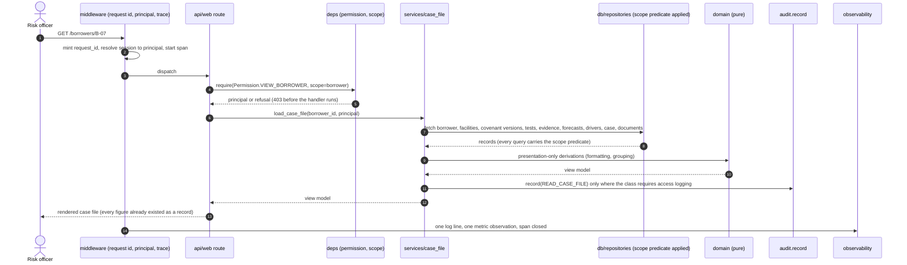

# plan.md — Covenant Radar · build design and sequence

**Companion to `spec.md` v1.0 (2026-08-30). Written for one engineer working with one coding agent at a time, and for the human who reviews every change.**

Sections `§0`–`§15`. A bare `§N` is a section of **this** document; a section of the specification is always written `spec §N`. IDs introduced here and never renumbered: `T-001…` tasks (detailed in `tasks.md`), `C-01…` contracts, `ADR-01…` architecture decision records, `[OPEN-11]+` open questions continuing after the spec's `[OPEN-10]`.

**Authority.** `spec.md` decides *what* is built and *what counts as done*. This document decides *how it is structured, in what order, and against which interfaces*. No requirement is added, removed or reworded here. Where this plan disagrees with the specification, §14 records the disagreement and the plan follows the specification.

---

## §0 The one page

**What is being built.** A production covenant-monitoring and early-warning system for Indian commercial credit. It keeps a versioned register of every covenant a borrower signed, recomputes each one on its contractual schedule from ingested financial statements and account conduct, scores daily behavioural signals for persistence and materiality rather than raising an alert for each, projects each covenant's headroom to a dated breach risk with named drivers, simulates what each candidate intervention would do to that date, ranks the portfolio, drafts a grounded memo, delivers it to the desk that needs it, and keeps an audit trail that reconstructs any warning it ever raised.

**The stack.** Python 3.12+ · FastAPI 0.141.1 + Uvicorn 0.52.4 · Pydantic 2.x · SQLAlchemy 2.0 + Alembic · PostgreSQL 17 (production) / SQLite (development, tests, offline evaluation) · Jinja2 3.1.6 + HTMX 2.x (vendored) + hand-written CSS + vanilla JS modules + inline SVG · APScheduler 3.11 with a database job store · pypdf, pdfplumber, OCRmyPDF, python-docx, WeasyPrint · NumPy + pandas · a pluggable LLM provider layer over httpx + tenacity · argon2-cffi, authlib, pysaml2, cryptography · structlog, prometheus-client, opentelemetry · pytest, hypothesis, mutmut, ruff, mypy, bandit, pip-audit, playwright, axe-core. Everything pinned in a lock file; nothing from a third-party origin at runtime.

**Execution mode: single agent, serial.** One coding agent — Claude Code or Codex, never both at once — takes one task at a time from the ordered backlog in `tasks.md`, works it to green on its own branch, and hands it to a human reviewer who merges it. There are no lanes, no file-ownership fences between concurrent workers, no batch disjointness proofs and no cross-agent merge protocol, because there is never more than one writer. §11 is the whole protocol.

**The shape of the codebase.** A `src/` layout with one installable package, `covenant_radar`, whose layers are enforced by an import-linter contract in CI: presentation (`web`, `api`) depends on application (`services`), which depends on domain (`domain`) and ports; adapters (`db`, `ai`, `ingestion`, `documents`, `notifications`) implement ports; and `domain/` imports nothing above it and no framework at all. That single rule is what keeps stages 2–6 auditable, and CI fails the build when it is broken.

**The work.** 173 tasks, `T-001`…`T-173`, grouped into seven milestones totalling **272 ideal days** before `spec §28`'s 20% contingency of 55, for **327** to general availability. Every task is 0.5–3.0 days, builds or supports a named requirement, names its files, its contracts, its tests and its commands, and leaves the full quality gate green.

**The milestones.** M-0 Foundation (34 d, `T-001`–`T-023`) · M-1 Covenant core (29 d, `T-024`–`T-041`) · M-2 Intelligence (35 d, `T-042`–`T-065`) · M-3 Interface and explainability (29 d, `T-066`–`T-083`) · M-4 Documents, intake and memo (39 d, `T-084`–`T-108`) · M-5 Workflow, integration and platform (51 d, `T-109`–`T-141`) · M-6 Hardening and release (55 d, `T-142`–`T-173`).

**The one command that proves the tree.**

```
python -m radarctl gate
```

which runs, in order and stopping at the first failure: `ruff format --check` · `ruff check` · `mypy src` · `lint-imports` (layer contracts) · `pytest tests/unit tests/property` · `alembic check` (model drift) · `pytest tests/integration` · `pytest tests/contract` · `python -m radarctl seed --check-deterministic` · `python -m evaluation.run --both-arms --gate` · `pytest tests/e2e` · `pytest tests/a11y` · `bandit -c pyproject.toml -r src` · `pip-audit` · `python -m radarctl perf --check`.

Locally, `python -m radarctl gate --fast` runs the first six steps in under two minutes; CI runs the full sequence. A task is not done until the fast gate is green locally and the full gate is green in CI.

**The refusal.** A task block in `tasks.md` is worked on its own. Where the block does not say enough to do the work without guessing, the agent stops, does not guess, and prints:

```
BRIEF INCOMPLETE — T-0NN: <the one fact that is missing>
```

That line is agent output. It never appears in this document, in code, in a comment, in a test name or in a commit message. Refusing costs an hour; guessing costs a rewrite and, in an audited system, possibly a wrong number on a screen.

---

## §1 Baseline, inventory and what this plan adds

### 1.1 Repository baseline, inspected 2026-08-30

The working directory `c:\Users\GenAICHNSIRUSR35\exp_team` contains `spec.md`, `plan.md`, `tasks.md`, `problem.md`, `MERGE_LOG.md`, `.gitignore`, `.claude/` and `.agent-workspaces/`. There is **no product source, no manifest, no lock file, no test and no migration**. Python 3.12.8 is present at `C:\Program Files\Python312\python.exe`. `git` was not on PATH at the time of the earlier inspection and is carried as `[OPEN-11]`; the first task installs or resolves it, because a production build without version control is not a production build.

`MERGE_LOG.md` carries a hackathon-era baseline block referring to task ids from the previous plan. It is superseded: `T-001` rewrites it against this plan's ids and records the supersession rather than deleting the history.

**The product is greenfield. Nothing is replaced because nothing exists.** The four markdown documents are preserved and are never edited by a task; `spec.md`, `plan.md` and `tasks.md` are under every task's `Off limits`.

### 1.2 What each section of this plan carries

| Section | Transcribes from | Authors here |
|---|---|---|
| §0 | everything below it | nothing |
| §1 | `spec §10`, `§28` | the baseline, the execution mode, the requirement-to-task map |
| §2 | `spec §13` | pinned versions, install order, verification, fallbacks |
| §3 | `spec §13` | the layer contract, the module map, the request walk, cross-cutting mechanics |
| §4 | `spec §14`, `spec §25` | the complete tree with ownership and generation |
| §5 | `spec §14` | every table, field, type, index, constraint and migration rule |
| §6 | `spec §14`'s interface table | every contract row not already fixed there |
| §7 | `spec §15` entire | tokens as files, the component inventory, the screen build, the proof method |
| §8 | `spec §17`, `spec §20` | the provider layer, prompt files, the call site, the trace, the harness |
| §9 | `spec §10` | the 173-task index with effort, requirement and dependency |
| §10 | `spec §28` | ordering, the dependency graph, the critical chain, effort arithmetic |
| §11 | — | the single-agent execution protocol |
| §12 | `spec §26` | the sequencing-risk register and what is done when a milestone runs long |
| §13 | `spec §23`, `§24` | the gate command, the test taxonomy, the release checklist |
| §14 | `spec §27` | disagreements, additions and new open questions |
| §15 | — | the checks on this document |

### 1.3 Requirement inventory, counted against the specification

Functional `must`: R-01…R-36 — **36**. Non-functional `must`: N-01…N-12 — **12**. Total requirements: **48**. Product-posture exclusions: P-01…P-05 — **5**. Flows: F-01…F-08 — **8**. Risks: RISK-01…RISK-10 — **10**. Open questions inherited: [OPEN-01]…[OPEN-10] — **10**. Assumptions: [ASSUMED-01]…[ASSUMED-08] — **8**. Milestones: M-0…M-6 — **7**.

**There is no `should`, no `later`, no cut list and no narrowed variant in this plan, because the specification has none.** A task exists for every requirement; a requirement exists for every task that carries `Builds:`.

### 1.4 Every requirement mapped to its tasks

| Req | Spec days | Plan days | Tasks |
|---|---|---|---|
| R-01 | 4 | 4.0 | T-006, T-007, T-008, T-009, T-010 (partial), T-011 |
| R-02 | 4 | 4.0 | T-008 (partial), T-023, T-010 (partial) |
| R-03 | 5 | 5.0 | T-024, T-025, T-026 |
| R-04 | 6 | 6.0 | T-084, T-085, T-086, T-087 |
| R-05 | 5 | 5.0 | T-031, T-032, T-033 |
| R-06 | 7 | 7.0 | T-093, T-094, T-095, T-096 |
| R-07 | 5 | 5.0 | T-027, T-028, T-029, T-030 |
| R-08 | 6 | 6.5 | T-034, T-035, T-036, T-037 |
| R-09 | 4 | 2.5 | T-038, T-039 |
| R-10 | 6 | 5.0 | T-042, T-043, T-044, T-045 |
| R-11 | 7 | 7.0 | T-046, T-047, T-048, T-049, T-050, T-051 |
| R-12 | 7 | 8.0 | T-052, T-053, T-054, T-055, T-056 |
| R-13 | 3 | 2.5 | T-057, T-058 |
| R-14 | 4 | 4.0 | T-059, T-060, T-061 |
| R-15 | 5 | 5.0 | T-062, T-063, T-064 |
| R-16 | 3 | 1.5 | T-098 |
| R-17 | 5 | 6.0 | T-099, T-100, T-101, T-102 |
| R-18 | 4 | 3.5 | T-109, T-110 |
| R-19 | 3 | 3.0 | T-111, T-112 |
| R-20 | 5 | 6.5 | T-066, T-067, T-068, T-069 |
| R-21 | 5 | 4.5 | T-070, T-071, T-072 |
| R-22 | 3 | 3.0 | T-073, T-074 |
| R-23 | 7 | 7.0 | T-075, T-076, T-077, T-078 |
| R-24 | 4 | 2.0 | T-097 |
| R-25 | 4 | 4.5 | T-079, T-080, T-081 |
| R-26 | 5 | 4.5 | T-113, T-114, T-115 |
| R-27 | 4 | 5.5 | T-116, T-117, T-118, T-119 |
| R-28 | 5 | 5.5 | T-120, T-121, T-122 |
| R-29 | 7 | 8.0 | T-123, T-124, T-125, T-126, T-127 |
| R-30 | 5 | 6.0 | T-128, T-129, T-130, T-131 |
| R-31 | 5 | 4.5 | T-132, T-133, T-134 |
| R-32 | 4 | 4.0 | T-135, T-136 |
| R-33 | 3 | 2.5 | T-137, T-138 |
| R-34 | 3 | 1.5 | T-139 |
| R-35 | 3 | 2.5 | T-140, T-141 |
| R-36 | 2 | 1.5 | T-082 |
| N-01 | 6 | 6.0 | T-103, T-104, T-105, T-106 |
| N-02 | 5 | 5.5 | T-142, T-143, T-144, T-145 |
| N-03 | 3 | 3.0 | T-004, T-012 |
| N-04 | 8 | 9.5 | T-013, T-014, T-015, T-016, T-017, T-018, T-019 |
| N-05 | 3 | 3.5 | T-146, T-147 |
| N-06 | 4 | 4.0 | T-148, T-149, T-150 |
| N-07 | 3 | 2.0 | T-083 |
| N-08 | 5 | 8.0 | T-151, T-152, T-153, T-154, T-155 |
| N-09 | 6 | 6.5 | T-156, T-157, T-158, T-159, T-160 |
| N-10 | 4 | 5.5 | T-161, T-162, T-163, T-164, T-165 |
| N-11 | 4 | 5.0 | T-166, T-167, T-168, T-169 |
| N-12 | 4 | 3.0 | T-107, T-108 |

Per-requirement deltas exist in both directions and net out inside the milestone totals; §10's arithmetic reconciles them and §14 explains the four largest. Supporting tasks that build no single requirement — tooling, design system, shell, reference portfolio, calibration, penetration-test remediation, integration reserve — are listed separately in §10.

---

## §2 The stack, pinned and installed

*Choices are `spec §13`'s. Versions, install order, verification and fallbacks are authored here.*

| Purpose | Package and version | Verified by | Fallback |
|---|---|---|---|
| Runtime | CPython 3.12.8 (3.13 supported) | `python -V` | None — foundational |
| Web framework | `fastapi==0.141.1` | `/health` responds | Starlette directly |
| ASGI server | `uvicorn[standard]==0.52.4` | service starts and binds | Hypercorn |
| Validation and settings | `pydantic==2.11.*`, `pydantic-settings==2.7.*` | settings load and refuse invalid input | dataclasses with explicit validators |
| ORM and core | `sqlalchemy==2.0.*` | schema creates, queries run on both engines | None |
| Migrations | `alembic==1.14.*` | `alembic upgrade head`, `alembic check` | None |
| PostgreSQL driver | `psycopg[binary]==3.2.*` | connection and pool | `psycopg2-binary` |
| Templating | `jinja2==3.1.6` | screens render | None |
| Progressive interaction | HTMX 2.0.x, **vendored** into `static/vendor/` with its licence and integrity hash | interaction tests pass; no external request in the CSP report | Full page loads |
| Scheduling | `apscheduler==3.11.*` | jobs run, survive restart, resume from the store | Platform scheduler invoking the CLI |
| PDF text and layout | `pypdf==5.*`, `pdfplumber==0.11.*` | span extraction test | Text-only extraction with a flag |
| OCR | `ocrmypdf==16.*` with Tesseract 5 (system package, documented in the installer) | OCR confidence test | Pages route to human review |
| DOCX | `python-docx==1.1.*` | export test | — |
| PDF output | `weasyprint==63.*` | memo export test | ReportLab |
| Numeric | `numpy==2.2.*`, `pandas==3.0.5` | ratio and projection tests | Pure-Python statistics |
| HTTP client | `httpx==0.28.1` | provider adapter test | — |
| Retry and backoff | `tenacity==9.*` | retry tests | Hand-written backoff |
| Password hashing | `argon2-cffi==23.*` | auth tests | — |
| OIDC | `authlib==1.4.*` | SSO integration test against a local provider | — |
| SAML | `pysaml2==7.*` | SSO integration test | OIDC only, documented |
| Cryptography | `cryptography==44.*` | field-encryption tests | — |
| Signed cookies and tokens | `itsdangerous==2.2.*` | session tests | — |
| Structured logging | `structlog==25.*` | log-shape tests | stdlib logging with a JSON formatter |
| Metrics | `prometheus-client==0.21.*` | `/metrics` scrapes | — |
| Tracing | `opentelemetry-sdk==1.29.*` | span propagation test | Logging correlation only |
| Email | stdlib `smtplib` + `email` | SMTP sink test | — |
| Spreadsheets | `openpyxl==3.1.*` | import and export tests | CSV only, documented |
| Tests | `pytest==9.1.1`, `pytest-cov`, `pytest-asyncio`, `hypothesis==6.*`, `mutmut==3.*` | the gate | stdlib `unittest` for the core only |
| Browser tests | `playwright==1.5*` | e2e suite | Documented manual script |
| Accessibility | `axe-core` via Playwright | a11y suite | Manual audit |
| Lint, format, types | `ruff==0.9.*`, `mypy==1.14.*`, `import-linter==2.*` | the gate | — |
| Security scanning | `bandit==1.8.*`, `pip-audit==2.*`, `detect-secrets==1.5.*` | the gate | — |
| Packaging | `hatchling`, `uv` or `pip-tools` for the lock, `cyclonedx-py` for the bill of materials | reproducible build test | — |

**Rules that hold for every dependency.** Exact pins in `requirements.lock` generated from `pyproject.toml`; no range, ever. Licences recorded in the bill of materials and checked against the allowed list in CI. A new dependency requires an architecture decision record naming what it replaces and why it is not written in-house. Nothing is fetched at runtime — HTMX, fonts and every static asset are vendored with their licences. `T-001` and `T-003` establish this and `T-155` proves it reproducible.

**Environment verification, run once at `T-001` and again by the installer's post-install check (`T-151`, `T-152`):** Python version · lock resolves and installs · PostgreSQL reachable and at the required version · SQLite version supports the features used · Tesseract present if OCR is enabled · the model provider reachable if configured, with TLS verification on · the document store path writable · the clock synchronised to IST. Each prints pass, fail or not-configured; none is assumed.

---

## §3 Architecture

### 3.1 The layer contract, enforced in CI

```
                    ┌─────────────────────────────────────────┐
   HTTP / HTMX ───▶ │  web/          api/                     │  presentation
                    │  templates, routes, forms, view models  │
                    └───────────────┬─────────────────────────┘
                                    │ calls
                    ┌───────────────▼─────────────────────────┐
                    │  services/                              │  application
                    │  use cases, transactions, authorization │
                    │  orchestration, audit emission          │
                    └───────┬───────────────────┬─────────────┘
                            │ calls             │ uses
              ┌─────────────▼──────┐   ┌────────▼──────────────┐
              │  domain/           │   │  ports/               │
              │  pure rules:       │   │  Protocol classes:    │
              │  ratios covenants  │   │  LLMProvider          │
              │  signals forecast  │   │  DocumentStore        │
              │  triage            │   │  Notifier             │
              │  interventions     │   │  FeedAdapter          │
              │  NO framework      │   │  ConnectorTransport   │
              │  NO I/O            │   │  Clock  UnitOfWork    │
              └────────────────────┘   └────────┬──────────────┘
                                                │ implemented by
                    ┌───────────────────────────▼─────────────┐
                    │  db/  ai/  ingestion/  documents/        │  adapters
                    │  notifications/  scheduler/             │
                    └─────────────────────────────────────────┘
                    ┌─────────────────────────────────────────┐
                    │  config/  security/  audit/  observability/  cross-cutting
                    └─────────────────────────────────────────┘
```

The contracts `lint-imports` enforces, and which fail the build:

1. `covenant_radar.domain` may import only the standard library, `decimal`, `datetime`, typing and its own submodules. **Not** SQLAlchemy, FastAPI, Pydantic models bound to the database, the AI package, or any adapter.
2. `covenant_radar.services` may import `domain`, `ports`, `audit`, `security` and `config`. **Not** `web`, `api` or any adapter module directly — adapters arrive by dependency injection through their ports.
3. Only `covenant_radar.ai.client` may perform an outbound model call. No other module imports the provider adapters.
4. `covenant_radar.web` and `covenant_radar.api` may import `services`, `config` and view models. **Not** `domain` internals, `db` or `ai`.
5. Nothing outside `covenant_radar.db` may import a SQLAlchemy session.
6. No module may import `covenant_radar.audit.store`'s write path except through `audit.record`, so every audit write is one code path.

Contract 1 is the product. Stages 2 through 6 of `spec §3`'s mechanism live in `domain/`, and a domain module that knows about a model provider, a web request or a database session has stopped being auditable.

### 3.2 Request flow



The memo path adds: `services/memo` assembles a slot map from records only → `ai.masking.build_outbound` admits whitelisted, non-personal keys and raises on anything else → `ai.client.call` is the single outbound hop, with timeout, one retry, ceilings, budget check and per-call logging → `ai.shapes.check_stage7` validates before anything is stored → pass persists the memo and writes a stage-7 trace row; fail retries once then refuses, writing no memo record.

### 3.3 Cross-cutting mechanics, decided once

- **Request identity.** A `request_id` (`rq-` plus 16 hex) is minted in middleware, carried in a context variable, and written verbatim onto every application log line, every audit event, every trace row, every model-call record and every job log line that request causes. Background jobs mint a `job_run_id` in the same shape and propagate it identically. One search across three sinks reconstructs any request or run.
- **Time.** All instants are stored as timezone-aware UTC and rendered in IST. The domain takes a `Clock` port so time is injectable and tests are deterministic. `datetime.now()` without the port fails a lint rule.
- **Money and ratios.** Money is `Decimal` in ₹ with the unit recorded; ratios are `Decimal` with an explicit quantisation applied only at display. Floating-point money fails review.
- **Identifiers.** Every entity has a UUIDv7 primary key and, where users see it, a short human reference (`B-000123`, `CV-000456`) that is stable and never reused.
- **Transactions.** One unit of work per use case, opened by the service, never by a repository or a route. A service that needs two transactions is two use cases.
- **Errors.** A single exception hierarchy — `DomainError`, `ValidationError`, `AuthorizationError`, `NotFound`, `Conflict`, `ExternalServiceError` — mapped once to HTTP status codes and once to UI states. No handler invents a status code.
- **Concurrency.** Optimistic concurrency with a version column on every user-editable entity; the second writer is told what changed and by whom.
- **Audit emission.** Services emit audit events; routes and repositories never do. Every state-changing service call either records an event or is explicitly annotated as non-auditable with a reason, and a test enumerates the exceptions.
- **Configuration.** One typed settings object loaded at startup from file plus environment, validated, immutable thereafter. Thresholds are separate, versioned, hot-reloadable and approval-gated, and are read through one accessor so a static check can prove no threshold literal exists in a branch.
- **Feature availability, not feature flags.** There are no flags that change product behaviour. There are *capability* switches that reflect what is configured — model provider present or absent, SSO configured or not, OCR available or not — and each has a designed degraded state. A capability switch may never enable something `spec §8.2` forbids.

---

## §4 Directory structure

Marks: `new` unless stated. Ownership is the whole team; the column names the task that creates it.

```
covenant-radar/
├─ pyproject.toml                     packaging, tool config (ruff, mypy, pytest, coverage) · T-001
├─ requirements.lock                  exact pins, generated · T-001
├─ .python-version                                            · T-001
├─ README.md                          what it is, how to run it, where the docs are · T-001
├─ CHANGELOG.md                       Keep-a-Changelog, one entry per release · T-001
├─ CONTRIBUTING.md                    the working agreement in §11 · T-001
├─ LICENSE                                                    · T-001
├─ SECURITY.md                        reporting, supported versions · T-019
├─ .env.example                       every variable, no value · T-004
├─ .gitignore  .gitattributes  .editorconfig                  · T-001
├─ .pre-commit-config.yaml            format, lint, types, secret scan · T-002
├─ alembic.ini                                                · T-010
├─ noxfile.py                         one entry point per gate step, cross-platform · T-002
├─ spec.md  plan.md  tasks.md  problem.md   EXISTING · never edited by a task
├─ MERGE_LOG.md                       review and merge ledger · T-001
│
├─ config/
│  ├─ default.toml                    non-secret defaults · T-004
│  ├─ production.example.toml         the deployment template · T-004
│  ├─ thresholds.default.json         spec §17.5's T1–T12 · T-012
│  └─ logging.toml                                            · T-005
│
├─ src/covenant_radar/
│  ├─ __init__.py                     version string, single source of truth · T-001
│  ├─ __main__.py                     python -m covenant_radar · T-022
│  ├─ cli.py                          radarctl: serve, migrate, seed, gate, job, perf, diag · T-001
│  ├─ asgi.py                         the ASGI application factory · T-022
│  │
│  ├─ config/
│  │  ├─ settings.py                  typed settings, precedence, startup validation · T-004
│  │  ├─ thresholds.py                versioned store, snapshot, approval, hot reload · T-012
│  │  └─ capabilities.py              what is configured and what degrades · T-004
│  │
│  ├─ core/
│  │  ├─ errors.py                    the one exception hierarchy · T-005
│  │  ├─ ids.py                       UUIDv7, request ids, human references · T-005
│  │  ├─ clock.py                     Clock port and the real implementation · T-005
│  │  ├─ money.py                     Decimal money, units, ₹ formatting · T-005
│  │  ├─ result.py                    typed outcome for verification chains · T-005
│  │  └─ context.py                   request/job context variables · T-005
│  │
│  ├─ ports/
│  │  ├─ llm.py  document_store.py  notifier.py  feed.py
│  │  ├─ connector.py  unit_of_work.py  repository.py         · T-006, T-084, T-088, T-116, T-123, T-128
│  │
│  ├─ domain/                          PURE — no framework, no I/O
│  │  ├─ ratios/                       definitions.py library.py custom.py compute.py · T-027…T-030
│  │  ├─ covenants/                    model.py evaluate.py headroom.py exceptions.py
│  │  │                                cure.py calendar.py sma.py · T-031…T-037
│  │  ├─ signals/                      taxonomy.py evidence.py persistence.py
│  │  │                                materiality.py decay.py supersession.py · T-046…T-051
│  │  ├─ forecast/                     trend.py path.py crossing.py probability.py
│  │  │                                confidence.py attribution.py · T-052…T-058
│  │  ├─ triage/                       urgency.py banding.py changes.py · T-059, T-060
│  │  ├─ interventions/                catalogue.py effects.py simulate.py · T-062…T-064
│  │  └─ trace.py                      the one stage-record shape · T-070
│  │
│  ├─ services/                        use cases, transactions, authorization, audit emission
│  │  ├─ master_data.py  statements.py  documents.py  registry.py  intake.py
│  │  ├─ engine.py  certificates.py  ingestion.py  ledger.py  scoring.py
│  │  ├─ triage.py  simulation.py  memo.py  cases.py  overrides.py
│  │  ├─ notifications.py  reporting.py  admin.py  search.py  export.py
│  │  └─ reconstruction.py                                    · across M-1…M-5
│  │
│  ├─ db/
│  │  ├─ base.py  session.py  types.py  scoping.py            · T-006, T-016, T-017
│  │  ├─ models/   one module per aggregate                    · T-007…T-009
│  │  ├─ repositories/  one per aggregate, scope applied here  · T-006 onward
│  │  └─ migrations/  env.py  versions/                        · T-010
│  │
│  ├─ ai/
│  │  ├─ client.py                    THE single outbound call site · T-089
│  │  ├─ providers/  base.py  tcs_genailab.py  azure_openai.py
│  │  │              anthropic.py  recorded.py                · T-088, T-091
│  │  ├─ masking.py                   whitelist, fails closed · T-090
│  │  ├─ shapes.py                    stage-1 and stage-7 checks · T-095, T-100
│  │  ├─ prompts/  stage1_extract.v1.md  stage7_memo.v1.md    · T-092
│  │  ├─ budget.py                    ceilings, spend, queueing · T-089
│  │  └─ registry.py                  model registry, cards, drift · T-107, T-108
│  │
│  ├─ documents/
│  │  ├─ store.py  extract_native.py  ocr.py  classify.py  spans.py  render.py · T-084…T-087, T-102
│  │
│  ├─ ingestion/
│  │  ├─ statements/  mapping.py  normalise.py  validate.py  restate.py · T-024…T-026
│  │  ├─ connectors/  framework.py  file_drop.py  rest_pull.py  db_view.py
│  │  │                reconcile.py  quarantine.py            · T-123…T-127
│  │  └─ feeds/  adapters/  entity_resolution.py  dedupe.py  synthetic.py · T-128…T-131
│  │
│  ├─ notifications/  templates/  email.py  webhook.py  inapp.py  digest.py · T-116…T-119
│  ├─ scheduler/  jobs.py  pipeline.py  runner.py  ledger.py   · T-120…T-122
│  ├─ audit/  record.py  store.py  chain.py  reconstruct.py  bundle.py · T-066…T-069
│  ├─ security/  passwords.py  sessions.py  oidc.py  saml.py  rbac.py
│  │             permissions.py  crypto.py  secrets.py  maker_checker.py
│  │             headers.py  ratelimit.py  uploads.py          · T-013…T-019
│  ├─ observability/  logging.py  metrics.py  tracing.py  health.py  slo.py · T-005, T-142…T-145
│  ├─ reporting/  crilc.py  rfa_pack.py  mis.py  scheduler.py  · T-132…T-134
│  ├─ i18n/  catalogues/en/  catalogues/hi/  formatting.py     · T-140, T-141
│  ├─ api/  v1/routers/  v1/schemas/  deps.py  errors.py  openapi.py · T-135, T-136
│  └─ web/
│     ├─ routes/  queue.py  borrower.py  intake.py  simulator.py  audit.py
│     │            admin.py  cases.py  why.py  auth.py         · M-3, M-5
│     ├─ templates/  base.html  _components/  _states/  screens/ · T-021, T-022, M-3
│     ├─ static/  css/tokens.css  css/app.css  js/  vendor/htmx/  fonts/ · T-020, T-021
│     └─ view_models/                                          · M-3
│
├─ evaluation/
│  ├─ examples/  EX-###.json  _schema.json                     · T-103
│  ├─ cassettes/  recorded provider responses                  · T-091
│  ├─ arms/  product.py  baseline.py                           · T-104, T-105
│  ├─ run.py  score.py  report.py                              · T-104…T-106
│  └─ reference_portfolio/  generator.py  cohorts.py  labels.py · T-040, T-041
│
├─ tests/
│  ├─ conftest.py  factories/  fixtures/
│  ├─ unit/  property/  integration/  contract/  e2e/  a11y/  security/  perf/  migration/
│
├─ deploy/
│  ├─ linux/  install.sh  covenant-radar.service  nginx.conf.example
│  ├─ windows/  install.ps1  service.ps1
│  ├─ container/  Containerfile  compose.yaml
│  ├─ backup/  backup.sh  backup.ps1  restore.md
│  └─ upgrade/  upgrade.sh  upgrade.ps1  rollback.md           · T-148, T-151…T-154
│
├─ docs/
│  ├─ admin-guide/  user-guide/  api/  runbook/  adr/  model-cards/
│  ├─ compliance/  data-inventory.md  retention.md  evidence-pack.md
│  └─ architecture.md                                          · M-6
│
├─ .github/workflows/  ci.yml  security.yml  release.yml       · T-003
│
└─ var/                               GENERATED · gitignored
   ├─ documents/  logs/  backups/  evidence/  tmp/
```

**Committed:** all source, tests, configuration templates, prompts, evaluation examples and cassettes, reference-portfolio generator, vendored assets with licences, lock file, deployment scripts, documentation, `MERGE_LOG.md`.
**Ignored:** `var/`, `.venv/`, `__pycache__/`, `.pytest_cache/`, `.mypy_cache/`, `.ruff_cache/`, `*.db`, `.env`, `node_modules/`, `playwright-report/`, `.coverage*`.
**Never committed:** any secret, any real customer data, any generated document, any log.
**Preserved and never edited by a task:** `spec.md`, `plan.md`, `tasks.md`, `problem.md`.

---

## §5 The data model

*Authored here. `spec §14.2` named the entities and their governance and stopped short of the definitions.*

**Conventions that hold for every table, stated once.** Primary keys are UUIDv7 (`id`), stored as `uuid` on PostgreSQL and `char(36)` on SQLite through one custom type. Every table carries `created_at` and `updated_at` as timezone-aware UTC, `created_by_id` and `updated_by_id` referencing `app_user`, and `request_id`. User-editable entities carry `version` for optimistic concurrency. Money is `numeric(18,4)` with a sibling `*_unit` column; ratios are `numeric(18,6)`; percentages are stored as the number, not the fraction, with the convention documented per column. `NULL` means "not known" and never "zero". Soft deletion does not exist: entities are deactivated with `deactivated_at` and a reason, or superseded by a new row. JSON payloads are `jsonb` on PostgreSQL and `text` with a JSON check on SQLite. Every foreign key is declared with an explicit `ondelete` policy — `RESTRICT` by default, `CASCADE` only where the child has no independent meaning.

### 5.1 Identity, access and structure

| Table | Key fields | Notes |
|---|---|---|
| `organisation` | `name`, `short_code`, `regulatory_id`, `fiscal_year_start_month` | One row per deployment; the FY start drives every quarter calculation |
| `portfolio` | `code`, `name`, `parent_id`, `branch_code`, `path` | Materialised path so scope predicates are one `LIKE` rather than a recursive query |
| `app_user` | `username`, `email`, `full_name`, `password_hash`, `auth_source`, `external_subject`, `is_active`, `mfa_secret_enc`, `failed_attempts`, `locked_until`, `password_changed_at`, `must_change_password`, `locale`, `theme` | `auth_source ∈ {local, oidc, saml}`; `password_hash` is Argon2id; `mfa_secret_enc` is field-encrypted |
| `role` | `code`, `name`, `is_system` | Seven system roles from `spec §16.1`; custom roles permitted |
| `permission` | `code`, `description` | The enumerated permission set; seeded, never user-created |
| `role_permission` | `role_id`, `permission_id` | Unique together |
| `user_role` | `user_id`, `role_id`, `granted_by_id`, `granted_at` | |
| `user_portfolio_scope` | `user_id`, `portfolio_id`, `include_descendants` | The row-level scope; absence of any row means no access, never all access |
| `user_session` | `user_id`, `token_hash`, `issued_at`, `last_seen_at`, `expires_at`, `absolute_expires_at`, `ip_hash`, `user_agent_hash`, `revoked_at` | Token stored hashed only |
| `api_key` | `name`, `key_hash`, `prefix`, `scopes`, `portfolio_scope`, `rate_limit_per_min`, `expires_at`, `last_used_at`, `revoked_at` | Prefix is shown; the key is displayed once |
| `maker_checker_request` | `subject_type`, `subject_id`, `operation`, `payload`, `maker_id`, `checker_id`, `state`, `decided_at`, `reason` | `state ∈ {pending, approved, rejected, expired}`; a database check enforces `maker_id <> checker_id` |

**Indexes:** `portfolio(path)`, `app_user(username)` unique, `app_user(email)` unique where active, `user_session(token_hash)` unique, `user_portfolio_scope(user_id)`, `api_key(key_hash)` unique, `maker_checker_request(state, subject_type)`.

### 5.2 Borrower and facility

| Table | Key fields | Notes |
|---|---|---|
| `borrower` | `reference` (`B-000123`), `legal_name`, `cin_enc`, `pan_enc`, `industry_code`, `group_id`, `portfolio_id`, `constitution`, `incorporation_date`, `is_active` | `cin_enc`/`pan_enc` field-encrypted; a deterministic `cin_fingerprint` (HMAC) supports uniqueness and lookup without decryption |
| `borrower_group` | `name`, `parent_id` | Concentration and related-party analysis |
| `related_party` | `borrower_id`, `party_type`, `name_enc`, `identifier_enc`, `role`, `effective_from`, `effective_to` | `party_type ∈ {promoter, guarantor, director, signatory, related_entity}`; **identifying class** |
| `borrower_contact` | `borrower_id`, `name_enc`, `email_enc`, `phone_enc`, `designation`, `is_primary` | **identifying class** |
| `facility` | `reference` (`F-000123-01`), `borrower_id`, `facility_type`, `sanctioned_limit`, `currency`, `drawing_power`, `outstanding`, `security_type`, `pricing_bps`, `sanction_date`, `maturity_date`, `effective_from`, `effective_to`, `superseded_by_id` | Effective-dated: a limit change inserts a new row and closes the old |
| `facility_conduct` | `facility_id`, `as_of_date`, `outstanding`, `utilisation_pct`, `days_past_due`, `overdue_amount`, `excess_amount`, `source_id` | One row per facility per day; the SMA input |
| `industry_reference` | `code`, `name`, `parent_code`, `taxonomy_version` | Seeded reference data |

**Indexes:** `borrower(reference)` unique, `borrower(cin_fingerprint)` unique where active, `borrower(portfolio_id)`, `facility(borrower_id, effective_from)`, `facility_conduct(facility_id, as_of_date)` unique, `facility_conduct(as_of_date)`.

### 5.3 Financial statements

| Table | Key fields | Notes |
|---|---|---|
| `statement_line_definition` | `code`, `name`, `statement`, `sign_convention`, `is_derived`, `derivation` | The normalised chart; seeded, versioned |
| `financial_period` | `borrower_id`, `fy_label` (`FY27Q2`), `period_type`, `period_start`, `period_end`, `is_complete`, `is_audited`, `version`, `superseded_by_id`, `source_batch_id` | Restatement creates a new version; the old remains |
| `statement_line_value` | `period_id`, `line_code`, `value`, `unit`, `currency`, `provenance_id` | One row per line per period version |
| `field_provenance` | `source_type`, `source_reference`, `row_reference`, `mapping_version`, `ingested_at`, `batch_id`, `transform_note` | Referenced by any field whose origin must be defensible |
| `import_batch` | `source_type`, `source_reference`, `mapping_id`, `content_hash`, `started_at`, `finished_at`, `row_count`, `accepted_count`, `quarantined_count`, `state`, `report` | `content_hash` unique — idempotence |
| `quarantine_row` | `batch_id`, `row_number`, `raw`, `rule_failed`, `message`, `resolved_at`, `resolved_by_id`, `resolution` | Nothing is silently dropped |
| `import_mapping` | `name`, `source_type`, `version`, `spec`, `is_active` | A mapping change is a new version |

**Indexes:** `financial_period(borrower_id, fy_label, version)` unique, `statement_line_value(period_id, line_code)` unique, `import_batch(content_hash)` unique, `quarantine_row(batch_id, resolved_at)`.

### 5.4 Documents

| Table | Key fields | Notes |
|---|---|---|
| `document` | `borrower_id`, `facility_id`, `doc_type`, `filename`, `content_hash`, `byte_size`, `mime_type`, `storage_key`, `uploaded_by_id`, `scan_result`, `page_count`, `extraction_state`, `ocr_applied`, `retention_class`, `purge_after` | `content_hash` unique per borrower — re-upload is recognised |
| `document_page` | `document_id`, `page_number`, `text`, `ocr_confidence`, `needs_review`, `width`, `height` | `needs_review` set below T9 |
| `document_span` | `document_id`, `page_number`, `start_offset`, `end_offset`, `bbox`, `text`, `span_type` | The anchor every extracted field points at |

**Indexes:** `document(borrower_id, doc_type)`, `document(content_hash)`, `document_page(document_id, page_number)` unique, `document_span(document_id, page_number)`.

### 5.5 Covenants

| Table | Key fields | Notes |
|---|---|---|
| `covenant` | `reference` (`CV-000456`), `facility_id`, `name`, `covenant_class`, `is_active` | The stable identity across versions |
| `covenant_version` | `covenant_id`, `version_no`, `definition_ref`, `custom_formula`, `threshold`, `direction`, `unit`, `frequency`, `test_basis`, `effective_from`, `effective_to`, `warning_headroom_pct`, `cure_days`, `grace_days`, `source_document_id`, `source_span_id`, `status`, `tested_at_least_once`, `registered_by_id`, `approved_by_id` | `direction ∈ {min, max}`; `frequency ∈ {monthly, quarterly, half_yearly, annual, on_event}`; `status ∈ {draft, pending_approval, live, superseded, retired}`; immutable once `tested_at_least_once` |
| `covenant_exception` | `covenant_version_id`, `from_period`, `to_period`, `relaxed_threshold`, `reason`, `document_id`, `approved_by_id` | Dated relaxation carried by the version |
| `covenant_waiver` | `covenant_id`, `from_date`, `to_date`, `scope`, `reason`, `document_id`, `requested_by_id`, `approved_by_id`, `state` | Attaches to the covenant without altering any version |
| `covenant_test` | `covenant_version_id`, `period_id`, `as_of_date`, `value`, `threshold_used`, `headroom_pct`, `verdict`, `exception_id`, `waiver_id`, `cure_ends_on`, `inputs`, `not_computable_reason`, `computed_at`, `job_run_id` | `verdict ∈ {pass, warning, breach, breach_cure_open, stale, not_computable}` |
| `covenant_schedule` | `covenant_version_id`, `due_date`, `state`, `test_id`, `certificate_id` | The testing calendar R-09 and R-28 both read |
| `ratio_definition` | `code`, `name`, `formula_text`, `required_lines`, `unit`, `plausible_min`, `plausible_max`, `direction_hint`, `taxonomy_version` | The 24 library definitions as data, so the plausible band is configuration and not a literal |

**Indexes:** `covenant(reference)` unique, `covenant_version(covenant_id, version_no)` unique, `covenant_version(facility_id, status)` via the parent join, `covenant_test(covenant_version_id, as_of_date)`, `covenant_test(as_of_date, verdict)`, `covenant_schedule(due_date, state)`.

**The immutability rule, enforced in three places:** a database trigger refuses `UPDATE` on `covenant_version` where `tested_at_least_once` is true except for `status` and `effective_to`; the repository has no update method for the other columns; and a test asserts both.

### 5.6 Signals, evidence and certificates

| Table | Key fields | Notes |
|---|---|---|
| `signal_event` | `borrower_id`, `facility_id`, `event_date`, `family`, `event_type`, `magnitude`, `unit`, `payload`, `source_id`, `content_hash`, `is_late`, `ingested_at` | `family ∈ {payment, utilisation, treasury, concentration, industry, news}`; `content_hash` unique — idempotence for free |
| `evidence_item` | `borrower_id`, `facility_id`, `family`, `evidence_type`, `first_seen`, `last_seen`, `persistence_days`, `event_count_window`, `materiality_pct`, `decay_factor`, `state`, `counts_toward_pressure`, `superseded_by_id`, `supersedes_id`, `source_event_ids`, `last_scored_at` | `state ∈ {transient, sustained, superseded, disputed}`; never deleted |
| `evidence_transition` | `evidence_id`, `from_state`, `to_state`, `occurred_on`, `rule`, `threshold_snapshot_id` | The flip R-11.b asserts is in the trail |
| `certificate_request` | `covenant_schedule_id`, `borrower_id`, `due_date`, `state`, `requested_at`, `received_at`, `document_id`, `reviewed_by_id`, `rejection_reason` | `state ∈ {requested, received, under_review, accepted, rejected, overdue}` |

**Indexes:** `signal_event(content_hash)` unique, `signal_event(borrower_id, event_date)`, `signal_event(event_date, family)`, `evidence_item(borrower_id, state)`, `evidence_item(state, last_scored_at)`, `certificate_request(state, due_date)`.

### 5.7 Forecast, simulation and triage

| Table | Key fields | Notes |
|---|---|---|
| `forecast_run` | `as_of_date`, `job_run_id`, `threshold_snapshot_id`, `model_version`, `started_at`, `finished_at`, `covenant_count`, `state` | Every forecast belongs to a run, so a whole day's scoring is reproducible |
| `forecast` | `run_id`, `covenant_version_id`, `horizon_days`, `probability`, `confidence`, `below_confidence_floor`, `projected_cross_date`, `direction`, `formula_inputs`, `data_as_of`, `staleness_days` | Unique on `(run_id, covenant_version_id, horizon_days)`. **Any probability shown anywhere exists here first** |
| `forecast_path` | `run_id`, `covenant_version_id`, `day_offset`, `projected_value`, `headroom_pct` | 0…max horizon; what the horizon control reads and never recomputes |
| `forecast_driver` | `forecast_id`, `name`, `share`, `evidence_id`, `is_other` | Shares at or above T5 individually; the remainder in one `other` row; shares sum to 1 |
| `simulation` | `forecast_id`, `intervention_id`, `parameters`, `assumptions`, `projected_cross_date`, `probability`, `delta_days`, `delta_probability`, `created_by_id` | Persisted, not transient, because a memo cites it |
| `intervention` | `code`, `role_tag`, `text`, `effect_model`, `effect_parameters`, `applicable_covenant_classes`, `requires_approval`, `is_active`, `retired_at` | Retired entries still resolve for historical memos |
| `triage_entry` | `run_id`, `borrower_id`, `worst_covenant_version_id`, `worst_horizon`, `probability`, `confidence`, `exposure`, `urgency`, `band`, `sma_band`, `what_changed`, `rank` | One row per borrower per run; the queue is a read of the latest run |

**Indexes:** `forecast(run_id, covenant_version_id, horizon_days)` unique, `forecast_path(run_id, covenant_version_id, day_offset)` unique, `triage_entry(run_id, rank)`, `triage_entry(run_id, band)`, `forecast_run(as_of_date)`.

### 5.8 Workflow, memo and notification

| Table | Key fields | Notes |
|---|---|---|
| `case` | `reference`, `borrower_id`, `opened_from_run_id`, `state`, `band_at_open`, `assignee_id`, `due_at`, `sla_hours`, `closed_at`, `closure_reason`, `closure_note` | `state ∈ {open, in_progress, monitoring, escalated, closed}` |
| `case_event` | `case_id`, `event_type`, `actor_id`, `payload`, `occurred_at` | Append-only case history |
| `case_comment` | `case_id`, `author_id`, `body`, `mentions` | |
| `action_taken` | `case_id`, `intervention_id`, `free_text`, `taken_at`, `actor_id`, `outcome` | The G2 measurement's raw material |
| `memo` | `borrower_id`, `run_id`, `case_id`, `template_version`, `prompt_version`, `provider`, `model_version`, `slots`, `drafted_text`, `actions`, `simulations`, `check_verdict`, `generated_by_id` | Written **only** after the shape check passes |
| `memo_export` | `memo_id`, `format`, `storage_key`, `integrity_hash`, `exported_at`, `exported_by_id` | |
| `override_record` | `subject_type`, `subject_id`, `stage`, `shown`, `user_action`, `user_value`, `reason`, `prompt_version`, `model_version`, `threshold_snapshot_id`, `actor_id` | The labelled dataset N-12 learns from |
| `disposition` | `subject_type`, `subject_id`, `outcome`, `reason_code`, `note`, `actor_id` | `outcome ∈ {acted, monitoring, dismissed}` |
| `notification` | `recipient_id`, `channel`, `template`, `subject_type`, `subject_id`, `payload`, `state`, `scheduled_for`, `sent_at`, `attempts`, `last_error`, `dead_lettered_at` | |
| `notification_preference` | `user_id`, `template`, `channel`, `enabled`, `quiet_hours_start`, `quiet_hours_end`, `digest_frequency` | |

### 5.9 Audit, trace, configuration and operations

| Table | Key fields | Notes |
|---|---|---|
| `audit_event` | `sequence` (monotonic bigint), `occurred_at`, `actor_id`, `actor_label`, `event_type`, `subject_type`, `subject_id`, `payload`, `threshold_snapshot_id`, `request_id`, `prev_hash`, `hash` | **Append-only.** `hash = H(sequence ‖ occurred_at ‖ actor ‖ type ‖ subject ‖ canonical(payload) ‖ prev_hash)`. No `UPDATE` or `DELETE` statement against this table exists in the source, and the application's database role holds no such grant |
| `trace_row` | `subject_type`, `subject_id`, `stage`, `decider`, `inputs`, `outputs`, `rule_or_prompt_version`, `thresholds_compared`, `confidence`, `sources`, `request_id`, `occurred_at` | `decider ∈ {code, model, statistical}`; `thresholds_compared` entries are `{name, value, observed, side}` with `side ∈ {above, below, at}`. One shape for every stage |
| `threshold_snapshot` | `values`, `source`, `effective_from`, `proposed_by_id`, `approved_by_id`, `note` | Every record that decided anything names the snapshot in force |
| `config_version` | `values_redacted`, `applied_at`, `applied_by_id`, `checksum` | Secrets are never stored, only their presence |
| `model_call` | `request_id`, `stage`, `provider`, `model_version`, `prompt_version`, `tokens_in`, `tokens_out`, `latency_ms`, `cost`, `currency`, `check_verdict`, `retry_count`, `refusal_reason`, `from_cassette` | |
| `model_registration` | `component`, `provider`, `model_id`, `prompt_version`, `purpose`, `owner_id`, `evaluation_run_id`, `approved_by_id`, `approved_at`, `state` | `state ∈ {registered, approved, champion, challenger, retired}` |
| `drift_observation` | `component`, `metric`, `window_start`, `window_end`, `value`, `baseline`, `breached` | |
| `job_run` | `job_name`, `run_id`, `trigger`, `started_at`, `finished_at`, `state`, `attempt`, `error`, `metrics` | The batch ledger R-28 resumes from |
| `connector` / `connector_run` | configuration and per-run reconciliation totals, lag, rejects | |
| `feed_source` / `entity_match` | feed configuration; match candidate, confidence, decision, `is_negative` | The negative-match memory R-30.b needs |
| `retention_purge_log` | `entity`, `criteria`, `purged_count`, `executed_at`, `executed_by` | N-11's proof |
| `evaluation_run` | `commit_sha`, `arm`, `scores`, `passed`, `executed_at` | The scoreboard the release notes carry |

**Migrations.** Every schema change is an Alembic revision with an upgrade and a downgrade, or an explicit irreversibility note with its reason. `alembic check` proves models and head agree and runs in the gate. A migration that moves data does so in batches with progress logging, and is tested against a representative dataset in `tests/migration`. Migrations never rewrite audit or trace history.

---

## §6 The contracts

*This section is the freeze.* A task copies the rows it uses and stops rather than briefing around an open one. No row is left to be decided at build time. Authorization is stated per row and is enforced in the application, not the template.

**Standing answer on identity for every HTTP row.** Every request resolves to a principal — a session user or an API key — or receives `401`. A principal without the named permission receives `403` with the missing permission named. A principal whose portfolio scope excludes the subject receives `404`, not `403`, so scope is not an enumeration oracle. Rate limits return `429` with `Retry-After`. Every state-changing route requires a CSRF token in the web surface and an idempotency key in the API where the operation is not naturally idempotent.

### 6.1 Web and API surface

| ID | Route | Module | In | Out | Caller wrong | Permission |
|---|---|---|---|---|---|---|
| **C-01** | `GET /` → queue | `web/routes/queue.py` | filters, saved view, page | 200 HTML | invalid filter → 400 with the field named | `VIEW_QUEUE`, scoped |
| **C-02** | `GET /borrowers/{ref}` | `web/routes/borrower.py` | borrower reference | 200 HTML case file | unknown or out of scope → designed 404 | `VIEW_BORROWER`, scoped |
| **C-03** | `GET /api/v1/forecasts/{covenant_ref}/path?day={int}` | `api/v1/routers/forecast.py` | `day: int 0..maximum_horizon` | `{day, projected_value, headroom_pct, probability\|null, confidence, below_confidence_floor, crossing_date\|null, drivers[]}` | out of range → 422 with the bound; unknown → 404 | `VIEW_BORROWER`, scoped. **Reads `forecast_path`; never recomputes, never calls a provider** |
| **C-04** | `POST /documents` | `web/routes/intake.py` | multipart file, `borrower_ref`, `doc_type` | 202 with a document id and extraction state | wrong type → 415; too large → 413; scan failure → 422 and quarantine | `UPLOAD_DOCUMENT`, scoped |
| **C-05** | `POST /intake/proposals` | `web/routes/intake.py` | `document_id` or `clause_text` (1..20000), `facility_ref` | 200 proposal list with per-check verdicts | empty → 422 "Provide the covenant text first."; oversize → 413, text not stored; injection-shaped → fixed refusal, security event | `RUN_INTAKE`, scoped |
| **C-06** | `POST /intake/proposals/{id}/submit` | `web/routes/intake.py` | corrected fields | 303 to the approval queue, or to the covenant when maker-checker is off | any verification failed → 409 `{error, failed_checks[]}`; **the control never rendered either** | `REGISTER_COVENANT`. **No role may submit a failed proposal in any configuration** |
| **C-07** | `POST /covenants/{ref}/approve` | `web/routes/intake.py` | decision, reason | 303 to the covenant, now `live` | maker equals checker → 409 naming the constraint | `APPROVE_COVENANT` |
| **C-08** | `POST /memos` | `web/routes/borrower.py` | `borrower_ref`, optional `simulation_ids[]` | 200 memo block; model prose wrapped and labelled | ceiling reached → 200 with a queued banner; provider down → 200 with the degraded message | `GENERATE_MEMO`, scoped |
| **C-09** | `GET /memos/{id}/export.{pdf\|docx}` | `web/routes/borrower.py` | format | 200 file with an integrity hash header | unknown format → 404 | `GENERATE_MEMO`, scoped |
| **C-10** | `GET /why/{subject_type}/{subject_id}` | `web/routes/why.py` | subject reference | 200 HTML drawer or full page, one section per stage in order | malformed → 400; a stage that did not run renders "not run" | `VIEW_BORROWER`, scoped |
| **C-11** | `POST /simulations` | `web/routes/simulator.py` | `forecast_id`, `intervention_code`, `parameters` | 200 with the counterfactual, delta and assumptions | inapplicable intervention → 422 naming why | `RUN_SIMULATION`, scoped |
| **C-12** | `POST /overrides` | `web/routes/borrower.py` | `subject`, `stage`, `user_action`, `user_value`, `reason (1..2000)` | 303 back to the subject; both states retained | missing reason → 422 "A reason is required."; stage out of range → 422 | `OVERRIDE_RISK_VIEW` |
| **C-13** | `POST /dispositions` | `web/routes/borrower.py` | `subject`, `outcome`, `reason_code`, `note` | 204 | unknown outcome → 422 | `RECORD_DISPOSITION`, scoped |
| **C-14** | `GET /cases`, `GET /cases/{ref}`, `POST /cases/{ref}` | `web/routes/cases.py` | filters; state, assignee, comment | 200 / 303 | closure with no reason → 422 | `VIEW_CASE` / `UPDATE_CASE`, scoped |
| **C-15** | `GET /audit`, `GET /audit/warnings/{forecast_id}` | `web/routes/audit.py` | filters; forecast id | 200 reconstruction with every part | unknown → 404; purged inputs → present with the retention rule named | `VIEW_AUDIT` |
| **C-16** | `POST /audit/warnings/{forecast_id}/bundle` | `web/routes/audit.py` | — | 202, then a downloadable signed bundle | — | `EXPORT_EVIDENCE` |
| **C-17** | `GET/POST /admin/users`, `/admin/roles`, `/admin/scopes` | `web/routes/admin.py` | user and role payloads | 200 / 303 | self-elevation without a checker → 409 | `MANAGE_USERS` |
| **C-18** | `POST /admin/thresholds` | `web/routes/admin.py` | proposed values, note | 303; enters `pending` | invalid shape → 422 naming the key; approval by the proposer → 409 | `PROPOSE_THRESHOLDS` / `APPROVE_THRESHOLDS` |
| **C-19** | `GET/POST /admin/connectors`, `POST /admin/connectors/{id}/dry-run` | `web/routes/admin.py` | configuration, mapping, schedule | 200 with the dry-run report | schema mismatch → 422 naming the difference; **dry run writes nothing** | `MANAGE_CONNECTORS` |
| **C-20** | `GET/POST /admin/jobs`, `POST /admin/jobs/{name}/run` | `web/routes/admin.py` | job name, parameters | 202 with a run id | unknown job → 404; already running → 409 | `MANAGE_JOBS` |
| **C-21** | `GET /api/v1/{borrowers,facilities,covenants,tests,evidence,forecasts,simulations,memos,cases,audit-events}` | `api/v1/routers/*` | filter, cursor, page size | 200 JSON per the OpenAPI document | invalid cursor → 422; out of scope → 404 | The matching `VIEW_*`, scoped |
| **C-22** | `POST /api/v1/ingest/{statements,signals,conduct}` | `api/v1/routers/ingest.py` | batch payload, idempotency key | 202 with a batch id | duplicate key → 200 with the prior batch; invalid row → 202 with quarantine counts | `INGEST_DATA` |
| **C-23** | `GET /health`, `GET /ready`, `GET /version`, `GET /metrics` | `observability/health.py` | — | health JSON; Prometheus text | — | Unauthenticated for `/health`; `/metrics` restricted by network or token |

### 6.2 Domain contracts — pure, no I/O

| ID | Signature | Module | Behaviour and failure |
|---|---|---|---|
| **C-30** | `compute_ratio(definition: RatioDefinition, lines: Mapping[str, Decimal], facility: FacilityFacts \| None) -> RatioResult` | `domain/ratios/compute.py` | `RatioResult(value, computable, reason, inputs_used)`. Missing line → not computable naming it. Zero or meaningless denominator → not computable with the defined reason. Unknown definition → `UnknownDefinition`. Never raises an arithmetic error |
| **C-31** | `parse_custom_formula(text: str, allowed_lines: frozenset[str]) -> Formula` | `domain/ratios/custom.py` | Restricted AST: literals, names from `allowed_lines`, `+ - * /` and parentheses only. Any call, attribute, subscript, comprehension or name outside the set → `FormulaRefused` naming the construct |
| **C-32** | `evaluate_covenant(version: CovenantVersionFacts, ratio: RatioResult, period: PeriodFacts, exception: ExceptionFacts \| None, waiver: WaiverFacts \| None, thresholds: Thresholds) -> CovenantEvaluation` | `domain/covenants/evaluate.py` | Returns value, threshold used, signed headroom, verdict, exception and waiver applied, cure end date, and the thresholds compared with sides. Boundary is `spec §17.5`'s documented behaviour. Never raises |
| **C-33** | `sma_band(days_past_due: int) -> SmaBand` | `domain/covenants/sma.py` | 0 → none; 1–30 → SMA-0; 31–60 → SMA-1; 61–90 → SMA-2; >90 → beyond. Negative → `ValueError` |
| **C-34** | `score_evidence(events: Sequence[SignalEventFacts], existing: Sequence[EvidenceFacts], as_of: date, thresholds: Thresholds) -> list[EvidenceScore]` | `domain/signals/evidence.py` | Persistence, materiality, decay and state per item, with the transition and the rule that caused it. Empty input → empty list, never an exception |
| **C-35** | `project(series: Sequence[Observation], pressure: Decimal, horizon_days: int, threshold: Decimal, direction: Direction) -> Projection` | `domain/forecast/path.py` | Slope, per-day drift, the full day-0..horizon path, the first crossing day or none. Fewer than two observations → zero slope and a stated reason |
| **C-36** | `probability(distance: Decimal, velocity: Decimal, pressure: Decimal, horizon_days: int, weights: Weights) -> Decimal` | `domain/forecast/probability.py` | The documented mapping, clamped to `[0, 0.99]` so no screen shows certainty. Terms returned alongside for the trace |
| **C-37** | `confidence(completeness: Decimal, evidence_support: Decimal, staleness_days: int) -> Decimal` | `domain/forecast/confidence.py` | The documented product, clamped to `[0, 1]` |
| **C-38** | `attribute(terms: Mapping[str, Decimal], threshold_t5: Decimal) -> list[DriverShare]` | `domain/forecast/attribution.py` | Normalised to sum 1.0; shares at or above T5 listed; the remainder in one `other` |
| **C-39** | `rank(entries: Sequence[TriageInput], thresholds: Thresholds) -> list[TriageEntry]` | `domain/triage/urgency.py` | Urgency, band, deterministic total ordering with the documented tie-break, what-changed. Empty → empty |
| **C-40** | `simulate(projection: Projection, intervention: InterventionFacts, parameters: Mapping) -> SimulationResult` | `domain/interventions/simulate.py` | Counterfactual path, crossing date, probability, deltas and the assumption list. Inapplicable intervention → `InterventionNotApplicable` naming the reason |
| **C-41** | `stage_record(stage, decider, inputs, outputs, rule_or_prompt_version, thresholds_compared, confidence, sources) -> TraceRecord` | `domain/trace.py` | One shape for every stage. A `thresholds_compared` entry without a `side` → `ValueError` naming it, because a threshold with no side is a coin toss written as a number |

### 6.3 Port contracts — the seams

| ID | Protocol | Implemented by | Failure |
|---|---|---|---|
| **C-50** | `LLMProvider.complete(request: CompletionRequest) -> CompletionResponse` | `ai/providers/{tcs_genailab,azure_openai,anthropic,recorded}.py` | Transport failure → `ProviderUnavailable`; auth failure → `ProviderAuthError`, **never retried with altered credentials**; malformed response → returned as-is for the shape check to refuse |
| **C-51** | `ai.client.call(stage: Stage, prompt: MaskedPrompt, prompt_version: str, context: CallContext) -> ModelResult` | `ai/client.py` | **The single outbound call site.** Unmasked prompt → `RuntimeError`; stage not in {1, 7} → `ValueError`; timeout → one retry → `ProviderUnavailable`; hourly, daily or budget ceiling → `CeilingReached` with **no call made**; every path writes one `model_call` row |
| **C-52** | `ai.masking.build_outbound(fields: Mapping[str, object]) -> MaskedPrompt` | `ai/masking.py` | Whitelist only; any other key → `FieldNotWhitelisted` naming it — **fails closed**. Names → role tokens, identifier patterns → opaque tokens, the configured secret value → redacted. The token map stays on the host |
| **C-53** | `DocumentStore.put/get/delete/stream` | `documents/store.py` | Unwritable → `StorageUnavailable` naming the path; a read of a missing key → `NotFound`; content is encrypted at rest |
| **C-54** | `Notifier.send(message: OutboundMessage) -> DeliveryResult` | `notifications/{email,webhook,inapp}.py` | Transient failure → retried with backoff to the configured count, then dead-lettered with an alert; **never silently dropped** |
| **C-55** | `ConnectorTransport.fetch(config, watermark) -> Iterator[SourceRecord]` | `ingestion/connectors/{file_drop,rest_pull,db_view}.py` | Schema difference → `SourceSchemaChanged` naming the difference, and the run refuses; partial failure → nothing committed; **no write method exists on this protocol** |
| **C-56** | `FeedAdapter.poll(since) -> Iterator[FeedItem]` | `ingestion/feeds/adapters/*.py`, `synthetic.py` | Outage degrades that family alone and reports on the health view |
| **C-57** | `UnitOfWork.__enter__/commit/rollback` | `db/session.py` | One per use case; a nested use is a programming error and raises |
| **C-58** | `Repository[T]` with `get`, `find`, `add`, `list` — every read applying the caller's scope predicate | `db/repositories/*.py` | A repository method that can return an out-of-scope row does not exist; a test proves it per repository |
| **C-59** | `Clock.now() -> datetime` (aware, UTC) | `core/clock.py` | Injected everywhere; direct `datetime.now()` fails lint |
| **C-60** | `audit.record(event_type, subject, payload, *, actor, request_id) -> AuditEvent` | `audit/record.py` | **The only write path into `audit_event`.** Non-serialisable payload → `TypeError`; personal-class values must be passed by reference or they are rejected by the payload validator |

### 6.4 Command-line contracts

| ID | Command | Behaviour |
|---|---|---|
| **C-70** | `radarctl serve [--host --port --workers]` | Binds as configured; refuses to start on invalid configuration, naming the key and line; exit 3 if the port is busy |
| **C-71** | `radarctl migrate [upgrade\|downgrade\|check\|current]` | Wraps Alembic; `check` fails on model drift |
| **C-72** | `radarctl seed [--reference-portfolio] [--reset] [--check-deterministic]` | Loads reference data and, on request, the reference portfolio; `--check-deterministic` builds twice and compares content hashes, exit 1 on mismatch. `--reset` refuses without `--i-understand` on a non-development database |
| **C-73** | `radarctl user create --username --role [--portfolio]` | Creates a user with a forced password change; never accepts a password on the command line |
| **C-74** | `radarctl job run <name> [--as-of] [--borrower]` | Runs a pipeline job outside the schedule; idempotent; writes a `job_run` row |
| **C-75** | `radarctl gate [--fast]` | The quality gate of §0; exits with the first failing step's code |
| **C-76** | `radarctl perf [--check]` | Runs the performance suite against `spec §18`'s table; `--check` exits non-zero on a miss |
| **C-77** | `radarctl diag [--out]` | Support bundle: versions, health, configuration with secrets redacted, recent logs, job history. **Refuses to run if the redaction self-test fails** |
| **C-78** | `radarctl backup \| restore` | Wraps the documented procedures and verifies the result |
| **C-79** | `python -m evaluation.run --both-arms [--gate] [--only EX-###]` | Scores both arms against the pass marks; writes the scoreboard; `--gate` exits non-zero when a score is below its recorded floor; exits 0 on a miss without `--gate`, and non-zero only if the run itself broke |

---

## §7 The interface, built

**`spec §15`'s direction sentence, transcribed verbatim, above everything else:**

> *Every screen is a credit case file being weighed — computed numbers in ink on paper, every claim wearing its evidence, and one amber-to-red accent that only ever means breach risk.*

That is the line a builder reads when a layout decision arises that no task anticipated. Nothing `spec §15` decided is re-decided here; what follows is how it becomes files, components and checks.

### 7.1 The refusals as build rules

Binding on every component and every screen, and a reviewer holds a screen against them: no KPI tiles or summary-card grids; no colour that is not risk; no chart without its ledger line; no gradients on near-black; no glass or blur; no glowing borders; no bento grid; no stock icon set; no component library left at its defaults; no untouched rounded-2xl shadow card and no cards nested in cards; no permanent dark mode with neon accents; and no cream-plus-serif-plus-sage "tasteful default". No 3D, maps, WebGL or heavy motion — every figure is flat hand-drawn SVG and no visualisation library is loaded, so no fallback for one is needed and none must be added.

### 7.2 Tokens

`src/covenant_radar/web/static/css/tokens.css` (`T-020`) is the single source of every design value. **A colour, size, spacing step, radius, duration or easing curve typed literally into any other stylesheet or template is a defect the gate fails on.**

```css
:root{
  /* light — the default */
  --paper:#F7F4EE; --ink:#191C1F; --ink-muted:#5A6067; --hairline:#D9D3C7;
  --surface-raised:#FFFFFF; --focus:#191C1F;
  --headroom:#1E6B45; --watch:#B45309; --breach:#B42318;
  --headroom-bg:#E8F0EA; --watch-bg:#FBF0E2; --breach-bg:#FBE9E7;

  --font-head:"Radar Serif",Georgia,"Times New Roman",serif;
  --font-data:"Radar Mono",Consolas,"Courier New",monospace;
  --font-ui:"Radar Sans","Segoe UI",Tahoma,sans-serif;
  --font-deva:"Radar Devanagari","Nirmala UI",sans-serif;

  --size-data:13px; --size-body:15px; --size-section:18px;
  --size-case-title:22px; --size-screen-title:28px;
  --weight-regular:400; --weight-semi:600; --weight-bold:700;

  --space-1:4px; --space-2:8px; --space-3:12px; --space-4:16px;
  --space-6:24px; --space-8:32px; --space-12:48px;
  --row-height:32px; --content-max:1200px; --grid-cols:12; --hit-min:32px;

  --radius:2px; --border:1px solid var(--hairline);
  --shadow-drawer:0 8px 24px rgba(25,28,31,.18);
  --dur-state:160ms; --dur-panel:240ms; --ease:cubic-bezier(0.2,0,0,1);
}
[data-theme="dark"]{
  --paper:#14161A; --ink:#E8E4DC; --ink-muted:#9AA1A9; --hairline:#2C3138;
  --surface-raised:#1B1E23; --focus:#E8E4DC;
  --headroom:#4CAF7D; --watch:#E0913A; --breach:#E8695E;
  --headroom-bg:#16241D; --watch-bg:#2A2015; --breach-bg:#2B1917;
  --shadow-drawer:0 8px 24px rgba(0,0,0,.55);
}
@media (prefers-reduced-motion:reduce){ :root{ --dur-state:0ms; --dur-panel:0ms; } }
```

The dark palette is derived by role, not inverted, and both themes are checked against `spec §15.6`'s floors — 7:1 for text, 4.5:1 for accent chips — by `scripts` invoked from the gate (`T-020`, `T-082`). Typefaces are **self-hosted** with their licences recorded in `web/static/fonts/LICENSES.md`; no font, script or stylesheet loads from a third-party origin, and the content security policy has no external origin, so a violation is an error rather than a silent degradation. The ₹ glyph and Devanagari coverage are asserted by a rendering test at the smallest and largest sizes in use.

### 7.3 Components before screens

Built in `T-021`, in `web/templates/_components/`, each with its named states, each taking explicit parameters and no globals, each styled only through `var(--…)`:

| # | Component | States |
|---|---|---|
| 1 | `button` | rest, hover, focus, active, disabled, loading, destructive |
| 2 | `field` (input, textarea, select, file) | rest, focus, disabled, error, with-hint |
| 3 | `panel` | rest, loading, error, empty |
| 4 | `ledger_table` / `ledger_row` | rest, hover, selected, skeleton, empty |
| 5 | `band_chip` | act, amber, watch, neutral — the only accent-carrying component |
| 6 | `verdict_mark` | passed, struck, pending |
| 7 | `drawer` | closed, opening, open — the one element that casts a shadow |
| 8 | `toast` | info, success, error |
| 9 | `empty_state` | one, always with a next action |
| 10 | `skeleton` | one — never a spinner over blank |
| 11 | `degraded_note` | one, naming exactly which capability is unavailable |
| 12 | `trajectory` (inline SVG) | one, always rendered beside its ledger figures |
| 13 | `horizon_control` | idle, dragging, keyboard, stops-only |
| 14 | `why_section` | ran, not-run, code-decided, model-decided |
| 15 | `feedback_control` | rest, submitted |
| 16 | `provenance_link` | resolvable, purged |
| 17 | `pagination` | rest, loading, end |
| 18 | `filter_bar` | rest, active, saved-view |

A screen built before its components is a screen rebuilt after them, so `T-021` precedes every screen task.

### 7.4 Screens

| Screen | Tasks | Empty | Loading | Error | Degraded |
|---|---|---|---|---|---|
| Portfolio queue | T-073, T-074 | "No borrowers in scope — import a portfolio or ask an administrator for access." | Skeleton ledger rows | The message plus the next step | "Ranks and bands are computed locally and are unaffected." |
| **Borrower case file** | T-075, T-076, T-077, T-078 | "No covenants registered — add them from the sanction letter" with the intake link | Skeleton covenant strip and evidence margin | As above | Memo area shows its degraded state; everything else works |
| Covenant intake | T-097 | "Upload a sanction letter or paste a clause to begin." | Proposal column skeleton with OCR progress | Struck proposal with the failing check named | Hand-entry form, proposal column absent, verification intact |
| Intervention simulator | T-079 | "Select an intervention to compare against doing nothing." | Skeleton comparison | As above | Local; unaffected |
| Audit and reconstruction | T-080 | "No warnings yet." | Skeleton timeline | As above | Local; unaffected |
| Governance | T-081 | "No evaluation run recorded for this release." | Skeleton | As above | Local; unaffected |
| Cases | T-110 | "No cases assigned to you." | Skeleton | As above | Local; unaffected |
| Administration | T-113, T-114, T-115 | Per panel | Skeleton | As above | Names each unconfigured capability |
| Sign-in and account | T-013, T-014 | — | — | Generic message that does not reveal account existence | Names which authentication source is unavailable |

**The case file is the screen that carries the product.** It is built at full fidelity and is never traded against another screen's polish. There is no cut list in this plan, so "protected" means only this: when a review finds a defect on the case file and one elsewhere in the same pass, the case file's is fixed first.

### 7.5 The horizon control

`T-077`. Reads `forecast_path` through `C-03` and **never re-models**, which is what makes `spec §18`'s 100 ms step budget achievable. Direct manipulation with no tween: the display *is* the data at the selected day. Keyboard: arrows step a day, Shift-arrows step a week, Home and End jump to the ends, and the named horizons are tab stops. Under reduced motion or with JavaScript disabled it renders as the named horizon stops, each a plain link carrying `?day=`, so the screen never depends on script for its meaning. One in-flight request at a time with the previous value held rather than flickering.

### 7.6 Accessibility floor

WCAG 2.2 AA on every screen in both themes and both languages, automated in `tests/a11y` on every commit (`T-083`) and audited manually with a screen reader before release. Contrast 7:1 text and 4.5:1 chips; hit targets at least 32px, and 44px for the horizon handle at narrow widths; a visible 2px focus ring on everything focusable and never `outline:none`; one `h1` per screen with a real heading hierarchy and landmarks; `<th scope>` on every ledger; a text equivalent for every SVG — the ledger line beside it *is* the equivalent, so it exists as markup already; the whole primary flow completable by keyboard; usable at 200% zoom and 320px width.

### 7.7 How the interface is proved

Screenshots at 390×844, 1366×768 and 1920×1080, in both themes, for every screen in every applicable state, captured by a headless browser in CI and stored as build artefacts. Each is compared against `spec §15`'s composition rules: the four header facts and the whitespace ratio, the five type sizes, the token palette, the 4px spacing scale, decimal alignment in the data face, the accent appearing only in its permitted homes, no horizontal overflow at 390px, and every trajectory sitting beside its figures. A human reviews and signs the visual comparison at every milestone gate that touches the interface. **A front-end task is not done from a passing test alone.**

---

## §8 The AI layer, built

*Authored from `spec §17` and `spec §20`, which said what must be true and not where it lives.*

### 8.1 The provider layer is the exit strategy

`ports/llm.py` declares one protocol. `ai/providers/` holds four adapters: the TCS GenAI Lab gateway (default, OpenAI-compatible), Azure OpenAI, Anthropic, and `recorded` — which replays cassettes and is what makes the whole evaluation suite and CI run with no network. Selection is configuration; adding a fifth adapter is a new file and a registry entry, never a change to a caller. This is the concrete answer to the IT-Outsourcing Direction's exit-strategy requirement: an architecture, not a promise.

Every adapter normalises to one response shape carrying text, the model identifier the provider actually returned, token counts, latency and the raw payload for the log. An adapter never retries, never interprets, never repairs and never decides — those belong to the call site and the shape checker.

### 8.2 One call site

`ai/client.py:call` (`C-51`) is the only place in the codebase that reaches a provider, enforced by import contract 3 and by a test that scans the tree. It carries, once and nowhere else: prompt-masking verification before send, prompt-version verification against the file, the timeout, the single retry, the hourly, daily and monetary ceilings with queueing rather than dropping, the cassette fallback where configured, and the per-call `model_call` record written on **every** path including refusals and ceiling hits.

### 8.3 Masking fails closed

`ai/masking.py` (`C-52`) admits only whitelisted, non-personal keys — ratio name, value, threshold, headroom, evidence type and counts, materiality, probability, confidence, crossing date, driver names, intervention text, and clause text — and raises on anything else. This direction matters: a new field added to a prompt without being whitelisted **fails**, rather than leaking by having been forgotten. Names become role tokens, identifier patterns become opaque tokens, the configured secret value is scanned for and redacted, and the token map stays on the host so the stored record keeps the original.

### 8.4 Prompts as versioned files

`ai/prompts/stage1_extract.v1.md` and `ai/prompts/stage7_memo.v1.md`. The first line of each carries its version; the client refuses to send a prompt whose embedded version disagrees with its filename; and a build check (`T-092`) fails when a prompt file's content hash changes without a version bump. A version that lies is worse than no version at all.

### 8.5 The shape checks are ours and stay ours

`ai/shapes.py`. Stage 1 verifies the field set and types, that the definition is in the library or is a valid custom formula, that it is **independently recomputable** by `C-30` against this borrower's stored statements, that the threshold is inside the definition's plausible band, that units and currency are consistent, and that frequency and effective dates are allowed and consistent with the facility. Stage 7 verifies that every slot resolves to a record reference, that every action exists in the catalogue with the right role tag, that the length is within T6, that **no numeric token appears in the prose outside a slot**, and that no directive language appears. Fail → one retry → refuse, writing nothing. This stays the product's own code even where a provider offers structured output, because a guardrail in code is not a request in a prompt.

### 8.6 The trace is one shape for every stage

`domain/trace.py` and `trace_row` (§5.9). One row per stage per subject carrying inputs, outputs, decider, the version of whatever decided, the thresholds compared with **which side each value fell**, the confidence and the source references. Stage 4 writes `rule_or_prompt_version="forecast.trend_pressure.v1"` and `thresholds_compared=[{name:"T1", value:0.70, observed:0.71, side:"above"}]` in exactly the shape stage 7 writes its prompt version and check verdict. The why-panel reads one structure, not three, which is why `spec §17.6`'s promise — that a future statistical stage answers the same way — holds without a second surface being built.

### 8.7 Evaluation

`evaluation/examples/EX-###.json` against `_schema.json`, so adding an example is a file, not a code change. `evaluation/arms/product.py` runs the real pipeline; `evaluation/arms/baseline.py` runs the documented alternative — the naive headroom rule for forecasting, a regex parser for extraction, one ungrounded prompt for the memo. `evaluation/run.py` scores both against `spec §17.7`'s pass marks and writes the scoreboard. Cassettes make it deterministic and offline. `--gate` fails the build when any score falls below its recorded floor, and the floors move only upward with a recorded justification.

### 8.8 Model governance

`ai/registry.py` holds one registration per model-using component with its provider, model identifier, prompt version, purpose, owner, evaluation run and approval. Promotion of the statistical stage-4 challenger requires a harness result and a named approver, enforced in code rather than in process. Drift observations on input distribution, override rate, refusal rate and score are written on a schedule, alerted on breach, and carry an automatic rollback to the prior approved version. A model card per component lives in `docs/model-cards/`.

---

## §9 The work

*173 tasks. Full blocks are in `tasks.md`; this is the index a reader uses to see the shape of the whole build. `Builds` names a requirement; `Supports` names a section a task serves without owning a requirement. Days are ideal engineer-days.*

### M-0 · Foundation — 34.0 days

| ID | Task | Builds / Supports | Days | Depends on |
|---|---|---|---|---|
| T-001 | Repository, packaging, lock file and tooling baseline | Supports §2, §4 | 1.0 | — |
| T-002 | Quality gate: format, lint, types, import contracts, pre-commit | Supports §0, N-09 | 1.0 | T-001 |
| T-003 | CI pipeline with offline-capable gates and artefact publishing | Supports N-09 | 1.0 | T-002 |
| T-004 | Typed settings, precedence, startup validation, capabilities | N-03 | 1.5 | T-001 |
| T-005 | Core: errors, ids, clock, money, context, structured logging | Supports §3.3 | 1.5 | T-004 |
| T-006 | Database engine, session, unit of work, repository base | R-01 | 1.5 | T-005 |
| T-007 | Model: organisation, portfolio, user, role, permission, session, API key | R-01 | 1.5 | T-006 |
| T-008 | Model: borrower, group, related party, contact, facility, conduct | R-01, R-02 | 1.5 | T-007 |
| T-009 | Model: covenant, test, signal, evidence, forecast, case, audit, trace, ops | R-01 | 1.5 | T-008 |
| T-010 | Alembic setup, first migration, drift check, dual-engine support | R-01, R-02 | 1.5 | T-009 |
| T-011 | Reference data loader and the seed command | R-01 | 1.0 | T-010 |
| T-012 | Threshold store: versioning, snapshot, approval, hot reload | N-03 | 1.5 | T-010 |
| T-013 | Local authentication: Argon2id, policy, lockout, sessions, MFA | N-04 | 2.0 | T-010 |
| T-014 | OIDC and SAML authentication providers | N-04 | 2.0 | T-013 |
| T-015 | Permission model and declarative enforcement | N-04 | 2.0 | T-013 |
| T-016 | Row-level portfolio scoping in the repository layer | N-04 | 1.5 | T-015 |
| T-017 | Field-level encryption, key handling and secret loading | N-04 | 1.5 | T-006 |
| T-018 | Maker-checker framework | N-04 | 1.0 | T-015 |
| T-019 | Security headers, CSP, CSRF, rate limiting, upload guard | N-04 | 1.5 | T-015 |
| T-020 | Design tokens, both themes, fonts, contrast check | Supports §7.2 | 1.5 | T-001 |
| T-021 | The eighteen components and state partials | Supports §7.3 | 2.0 | T-020 |
| T-022 | Application shell: ASGI factory, routing, i18n scaffold, 404/500 | Supports §7.4 | 1.5 | T-021, T-015 |
| T-023 | Master data: services, screens and API for borrower, facility, portfolio | R-02 | 1.5 | T-022, T-016 |

### M-1 · Covenant core — 29.0 days

| ID | Task | Builds | Days | Depends on |
|---|---|---|---|---|
| T-024 | Statement chart of accounts and the normalisation model | R-03 | 1.5 | T-010 |
| T-025 | Statement import: CSV, XLSX, JSON, API, with mapping and validation | R-03 | 2.5 | T-024 |
| T-026 | Provenance, restatement and quarantine | R-03 | 1.5 | T-025 |
| T-027 | Ratio library part 1: leverage, coverage and liquidity definitions | R-07 | 1.5 | T-024 |
| T-028 | Ratio library part 2: conduct, working-capital and condition definitions | R-07 | 1.5 | T-027 |
| T-029 | Custom formula parser, validator and restricted evaluator | R-07 | 1.5 | T-027 |
| T-030 | Not-computable and missing-line behaviour across the library | R-07 | 0.5 | T-028 |
| T-031 | Covenant registry: model, versioning, immutability enforcement | R-05 | 2.0 | T-010 |
| T-032 | Exceptions, waivers, cure and grace periods | R-05 | 1.5 | T-031 |
| T-033 | Registry service, maker-checker path and API | R-05 | 1.5 | T-032, T-018 |
| T-034 | Covenant engine: evaluation, headroom, verdicts, boundaries | R-08 | 2.5 | T-031, T-030 |
| T-035 | Testing calendar, scheduling and on-arrival retest | R-08 | 1.5 | T-034 |
| T-036 | SMA banding from account conduct | R-08 | 1.0 | T-034 |
| T-037 | Stage-2 trace rows and engine explainability data | R-08 | 1.5 | T-034 |
| T-038 | Certificate model and request generation from the calendar | R-09 | 1.5 | T-035 |
| T-039 | Certificate receipt, linkage, rejection and overdue evidence | R-09 | 1.0 | T-038 |
| T-040 | Reference portfolio: borrowers, facilities, financials | Supports §22 | 2.5 | T-011 |
| T-041 | Reference portfolio: cohorts, signals and labelled outcomes | Supports §22 | 2.0 | T-040 |

### M-2 · Intelligence — 35.0 days

| ID | Task | Builds | Days | Depends on |
|---|---|---|---|---|
| T-042 | Signal event model and the ingestion framework | R-10 | 2.0 | T-010 |
| T-043 | Signal source adapters and the connector hand-off point | R-10 | 1.0 | T-042 |
| T-044 | Idempotence, late arrival and watermarking | R-10 | 1.5 | T-042 |
| T-045 | Ingestion reporting and quarantine for signals | R-10 | 0.5 | T-044 |
| T-046 | Evidence item model and derivation from events | R-11 | 1.5 | T-042 |
| T-047 | Persistence scoring | R-11 | 1.5 | T-046, T-012 |
| T-048 | Materiality scoring | R-11 | 1.5 | T-047, T-034 |
| T-049 | Decay and visibility | R-11 | 1.0 | T-047 |
| T-050 | Supersession and revision | R-11 | 1.5 | T-049 |
| T-051 | Stage-3 trace rows and ledger explainability | R-11 | 1.0 | T-050 |
| T-052 | Trend projection and the daily path | R-12 | 2.0 | T-034, T-050 |
| T-053 | Threshold crossing and dating | R-12 | 1.5 | T-052 |
| T-054 | Probability mapping, clamping and term capture | R-12 | 1.5 | T-053 |
| T-055 | Confidence model from completeness, support and staleness | R-12 | 1.5 | T-054 |
| T-056 | Forecast persistence, runs, versioning and staleness marking | R-12 | 1.5 | T-055 |
| T-057 | Driver attribution and normalisation | R-13 | 1.5 | T-056 |
| T-058 | Attribution links to evidence and stage-4 trace | R-13 | 1.0 | T-057 |
| T-059 | Urgency, banding and the deterministic tie-break | R-14 | 1.5 | T-056 |
| T-060 | What-changed computation between runs | R-14 | 1.0 | T-059 |
| T-061 | Queue query, filtering and the saved-view model | R-14 | 1.5 | T-060, T-016 |
| T-062 | Intervention effect models and applicability rules | R-15 | 1.5 | T-052 |
| T-063 | Counterfactual simulation and multi-option comparison | R-15 | 2.0 | T-062 |
| T-064 | Simulation persistence and assumption capture | R-15 | 1.0 | T-063 |
| T-065 | Threshold and weight calibration on the reference portfolio | Supports [OPEN-06] | 3.0 | T-063, T-041 |

### M-3 · Interface and explainability — 29.0 days

| ID | Task | Builds | Days | Depends on |
|---|---|---|---|---|
| T-066 | Audit store, hash chain and append-only enforcement | R-20 | 2.0 | T-010 |
| T-067 | Audit emission across every service, with the coverage test | R-20 | 1.5 | T-066 |
| T-068 | Warning reconstruction assembly | R-20 | 1.5 | T-067, T-058 |
| T-069 | Evidence bundle export, manifest and verification | R-20 | 1.5 | T-068 |
| T-070 | Trace model, the unified stage record and its reader | R-21 | 1.5 | T-066 |
| T-071 | Why-panel rendering for code, model and statistical stages | R-21 | 2.0 | T-070, T-021 |
| T-072 | Why-panel API and the no-JavaScript full page | R-21 | 1.0 | T-071 |
| T-073 | Portfolio queue screen | R-22 | 2.0 | T-061, T-021 |
| T-074 | Queue filters, saved views and bulk selection | R-22 | 1.0 | T-073 |
| T-075 | Case file: layout, header facts, covenant strip | R-23 | 2.0 | T-073 |
| T-076 | Forecast panel and inline SVG trajectories | R-23 | 1.5 | T-075, T-056 |
| T-077 | Horizon control: interaction, keyboard, reduced motion, stops fallback | R-23 | 2.0 | T-076 |
| T-078 | Evidence margin, document strip, case actions | R-23 | 1.5 | T-075, T-051 |
| T-079 | Simulator screen and comparison view | R-25 | 1.5 | T-064, T-076 |
| T-080 | Audit search and reconstruction screens | R-25 | 1.5 | T-069 |
| T-081 | Governance screens: thresholds, model registry, scoreboard | R-25 | 1.5 | T-080, T-012 |
| T-082 | Dark theme completion and print styles | R-36 | 1.5 | T-078 |
| T-083 | Automated accessibility audit and remediation | N-07 | 2.0 | T-082 |

### M-4 · Documents, intake and memo — 39.0 days

| ID | Task | Builds | Days | Depends on |
|---|---|---|---|---|
| T-084 | Document model, upload, virus scan, encrypted store | R-04 | 2.0 | T-017, T-019 |
| T-085 | Native PDF text and span extraction | R-04 | 2.0 | T-084 |
| T-086 | OCR pipeline, page confidence, human-review routing | R-04 | 2.0 | T-085 |
| T-087 | Document classification and the span-highlighting viewer | R-04 | 1.5 | T-086, T-021 |
| T-088 | LLM provider protocol and the four adapters | Supports §8.1 | 2.0 | T-004 |
| T-089 | The single call site: retries, timeouts, ceilings, budget, logging | Supports §8.2 | 1.5 | T-088 |
| T-090 | Outbound masking whitelist that fails closed | Supports §8.3 | 1.5 | T-089 |
| T-091 | Recorded-response adapter and cassette management | Supports §8.1 | 0.5 | T-088 |
| T-092 | Prompt files, version binding and the build check | Supports §8.4 | 1.0 | T-089 |
| T-093 | Clause candidate detection over documents and text | R-06 | 1.5 | T-085 |
| T-094 | Stage-1 proposal, parsing and normalisation | R-06 | 1.5 | T-093, T-092 |
| T-095 | The six code verifications, failing closed | R-06 | 2.0 | T-094, T-034 |
| T-096 | Intake service, confirm refusal and the approval flow | R-06 | 1.5 | T-095, T-033 |
| T-097 | Intake screen: side-by-side, inline verdicts, hand entry | R-24 | 2.0 | T-096, T-087 |
| T-098 | Action catalogue: model, management and applicability | R-16 | 1.5 | T-062 |
| T-099 | Memo slot assembly from records only | R-17 | 1.5 | T-058, T-064 |
| T-100 | Stage-7 prompt, drafting and the four shape checks | R-17 | 2.0 | T-099, T-092 |
| T-101 | Memo refusal, retry and persistence rules | R-17 | 1.0 | T-100 |
| T-102 | Memo PDF and DOCX export with integrity hash | R-17 | 1.5 | T-101 |
| T-103 | Evaluation example schema and the authored set | N-01 | 2.0 | T-041 |
| T-104 | Evaluation harness: the product arm | N-01 | 2.0 | T-103, T-091 |
| T-105 | Evaluation harness: the baseline arm and the scoreboard | N-01 | 1.5 | T-104 |
| T-106 | Regression gates and score floors in CI | N-01 | 0.5 | T-105 |
| T-107 | Model registry, model cards and the approval path | N-12 | 1.5 | T-089 |
| T-108 | Drift monitoring, guardrails and automatic rollback | N-12 | 1.5 | T-107, T-105 |

### M-5 · Workflow, integration and platform — 51.0 days

| ID | Task | Builds | Days | Depends on |
|---|---|---|---|---|
| T-109 | Case model, SLA derivation and lifecycle | R-18 | 2.0 | T-059 |
| T-110 | Case screens, comments, actions taken | R-18 | 1.5 | T-109, T-075 |
| T-111 | Override capture and view revision | R-19 | 1.5 | T-067, T-071 |
| T-112 | Disposition, feedback and labelled-dataset export | R-19 | 1.5 | T-111 |
| T-113 | Admin console: users, roles, scoping, sessions | R-26 | 2.0 | T-016, T-022 |
| T-114 | Admin console: thresholds with approval, action catalogue | R-26 | 1.5 | T-113, T-098 |
| T-115 | Admin console: jobs, health, retention configuration | R-26 | 1.0 | T-113 |
| T-116 | Notification model, templates, preferences, quiet hours | R-27 | 1.5 | T-010 |
| T-117 | Email digests and bundling | R-27 | 1.5 | T-116 |
| T-118 | Webhook delivery: signing, retry, dead letter | R-27 | 1.5 | T-116 |
| T-119 | In-app notification centre | R-27 | 1.0 | T-116, T-022 |
| T-120 | Job model, scheduler, run ledger, restart resumption | R-28 | 2.0 | T-010 |
| T-121 | Nightly pipeline composition and idempotent re-run | R-28 | 2.0 | T-120, T-060 |
| T-122 | Partial-failure policy, retry and deadline alerting | R-28 | 1.5 | T-121 |
| T-123 | Connector framework and the transport protocol | R-29 | 2.0 | T-026, T-044 |
| T-124 | File-drop transport with decryption and mapping | R-29 | 2.0 | T-123 |
| T-125 | REST pull transport with watermarking and pagination | R-29 | 1.5 | T-123 |
| T-126 | Read-only database view transport | R-29 | 1.0 | T-123 |
| T-127 | Reconciliation, dry run and schema-change refusal | R-29 | 1.5 | T-124 |
| T-128 | Feed adapter protocol and the synthetic generator | R-30 | 1.5 | T-042 |
| T-129 | News, industry and bureau adapters | R-30 | 1.5 | T-128 |
| T-130 | Entity resolution, review queue, negative-match memory | R-30 | 2.0 | T-129 |
| T-131 | Feed deduplication, relevance and cost accounting | R-30 | 1.0 | T-130 |
| T-132 | CRILC export and the weekly default report | R-31 | 2.0 | T-036, T-056 |
| T-133 | EWS/RFA pack assembly | R-31 | 1.5 | T-068 |
| T-134 | Board MIS and scheduled report delivery | R-31 | 1.0 | T-132, T-117 |
| T-135 | REST API resources, schemas and error envelope | R-32 | 2.0 | T-016 |
| T-136 | API keys, scoping, rate limits, OpenAPI and contract tests | R-32 | 2.0 | T-135 |
| T-137 | Search across entities with scope enforcement | R-33 | 1.5 | T-016 |
| T-138 | Saved views, recent items and sharing | R-33 | 1.0 | T-137, T-074 |
| T-139 | Bulk operations and asynchronous export | R-34 | 1.5 | T-074, T-120 |
| T-140 | Translation catalogues, extraction and the build check | R-35 | 1.5 | T-022 |
| T-141 | Hindi translation and locale formatting | R-35 | 1.0 | T-140 |

### M-6 · Hardening and release — 55.0 days

| ID | Task | Builds | Days | Depends on |
|---|---|---|---|---|
| T-142 | Logging finalisation: redaction, sampling, rotation, retention | N-02 | 1.5 | T-005 |
| T-143 | Metrics, health, readiness and version endpoints | N-02 | 1.5 | T-142 |
| T-144 | Tracing and correlation across requests and jobs | N-02 | 1.0 | T-143 |
| T-145 | SLO definitions, alert rules and the runbook mapping | N-02 | 1.5 | T-144 |
| T-146 | Performance test suite and the capacity model | N-05 | 2.0 | T-121 |
| T-147 | Performance remediation to `spec §18`'s targets | N-05 | 1.5 | T-146 |
| T-148 | Backup, restore and the rehearsal tooling | N-06 | 2.0 | T-010 |
| T-149 | Graceful shutdown, startup self-checks, pool resilience | N-06 | 1.0 | T-143 |
| T-150 | Data-integrity checks: audit chain and referential | N-06 | 1.0 | T-066 |
| T-151 | Linux installer, service unit and post-install verification | N-08 | 2.0 | T-149 |
| T-152 | Windows installer, service registration and verification | N-08 | 2.0 | T-151 |
| T-153 | Upgrade command with automatic rollback | N-08 | 2.0 | T-152, T-148 |
| T-154 | Container image and compose alternative | N-08 | 1.0 | T-151 |
| T-155 | Reproducible build, lock verification and SBOM | N-08 | 1.0 | T-001 |
| T-156 | Property-based tests for domain invariants | N-09 | 1.5 | T-063 |
| T-157 | Migration upgrade tests from the prior release | N-09 | 1.0 | T-010 |
| T-158 | Authorization test matrix: every role against every endpoint | N-09 | 2.0 | T-136 |
| T-159 | End-to-end suite across themes and languages | N-09 | 2.0 | T-141 |
| T-160 | Mutation testing and coverage gates | N-09 | 1.5 | T-156 |
| T-161 | Administrator guide | N-10 | 1.5 | T-153 |
| T-162 | User guides per role | N-10 | 1.5 | T-159 |
| T-163 | API reference and worked examples | N-10 | 0.5 | T-136 |
| T-164 | Operations runbook, one section per alert | N-10 | 1.0 | T-145 |
| T-165 | Architecture decision records and model cards | N-10 | 1.0 | T-107 |
| T-166 | Data inventory and field classification | N-11 | 1.0 | T-009 |
| T-167 | Retention enforcement job and the purge log | N-11 | 1.5 | T-166, T-120 |
| T-168 | Erasure procedure with audit-chain preservation | N-11 | 1.5 | T-167 |
| T-169 | Compliance evidence pack assembly | N-11 | 1.0 | T-168, T-158 |
| T-170 | Penetration-test support and remediation | N-04 | 4.0 | T-158 |
| T-171 | Release candidate assembly and the acceptance sweep | Supports `spec §23` | 2.0 | T-170 |
| T-172 | Evaluation build packaging and the walkthrough script | Supports `spec §22` | 1.5 | T-171 |
| T-173 | Integration, stabilisation and release-engineering reserve | Supports all | 8.0 | — |

---

## §10 Order, dependencies and arithmetic

### 10.1 The dependency graph

```mermaid
flowchart TD
  subgraph M0[M-0 Foundation]
    A1[T-001..T-003 tooling and CI] --> A2[T-004 T-005 config and core]
    A2 --> A3[T-006..T-011 data model and migrations]
    A3 --> A4[T-012 thresholds]
    A3 --> A5[T-013..T-019 security]
    A1 --> A6[T-020 T-021 tokens and components]
    A6 --> A7[T-022 shell]
    A5 --> A7
    A7 --> A8[T-023 master data]
  end
  subgraph M1[M-1 Covenant core]
    A3 --> B1[T-024..T-026 statements]
    B1 --> B2[T-027..T-030 ratio library]
    A3 --> B3[T-031..T-033 registry]
    B2 --> B4[T-034..T-037 engine]
    B3 --> B4
    B4 --> B5[T-038 T-039 certificates]
    A3 --> B6[T-040 T-041 reference portfolio]
  end
  subgraph M2[M-2 Intelligence]
    A3 --> C1[T-042..T-045 signal ingestion]
    C1 --> C2[T-046..T-051 evidence ledger]
    B4 --> C3[T-052..T-056 forecast]
    C2 --> C3
    C3 --> C4[T-057 T-058 attribution]
    C3 --> C5[T-059..T-061 triage]
    C3 --> C6[T-062..T-064 simulation]
    C6 --> C7[T-065 calibration]
    B6 --> C7
  end
  subgraph M3[M-3 Interface]
    A3 --> D1[T-066..T-069 audit]
    D1 --> D2[T-070..T-072 why-panel]
    C4 --> D1
    C5 --> D3[T-073 T-074 queue]
    A6 --> D3
    D3 --> D4[T-075..T-078 case file]
    C6 --> D5[T-079..T-081 simulator and governance]
    D4 --> D6[T-082 T-083 theming and access]
  end
  subgraph M4[M-4 Documents intake memo]
    A5 --> E1[T-084..T-087 documents and OCR]
    A2 --> E2[T-088..T-092 provider layer]
    E1 --> E3[T-093..T-096 verified intake]
    E2 --> E3
    B4 --> E3
    E3 --> E4[T-097 intake screen]
    C6 --> E5[T-098..T-102 catalogue and memo]
    E2 --> E5
    B6 --> E6[T-103..T-106 evaluation harness]
    E5 --> E6
    E2 --> E7[T-107 T-108 model governance]
  end
  subgraph M5[M-5 Workflow integration platform]
    C5 --> F1[T-109..T-112 cases overrides]
    A7 --> F2[T-113..T-115 admin]
    A3 --> F3[T-116..T-119 notifications]
    A3 --> F4[T-120..T-122 scheduler and pipeline]
    B1 --> F5[T-123..T-127 connectors]
    C1 --> F6[T-128..T-131 feeds]
    D1 --> F7[T-132..T-134 reporting]
    A5 --> F8[T-135 T-136 API]
    A5 --> F9[T-137..T-139 search bulk]
    A7 --> F10[T-140 T-141 languages]
  end
  subgraph M6[M-6 Hardening and release]
    F4 --> G1[T-142..T-147 observability and performance]
    A3 --> G2[T-148..T-150 reliability]
    G1 --> G3[T-151..T-155 install upgrade build]
    F8 --> G4[T-156..T-160 test strategy]
    G3 --> G5[T-161..T-165 documentation]
    D1 --> G6[T-166..T-169 compliance]
    G4 --> G7[T-170 penetration remediation]
    G7 --> G8[T-171 T-172 release and evaluation build]
  end
  M0 --> M1 --> M2 --> M3
  M2 --> M4
  M3 --> M5 --> M6
  M4 --> M5
```



### 10.2 The critical chain

Longest dependent path by plan days:

`T-001 (1.0) → T-004 (1.5) → T-005 (1.5) → T-006 (1.5) → T-007 (1.5) → T-008 (1.5) → T-009 (1.5) → T-010 (1.5) → T-024 (1.5) → T-025 (2.5) → T-027 (1.5) → T-028 (1.5) → T-034 (2.5) → T-052 (2.0) → T-053 (1.5) → T-054 (1.5) → T-055 (1.5) → T-056 (1.5) → T-057 (1.5) → T-059 (1.5) → T-073 (2.0) → T-075 (2.0) → T-076 (1.5) → T-077 (2.0) → T-099 (1.5) → T-100 (2.0) → T-101 (1.0) → T-121 (2.0) → T-146 (2.0) → T-147 (1.5) → T-171 (2.0)`

= **51.5 days of strictly dependent work.** With one worker the whole 272 is serial, so the chain does not shorten the schedule; it matters for a different reason. **Any task on this chain that turns out harder than estimated delays everything after it, and any task off it does not.** The chain is therefore the list of tasks a reviewer looks at first, the list where a spike is worth doing before committing to an estimate, and the list `spec §12`'s customer dependencies must not block: the extract specification ([OPEN-04]) touches `T-124` and is off the chain; the calibration data ([OPEN-06]) touches `T-065` and is off the chain; the penetration test ([OPEN-08]) touches `T-170`, which is on it, and is therefore booked at M-0 rather than requested at M-6.

Compared with `spec §12.3`'s spine, this plan's chain agrees on the order and adds two things the specification did not name: the tooling and configuration prefix that everything else compiles against, and the release-assembly tail. Both are recorded in §14.

### 10.3 Ordering rules a single worker follows

1. **A task starts only when every task in its `Depends on` has been reviewed and merged.** Not "written" — merged. There is no branch stacking, because a stack of unreviewed work is a merge conflict with a deadline.
2. **Within a milestone, take the ready task with the most dependents.** The order in §9's tables is already a valid topological order; deviate only for a reason recorded in `MERGE_LOG.md`.
3. **Never begin a milestone before the previous milestone's gate has passed**, except for tasks with no dependency into it — §10.1 shows which those are, and they are the intended slack when a gate is being fixed.
4. **A task that grows beyond its estimate by more than half is stopped and split**, and the split is recorded. A three-day task that becomes six was two tasks that had not been noticed.
5. **A task that reveals a specification gap stops and prints the refusal line.** It does not decide the missing fact.

### 10.4 The arithmetic

| Line | Days |
|---|---|
| **(a)** Requirement tasks — the 155 tasks carrying `Builds:` | **237.0** |
| **(b)** Supporting tasks — the 17 tasks carrying `Supports:` (tooling, CI, core primitives, tokens, components, shell, reference portfolio, calibration, provider layer, call site, masking, cassettes, prompts, release and evaluation build) | **27.0** |
| **(c)** Reserve — `T-173`, integration, stabilisation and release engineering across milestones | **8.0** |
| **(d) Subtotal** = (a) + (b) + (c) | **272.0** |
| **(e)** Contingency at 20%, per `spec §28.1` | **55.0** |
| **(f) Total to 1.0 GA** | **327.0** |

Milestone totals: M-0 34.0 · M-1 29.0 · M-2 35.0 · M-3 29.0 · M-4 39.0 · M-5 51.0 · M-6 55.0 = **272.0**, which reconciles with line (d) and with `spec §28.1`'s subtotal.

**Two things this arithmetic does not claim.** It is not a calendar: one ideal day is not one working day, and the ratio depends on review latency, environment availability and the customer dependencies in `spec §12.1`. And it is not a measurement: these are engineering estimates, stated as ideal days precisely so that a calendar commitment is negotiated against them rather than derived from them. Actuals are recorded in `MERGE_LOG.md` per task and reported at each gate, so the estimate quality is visible by M-1 rather than at M-6.

**Contingency is governed, not consumed.** It is drawn against by name — which task, how many days, why — and the drawdown is reported at every gate. When more than a third of it is gone before M-3, that is the signal §12 acts on.

### 10.5 Milestone gates

| Gate | Demonstrated by | Evidence recorded |
|---|---|---|
| **M-0** | A user signs in through both authentication paths, sees an empty scoped portfolio, and cannot see another's. Migrations upgrade and downgrade on both engines. The full gate is green on a clean checkout | Authorization matrix output, migration log, gate transcript, component gallery screenshots in both themes |
| **M-1** | A covenant entered by hand tests correctly against imported statements, with exceptions, waivers, cure periods, staleness and not-computable all behaving as specified; every hand-worked ratio and engine case exact | Test transcript, the hand-worked case table with actual values, an import reconciliation report |
| **M-2** | On the reference portfolio: the deteriorating cohort dated within tolerance, the noisy cohort never escalating, the stable cohort below amber, driver shares summing, simulation deltas reconciling to recomputation | Cohort report, calibration record with before and after values, trace samples showing thresholds and sides |
| **M-3** | The primary flow completes end to end in the browser, by keyboard, in both themes; every figure on the case file resolves through the why-panel; a warning reconstructs and its bundle verifies | Screenshots at three viewports, keyboard walkthrough recording, accessibility report, a verified bundle |
| **M-4** | A sanction letter becomes live covenants through extraction, verification and approval, with one clause deliberately struck; a memo generates, grounds, exports and refuses correctly; both harness arms score with gates enforced | Intake walkthrough capture, memo PDF with its hash, the scoreboard, the refusal transcript |
| **M-5** | An overnight run scores the reference portfolio, raises cases, dispatches digests and lands inside its window; a file-drop connector reconciles against control totals; the API passes its contract tests; Hindi renders complete | Job ledger, reconciliation report, contract-test output, Hindi screenshots |
| **M-6** | `spec §23`'s ten criteria, all true, on a clean install of the release candidate | The release evidence pack |

A gate is demonstrated, never asserted. Someone runs it, someone else witnesses it, and the evidence is attached to the gate record in `MERGE_LOG.md`.

---

## §11 How one agent works this plan

*This section replaces every lane, batch, fence, disjointness proof and assistant-capacity table that a two-agent plan would need. There is one writer, so none of it applies.*

### 11.1 The loop

1. **Pick** the next ready task from §9's order. Read its block in `tasks.md`, and only its block plus the paths its `Read first` names.
2. **Branch** `task/t-0NN-short-slug` from the current main line. Record the base commit.
3. **Build** exactly what the block specifies, inside `Files owned`, using the contracts the block copies. Write the tests named in the block as you go, not afterwards.
4. **Prove** locally: `python -m radarctl gate --fast`, then the block's own `Run` commands with their stated expected results.
5. **Hand over**: open the change for review with the block id, the commands run, their output, and anything the block did not anticipate.
6. **Review** — a human reads the diff against `Files owned`, checks that the block's acceptance criteria are met, and runs the full gate in CI.
7. **Merge** on approval, squashed to one commit whose message begins `T-0NN:`. Record the task id, the commit, the actual days and the revert command in `MERGE_LOG.md`.
8. **Never** merge, rebase, force-push or switch the main line as the agent. That is the reviewer's action, always.

### 11.2 What the agent may and may not do

**May:** create and edit files inside the task's `Files owned`; read anything the task's `Read first` names plus the two specification documents; run any command in the block; run the gate; install nothing.

**May not:** edit `spec.md`, `plan.md`, `tasks.md` or `problem.md`; edit `requirements.lock` or `pyproject.toml` outside `T-001` and the tasks that explicitly own them; add a dependency (that is an architecture decision record and a change to `T-001`'s owned file, requested through the refusal line); leave a `TODO`, a placeholder, a commented-out call, a fake return or a skipped test; disable a lint rule or a gate step without an inline justification the reviewer approves; write `[OPEN-NN]`, `[ASSUMED-NN]`, `PILOT`, `TARGET`, `ESTIMATED` or any other document marker into code, comments, log lines, test names or anything a user sees; commit a secret, a generated document, a log or real customer data.

### 11.3 Context discipline

A block is written to be worked from the block plus its named paths. When the agent's context is exhausted mid-task, the recovery is: commit the work in progress on the branch with a `wip:` message, write the state into the branch's notes — what is done, what is next, which command last passed — and resume from the block. It is never: guess what the previous session intended.

Agent-agnostic by construction: nothing in `tasks.md` depends on a particular tool's features, prompt format, memory or extensions. Claude Code and Codex work the same blocks the same way, and the working agreement in `CONTRIBUTING.md` is the same for both.

### 11.4 The merge ledger

`MERGE_LOG.md` is human-owned. One row per merged task: task id, commit, revert command, plan days, actual days, and a note where the two differ by more than half. One gate record per milestone with its evidence. One line per contingency drawdown with its reason. It is what makes §10.4's estimate quality visible while there is still time to act on it, and it is the first thing a new engineer reads.

### 11.5 Architecture decision records

Any decision that a future reader would otherwise have to reverse-engineer is written as an ADR in `docs/adr/` at the moment it is made: the context, the options, the choice, the consequences and what would change it. Adding a dependency, changing a layer contract, choosing a schema shape that is not obvious, and picking an algorithm over an alternative all qualify. A decision reconstructed six weeks later is a guess wearing a document's clothes.

---

## §12 Sequencing risk, and what happens when a milestone runs long

**There is no cut ladder in this plan, because there is no cut list in the specification.** `spec §8.3` is explicit: a milestone that runs long moves the following ones; it does not remove a capability, and a scope conversation is a recorded change agreed with the customer, not a rung pulled quietly at 2 a.m. What follows is what actually happens instead.

| Trigger | Signal | Response, in order |
|---|---|---|
| A single task exceeds its estimate by more than half | The agent's own report at step 5 of §11.1 | Stop, split the task, record the split, re-estimate the pieces. A task that grew was two tasks |
| A milestone is trending more than 15% over | Cumulative actual against plan days in `MERGE_LOG.md`, checked at every fifth merge | Draw explicitly against the contingency, name the reason at the gate, and re-forecast the remaining milestones from the observed ratio rather than the original estimate |
| More than a third of the contingency is gone before M-3 | The drawdown line in `MERGE_LOG.md` | Re-plan the remaining milestones with the customer, with three options costed: extend the date, add a second engineer with the parallelisation §10.1 already implies, or agree a documented scope change against `spec §29` |
| A customer dependency is late | `spec §12.1`'s owner has not delivered by the M-0 request date | Take the documented default immediately rather than waiting: generic extract layouts for [OPEN-04], reference-portfolio calibration for [OPEN-06], local user store for [OPEN-03], synthetic feed for [OPEN-05]. Each is a configuration change later, not a rebuild |
| A technical approach fails | A task's tests cannot be made to pass with the chosen approach | Timebox one alternative at half the original estimate; if that fails, stop and write an ADR proposing the change, and let a human decide. Do not iterate silently |
| The evaluation score regresses | The gate fails at `--gate` | Treat it exactly as a broken build: the change does not merge. A score floor is a test, not a report |
| A gate cannot be demonstrated | The milestone gate's evidence cannot be produced | The milestone is not complete. Do not proceed into the next one; the dependency graph will punish it later at a worse hour |

**What is never traded, at any pressure:** the audit trail's completeness and immutability; the code-verification step between a model proposal and a registered covenant; server-side authorization; the confidence floor that suppresses a bare probability; the shape check between a model reply and a screen; and the accessibility floor. These are not features that could be smaller — they are the properties that make the rest of the product defensible, and a version without them is not a smaller version of this product but a different and worse one.

---

## §13 Verification and release

### 13.1 The test taxonomy

| Suite | Runs | Covers | Gate |
|---|---|---|---|
| `tests/unit` | Every commit, seconds | Domain rules, services with fakes, adapters with doubles | ≥90% line, ≥85% branch on `domain/` and `services/` |
| `tests/property` | Every commit | Ratio invariants, ledger monotonicity, forecast bounds, banding totality, attribution summation | No falsifying example |
| `tests/integration` | Every commit, against real PostgreSQL | Repositories, scoping predicates, migrations, transactions, jobs | All pass |
| `tests/contract` | Every commit | The API against its OpenAPI document, both directions | No drift |
| `tests/security` | Every commit | Every endpoint against every role; scope leakage across UI, API and search; CSRF; headers; upload guard; TLS-verification immutability | All pass |
| `tests/migration` | Every commit | Upgrade from the prior release tag with representative data; downgrade where declared reversible | All pass |
| `tests/e2e` | Every commit | The primary flows in a real browser, both themes, both languages | All pass |
| `tests/a11y` | Every commit | axe-core on every screen in both themes | Zero violations |
| `tests/perf` | Nightly and pre-release | `spec §18`'s table at the reference size | No regression beyond tolerance |
| `evaluation` | Every commit, offline via cassettes | Both arms against the pass marks | No score below its floor |
| Mutation | Weekly and pre-release | `domain/` | At or above the recorded score |

Every suite runs with no network access. Anything that would reach outside — a provider, a feed, an SMTP relay, a webhook endpoint — has a local double or a cassette, which is a property of the design rather than a testing convenience: it is the same mechanism that lets the product run air-gapped.

### 13.2 The definition of done, per task

A task is done when: its behaviour matches the block; every case in `Every case` produces exactly its named result; its named tests exist and pass; every `Run` command exits as stated; only `Files owned` changed; the fast gate is green locally and the full gate is green in CI; no secret, placeholder, `TODO`, skipped test or disabled rule was introduced; the interface tasks additionally carry their screenshots and a human's visual sign-off; and `MERGE_LOG.md` has its row.

### 13.3 The release checklist

Run against a clean install of the release candidate, in this order, with evidence attached to each line: every requirement check from `spec §10` · the full gate · the evaluation scoreboard for both arms · the performance table with every row measured · the accessibility audit and the screen-reader walkthrough · the authorization matrix · the outbound-capture scan · the penetration-test closure record · the backup and restore rehearsal with its measured objectives · the clean install by someone who did not write the installer · the upgrade from the prior release and the deliberate failed-upgrade rollback · the compliance evidence pack · the documentation review by someone who did not write it · the evaluation build and its walkthrough · and `spec §23`'s ten criteria signed off by a named owner.

---

## §14 What this plan questioned, added and could not answer

### 14.1 Non-blocking disagreements with the specification, planned as written

1. **`spec §10`'s per-requirement day figures are close but not exact against a bottom-up task breakdown.** Twelve requirements come out higher and eleven lower; the largest gaps are N-08 deployability (5 → 8, because two installers, an upgrade with automatic rollback, a container alternative and a reproducible build with a bill of materials are five distinct pieces of work), R-29 connectors (7 → 8, because three transports plus reconciliation plus dry-run is five), R-20 audit (5 → 6.5, because the hash chain, emission coverage across every service, reconstruction and a verifiable bundle are four), and N-04 security (8 → 9.5, because two authentication paths, RBAC, scoping, encryption, maker-checker and hardening are seven). Requirements are unchanged; the plan carries the difference and the milestone totals still reconcile to `spec §28`'s 272.
2. **`spec §12.3`'s critical path does not include the tooling prefix or the release tail.** §10.2 adds both. The specification's spine is correct about the domain; it starts at the data model, and nothing can be built before the tooling and configuration everything else compiles against.
3. **`spec §28`'s milestone contents are followed exactly, but three tasks sit outside the milestone their requirement belongs to.** The provider layer (`T-088`–`T-092`) is in M-4 with the intake and memo work that first needs it, even though `spec §13` describes it as architecture. The reference portfolio (`T-040`, `T-041`) is in M-1 rather than M-4 with the evaluation set, because M-2's cohort gate cannot be demonstrated without it. Threshold calibration (`T-065`) closes M-2 rather than opening M-3. Each is a sequencing choice, not a scope change.
4. **The specification requires WCAG 2.2 AA (N-07) at 3 days and this plan spends 2 on `T-083` plus continuous cost inside every interface task.** Accessibility built at the end is accessibility retrofitted; the components carry it from `T-021` and the audit task closes the gaps rather than creating the compliance.

### 14.2 Supporting work the specification did not itemise

| Work | Days | Why it is unavoidable |
|---|---|---|
| Tooling, gate and CI (`T-001`–`T-003`) | 3.0 | Every later task's definition of done references the gate; without it "done" is an opinion |
| Core primitives (`T-005`) | 1.5 | The exception hierarchy, identifiers, injectable clock, money type, request context and log shape are decided once or they are decided badly eleven times |
| Design tokens and components (`T-020`, `T-021`) | 3.5 | `spec §15` forbids a component library at its defaults, so the parts are hand-written, and a screen built before its components is a screen rebuilt after them |
| Application shell (`T-022`) | 1.5 | The designed 404, the request id on every line and the i18n scaffold all live above the screens |
| Reference portfolio (`T-040`, `T-041`) | 4.5 | M-2's gate, N-01's harness, `spec §22`'s evaluation build and every performance test read from it |
| Provider layer, call site, masking, cassettes, prompts (`T-088`–`T-092`) | 6.5 | `spec §13` names the pluggable provider as the exit strategy and `spec §17` names the single call site and the fails-closed masking; none is inside a functional requirement's day count |
| Calibration (`T-065`) | 3.0 | `[OPEN-06]` and `spec §17.5` both require it, and shipping uncalibrated defaults without the procedure having been run once is shipping an untested number |
| Release and evaluation build (`T-171`, `T-172`) | 3.5 | `spec §23`'s sweep and `spec §22.1`'s build are deliverables, not by-products |
| Integration and stabilisation reserve (`T-173`) | 8.0 | Seven milestone integrations at roughly a day each, plus release engineering |

Nothing else is built. Anything not in this table and not in `spec §10` does not get built, and a task proposing it stops and prints the refusal line.

### 14.3 Decisions authored here

- **UUIDv7 primary keys with short human references.** Sortable by creation, safe to expose, and users still get `B-000123` rather than a UUID on a screen.
- **Materialised path on `portfolio`.** Makes the scope predicate one indexed prefix match instead of a recursive query on the hottest path in the product.
- **The audit hash chain over a plain append-only table.** Append-only by grant and by code is defeated by anyone with database access; the chain makes tampering detectable rather than merely forbidden, which is what `spec §16.4`'s auditor is actually asking about.
- **`forecast_path` as stored rows rather than a computed response.** It is what makes `spec §18`'s 100 ms horizon step achievable and what guarantees the display never re-models.
- **Field encryption with a deterministic fingerprint for CIN.** Uniqueness and lookup without decryption; the fingerprint is an HMAC so it is not a rainbow-table target.
- **A trigger *and* a repository method absence *and* a test for covenant-version immutability.** Three enforcement points because this is the record every later number is defended against.
- **Cassettes as a first-class adapter rather than a test fixture.** The same mechanism serves offline CI, air-gapped operation and `spec §22`'s evaluation build.
- **One `Clock` port with a lint rule against `datetime.now()`.** Deterministic tests are worth one small inconvenience everywhere.

### 14.4 Open questions arising in this plan

| ID | Question | Owner | Blocked | Deadline | Default |
|---|---|---|---|---|---|
| **[OPEN-11]** | Is `git` available on the build machine, and where does the origin repository live? It was not on PATH at inspection, yet §11's whole protocol assumes branches, review and a merge ledger | Engineering | `T-001` and every merge after it | Before `T-001` | Install a per-user git; if genuinely impossible, the fallback is a dated snapshot archive per task with the same ledger, which is worse in every way and is a reason to escalate rather than proceed |
| **[OPEN-12]** | Which PostgreSQL instance does CI use, and is a container available there? The integration and migration suites need a real server | Engineering | `tests/integration` in CI | Before `T-006` | A locally installed PostgreSQL service on the build machine, with the suite marked as requiring it and skipped-with-failure rather than silently skipped |
| **[OPEN-13]** | Is Tesseract installable on the target hosts, and under which licence terms for the customer? | Engineering with the customer | `T-086` OCR | Before M-4 | Native-text extraction only, with scanned pages routed to human review and the limitation documented in the administrator guide |
| **[OPEN-14]** | What is the customer's required regulatory retention period per class, and does it exceed the 8-year default? | Customer compliance | `T-167` configuration values only | Before M-6 | The documented minimums in `spec §21`, configurable at deployment |
| **[OPEN-15]** | Which font families will be licensed for self-hosting, including Devanagari coverage? | Product with the customer | `T-020`'s final asset set | Before M-3 | Metric-compatible open families with recorded licences; the token file's stacks already name the fallbacks |
| **[OPEN-16]** | Does the customer require a formal model risk management sign-off under their own AI policy before the model-using stages are enabled in production? | Customer risk | Nothing in the build; it gates enablement | Before pilot | Ship with the model stages disabled by default and enable them on the customer's written approval, which the capability switch already supports |

None of these is a build blocker with its default taken, and every default is a configuration change later rather than a rebuild.

---

## §15 Checks on this document

1. **OK** — `spec.md` v1.0 was read in full. It carries no exclusion that is a deferral, no `LATER:`, no cut list and no narrowed variant, so none was inherited. Every one of its 48 requirements appears in §1.4 with at least one task, and every task in §9 carries `Builds:` a requirement that exists or `Supports:` a section that does.
2. **OK** — no requirement is added, removed or reworded here. §14.1 records four disagreements with the specification's estimates and sequencing, and the plan follows the specification in each.
3. **OK** — every anchor names its document: `spec §N` for the specification, bare `§N` for this plan. Versions, design values, thresholds and milestone contents are transcribed and match.
4. **OK** — the execution model is one agent throughout. §11 is the entire protocol, and this document contains no lane, batch, disjointness test, capacity window or cross-agent merge rule. A search for those terms finds them only in this line and in §12's opening sentence, which explains their absence.
5. **OK** — §4's tree is a `src/` layout with one installable package, one test root, one evaluation root, one deployment root and one documentation root. Every path is marked with its creating task. Generated paths are under `var/` and ignored. The four documents are preserved and off limits to every task.
6. **OK** — §3.1's six import contracts are stated as enforceable rules, contract 1 (the domain imports nothing above it and no framework) is the one that makes stages 2–6 auditable, and `T-002` puts them in the gate.
7. **OK** — every table in §5 states field, type, nullability and index; the personal, official-identity, financial and free-text classes are marked; the audit chain, the immutability trigger and the idempotence hashes are specified rather than left to a builder.
8. **OK** — all 60 contract rows in §6 state what goes in with types, what comes back, what happens when the caller is wrong, and who may call. The identity answer is given once as a standing rule and then per row. No row is left open.
9. **OK** — §7 transcribes the direction sentence verbatim above everything else, transcribes the refusals as build rules, puts every design value in one token file with a gate check against literals, builds components before screens, gives every screen its four states, and specifies both themes against the same contrast floors.
10. **OK** — §8 names the provider protocol and its four adapters, the single call site, the fails-closed masking direction, versioned prompt files with a build check, the shape checks as the product's own code, one trace shape for every stage, and the evaluation harness with a permanent baseline arm and score floors.
11. **OK** — §10.4's arithmetic sums: 237 + 27 + 8 = 272 subtotal, plus 20% contingency of 55, total 327. The seven milestone totals sum to 272 independently, and `tasks.md`'s 173 task blocks sum to 272 with every milestone matching to the day: M-0 34.0, M-1 29.0, M-2 35.0, M-3 29.0, M-4 39.0, M-5 51.0, M-6 55.0. §14.2's supporting-work table sums to 35.0, which is (b) 27.0 plus (c) 8.0.
12. **OK** — §12 has no cut ladder, because the specification has none. It names what happens instead — split, draw contingency by name, re-plan with the customer against `spec §29` — and lists six properties that are never traded at any pressure.
13. **OK** — §13's suites all run offline, which is the same property that lets the product run air-gapped, and the definition of done is checkable rather than felt.
14. **OK** — §14's six new open questions continue the specification's numbering from [OPEN-10] without reuse, and each names an owner, what is blocked, a deadline and a default that is a configuration change rather than a rebuild.
15. **PROBLEM — [OPEN-11] is unresolved and §11's entire protocol depends on it.** Version control was not available on the inspected machine. Branch-per-task, review-before-merge, the merge ledger, revert commands and `spec §26`'s RISK-10 mitigation all assume it. The default in §14.4 is honest but bad, and this is the one thing to resolve before `T-001` rather than at it. It is recorded here rather than smoothed over, because a build that discovers it at task forty has already lost the history that would have made the discovery cheap.

*One honest residual under the OK verdicts.* §10.4's day figures are estimates, and their quality is unknown until roughly M-1. That is why `MERGE_LOG.md` records actuals per task from the first merge, why §12 checks the trend every fifth merge rather than at a gate, and why the contingency is drawn by name. An estimate that is never compared against an actual is a number that cannot be wrong, which is the least useful kind.

*(End of plan.md — companion to spec.md v1.0, 2026-08-30.)*

